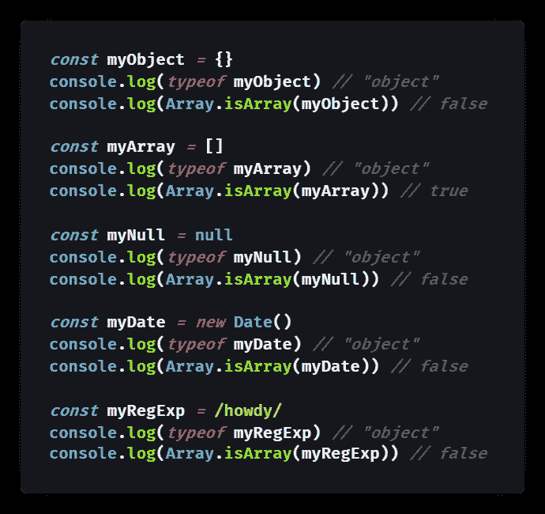
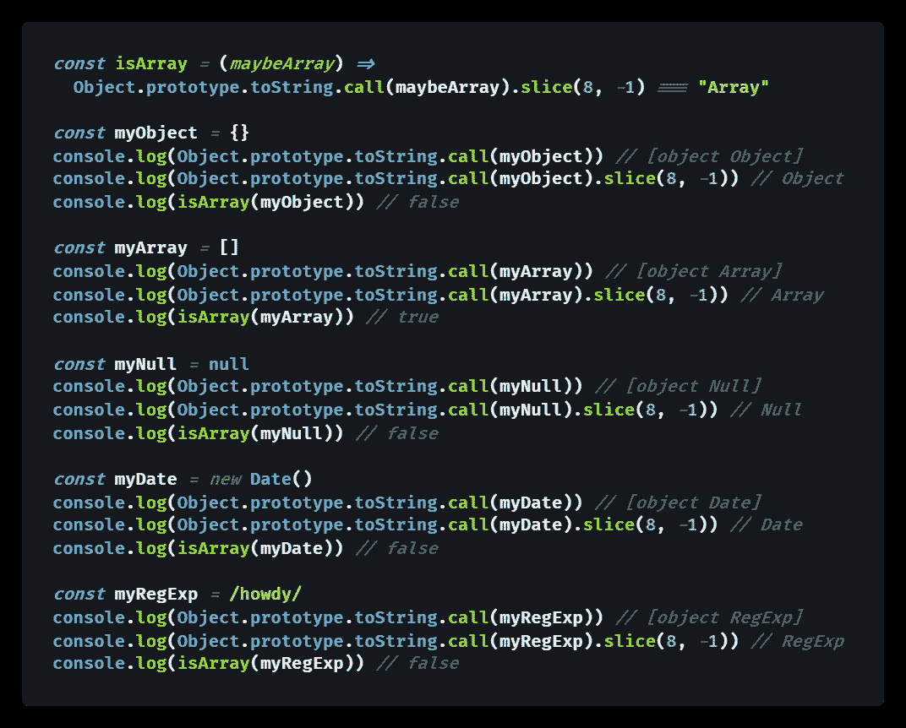
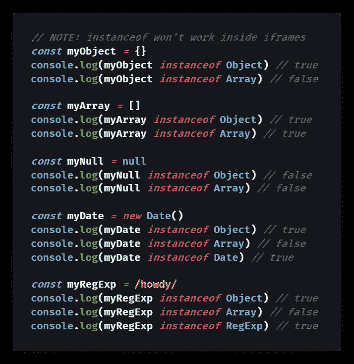
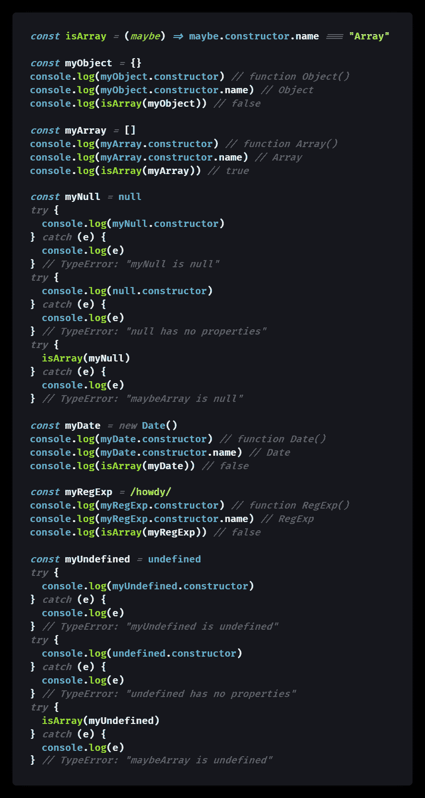
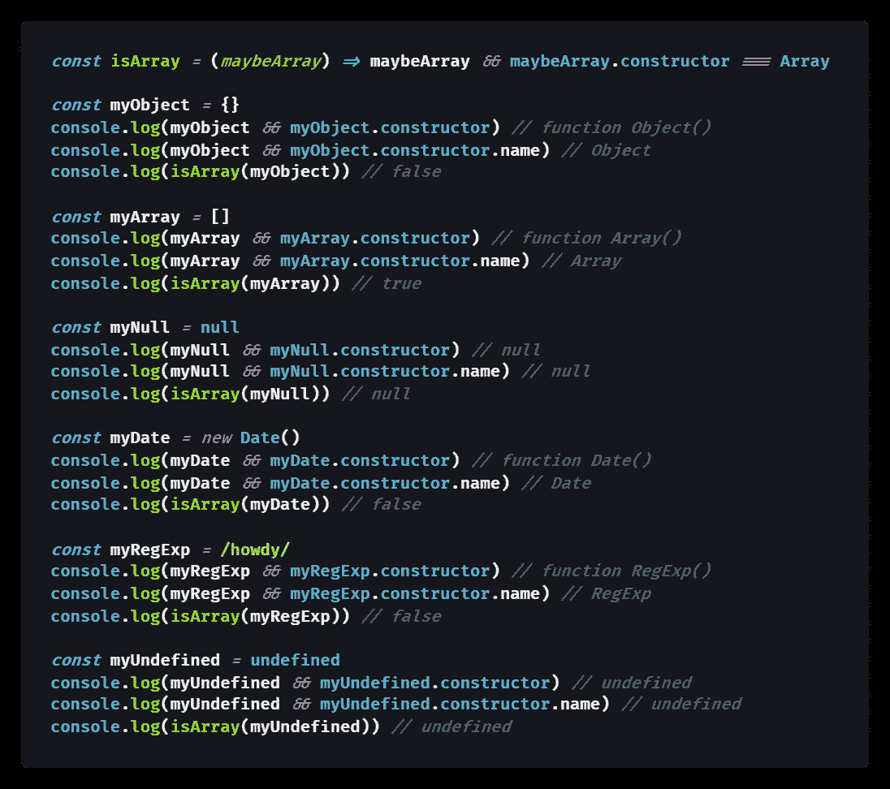
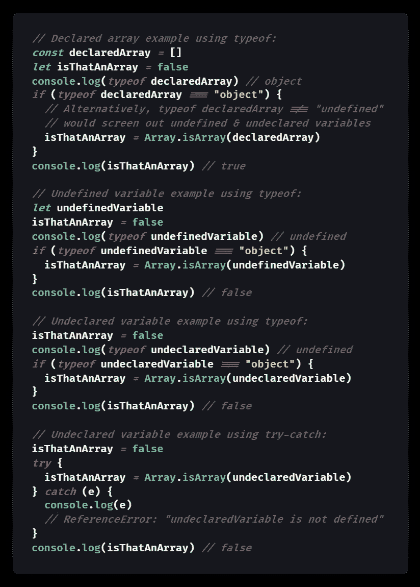
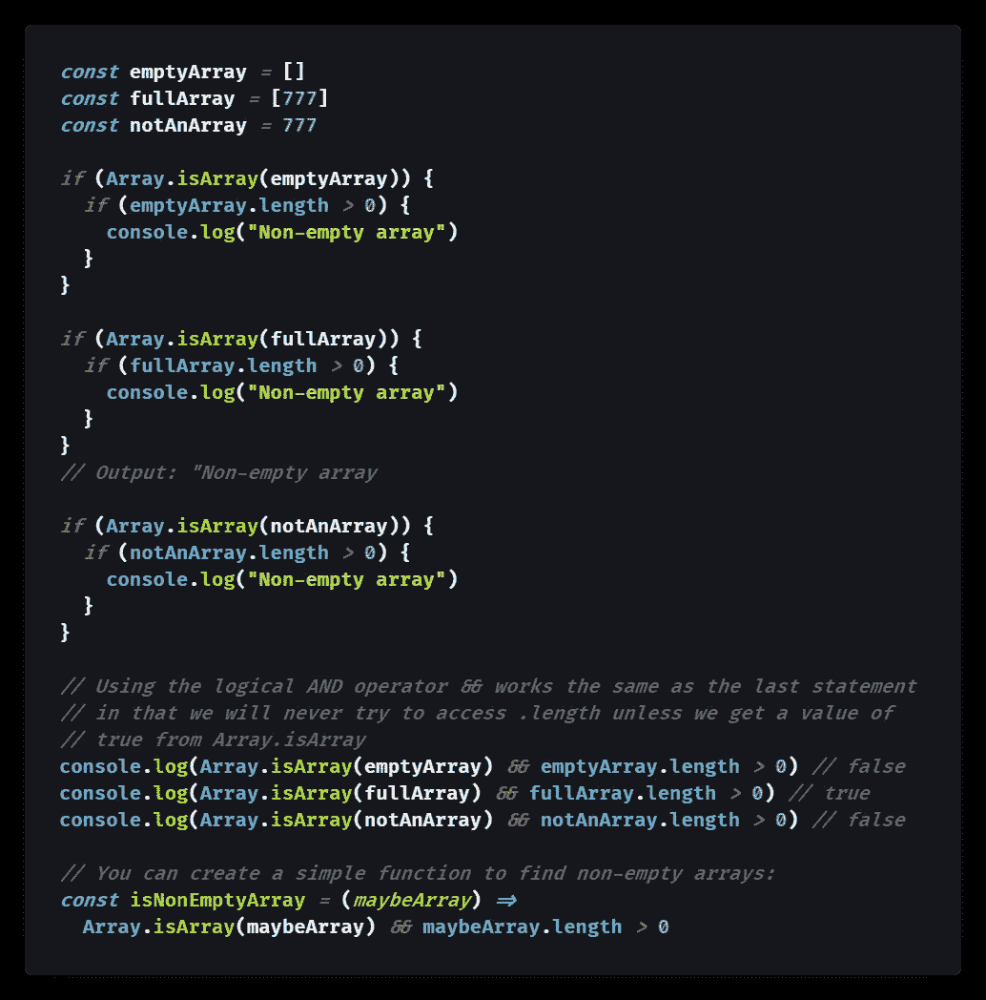
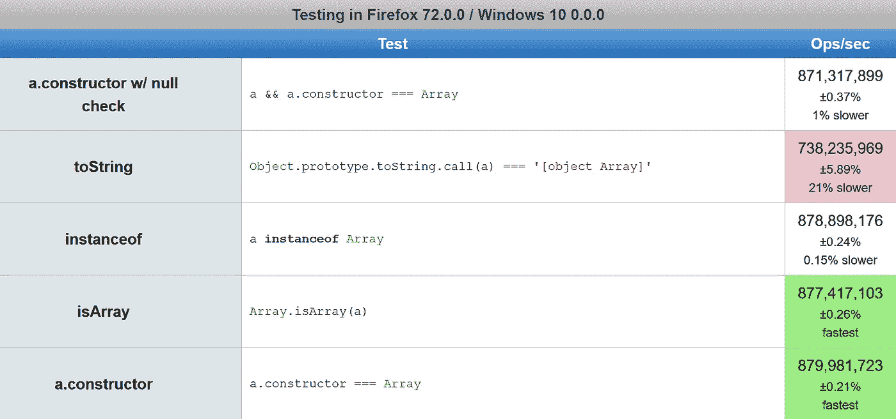

# 如何在 JavaScript 中检查数组

> 原文：<https://javascript.plainenglish.io/how-to-check-for-an-array-in-javascript-6ad20f7a0e21?source=collection_archive---------3----------------------->

## `Array.isArray([])`对`Object.prototype.toString.call([])`

## JavaScript 数组是一种对象类型，所以`typeof []`返回`"object"`——对于查看您是否有数组没有太大帮助。这里有 5 种方法来检查 JavaScript 对象是否是数组。

Photo by [JJ Ying](https://unsplash.com/@jjying?utm_source=medium&utm_medium=referral) on [Unsplash](https://unsplash.com?utm_source=medium&utm_medium=referral)

JavaScript 数据验证中的一个常见问题是检查给定变量是否包含数组。

> "数组是类似列表的对象，其原型具有执行遍历和变异操作的方法."— [MDN 文档](https://developer.mozilla.org/en-US/docs/Web/JavaScript/Reference/Global_Objects/Array)

对于原始类型，`[typeof](https://medium.com/better-programming/how-to-check-data-types-in-javascript-using-typeof-424d0520a329)`[关键字](https://medium.com/better-programming/how-to-check-data-types-in-javascript-using-typeof-424d0520a329)通常工作得很好，但是`typeof`数组是`"object"` : `typeof [] === object // true`。

虽然这很有意义(毕竟数组是 JavaScript 对象的内置类型)，但它对于区分数组和其他对象并没有什么用处。

另外，从`typeof` [得到`"object"`可以表示一个](https://medium.com/javascript-in-plain-english/how-to-check-for-null-in-javascript-dffab64d8ed5) `[null](https://medium.com/javascript-in-plain-english/how-to-check-for-null-in-javascript-dffab64d8ed5)` [值](https://medium.com/javascript-in-plain-english/how-to-check-for-null-in-javascript-dffab64d8ed5)。

幸运的是，有许多方法可以检查 JavaScript 数组:

*   方法 1) `Array.isArray([])`
*   方法 2) `Object.prototype.toString.call([])`
*   方法 3) `[] instanceof Array`
*   方法 4) `[].constructor`
*   方法 5) `&&`同`[].constructor`

在本文中，我将解释每种方法的优缺点。

# 方法 1: `Array.isArray([])`

ECMAScript 5 (ES5)引入了`[Array.isArray()](https://developer.mozilla.org/en-US/docs/Web/JavaScript/Reference/Global_Objects/Array/isArray)`方法来[检查数组](http://web.mit.edu/jwalden/www/isArray.html)，因为`typeof`将无法区分数组与其他对象，例如内置对象`[Date](https://developer.mozilla.org/en-US/docs/Web/JavaScript/Reference/Global_Objects/Date)`和`[RegExp](https://developer.mozilla.org/en-US/docs/Web/JavaScript/Reference/Global_Objects/RegExp)`。

使用`Array.isArray()`也有助于确保我们的对象不是`null`，因为`[null](https://medium.com/javascript-in-plain-english/how-to-check-for-null-in-javascript-dffab64d8ed5)` [由于一个长期存在的错误而具有](https://medium.com/javascript-in-plain-english/how-to-check-for-null-in-javascript-dffab64d8ed5) `[typeof "object"](https://medium.com/javascript-in-plain-english/how-to-check-for-null-in-javascript-dffab64d8ed5)`。

下面是一个使用`Array.isArray([])`检查数组的例子:

[View raw code](https://gist.github.com/DoctorDerek/a22a533367bf883b7f1ceb9602397a47) as a GitHub Gist

# 方法 2: `Object.prototype.toString.call([])`

详细的 JavaScript 语句`[Object.prototype.toString.call()](https://medium.com/better-programming/what-is-object-object-in-javascript-object-prototype-tostring-1db888c695a4)`可以区分数组和其他类型的对象，因为它返回的[字符串](https://medium.com/javascript-in-plain-english/how-to-check-for-a-string-in-javascript-a16b196915ff)比`typeof`更详细地指定了对象类型。

因为这个方法适用于任何对象，所以我称它为 JavaScript 中类型检查的最佳方式。下面是一个例子:

[View raw code](https://gist.github.com/DoctorDerek/eae44673b8e8a4a5250d6fece904591c) as a GitHub Gist

虽然冗长，但这个方法适用于任何基本类型和任何对象。它总是返回变量的构造函数的名称。

换句话说，`Object.prototype.toString.call()`有点像反过来的`instanceof`，尽管它在`iframes`内部工作得很好。

上述`isArray()`函数的行为应该与内置的`Array.isArray()`函数相同。

这里需要注意的一点是，`typeof {}`返回`"object"`(小写)，但是`Object.prototype.toString.call({}).slice(8,-1)`对于一个对象`{}`返回`"Object"`(大写)，对于一个数组`[]`返回`"Array"`(大写)。

与所有这些方法一样，如果变量尚未声明，该方法将不起作用。稍后我将解决未声明变量的检查问题。

# 方法三:`[] instanceof Array`

使用关键字`[instanceof](https://developer.mozilla.org/en-US/docs/Web/JavaScript/Reference/Operators/instanceof)`可以用来检查数组或任何类型的 JavaScript 对象。

> "`**instanceof**` **操作符**测试一个构造函数的`prototype`属性是否出现在一个对象的原型链中。"— [MDN 文档](https://developer.mozilla.org/en-US/docs/Web/JavaScript/Reference/Operators/instanceof)

语法很简单，如以下代码示例所示:

[View raw code](https://gist.github.com/DoctorDerek/3110d41754b2413600f3a2798c2738fc) as a GitHub Gist

不过要小心，`[iframes](https://medium.com/@bluepnume/iframes-are-just-terrible-heres-how-they-could-be-better-974b731f0fb4)`可能会破坏这种行为，正如 Mozilla Developer Network [文档中对](https://developer.mozilla.org/en-US/docs/Web/JavaScript/Reference/Global_Objects/Array/isArray) `[Array.isArray](https://developer.mozilla.org/en-US/docs/Web/JavaScript/Reference/Global_Objects/Array/isArray)`的解释:

> `instanceof` vs `isArray`
> 
> 在检查[an] `Array`实例时，`Array.isArray`优先于`instanceof`，因为它通过`iframes`工作。— [MDN 文档](https://developer.mozilla.org/en-US/docs/Web/JavaScript/Reference/Global_Objects/Array/isArray)

这意味着我们可能根本不想使用`instanceof`来检查数组，以防我们的 JavaScript 代码最终在`iframe`中运行。

# 方法四:`[].constructor`

为了完整起见，我想提一个类似于`instanceof` 的方法——调用 JavaScript 对象的`[.constructor](https://developer.mozilla.org/en-US/docs/Web/JavaScript/Reference/Global_Objects/Object/constructor)` [属性](https://developer.mozilla.org/en-US/docs/Web/JavaScript/Reference/Global_Objects/Object/constructor)。

`.constructor` 属性将返回构造函数，对于数组来说将是`function Array()`(即[JavaScript 类](https://developer.mozilla.org/en-US/docs/Web/JavaScript/Reference/Global_Objects/Array) `[Array](https://developer.mozilla.org/en-US/docs/Web/JavaScript/Reference/Global_Objects/Array)`)。

访问该函数的`.name`属性将得到字符串`"Array"`，该字符串可用于对数组的存在进行简单的检查。

由于`.constructor` 属性返回`function Array()`(即[JavaScript 类](https://developer.mozilla.org/en-US/docs/Web/JavaScript/Reference/Global_Objects/Array) `[Array](https://developer.mozilla.org/en-US/docs/Web/JavaScript/Reference/Global_Objects/Array)`)，所以也可以直接将其与[全局数组对象](https://developer.mozilla.org/en-US/docs/Web/JavaScript/Reference/Global_Objects/Array)(也就是返回的`function Array()`所引用的)进行比较。

换句话说，您实际上不必使用`.name`属性；`[].constructor===Array`相当于`[].constructor.name==="Array"`。

下面是一个代码示例:

[View raw code](https://gist.github.com/DoctorDerek/3be6f651b52395ff62ff52cd8edd7423) as a GitHub Gist

类似于`Object.prototype.toString.call()`，访问`.constructor`属性将适用于任何类型的 JavaScript 值，包括原语——尽管您不能访问`[undefined](https://medium.com/coding-at-dawn/how-to-check-for-undefined-in-javascript-bcedd62c8ad)`或`null`值的`.constructor`。

(注意，`instanceof`关键字适用于对象，但不适用于原语。当然还有`instanceof`在`iframes`被窃听。)

正如我们在上面看到的，使用没有`null`检查的`.constructor`会导致`null`和`undefined`都有一个`TypeError`——与`Array.isArray()`相比，这是一个缺点，它只会为这两个值返回`false`。

而且，就像到目前为止介绍的任何方法一样，如果您试图访问未声明的变量，它们将抛出一个`[ReferenceError](https://developer.mozilla.org/en-US/docs/Web/JavaScript/Reference/Global_Objects/ReferenceError)`。

## 一个警告:`.constructor`是可变的

在继续之前，值得注意的是`.constructor`并不健壮，因为它是一个可以在以后被覆盖的对象属性。

> “请记住，如果你以任何理由通过原型重写了你构造函数，那么`arr.constructor === Array`测试将返回 false。尽管如此，仍然返回 true。–[ghaschel](https://stackoverflow.com/users/1415032/ghaschel)他的栈中溢出[答案](https://stackoverflow.com/questions/4775722/how-to-check-if-an-object-is-an-array#comment84913691_4775722)

所以只要记住一个对象的`.constructor`属性是“[可变的](https://en.wikipedia.org/wiki/Immutable_object)”——它可能已经在代码中的某个地方从它的初始值改变了。

# 方法五:&&和`[].constructor` ( `null`检查！😄)

下面是一个简洁的一行程序，它将在检查数组`[] && [].constructor === Array`的同时检查非`null`值。

`null`和`undefined`都是 [falsy](https://medium.com/coding-at-dawn/what-are-falsy-values-in-javascript-ca0faa34feb4) 值，这意味着它们在条件语句中计算为 false，但是所有对象都是真的，包括空数组。检查`[] && [].constructor === Array`将为`null`或`undefined`值返回 false，而`.constructor`将单独抛出一个错误。

包含[逻辑 AND (](https://developer.mozilla.org/en-US/docs/Web/JavaScript/Reference/Operators/Logical_AND#Short-circuit_evaluatoin) `[&&](https://developer.mozilla.org/en-US/docs/Web/JavaScript/Reference/Operators/Logical_AND#Short-circuit_evaluatoin)` [)运算符](https://developer.mozilla.org/en-US/docs/Web/JavaScript/Reference/Operators/Logical_AND#Short-circuit_evaluatoin)的好处是避免了因为`null`和`undefined`没有属性而发生的`[TypeError](https://developer.mozilla.org/en-US/docs/Web/JavaScript/Reference/Global_Objects/TypeError)`。这是因为`&&`是一个[短路操作器](https://developer.mozilla.org/en-US/docs/Web/JavaScript/Reference/Operators/Logical_AND#Short-circuit_evaluatoin)通过使用逻辑 AND ( `&&`)，我们在尝试访问`.constructor`属性之前检查值是否为[真值](https://medium.com/coding-in-simple-english/what-are-truthy-values-in-javascript-e037bdfa76f8)。下面是一个代码示例:

[View raw code](https://gist.github.com/DoctorDerek/f30f3e65a06c487a14db55a6d33f78e4) as a GitHub Gist

为了提高代码的可读性，你可以考虑使用[松散等式](https://medium.com/better-programming/making-sense-of-vs-in-javascript-f9dbbc6352e3) : `[] != null && [].constructor`使[的空检查](https://medium.com/javascript-in-plain-english/how-to-check-for-null-in-javascript-dffab64d8ed5)显式化。使用`!=`(宽松相等运算符)意味着`null`和`undefined`彼此相等。

一个更加明确的检查将使用[严格等式](https://medium.com/better-programming/making-sense-of-vs-in-javascript-f9dbbc6352e3) : `[] !== null && [] !== undefined && [].constructor === Array`。许多 JavaScript 程序员不喜欢使用松散的等式，因为`==`的规则令人困惑。

将`&&`与`.constructor`一起使用，对于`null`和`undefined`来说，效果与`Array.isArray()`一样:如你所愿，它返回 false。

然而，当试图访问`.constructor`属性时，未声明的变量仍然会抛出`[ReferenceError](https://developer.mozilla.org/en-US/docs/Web/JavaScript/Reference/Global_Objects/ReferenceError)`。您可以在数组检查之前使用`typeof`来检查值是否不是`"undefined"`来解决这个问题。

# 如果数组变量实际上是未声明的呢？

你可能不确定可能是数组的变量是否已经被声明了。让我简单谈谈检查未声明的数组。

提醒一下，访问一个没有声明的变量会抛出一个`[ReferenceError](https://www.google.com/search?client=firefox-b-d&q=ReferenceError+mdn)`，而一个已经声明但没有赋值的变量会有`[undefined](https://medium.com/coding-at-dawn/how-to-check-for-undefined-in-javascript-bcedd62c8ad)`的值。

值得庆幸的是，`[typeof](https://medium.com/better-programming/how-to-check-data-types-in-javascript-using-typeof-424d0520a329)`[关键字](https://medium.com/better-programming/how-to-check-data-types-in-javascript-using-typeof-424d0520a329)将为尚未声明的变量返回`"undefined"`，对于值`undefined`也是如此，但不会抛出`ReferenceError`，因为变量尚未声明。

这意味着我们可以将`Array.isArray()`包装在`typeof`调用中，以使其对未声明的变量具有健壮性。这里有一个例子:

[View raw code](https://gist.github.com/DoctorDerek/63c32245dd4b21fc1b3c8cf47357df2d) as a GitHub Gist

或者，我们可以使用一个`[try...catch](https://developer.mozilla.org/en-US/docs/Web/JavaScript/Reference/Statements/try...catch)`块，捕捉潜在的`ReferenceError`，但是`typeof`对未声明的变量也同样有效。

# 如何在 JavaScript 中检查空数组？

相反，如果我们想检查一个数组是否为空，我们可以检查它的`[.length](https://developer.mozilla.org/en-US/docs/Web/JavaScript/Reference/Global_Objects/Array/length)`属性——一个空数组有`.length`的`0`。

同样，我们需要确保我们使用的是一个已经被赋值的声明变量，这个值肯定是一个数组。

但是，假设我们从`Array.isArray([])`得到了`true`，那么`[].length > 0`会确认我们的数组不是空的。下面是一段代码:

[View raw code](https://gist.github.com/DoctorDerek/513c7ccb117ecef1a946f58fa6a297dc) as a GitHub Gist

同样，我们正在利用`&&`作为短路操作器的优势。因为它“短路”了错误的语句，所以我们永远不会到达上面例子中的`.length`调用。这正是我们想要的，因为`.length`不能处理大多数原语，比如[数字](https://medium.com/javascript-in-plain-english/how-to-check-for-a-number-in-javascript-8d9024708153)或其他类型的对象。

# 性能测试:在 JavaScript 中检查数组最快的方法是什么？

开发者[Mark Penner](https://medium.com/u/e36902b76a9a?source=post_page-----6ad20f7a0e21--------------------------------)([mpen](https://stackoverflow.com/users/65387/mpen))使用 [jsPerf](https://jsperf.com/js-isarray-comparison/16) 来比较 JavaScript 中检查数组的各种方法。

他的结果显示，一种流行的方法比其他方法慢 20%——尽管这种差异可以忽略不计，因为结果是如此之快。

以下是我几个月前运行[的 jsPerf 测试套件](https://jsperf.com/js-isarray-comparison/16)时得到的结果:

These jsPerf test results show that Object.prototype.toString.call([]) is about 20% slower than other methods, such as Array.isArray().

(*作者注* : jsPerf 目前关闭[，等待一些配置](https://github.com/jsperf/jsperf.com/pull/535)来重新启动它。我希望作者们能尽快让它重新工作起来。🙏)

总结就是`Array.isArray()`和`.constructor`或者`instanceof`一样快，但是`Object.prototype.toString.call([])`要慢一些。

默认情况下，结果支持使用`Array.isArray()`，尽管您的个人偏好可能是使用带有`null`检查的`.constructor`。

但是如果你是`Object.prototype.toString.call([])`的粉丝——不要担心！不同之处在于，这种稍慢的方法仍然非常快:在我的家用电脑上，每秒钟超过 700，000，000 次运算。

因此，除非您正在进行数万亿次数组检查，否则将任何一种方法换成另一种方法都不会显著提高代码的速度。

# 结论:如何检查 JavaScript 数组

因为关键字`typeof`返回`null`和所有对象的`"object"`——包括数组——检查数组需要另一个工具。

## 数组特定的方法

ES5 帮助器方法`Array.isArray()`会快速简单地告诉你任何 JavaScript 变量是否是数组:`Array.isArray([]) // true`，它对`null`和`undefined`有效(但对未声明的变量无效)。

从 Internet Explorer 9 开始，`Array.isArray()`方法[在所有浏览器](http://kangax.github.io/compat-table/es5/#test-Array.isArray)中得到广泛支持，因为它是 ECMAScript 5 规范的一部分。

你可能会看到使用过的`instanceof`:`[] instanceof Array // true`，但是不推荐使用`instanceof`，因为它在`iframes`中不起作用。

## 适用于任何对象的方法

有几种方法对检查数组很有用，因为它们可以用来确定任何 JavaScript 对象的类型。

更通用的方法`Object.prototype.toString.call([]) // "[object Array]"`会告诉你任何值是什么类型的对象，包括原语。

为了捕获类型，可以用`[.slice()](https://developer.mozilla.org/en-US/docs/Web/JavaScript/Reference/Global_Objects/Array/slice)` : `Object.prototype.toString.call([]).slice(8,-1) // Array`处理该字符串

类似地，`.constructor`属性将返回 JavaScript 值的构造函数。对于数组，这是内置的全局`function Array()`。

该函数可以与全局对象(即`Array`)进行比较，或者构造函数的`.name`属性可以作为字符串:`[].constructor.name // "Array"`进行访问。

然而，`.constructor`有一个缺点，你可以给它赋一个新的值，从而否定你的数组检查:`[].constructor = 3 // valid`

## 检查未声明的数组

关键字`[typeof](https://medium.com/better-programming/how-to-check-data-types-in-javascript-using-typeof-424d0520a329)`不会将数组与其他对象区分开来，尽管`typeof`对于筛选出未声明的变量仍然有用。

当`typeof`关键字返回`"object"`时，我们知道变量已经被声明并被赋值[或者是一个对象或者是一个](https://medium.com/javascript-in-plain-english/how-to-check-for-null-in-javascript-dffab64d8ed5) `[null](https://medium.com/javascript-in-plain-english/how-to-check-for-null-in-javascript-dffab64d8ed5)` [值](https://medium.com/javascript-in-plain-english/how-to-check-for-null-in-javascript-dffab64d8ed5)。

同时，`typeof`将为未声明的变量返回`"[undefined](https://medium.com/coding-at-dawn/how-to-check-for-undefined-in-javascript-bcedd62c8ad)"`,而不是抛出一个`ReferenceError`,如果你认为你可能正在处理一个未声明的变量，那么首先检查`typeof`是很有用的。

一旦我们知道变量是使用`typeof`声明的(无论是`=== "object"`还是`!== "undefined"`，我们就可以确定地使用`Array.isArray()`。

## 检查空数组

最后，当我们确定我们有一个数组时(即当`Array.isArray()`返回`true`时)，我们可以使用`.length`检查数组是否为空。

`0`的一个`.length`表示一个空的 JavaScript 数组`[]`，而一个带`.length > 0`的数组表示一个非空数组。

注意，空数组`[]`是真的，这意味着当作为布尔值计算时，它返回真。(`[]`是真的，因为[所有对象都是真的](https://medium.com/coding-in-simple-english/what-are-truthy-values-in-javascript-e037bdfa76f8)。)

## 检查数组的最佳方法

我介绍了检查 JavaScript 数组的 5 种不同方法。出于几个原因，我通常在编码时使用`Array.isArray()`:

*   `Array.isArray()`速度快，支持面广。
*   `Array.isArray()`是显式的，使你的代码更具可读性。
*   `Array.isArray()`为`null`和`undefined`返回`false`。

有时，我会将数组检查封装在一个`if(typeof !== "undefined")` 语句中，这是我担心未声明变量的罕见情况。

但除此之外，我将使用`Array.isArray()`——它只是工作。

现在，开始自信地检查数组吧！

**快乐编码！**💻🎶👓💯🤩

# 进一步阅读

*   [Hugo](https://codewithhugo.com/detecting-object-vs-array-in-javascript-by-example/)代码覆盖`Array.isArray()`所有可能的数据类型:

 [## JavaScript 数组类型检查-“is array”vs .使用 Hugo 的对象深度代码

### 本节示例在 observablehq . com/@ Hugo df/JavaScript-array-detection-using-array-is array，可以玩…

codewithhugo.com](https://codewithhugo.com/detecting-object-vs-array-in-javascript-by-example/) 

*   才华横溢的作者 [Samantha Ming](https://medium.com/u/829a804ea5da?source=post_page-----6ad20f7a0e21--------------------------------) 讨论为什么不使用`instanceof`:

 [## 使用 Array.isArray 进行更好的数组检查

### 因为数组在 JavaScript 中不是真正的数组，所以没有简单类型的检查。没问题！使用方法…

medium.com](https://medium.com/dailyjs/better-array-check-with-array-isarray-dae0283263be) 

*   作者 [Moon](https://medium.com/u/994dcd5bc2e8?source=post_page-----6ad20f7a0e21--------------------------------) 在更好的编程中更详细地描述了`Object.prototype.toString.call([])`方法[:](https://medium.com/better-programming/what-is-object-object-in-javascript-object-prototype-tostring-1db888c695a4)

 [## JavaScript:Object . prototype . tostring 中的[object Object]是什么

### [object Object]的更深一层的解释

medium.com](https://medium.com/better-programming/what-is-object-object-in-javascript-object-prototype-tostring-1db888c695a4) 

*   我之前在更好的编程中写过`typeof` [的陷阱:](https://medium.com/better-programming/how-to-check-data-types-in-javascript-using-typeof-424d0520a329)

 [## 如何使用 typeof 检查 JavaScript 中的数据类型

### 检查九个字符串之一:undefined、object (null)、boolean、number、bigint、string、symbol、function 或 object…

medium.com](https://medium.com/better-programming/how-to-check-data-types-in-javascript-using-typeof-424d0520a329) 

*   我还在一篇文章[中用简单英语写了关于类型检查的`Object.prototype.toString.call([])`方法的文章](https://medium.com/javascript-in-plain-english/the-best-way-to-type-check-in-vanilla-js-55197b4f45ec):

 [## 在普通 JS 中键入 Check 的最佳方式

### 在 JavaScript 中检查变量类型的最好方法不是 type of。以下是使用的原因…

medium.com](https://medium.com/javascript-in-plain-english/the-best-way-to-type-check-in-vanilla-js-55197b4f45ec) 

*   [布兰登·莫雷利](https://medium.com/u/e9031892baf5?source=post_page-----6ad20f7a0e21--------------------------------)在代码突发中解释短路算子井[:](https://codeburst.io/javascript-what-is-short-circuit-evaluation-ff22b2f5608c)

 [## JavaScript:什么是短路评估？

### 学习如何使用逻辑 OR ( ||)来分配变量。

codeburst.io](https://codeburst.io/javascript-what-is-short-circuit-evaluation-ff22b2f5608c) 

[Derek Austin](https://www.linkedin.com/in/derek-austin/)博士是《职业编程:如何在 6 个月内成为一名成功的 6 位数程序员 》一书的作者，该书现已在亚马逊上架。