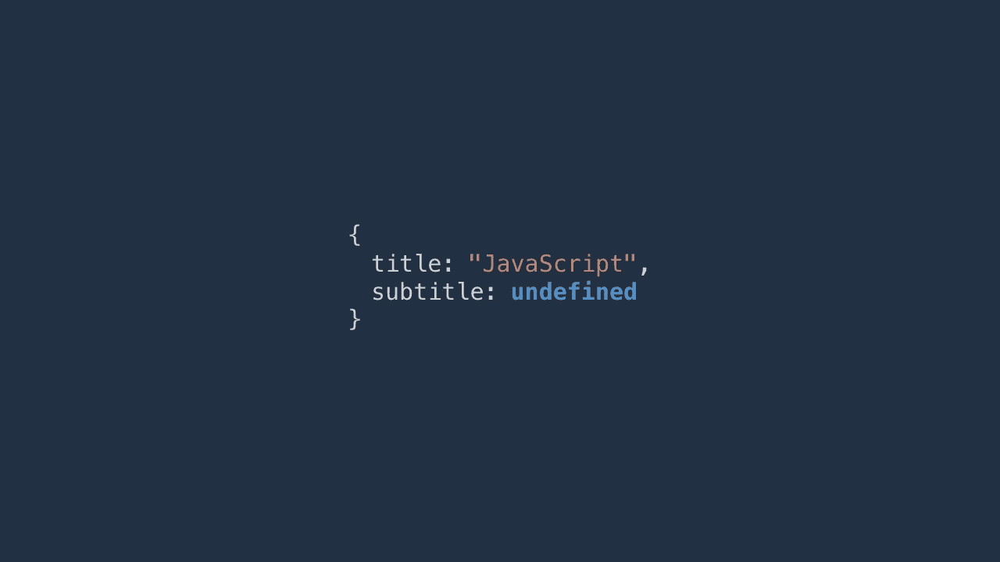

# 如何在 JavaScript 中检查一个对象是否有特定的属性？

> 原文：<https://javascript.plainenglish.io/how-to-check-if-an-object-has-a-specific-property-in-javascript-6086177014d1?source=collection_archive---------8----------------------->

## 使用错误的方法会给你误导的结果。



## 灵活性并不总是一件好事。

JavaScript 是灵活的。它赋予你比其他语言更自由地编码的能力。但这是有代价的。

有时你必须检查一个对象的属性是否存在。我已经找到了一些方法。但是，并不是所有的都推荐。

哪些？继续读下去，你会明白的。

# 1.与未定义的比较

当你使用一个未定义的属性时，你可能已经习惯了。

```
let book = {
  title: ‘Clean Code’
};console.log(book.subtitle); // undefined
```

我们可以利用它来检查一个属性是否在对象中:

```
console.log(book.subtitle === undefined); // true
```

在上面的例子中，结果为真，这意味着属性 **subtitle** 不是对象 book 的属性。

# 2.与类型比较

由于 **undefined** 在 JavaScript 中也是一种数据类型，所以可以使用 **typeof** 来检查一个属性是否存在。

```
let video = {
  title: ‘How I learn to code’
};console.log(typeof(video.title) === ‘undefined’); // falseconsole.log(typeof(video.subtitle) === ‘undefined’); // true
```

*注意，我把* ***未定义的*** *放在一对撇号里。*

我不推荐用**未定义**来检测一个属性的存在。为什么？因为如果属性的实际**值**是**未定义的**，那么比较就会出错。

例如:

```
let person = {
  name: ‘Amy’,
  age: undefined
};console.log(typeof(person.age) === ‘undefined’); // trueconsole.log(person.age === undefined); // true
```

两个结果都是真的，但这并不意味着属性**年龄**没有定义。在这种情况下， **undefined** 只是属性 **age** 的一个值。

所以，你最好使用以下方法:

# 3.hasOwnProperty 函数

hasOwnProperty 函数将返回一个布尔值来表明一个对象是否具有给定的属性。

看看这个例子:

```
let book = {
  name: ‘JavaScript’,
  price: 13
};console.log(book.hasOwnProperty(‘name’)); // trueconsole.log(book.hasOwnProperty(‘discount’)); // false
```

我们检查属性**名称**，它存在于对象簿中。因此， **hasOwnProperty** 返回 true。对于属性**折扣**，结果为假，因为对象**图书**没有属性**折扣**。

# 4.in 运算符

就像 **hasOwnProperty** 函数一样，运算符中的**会检查一个对象中是否存在某个属性。**

下面是你如何使用它:

```
let person = {
  name: ‘Amy’,
  age: 28
};console.log(‘name’ in person); // trueconsole.log(‘age’ in person); // trueconsole.log(‘relationship’ in person); // false
```

**姓名**和**年龄**是**人物**的属性，则结果为真。但是，对象**人**没有属性**关系**，因此返回 false。

你可能会问中的**和**有什么区别**？**

默认情况下，每个 JavaScript 对象都有继承的属性，比如的**value、 **toString** 等。**

虽然中的**可以检查那些继承的属性，但是**的 hasOwnProperty** 只对你定义的属性有效，对继承的属性无效。**

例如:

```
let tool = {
  name: ‘Sublime Text’,
  category: ‘Code editor’
};console.log(tool.hasOwnProperty(‘valueOf’)); // falseconsole.log(‘valueOf’ in tool); // true
```

到目前为止，您有四种方法来检查特定属性是否存在。你也知道应该用哪些。

可能有些方式我不知道。如果是这样的话，你能帮我完成这个清单吗？

[](https://medium.com/javascript-in-plain-english/11-super-handy-lodash-methods-to-simplify-things-in-javascript-8c45cd346616) [## 简化 JavaScript 的 11 个超级方便的 Lodash 方法

### 有时他们会拯救你的一天

medium.com](https://medium.com/javascript-in-plain-english/11-super-handy-lodash-methods-to-simplify-things-in-javascript-8c45cd346616)