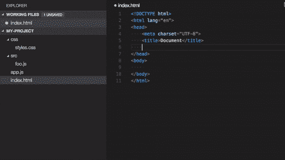
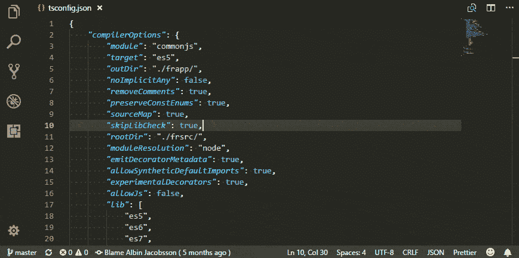
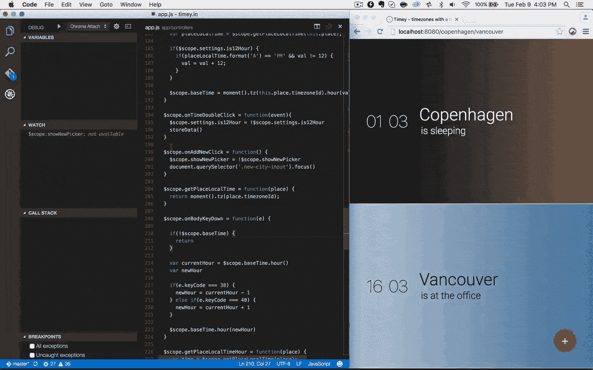
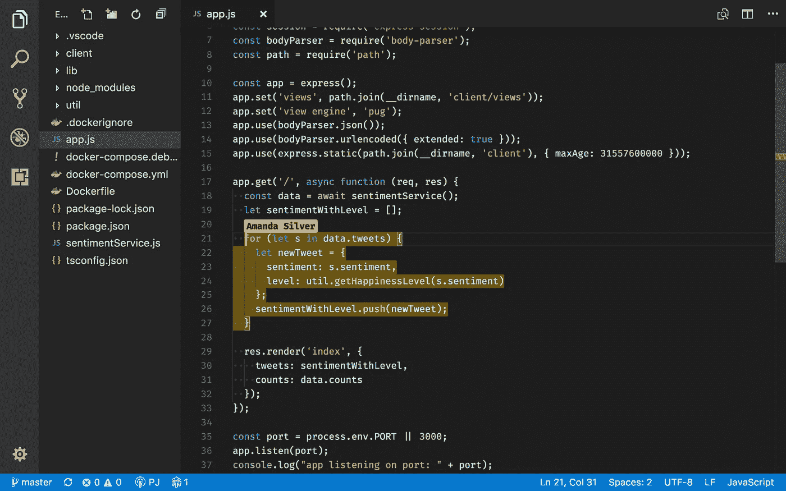

# 如何为您的 VS 代码设置选择完美的扩展

> 原文：<https://javascript.plainenglish.io/how-to-choose-the-perfect-extensions-for-your-vs-code-setup-66ecc7425d4b?source=collection_archive---------3----------------------->

## 如何让你的生活更轻松的快速入门

我相信像这样的文章已经写了几百遍了。但是，你知道，每个开发者都是不同的。所以为什么不向你展示我喜欢的工具。只是看看这个很酷的扩展列表。决定哪一个能给你带来惊喜。

或者更好的是，您可以使用我为本文特别创建的这个简单规则来决定。

> “我在你同事的机器上打开 VS 代码让你想:没有我的扩展，他怎么工作？那么你就知道这些扩展对你来说是至关重要的。—皮耶罗·博雷利

让我们看看我的清单。

## 首先，让它看起来很酷

为什么仅仅满足于经典与代码主题？我想给我的项目一个粗糙的外观。我更喜欢的主题是[夜猫子](https://marketplace.visualstudio.com/items?itemName=sdras.night-owl)。这是基于阅读理解和最佳眼花缭乱的有意义的对比。看我的窗户看起来多酷。

Night owl in action

如果你喜欢保持清醒，它还有一个白色版本。

Light owl

总共有数以千计的酷主题。这正是我在打开编辑器时希望看到的。这让我有种创电影的感觉。我也觉得暗版对眼睛挺好的，对我来说挺有意义的。

## 第二，让它更有色彩

这个扩展完美地总结了我之前解释的规则。我真的无法想象没有它的工作。它简单、美观，同时又很有用。哦对了，我说的是 B [球拍对上色器](https://marketplace.visualstudio.com/items?itemName=CoenraadS.bracket-pair-colorizer)。

Coloring your parentheses to make life a little easier

这个扩展只是给文件中匹配的括号着色。它使得复杂的嵌套更容易阅读。你有没有发现自己试图找到一个巨型类方法的结尾？是的，我做到了，但是没有这个工具，我再也不想这样做了。

事实上，它不仅会给括号着色，还会提供一个小的、有颜色的痕迹，显示一个块的开始和结束。从上面的图片可以看到，在`updateDocument`功能的左边。

如果你使用 Html，我也强烈建议你使用高亮匹配标签。寻找 div 结尾的日子将会结束。

## 第三，不要忘记细节

VS 代码本身就很棒。但是为什么要把自己局限在一个很酷的主题和括号里呢？我也想有一个很酷的文件树。

看看 [VS 代码图标](https://marketplace.visualstudio.com/items?itemName=vscode-icons-team.vscode-icons)的奇观就知道了。

Let’s pimp my icons

## 第四，执行规则

在对你的 VS 代码进行着色和取乐之后，我不得不开始考虑在代码的混乱中建立秩序。ESLint 和[beauty](https://marketplace.visualstudio.com/items?itemName=esbenp.prettier-vscode)是两个必备工具。第一个允许我为我的代码写林挺规则。

第二个将按照我的决定格式化我的代码。决定有多少空格，如何格式化括号等。这两个工具实际上可以很好地协同工作，并将提升整体开发体验。

## 第五，懒惰

我一个人输入所有那些冗长的代码片段？最好的程序员是懒惰的程序员。因为它们避免了重复和冗余。只需下载一个代码片段包，让奇迹发生。

使用 Javascript？使用 [ES6 代码片段](https://marketplace.visualstudio.com/items?itemName=xabikos.JavaScriptSnippets)。React with[ES7 React/Redux/graph QL/React-Native snippets](https://marketplace.visualstudio.com/items?itemName=dsznajder.es7-react-js-snippets)也是如此。

从字面上看，任何东西都有代码片段，甚至包括 PropTypes，你只需要去寻找它们。

为什么不偷懒呢？为什么不使用[路径智能感知](https://marketplace.visualstudio.com/items?itemName=christian-kohler.path-intellisense)来轻松检测文件路径？

## 第六，多疑

有时候很难理解为什么会出现 bug。甚至不知道为什么有些代码是这样写的。为什么不问问那条线的“主人”？你是怎么做到的？简单地用 [Git 责备](https://marketplace.visualstudio.com/items?itemName=waderyan.gitblame)找到“有罪的那个”。这让我可以看到谁写了特定的代码行。

Looking for the guilty colleague

找虫子？我想在这个不可思议的扩展中结合 VS 代码和 Chrome 的力量。对于在 Google Chrome 浏览器中调试 JavaScript 代码很有用。这里是 [Chrome 调试器](https://code.visualstudio.com/blogs/2016/02/23/introducing-chrome-debugger-for-vs-code)。

VS Code + Chrome = love

## 第七，去远程化

如果我在远程工作，我可能想与我的开发伙伴分享我的一些宝贵代码。我使用 [Live Share](https://visualstudio.microsoft.com/services/live-share/) 直接在我舒适的沙发上与合作者实时分享我的代码片段。

## 结论

这是一个快速、有趣的指南，向您展示了我在决定下载哪些扩展时的思维过程。希望你发现了新的或者对你有用的东西。不要忘记选择完美扩展的黄金法则。

> “如果在你同事的机器上打开 VS 代码，你会想:没有我的扩展，他怎么工作？那么你就知道这些扩展对你来说是至关重要的。—皮耶罗·博雷利

## 资源

*   [夜猫子](https://marketplace.visualstudio.com/items?itemName=sdras.night-owl)
*   [最佳 VS 代码主题](https://www.developerdrive.com/best-visual-studio-code-themes/)
*   B [球拍对上色器](https://marketplace.visualstudio.com/items?itemName=CoenraadS.bracket-pair-colorizer)
*   [VS 代码图标](https://marketplace.visualstudio.com/items?itemName=vscode-icons-team.vscode-icons)
*   [ESLint](https://marketplace.visualstudio.com/items?itemName=dbaeumer.vscode-eslint) 和[更漂亮](https://marketplace.visualstudio.com/items?itemName=esbenp.prettier-vscode)
*   [ES7 React/Redux/graph QL/React-Native 片段](https://marketplace.visualstudio.com/items?itemName=dsznajder.es7-react-js-snippets)
*   [路径智能感知](https://marketplace.visualstudio.com/items?itemName=christian-kohler.path-intellisense)
*   [饭桶怪](https://marketplace.visualstudio.com/items?itemName=waderyan.gitblame)
*   Chrome 调试器
*   [现场分享](https://visualstudio.microsoft.com/services/live-share/)
*   [icons 8 制作的所有惊艳图标](https://icons8.com)

## **来自简明英语团队的笔记**

你知道我们有四种出版物吗？给他们一个简单的提示来表达爱意:**、[**AI**、](https://medium.com/ai-in-plain-english)、[、**UX**、](https://medium.com/ux-in-plain-english)[、**Python**、](https://medium.com/python-in-plain-english)、**、**——谢谢你，继续学习！**

**此外，我们一直对帮助推广好的内容感兴趣。如果您有任何想提交给我们的出版物的文章，请发邮件至[**submissions @ plain English . io**](mailto:submissions@plainenglish.io)**并附上您的中位用户名和您感兴趣的内容，我们将回复您！****