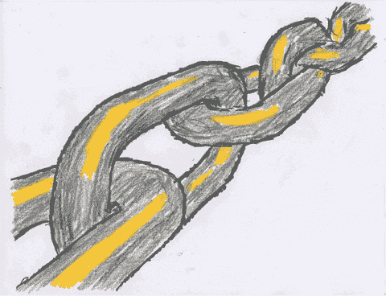
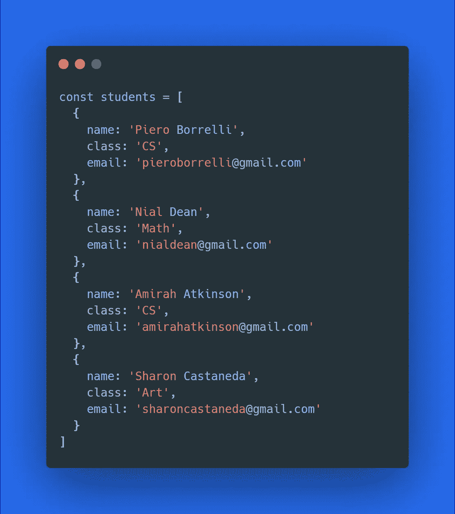
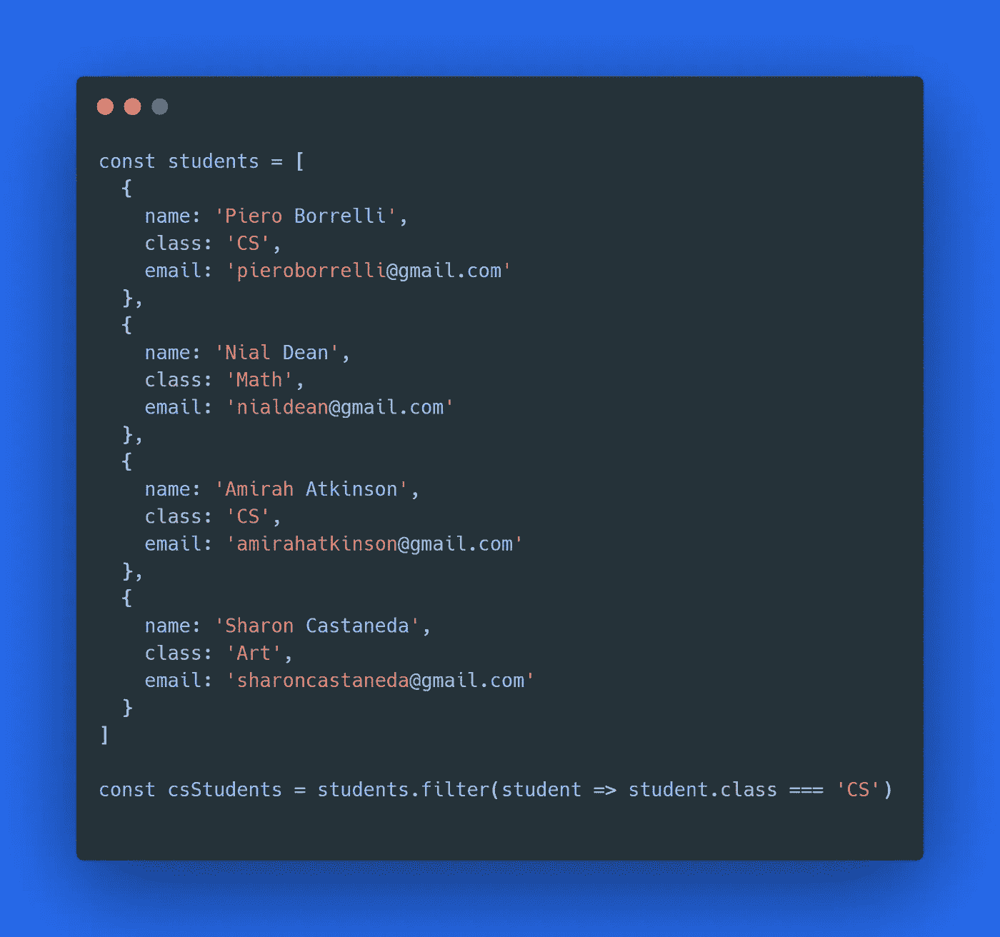
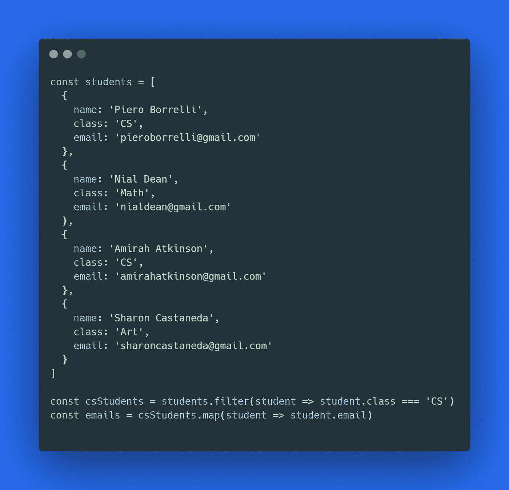
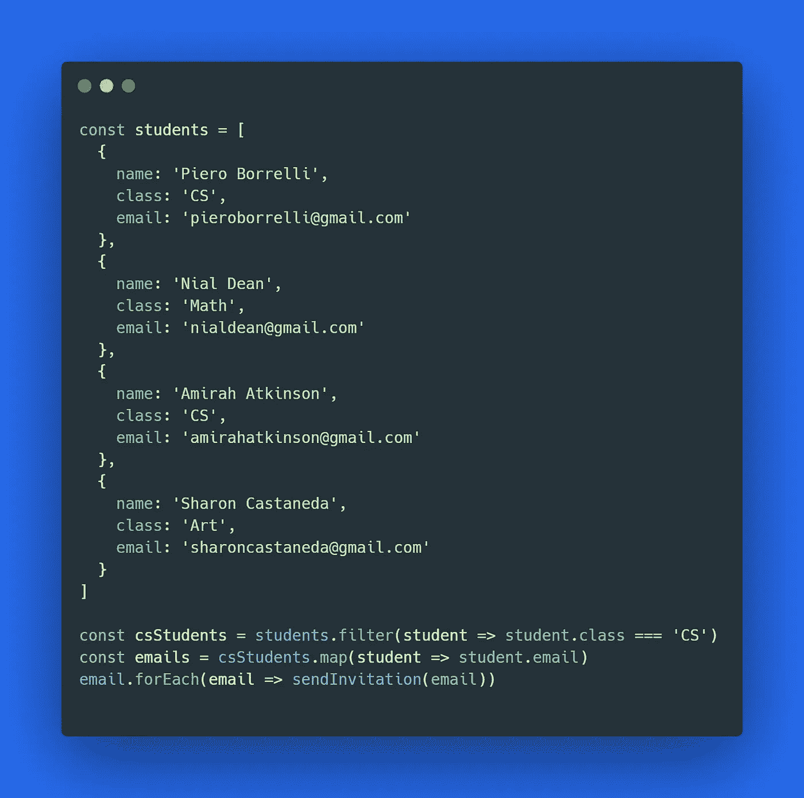
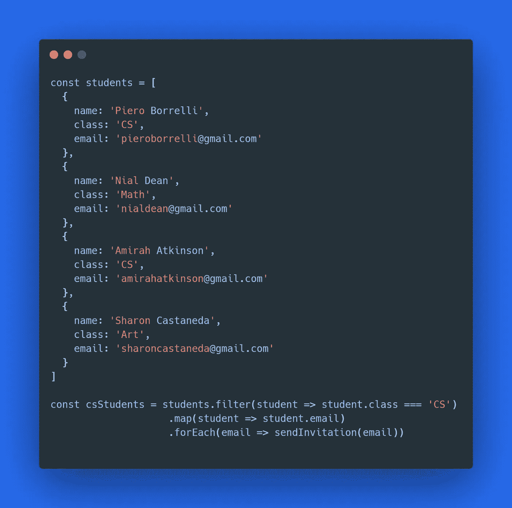

# 如何通过链接方法调用来清理代码

> 原文：<https://javascript.plainenglish.io/how-to-clean-your-code-by-chaining-methods-calls-b9b3bf6fff36?source=collection_archive---------2----------------------->

## 了解如何将许多操作合并成一个简单的操作

正如我在最近发表的一篇文章[中提到的](https://medium.com/javascript-in-plain-english/a-little-unknown-way-to-get-rid-of-switch-statements-15c2584f51b9)，**你应该关心正确地重构你的代码**。因为从长远来看，一系列复杂的、不必要的代码会严重损害您的应用程序。

*方法链*的概念可以帮助你进一步简化应用程序。对于编程界来说，这并不是什么新鲜事。但这听起来比实际要复杂得多。

> 链接意味着立即对一些返回的数据调用一个方法，而不需要先重新赋值。

正如您从定义中可以猜到的，*方法链*可以帮助您减少无用的数据重新分配，以简洁的方式一起执行一系列操作。

## **行动中的一个例子**

为了进行链接，您必须对一些返回的数据调用一个方法。所以数组方法是你掌握这个概念的完美方法。因为几乎所有的都会返回一些东西。想想`map`、`filter`或者`reduce`。

想象你在一个有大量数据的环境中:

如果你想过滤掉计算机系的学生以备后用呢？也许收到他们的电子邮件，然后给他们发一个研讨会的邀请？

首先，你可以用适当的方法过滤所有 CS 学生`filter`

然后你就可以`map`把邮件发出去了

最后，您可以遍历新发现的电子邮件的每个元素，向他们发送邀请

你能发现这里的问题吗？**每次你结束对**`students`**rray 的某个操作，你都在创建一个新的变量来存储新发现的数据**。虽然您应该关心减轻代码负担，消除重复操作。方法链在这里帮了你的忙:

上面发生的事情在这里也发生了。只是以更有效的方式。

> 链接包括利用从一个方法返回的数据顺序地附加到另一个方法上，没有中间操作。

这里，您利用了这样一个事实，即`filter`方法将返回一个过滤项目的数组。由于`map`方法作用于一个数组，您可以将它附加到第一次方法调用的结果中。类似地，`forEach`会将*自身*粘合到调用`map`后产生的数组上。

注意你不能在`forEach`的末尾链接一个新方法。因为它不返回任何东西，所以你要给`undefined`附加一些东西。

## 优势

现在你已经清楚你的代码如何受益于清晰和简洁。然而，请注意，*方法链接*会使你的代码更难调试。因为你不可能在你的链中间放一个断点。

最后，这篇文章就写到这里。在下面的部分保留一些评论。一如既往，感谢您花时间和精力阅读我的文章。

## **用简单英语写的 JavaScript**

喜欢这篇文章吗？如果有，通过 [**订阅我们的 YouTube 频道**](https://www.youtube.com/channel/UCtipWUghju290NWcn8jhyAw) **获取更多类似内容！**