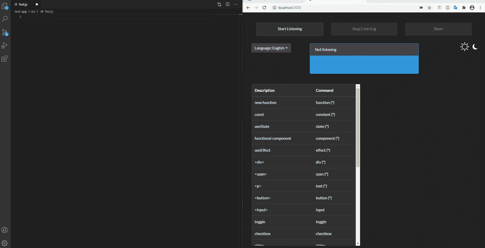

# 如何用你的声音编码

> 原文：<https://javascript.plainenglish.io/how-to-code-with-your-voice-f49f995a8bc6?source=collection_archive---------6----------------------->

## 如何使用语音转文本将语音命令转换为代码

Photo by [수안 최](https://unsplash.com/@suanmoo?utm_source=medium&utm_medium=referral) on [Unsplash](https://unsplash.com?utm_source=medium&utm_medium=referral) (sugoi = amazing in Japanese)

你是否厌倦了不断地为卡片、复选框或模态等各种组件查找正确的语法？有没有想过是否可以通过即时访问预定义的模板来加快编码速度？或者您是否可以用语音命令控制应用程序或计算机的各个部分？好了，不要再想了！今天你可以做到所有这些，甚至更多。

我使用 Web Speech API、React、Node 和 Express 构建了一个完全基于 JavaScript 的语音到文本应用程序来证明这是可能的。只要说几句话，我就可以立即将代码段插入到我的编辑器中。我甚至可以用动态命令修改部分代码，并用不同的语言说话。

我构建的应用程序有 React 和 HTML 的映射，但是你可以为你想要的任何语言、文本或命令创建映射；可能性是无限的。你可以在这里找到所有的[源代码](https://github.com/MachineLlama/react-voice)。这里有一个小小的预览:

在预览中，我没有输入一个字母，但是在不到 20 秒的时间里，我就有了一个新的组件和各种占位符模板。我启动应用程序，对着麦克风简单地说了几个字`component`、`email`、`check`、`toggle`、`quote`和`alert success`。应用程序拾取这些命令，找到适当的映射，更新命令文本的任何动态部分(如 alert 的“success”类型)，并将代码插入到我的编辑器中；相当整洁。

# 它是如何建造的

第一步是找到一个可以使用的语音转文本程序(如果你有野心，你可以使用你自己的程序)。我最初让这款应用与谷歌的云语音转文本功能配合使用，但我意识到你太快达到了他们的免费上限，这意味着你最终可能会花很多钱。所以我用了 [Web Speech API](https://developer.mozilla.org/en-US/docs/Web/API/Web_Speech_API) ，它内置在 Chrome 中，完全免费使用。为了利用它，我使用 [React 语音识别](https://www.npmjs.com/package/react-speech-recognition)库构建了一个简单的 React 应用程序。

接下来，我构建了将语音输出链接到代码片段的映射。例如，说单词“component”映射到 React 功能组件的模板。在单词“component”之后选择的任何内容都将被用作组件的名称。

然后，我们可以将生成的模板发送到后端 Express 服务器使用。我使用 [clipboardy](https://www.npmjs.com/package/clipboardy) 将文本复制到我电脑的剪贴板上，并使用 [robotjs](https://www.npmjs.com/package/robotjs) 以编程方式将文本粘贴到我光标所在的任何地方。这种复制-粘贴必须在后端服务器上完成，因为浏览器不允许在您的操作系统上执行操作(那会很可怕)。

仅此而已。一旦我启动了前端和后端部分，我可以单击 UI 上的 start，让它在后台运行。当我在项目中编码时，我只需要对着麦克风说几句话，一个预定义的模板就会神奇地出现在我的编辑器中(sugoi！).

我还尝试了不同语言的语音 API。英语绝对是我测试最流畅的语言，其次是西班牙语。像中文和日语这样的一些语言在 Web 语音 API 检测语音结束时存在问题。因此，根据您选择的语言，您的结果可能会有所不同。

# 它还能做什么？

嗯，你能想到的几乎都有。这个应用程序中的框架可以扩展为不同的编码语言，你 UI 上的语音交互，npm 或 git 命令，你计算机上的宏命令，自动化繁琐任务的脚本，物联网集成，聊天机器人，以及我现在甚至无法想象的东西。我包括了如何向 repo 添加更多命令和口头语言的说明，所以如果你想帮忙或者尝试自定义命令，请随意！