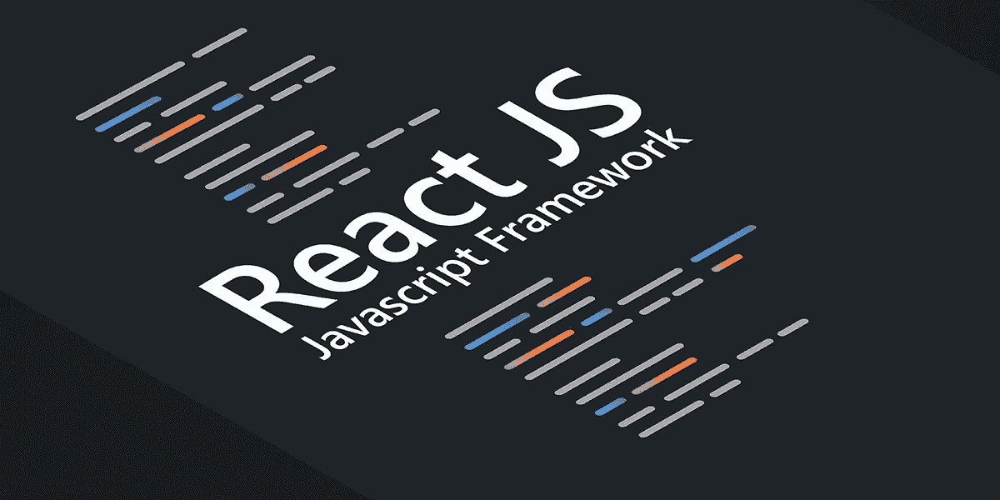

# 如何组合上下文提供者以获得更清晰的反应代码

> 原文：<https://javascript.plainenglish.io/how-to-combine-context-providers-for-cleaner-react-code-9ed24f20225e?source=collection_archive---------2----------------------->

如果您不是生活在玻璃下，并且在过去两年中您已经看过 React 代码，那么您已经看到了 React 上下文的实际应用。上下文是一个如此强大特性，对于我们所有正在使用 React 的人来说，它意味着从正确的钻探和容器类组件的移除中解脱出来，我敢说 Redux 也是如此😱。



然而，很容易迷失在上下文提供者的地狱中，因为在你眨眼之前，你的代码将看起来像这样:

```
<ContextProvider1> <ContextProvider2> <ContextProvider3> <ContextProvider4> .... </ContextProvider4> </ContextProvider3> </ContextProvider2></ContextProvider1>
```

这将很快失去控制。正如我们所知，当我们谈论上下文提供者时，ORDER MATHERS。

例如:
您可以在 *ContextProvider2* 中使用 *ContextProvider1* ，因为 *ContextProvider1* 正在包装 *ContextProvider2* ，但反之则不然，所以如下所示:

```
// insade *ContextProvider2*...
const { foo } = useContext(Context1) // WORKS!
```

然而，事情是这样的:

```
// insade *ContextProvider1*...
const { baz } = useContext(Context2) // DOES NOT WORK!
```

所以很难通过模板检查谁在包装谁。所以让我们简单点。

上下文提供者只是函数，因此它们可以被组合，并用于创建 **AppContextProvider** 我们就这么做吧。

首先，让我们创建 util 来帮助我们。

```
// *combineComponents.tsx**import* React, { ComponentProps, FC } *from* 'react';

*export const* combineComponents = (...*components*: FC[]): FC => {
  *return components*.reduce(
    (*AccumulatedComponents*, *CurrentComponent*) => { *return* ({ *children* }: ComponentProps<FC>): JSX.Element => {
        *return* (
          <AccumulatedComponents>
            <CurrentComponent>{*children*}</CurrentComponent>
          </AccumulatedComponents>
        );
      };
    },
    ({ *children* }) => <>{*children*}</>,
  );
};
```

这样，我们现在只需传递一组上下文提供者，它们将从左到右组合起来。

其次，让我们创建“ *AppContextProvider* ”。

```
// AppContextProvider.tsximport React from 'react';import { *ContextProvider1* } from '.../Context1';
import { ContextProvider2 } from '.../Context2';
import { ContextProvider3 } from '.../Context3';
import { ContextProvider4 } from '.../Context4';import { combineComponents } from '.../utils/combineComponents;const providers = [
  *ContextProvider1,
  ContextProvider2,
  ContextProvider3,
  ContextProvider4* ]*export const* AppContextProvider = combineComponents(...providers);
```

关于哪个上下文在哪里可用的规则是一样的，但是它更容易跟踪和推理。
现在我们的组件看起来像这样:

```
<AppContextProvider> ....</AppContextProvider>
```

那就是我们现在可以在应用程序的任何地方使用我们的上下文。这是你可以用来开发大规模应用程序的原则。

关于用上下文替换 Redux 和 Redux 中间件的更多信息，请阅读[https://medium . com/@ rasha 08/react-Context-async-calls-with-hooks-Redux-like-architecture-and-combine-Context-providers-with-ee95 ca 87 b 455](https://medium.com/@rasha08/react-context-async-calls-with-hooks-redux-like-architecture-and-combine-context-providers-with-ee95ca87b455)

*更多内容请看*[***plain English . io***](https://plainenglish.io/)*。报名参加我们的* [***免费周报***](http://newsletter.plainenglish.io/) *。关注我们关于*[***Twitter***](https://twitter.com/inPlainEngHQ)[***LinkedIn***](https://www.linkedin.com/company/inplainenglish/)*[***YouTube***](https://www.youtube.com/channel/UCtipWUghju290NWcn8jhyAw)*[***不和***](https://discord.gg/GtDtUAvyhW) ***。*****

*****对缩放您的软件启动感兴趣*** *？检查* [***电路***](https://circuit.ooo/?utm=publication-post-cta) *。***