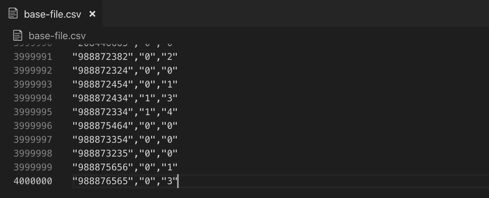
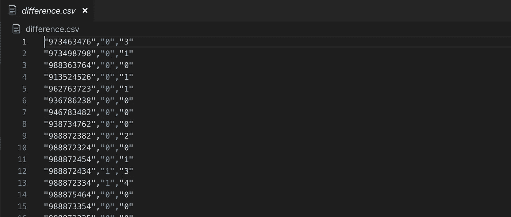
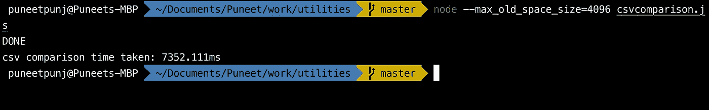

# 如何在 JavaScript 中比较巨大的 CSV 文件

> 原文：<https://javascript.plainenglish.io/how-to-compare-csv-files-with-millions-records-using-javascript-a2654a88c376?source=collection_archive---------0----------------------->

## 如何开始用 JavaScript 测试大数据



## 有没有在比较和验证包含数百万条记录的大型 csv 文件的内容时遇到过困难？

在我参与的大数据项目中，这一直是一个挑战。

在本文中，我们将查看简单的 nodejs 代码，以便在几秒钟内比较如此大的文件。

开始创建新的目录& cd 到新的目录中

```
mkdir csv-file-comparisoncd csv-file-comparison
```

假设您已经在系统上安装了一个 nodejs。执行以下命令初始化 npm 项目

```
npm init -y
```

安装从本地驱动器读取文件所需的 fs 包

```
npm install fs
```

创建新文件，并将其命名为 csvcomparison.js

```
touch csvcomparison.js
```

在您最喜欢的编辑器中打开 CSV coma 监狱. js 并复制以下代码

csvcomparison.js

为基本文件和辅助文件创建 readStream，并使用 JSON objects key magic 来比较它们。

将下面的代码复制到第 36 行之后。`**generateDeltaFile**`函数有两个参数

*第一个参数* —要比较的基础文件

*第二个参数* —与基本文件进行比较的第二个文件

```
(async () => { console.time("csv comparison time taken"); console.log(await generateDeltaFile('./base-file.csv',    './secondary-file.csv')) console.timeEnd("csv comparison time taken")})()
```

确保 base-file.csv 和 secondary-file.csv 放在`csv-file-comparison`目录中。假设这两个 csv 文件是有百万条记录的大数据文件。

执行下面的代码来调用函数，生成一个记录不匹配的新文件。

```
node --max_old_space_size=4096 csvcomparison.js
```

这应该会在`csv-file-comparison`目录中生成一个新文件`difference.csv`。



对于具有 4 百万条记录和 3 列的 csv 文件，这种方法大约需要 8 秒钟。



更多细节请查看我的 git 上的代码

[](https://github.com/puneetpunj/utilities/blob/master/csvcomparison.js) [## puneetpunj/公用事业

### 这个 repo 包含了对 bash、aws 等有用的工具——puneetpunj/utilities

github.com](https://github.com/puneetpunj/utilities/blob/master/csvcomparison.js)