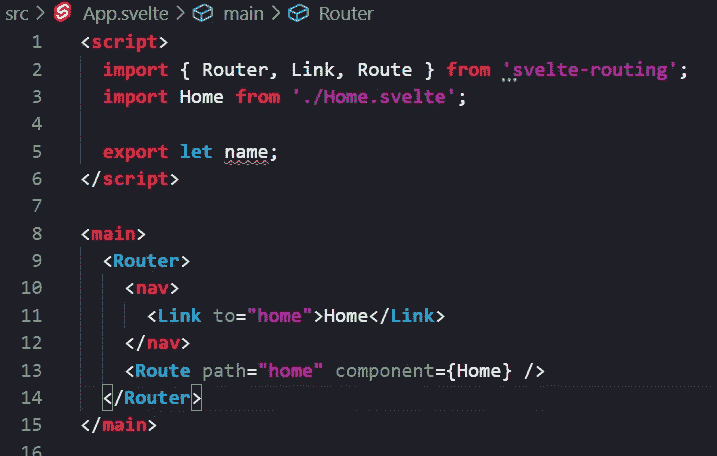
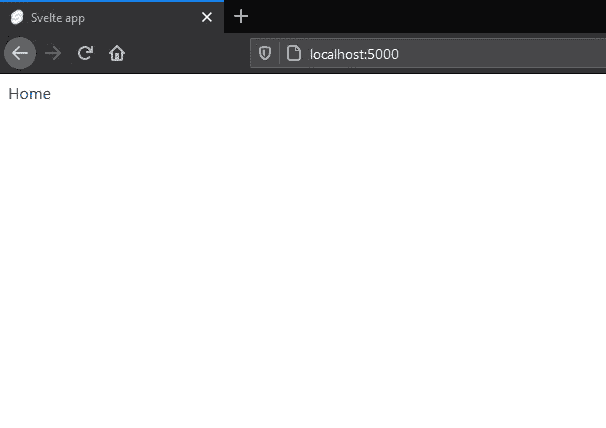
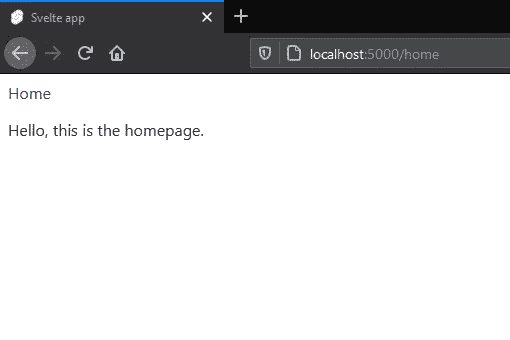

# 如何用 Svelte 和 Express.js 配置单页路由

> 原文：<https://javascript.plainenglish.io/how-to-configure-page-routing-with-svelte-and-express-js-ab5a4e0ad12f?source=collection_archive---------3----------------------->

## 了解如何在使用客户端路由和热重新加载时避免“找不到页面”错误


Photo by [Oliver Roos](https://unsplash.com/@fairfilter?utm_source=unsplash&utm_medium=referral&utm_content=creditCopyText) on [Unsplash](https://unsplash.com/s/photos/fork-in-the-road?utm_source=unsplash&utm_medium=referral&utm_content=creditCopyText)

本教程适用于任何创建单页面应用程序并想知道如何在服务器端正确配置路由的人。它将使用 Svelte 作为框架，但这里的技术将适用于任何使用客户端路由的应用程序。

**问题**

像`svelte-routing`这样的客户端路由解决方案工作得很好，但是如果你在使用它们时试图刷新页面，它们就会崩溃，这意味着不可能使用热重载。这是因为所有的路由逻辑都是在客户机上执行的，当您最初加载一个页面时，比如说`localhost:5000/home`，客户机代码还没有加载。这意味着你的浏览器将试图在`localhost:5000`找到文件`home.html`，但它不会在那里，因为它是一个单页应用。它只有`index.html`。

这里有一个例子。



上面的代码创建了一个简单的应用程序，并使用`svelte-routing`作为路由解决方案。然后，它为`Home`组件创建一个`Route`和一个导航链接。`Home`组件只返回一个`p`标签，上面写着‘你好，这是主页’。

当我加载这个应用程序时，我看到了根页面。



当我点击`Home`时，我被转到主页。



当我试图直接导航到`localhost:5000/home`或刷新页面时，问题出现了。如果我这样做，我会看到一个空白页，或一个找不到的错误。

**解决方案**

为了解决这个问题，我们需要一种方法来拦截对`localhost:5000`的 HTTP 调用，然后将它们全部重定向回`index.html`。当我们这样做时，服务器将返回根页面，它将加载我们所有的代码，然后路由将开始运行并显示主页。

我们可以通过创建一个 express 服务器来服务我们的应用程序来做到这一点，让我们开始吧。

首先，通过运行`npm i express`安装 express，然后在项目的根目录下创建一个文件`server.js`。添加以下样板文件来创建服务器。

```
var express = require('express')
var app = express()app.listen(3000, () => {
  console.log("App listening on port 3000")
})
```

现在，我们需要做两件事。我们需要配置一个静态目录，它将告诉 express 在哪里可以找到我们的 html & js 文件。然后我们需要拦截所有的 http 呼叫并把它们路由回 index.html。

Svelte 的静态目录将是`public`目录，因为所有构建的文件都放在那里。这是标准的，所以对其他框架来说可能也是一样的，但是显然要确保检查。

要在 express 中定义静态文件夹，我们需要:

`app.use(express.static('public'))`

所以把这个加到`server.js`

```
var express = require('express')
var app = express()app.use(express.static('public'))app.listen(3000, () => {
  console.log("App listening on port 3000")
})
```

现在，如果您使用`node server.js`运行您的服务器，您应该会看到您的应用程序被加载到浏览器中。然而，我们仍然没有解决这个问题。

现在我们需要重写所有对`index.html`的 http 调用。这很简单，如下所示。

```
app.get('*', (req, res) => {
  res.sendFile(__dirname + "/public/index.html")
})
```

星号字符拦截所有调用，然后我们告诉服务器从公共文件夹返回`index.html`文件。我们使用`__dirname`来获得完全合格的路径。

如果您现在运行您的服务器，您应该能够直接导航到`localhost:5000/home`。不过，还有一个问题。

**热重装**

这样做的一个好处是它可以热重装。然而，现在我们没有使用 Svelte 的`npm run dev`来运行我们的应用程序，我们没有从中受益。目前，我们需要停止服务器，编译应用程序，并再次重启它，使热重装工作。这是一个痛苦的手动操作，但我们可以相对容易地将其自动化。

有一个很好的小 npm 包叫做`concurrently`。我们过程的最后一步是用`npm i concurrently`安装它，然后在我们的`package.json`中创建一个脚本来运行我们的服务器和我们的热重装。下面是它看起来很苗条的样子(对于其他框架几乎是一样的)。

```
"scripts": {
   "build": "rollup -c",
   "dev": "rollup -c -w",
   "start": "sirv public",
   "serve": "concurrently \"node server.js\" \"npm run dev\" "
 },
```

我们的`serve`命令将运行服务器和`dev`命令。因为 dev 命令会在每次保存时重新创建`public`文件夹，并且我们的服务器会在每次请求时读取该文件夹，所以我们总能获得最新的应用程序代码。

就是这样。简单的过程，但如果你不知道你在找什么，那就很烦人了。感谢阅读。