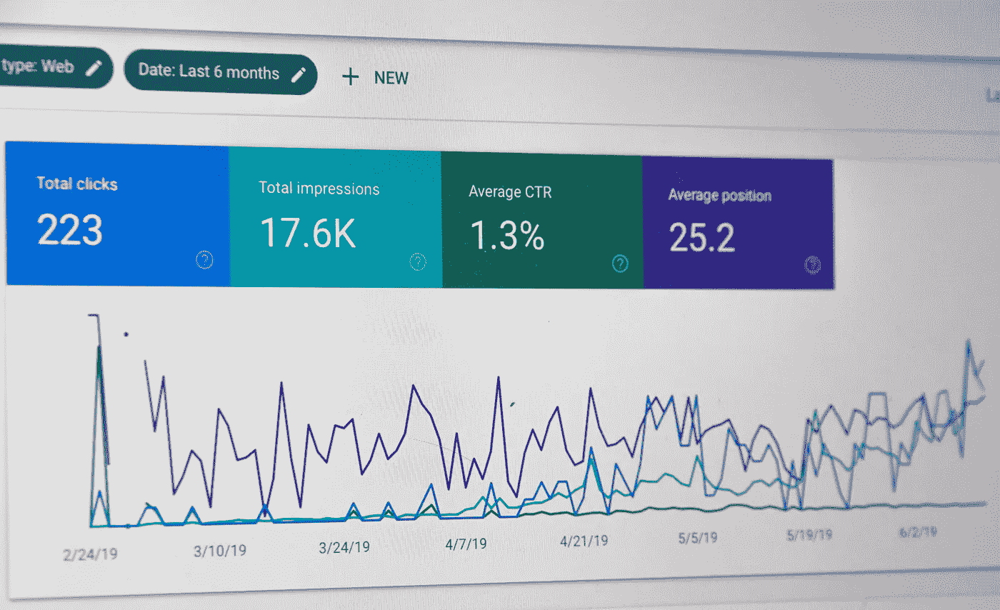
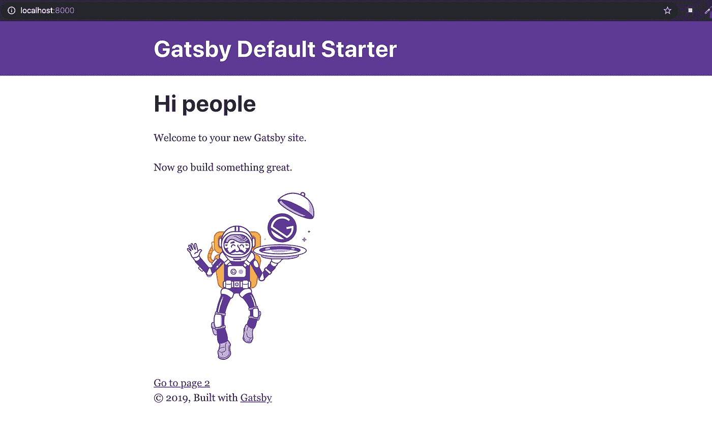
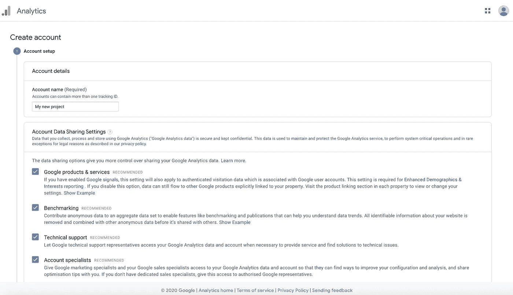
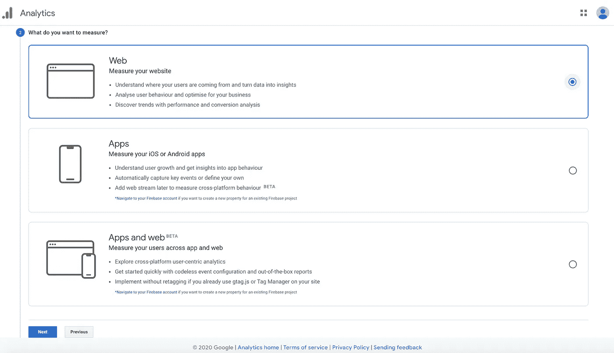
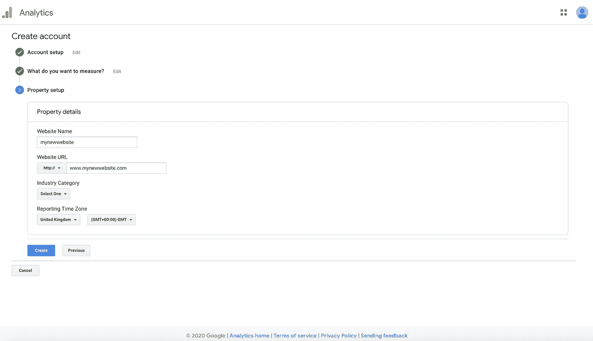
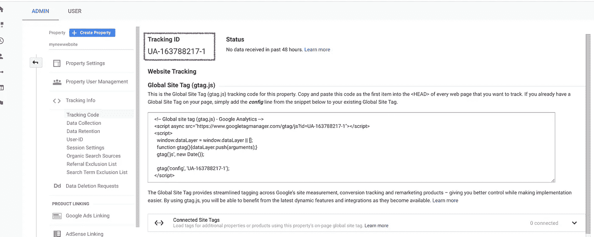
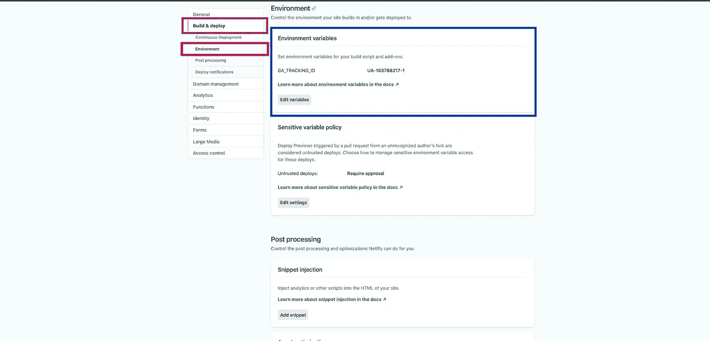
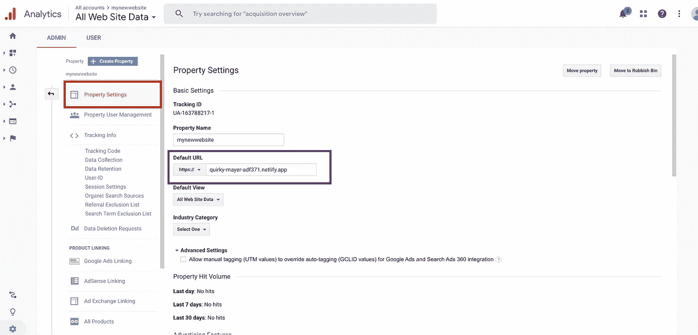
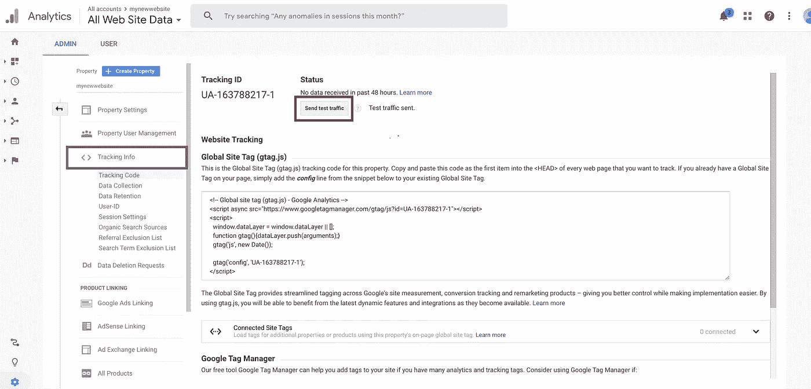
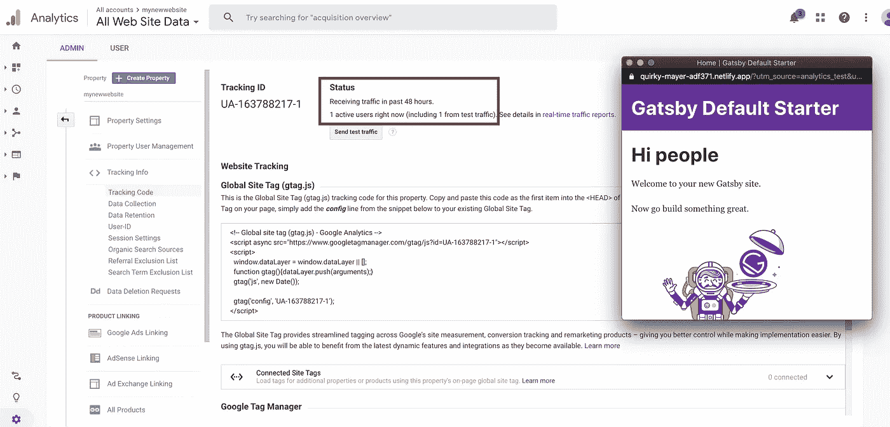

# 如何将谷歌分析添加到你的 Gatsby.js 网站

> 原文：<https://javascript.plainenglish.io/how-to-connect-your-gatsby-js-landing-page-to-google-analytics-and-deploy-to-netlify-step-by-step-8352467583df?source=collection_archive---------0----------------------->

在用 Gatsby.js、Netlify 和 Mailgun 一步一步地制作了联系表之后，我想继续我的系列文章，讲述如何一步一步地用 Gatsby.js 建立一个经典的登录页面。今天的文章将是关于设置谷歌分析。



The traffic I wished I had on my website. Photo by [Webaroo](https://unsplash.com/@webaroo?utm_source=unsplash&utm_medium=referral&utm_content=creditCopyText) on [Unsplash](https://unsplash.com/s/photos/analytics?utm_source=unsplash&utm_medium=referral&utm_content=creditCopyText)

将 Google Analytics 连接到您的登录页面非常重要。事实上，它允许你跟踪页面的使用情况。不久前，我与一位企业家交谈，她不明白为什么人们会在购买任何东西之前就离开她的网站。在快速浏览了一下她的分析后，我发现她的 90%的用户都在使用移动设备，如果你使用移动设备，结账前的页面会弹出一个无法关闭的窗口。那么，让我们开始设置它:

# 第一步。创建一个 Gatsby.js 启动器，并将其推送到 GitHub 上

如果您已经有了登录页面，您可以直接进入步骤 2。

和以前一样，我们将从创建一个 Gatsby.js 启动器开始。如果你还没有建立你的开发环境，你可以按照[这个步骤](https://www.gatsbyjs.org/tutorial/part-zero/)。



Gatsby starter

完成后，我们将创建一个新的 gatsby 站点，并使用以下命令进行第一次运行。

```
gatsby new gatsby-site
gatsby develop
```

一旦你到了这里，你可以打开浏览器，进入 [http://localhost:8000/](http://localhost:3000/) 查看你的网站运行情况。

然后，我们将在 Github 上发布我们的代码。创建存储库后，Github 会给出发布存储库的说明。如果您选择在命令行上创建一个新的存储库，那么您不需要添加一个 read me，因为 Gatsby.js starter 已经提供了一个。

如果你想看的话，我在 Github 上的知识库可以在这里找到。

# 第二步。创建您的谷歌分析帐户



Create a Google Analytics account

一旦你上了[谷歌分析](https://analytics.google.com/analytics/web/provision/?authuser=1#/provision)，你就需要开一个账户。

这非常简单，你只需要给你的项目取一个名字。

下一步是棘手的部分。你必须选择你想测量的东西。在我们的例子中，它是一个“网站”。我第一次设置 google analytics 时，选择了“应用和网络”,但我从来没有成功地使用 Gatsby.js。



Pick Website

最后一部分，你必须填写你的财产细节。你可以在网址中看到，我放了一个随机的网址。一旦我们的网站部署在 Netlify 上，我们将改变这一点。如果你已经知道你的网址，请随意直接把它放上去。



Create your google analytics account

点击创建，同意服务条款，你就都好了！谷歌会给你一个追踪 ID。它应该出现在你点击创建后打开的页面上。如果不是，你可以在管理面板，跟踪信息，然后跟踪代码中找到它。你可以在紫色方块中看到它:



Find your Tracking ID

# 第三步:安装谷歌分析插件并进行设置

首先，我们要做的是安装谷歌分析插件:

`npm install --save gatsby-plugin-google-analytics`

我们将根据最低需求对其进行配置:

```
**// In your gatsby-config.js**module.exports = {
  plugins: [
    {
      resolve: `gatsby-plugin-google-analytics`,
      options: {
        // The property ID; the tracking code won't be generated without it
        trackingId: "YOUR_GOOGLE_ANALYTICS_TRACKING_ID",
      },
    },
  ],
}
```

正如你所看到的，有一个空间来放置你的谷歌分析跟踪 ID。您的谷歌分析跟踪 ID 是私人的，如果您不小心，它很容易被盗。它不应该被公开。所以比如**不要在 GitHub 上推**。这就是为什么我们要在设置中保存它们。

[Gatsby](https://www.gatsbyjs.org/docs/environment-variables/) 需要在我们的函数文件中安装环境变量和几行代码(`npm install dotenv`):

```
**// In your gatsby-config.js** // Gatsby settings for the environment variablesrequire("dotenv").config({
  path: `.env.${process.env.NODE_ENV}`,
})
```

然后，您可以添加环境变量:

要将它与你的谷歌分析连接起来，你需要在你的根文件夹中创建一个名为`.env.development`的文件。你应该小心这个文件的拼写，如果拼写不正确，它将无法工作。这个文件不会上传到 Github 上，因为这些类型的文件包含在 Gatsby.js starter 提供的 git ignore 中。

您的`.env.development`文件将只包含一行:

```
GA_TRACKING_ID="UA-163788217-1"
```

现在，如果你离开你的服务器(CTRL + C)并再次启动它(`gatsby develop`)。

# 第四步。在 Netlify 上部署并更新您的 google analytics 设置

如果你还没有一个 Netlify 账户，在这里注册并点击右上角的按钮“来自 Git 的新网站”。然后，您将被重定向到一个新的屏幕，在这里您可以选择 GitHub 作为您的 Git 提供者。一旦它链接到 GitHub 并选择您之前创建的存储库。

如您所知，您的 google analytics 跟踪 ID 在您的环境设置中。因此，一旦部署到 Netlify 上，不要忘记将它添加到部署设置中。

现在，是时候在部署变量中添加您的 google analytics 跟踪 ID 了。


Netlify settings before deployment

然后，点击“部署网站”。

如果您已经有一个已部署的登录页面，您可以通过进入设置，单击构建和部署(紫色方块)，然后单击环境(红色方块)。然后，在“编辑变量”(蓝色方块)中，您将能够为每个变量输入一个键和值的组合。



Changing your environment variable from Netlify’s settings

构建完成后，您将能够看到您的站点 URL。所以，现在你可以回到你的谷歌分析仪表板，进入你的属性设置(红色方块)并更新你的默认网址(紫色方块):



Property settings to change

完成后，不要忘记保存页面底部。几分钟后，你可以进入跟踪信息(紫色方块)，点击“发送流量请求”(红色方块)。



Traffic Test

一旦你点击了这个按钮，它就会在一个新的页面上打开你的网站。一旦你重新加载谷歌分析，你会看到有人(猜猜谁是🕵️‍♀️🔎？)连接到您的网站。



Result of the traffic test

恭喜🎉，一切正常，你的网站连接到谷歌分析。如果你在路上迷路了，我们会在这里结束。