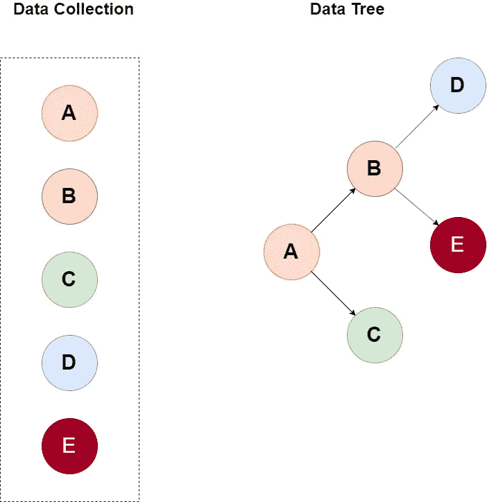

# 如何用 RxJS 的递归机制构造树形数据

> 原文：<https://javascript.plainenglish.io/how-to-construct-tree-data-using-recursive-mechanism-with-rxjs-b838127b39ac?source=collection_archive---------2----------------------->

在这篇博客中，我们将看到如何借助 RxJS 的递归机制将树节点的平面数据转换成树数据结构。

> 理想情况下，UI 应该由来自后端服务的数据驱动，但有时服务可能无法促进用户界面的预期，因此我们必须在 UI 中的状态/数据转换上做出妥协。

Data Collection vs Tree

Data we receive from service for Tree conversion

我们从服务端接收一个键值对对象，其中`key`代表记录的唯一标识符，`value`代表数据模型。

在处理完数据后，我们的最终状态应该是，

tree data

让我们开始编写代码，首先让我们尝试将数据转换成[流](https://codeburst.io/reactive-streams-are-so-simple-4105378f4c59)

在这里的`getFromServer`方法中，我们传递根节点的标识符，并将数据转换成可观察值。

让我们一步步讨论`getRecursive`方法的功能，

1.  我们用记录的唯一标识符调用方法`getFromServer`，并进一步用下面的操作符`map`、`flatMap`、`forkJoin`、`tap`来管理它
2.  `map`将类型`FlatTreeData` 的数据转换为`{parent: {name: string; id: number;children:Array<number>}}`我们将子对象重置为空数组，因为管道中的未来操作符会分配相应的子对象。
3.  `forkJoin`用于累加父节点和该父节点的所有子节点，因为来自`getFromServer`方法的响应是可观察的。我们使用了`forkJoin`
4.  `flatMap`用于处理高阶可观测值。这里，我们需要将内部可观察对象展平，即从`forkJoin(parentStream, ...childrenStreams)`到`[parent, …children]`的响应
5.  `tap`用于更新从`parent`对象中的 rest 操作符获得的`children`属性
6.  最后，在`map`中，我们析构了父类和角色类型`TreeData`

完整的例子在这里-

感谢阅读。快乐编码👍🏽