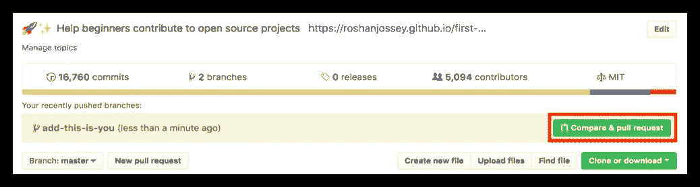
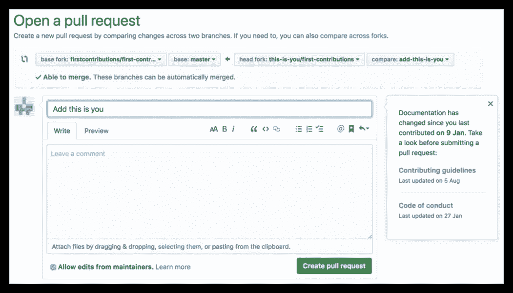

# 如何为 Github 库/项目做贡献

> 原文：<https://javascript.plainenglish.io/how-to-contribute-to-a-github-repository-project-78f777623f18?source=collection_archive---------4----------------------->

## 在 Github 上投稿的简单指南

Photo by [Yancy Min](https://unsplash.com/@yancymin?utm_source=medium&utm_medium=referral) on [Unsplash](https://unsplash.com?utm_source=medium&utm_medium=referral)

> “光比声音传播得快。这就是为什么有些人看起来很聪明，直到你听到他们说话

拿到了吗？

我太逊了，哈哈

无论如何，如果你想为一个项目做贡献，让它变得更好，你的帮助总是会被感激的。参与项目也是了解 Github 上的社交编码、新技术及其生态系统，以及如何做出建设性的、有帮助的错误报告、功能请求和所有贡献中最高尚的:一个良好、干净的拉请求的好方法。

# 提出好的、干净的拉式请求

1.  将存储库分支到您的个人 Github。分叉基本上是为您自己的帐户复制存储库的一种简单方法。
2.  现在您已经将存储库分支到您的帐户，转到您帐户中的存储库，然后单击克隆按钮并点击*复制到剪贴板*图标。
3.  现在，在本地机器上打开一个终端，通过执行以下操作克隆分叉的存储库:`git clone <copied url>`
4.  比如:`git clone [https://github.com/raphtlw/Checkra1nBot.git](https://github.com/raphtlw/Checkra1nBot.git)`
5.  在本地机器中的 git 中创建一个分支:`git checkout -b <branch-name>`
6.  现在你可以修复 bug 或者做任何你需要做的事情来改进项目中的代码。遵循项目的代码风格，包括缩进。如果项目有测试，运行它们！根据需要编写或修改测试。根据需要添加或更改文档。请记住，要确保更改只应用到您创建的分支！
7.  在文本编辑器中打开`Contributors.md`,添加你的名字。不要把它放在文件的开头或结尾，而是放在文件中间的任何地方。现在，保存文件。
8.  通过执行`git commit -m "Added <your-name> to contributors list`来提交这些更改“-m”告诉 git 您正在提交更改，并通过一条消息告诉人们提交是关于什么的。
9.  将这些更改推送到 Github 上分叉的存储库，方法是:`git push origin <your-branch-name>`用您之前创建的分支的名称替换“< your-branch-name >。

## 提交您的更改以供审核

如果你去你在 GitHub 上的库，你会看到一个`Compare & pull request`按钮。点击那个按钮。

现在，提交拉取请求。

恭喜你。您已经成功地为 Github 库做出了贡献。现在，您只需等待存储库所有者/管理员接受您的拉请求。

感谢您阅读本指南！

*本指南最初发布于*[*blog . raphtlw . rocks*](https://blog.raphtlw.rocks/posts/how-to-contribute-to-a-github-repository/)