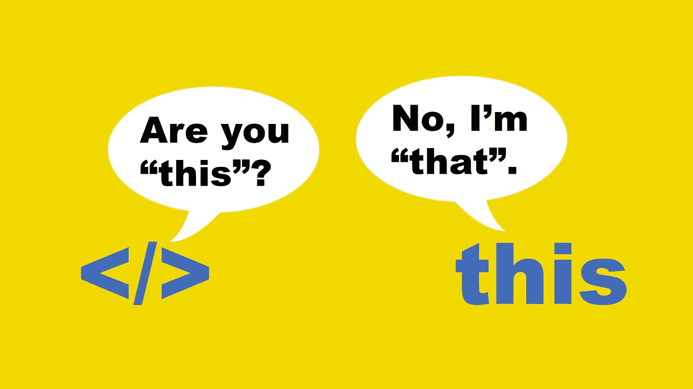
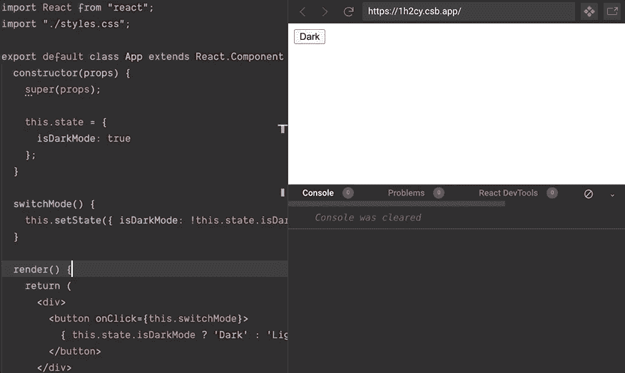
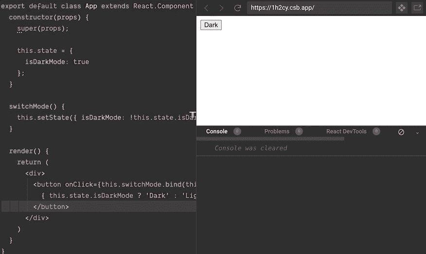

# 如何在 JavaScript 中更好地控制“this”

> 原文：<https://javascript.plainenglish.io/how-to-control-this-better-in-javascript-dcacd54bcf97?source=collection_archive---------5----------------------->

## **使用 call()、apply()和 bind()方法**



在 JavaScript 中处理`this`很棘手。

有时，你使用`this`，但它不是你期望的`this`。很困惑，对吧？

这就是为什么 JavaScript 为我们提供了三种方法来更好地控制`this`。它们是`call()`、`apply()`和`bind()`。

它们都是 JavaScript 中预定义的方法。它们被链接到函数对象原型，这意味着一旦你定义了一个函数，它就有权限访问所有这些方法。

让我们看看他们如何帮助我们对付`this`。

# 函数.原型.调用()

语法:`func.apply(thisArg, arg1, arg2, arg3,…)`

`call()`是做什么的？

你可以从它的名字猜到，它调用函数。

示例:

```
function sayHello() {
  console.log(‘Hello’);
}sayHello.call(); // Hello
```

简单吧？

但是为什么要写整个`sayHello.call()`而我们可以只写`sayHello()`？

只是举个例子。我不认为有人会那样使用`call()` 。

为了理解使用`call()`的正确方法，请看下面的例子:

```
let book = {
  title: ‘JavaScript Best Practices’
}function showAuthorBook(author) {
  console.log(`${author} is the author of “${this.title}”`);
}
```

如果我们正常调用`showAuthorBook()`方法，`this.title`将是未定义的，因为函数没有`title`属性。

```
showAuthorBook(‘Amy’); Amy is the author of “undefined”
```

幸运的是，这个问题可以通过下面的方法解决:

```
showAuthorBook.call(book, ‘Amy’); // Amy is the author of “JavaScript Best Practices”
```

这里发生了什么？

`call()`方法允许为对象 y 分配和调用属于对象 X 的函数

通过使用`call()`，您将`this`的新值赋予函数，这样您就可以编写一次函数，然后在另一个对象中继承它。这就像改变一个函数的上下文。

在上面的例子中，`showAuthorBook()`函数是用一个给定的`this`(即`book`对象)和实际函数的参数`Amy`调用的。现在，`showAuthorBook()`函数中的上下文指向`book`对象，而不再是函数。所以，`showAuthorBook()`功能中的`this.title`其实就是`book.title`。

这样做的好处是，您不需要为`book`对象重写另一个具有相同任务的函数，因为您可以利用现有的函数。

使用`call()`的一些实用方法:

**1。借用功能**

看看下面的两个物体:

```
const dog = {
  name: ‘dog’,
  bark: function() {
    console.log(`I’m a ${this.name}`);
    console.log(‘woof woof’);
  }};const fish = {
  name: ‘fish’,
  swim: function() {
    console.log(swimming);
  }
};
```

我们给鱼一种叫的能力怎么样？

由于`dog`对象有`bark`函数，我们只是借用它来用于`fish`对象，而没有定义另一个函数。

```
dog.bark.call(fish); // I’m a fish woof woof
```

**2。对象的链构造函数**

你可以使用`call()`来链接一个对象的构造函数。在某种程度上，它类似于 OOP 中的继承。

示例:

```
function Vehicle(nWheels) {
  this.nWheels = nWheels;
}function Car(color) {
  Vehicle.call(this, 4);
  this.color = color;
}function Bike(color) {
  Vehicle.call(this, 2);
  this.color = color;
}let car = new Car(‘red’); // { nWheels: 4, color: “red” }
let bike = new Bike(‘green’); // { nWheels: 2, color: “green” }
```

# Function.prototype.apply()

语法:`func.apply(thisArg, [argsArray])`

`apply()`类似于`call()`。这里的区别是`apply()`接受实际函数的参数作为数组。

示例:

```
const normalUser = {
  type: ‘normal’
}function showName(firstname, lastname) {
  console.log(`I’m ${firstname} ${lastname}. I’m a ${this.job}.`);
}showName.apply(normalUser, [‘Amy’, ‘Andrews’]); // I’m Amy Andrews. I’m a developer.
```

正如你所看到的，第二个参数是一个数组，其中有元素将被传递给由`apply()`方法调用的`showName()`函数。

使用`apply()`的一些实用方法:

**1。合并数组**

假设您需要将一个数组的元素推送到另一个数组:

```
let group1 = [‘Joey’, ‘Chandler’, ‘Ross’];let group2 = [‘Monica’, ‘Phoebe’, ‘Rachel’];group1.push(group2);
console.log(group1); //[“Joey”, “Chandler”, “Ross”, [“Monica”, “Phoebe”, “Rachel”]]
```

完成了。`group2`数组的元素现在在`group1`中。然而，问题是它将整个数组作为一个元素来推送，而不是单独的元素。

[合并数组](https://medium.com/javascript-in-plain-english/8-ways-to-solve-javascript-array-issues-you-need-to-know-about-de4fb3770e5a)有很多种方法。但是这次我们用`apply()`。通过稍微调整代码，我们将完成任务:

```
group1.push.apply(group1, group2);console.log(group1); // [“Joey”, “Chandler”, “Ross”, “Monica”, “Phoebe”, “Rachel”]
```

现在其实已经做好了。

**2。识别数字数组的最小值/最大值**

```
let numbers = [3, 31, 12, 76, 243, 123, 55, 10];let min = Math.min.apply(null, numbers); // 3
let max = Math.max.apply(null, numbers); // 243
```

这很方便，因为我们不需要把数组分成单个的数字。我们所要做的就是在`apply()`的帮助下，将整个数组作为参数传递给`min()/max()`函数。

**3。借用功能**

像`call()`一样，我们可以使用`apply()`从其他对象借用函数。

```
const calculationV1 = {
  version: 1,
  sum: function(a, b) {
    console.log(`Calculation version ${this.version}. The sum of           
                 ${a} and ${b} is ${a + b}`);
  }
};const calculationV2 = {
  version: 2
}let sumV1 = calculationV1.sum(1, 2); // Calculation version 1\. The sum of 1 and 2 is 3let sumV2 = calculationV1.sum.apply(calculationV2, [4, 5]); // Calculation version 2\. The sum of 4 and 5 is 9
```

如你所见，`calculationV2`对象没有`sum()`函数，但是我们可以从`calculationV1`对象那里借用它。

# 函数.原型.绑定()

语法:`func.bind(thisArg, arg1, arg2, arg3,…)`

`bind()`方法创建一个新的函数，其`this`关键字设置为调用该函数时提供的值。要清楚地了解它，请查看以下示例:

```
const book = {
  title: ‘JavaScript’,
  displayTitle: function () {
    console.log(this.title);
  }
};function waitToDisplayTitle(displayFunc, time) {
  setTimeout(displayFunc, time);
}book.displayTitle(); // JavaScript
waitToDisplayTitle(book.displayTitle, 100); // undefined
```

如果我们用传统的方式来调用`displayTitle()`函数，它会完美地工作。但是当我们把它作为一个回调函数传递给另一个函数时，它就不再理解原来的`this`了。上下文已更改。这就是为什么`waitToDisplayTitle()`会打印`undefined`。

为了解决这个问题，我们使用如下的`bind()`:

```
waitToDisplayTitle(book.displayTitle.bind(book), 100); // JavaScript
```

`this`关键字返回到`book`对象，现在一切都如预期的那样工作。

如果你和我一样，使用`bind()`最实际的方法是当你需要在基于反应的应用程序中处理`this`时。不知何故，在那种应用中我们可能会遇到更多关于`this`的问题。

示例:

```
class App extends React.Component {
  constructor(props) {
    super(props); this.state = {
      isDarkMode: true
    };
  } switchMode() {
    this.setState({ isDarkMode: !this.state.isDarkMode });
  } render() {
    return (
      <div>
        <button onClick={this.switchMode}>
          { this.state.isDarkMode ? ‘Dark’ : ‘Light’ }
        </button>
      </div>
    )
  }
}
```

以上示例将呈现一个带有标签`Dark`的按钮。我们的任务是点击按钮后在`Dark`和`Light`之间切换标签。让我们看看任务是否完成了？



正如您在上面的 gif 中看到的，无论我们点击按钮多少次，标签都保持`Dark`。除此之外，我们还会得到一个错误。所以，我们还是有事情要做。

错误很明显。当我们调用`switchMode()`函数时，函数中`this`的值为`null`，不再指向应用状态。因此，我们需要用`bind()`将其指向背面。

以下是解决方案:

```
<button onClick={this.switchMode.bind(this)}>
  { this.state.isDarkMode ? ‘Dark’ : ‘Light’ }
</button>
```



如您所见，它现在工作了。

但是在这种情况下，我们可以使用 [ES6 arrow 函数](https://medium.com/javascript-in-plain-english/9-es6-features-every-javascript-developer-should-know-b1f2915e7add)仍然可以达到同样的效果。

```
<button onClick={e => this.switchMode(e)}>
```

这是因为 arrow 函数没有定义自己的上下文。它使用封闭函数范围的上下文作为其`this`值。

既然我们有箭头函数，为什么还要使用`bind()`?在我看来，是关于[性能问题](https://dev.to/georgecoldham/using-arrow-functions-might-be-costing-you-performance-4fm6)。你应该根据你的目的和经验明智地使用它。

# 结论

如果您的应用程序变得更大，JavaScript 中的控制`this`可能会很困难。

现在，到目前为止，你有三种方法来跟踪`this`。所以，每当你需要改变上下文或者将`this`指向另一个对象时，使用`call()`、`apply()`和`bind()`。

你在使用`this`时会遇到什么问题吗？请在下面的评论中告诉我。

希望你喜欢这篇文章。

**延伸阅读**

[](https://medium.com/javascript-in-plain-english/11-javascript-concepts-every-web-developer-should-know-to-take-their-skills-to-the-next-level-37ef6693111a) [## 每个 Web 开发人员都应该知道的 11 个 JavaScript 概念，让他们的技能更上一层楼

### 不了解这些概念，就无法掌握 JavaScript。

medium.com](https://medium.com/javascript-in-plain-english/11-javascript-concepts-every-web-developer-should-know-to-take-their-skills-to-the-next-level-37ef6693111a)