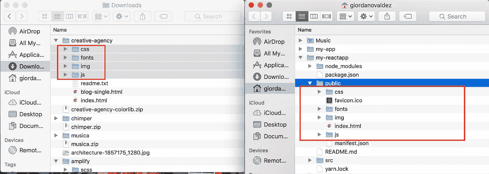
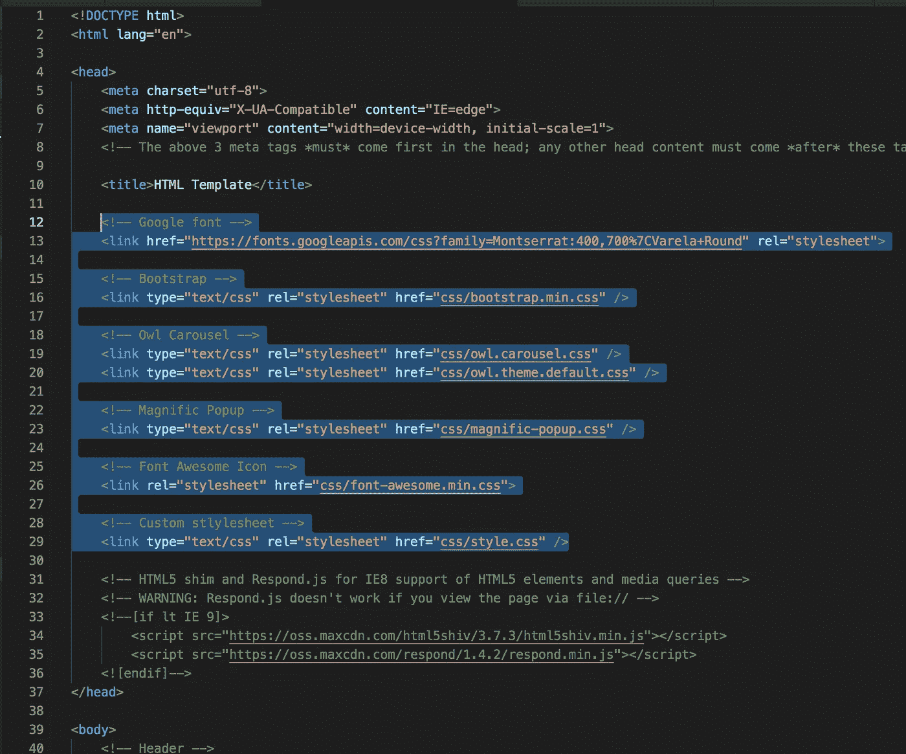
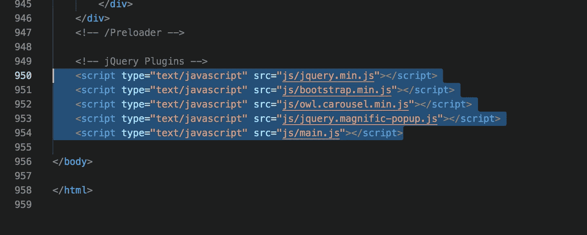
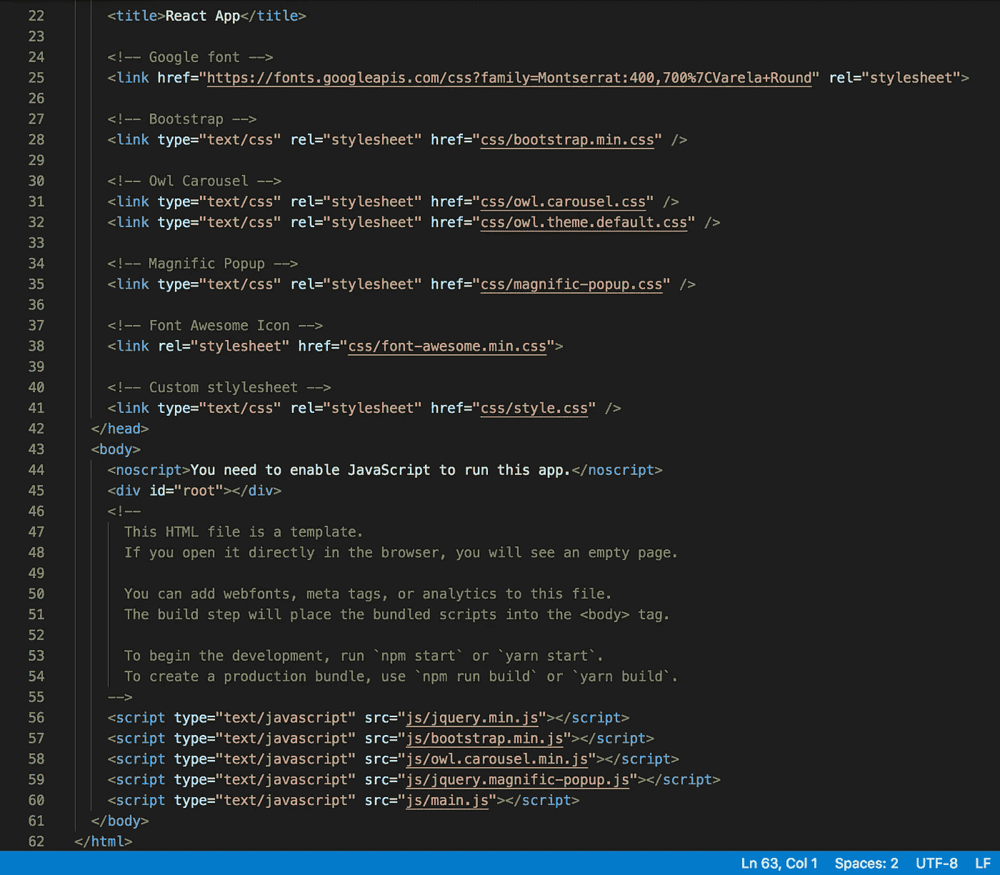
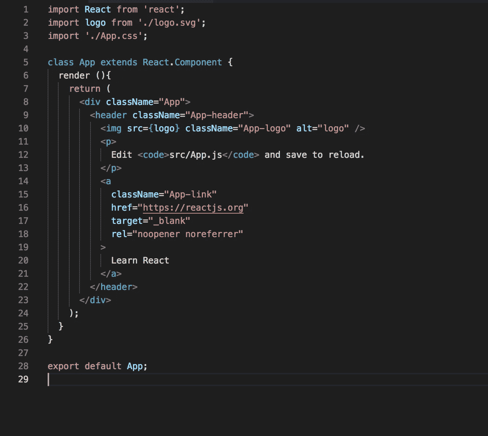
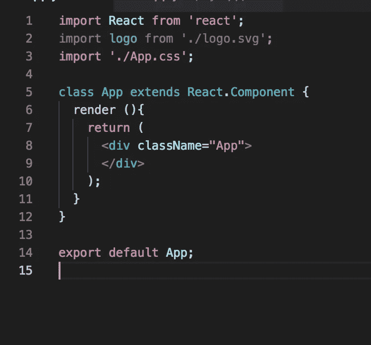

# 如何将任何网页转换成 React 网页

> 原文：<https://javascript.plainenglish.io/how-to-convert-any-web-page-to-reactjs-9740f1ba15db?source=collection_archive---------0----------------------->


下面的练习将把任何 HTML 网页转换成基于 ReactJS 组件的网站/应用程序。如果您正在构建一个全新的单页面应用程序，并且需要一个起点，那么这篇文章就是为您准备的。

虽然构建一个只知道 HTML、CSS 和 Javascript 的网站是令人满意的，但值得一提的是，以下公司已经决定过渡到 React 网站:

*   [Airbnb](https://www.airbnb.com/)
*   [Dropbox](https://www.dropbox.com/)
*   [看台报告](http://bleacherreport.com/)
*   脸书(真是个惊喜！)
*   [网飞](https://www.netflix.com/)

这是一个值得关注的非常重要的趋势，因为大多数名为“网站开发人员需求”的职位空缺都希望你知道如何制作一个快速的单页网站或应用程序，就像上面提到的那样。

本文将向您展示如何达到这一点。我们将使用 [ColorLib](https://colorlib.com/wp/templates/) 中的模板来完成这个练习。**免责声明:由于版权原因，这些模板仅用于实践，并不意味着是您的新网站，除非您愿意在单击“下载”时保留页脚注明，或者愿意直接支付模板费用。**

1.  下载以下[创意模板](https://colorlib.com/wp/template/creative-agency/)，因为这将是我们将转换为 React 的标准网站
2.  创建一个新的 [React 应用程序](https://reactjs.org/docs/create-a-new-react-app.html#create-react-app)，在您的终端或控制台中运行以下命令:

```
npx create-react-app **my-reactapp**
cd **my-reactapp**
npm start
```

注意:您必须拥有高于 6.0 的[节点版本和高于或等于 5.2 的 NPM 版本。](https://nodejs.org/en/)

用你选择的应用程序名称替换 **my-reactapp** 。一旦你运行了上面的命令，你的服务器应该正在运行并启动一个带有旋转 React 标志和背景的网页。您的所有资源都将位于 **my-reactapp/public** 文件夹中。

3.将所有文件夹(css/，fonts/，img/，js/)从你的[创意模板](https://colorlib.com/wp/template/creative-agency/)移动到你的 React 项目的**公共**文件夹。您需要将这些引用添加到 React 应用程序中的 **public/index.html** 文件中。



将资源从[创意模板](https://colorlib.com/wp/template/creative-agency/)移动到应用程序后，让我们打开它们各自的 index.html 文件。将样式和字体引用从模板的**index.html**文件复制到应用程序的文件中。



不要忘记从文件底部复制参考文献。



最终结果应该如下所示:



完成这一步后，模板中的所有功能都转移到了新的 ReactJS 应用程序中。您的整个网页将被嵌入到上面的 **< div id="root" >** 节点中。现在是有趣的部分。

4.现在是将布局转换成组件的时候了。在应用程序中打开主组件所在的 **/src/App.js** 文件。在这个文件中，您会注意到 **App()** 函数和一个 **return** 语句，该语句包含一个带有 HTML 的节点，其中包含启动服务器时显示的 React 徽标。

我们接下来要做的是完全可选的，但我更喜欢将这个应用程序功能转换成一个应用程序**类**。如果你不明白这一点，查看文档中的[函数和类](https://reactjs.org/docs/components-and-props.html#function-and-class-components)。长话短说，我们:

*   将**函数 App()** 改为**类 App extends React。组件**
*   给类 App 一个 **render()** 函数
*   将函数 App()中的返回语句复制到类 App Render()函数中

最终结果应该是这样的:



因此，我们应该有和以前一样的布局，旋转的 React 标志仍然在屏幕中间。通过将这个组件转换成一个类，我们能够赋予应用程序 [**状态**](https://reactjs.org/docs/state-and-lifecycle.html) ，如果你想让你的网站更加动态**，这可能是一个关键的特性。**我们还将被允许访问 React 的 [**生命周期方法**](https://reactjs.org/docs/state-and-lifecycle.html) ，这将允许我们在组件安装和卸载事件之间嵌入逻辑。

5.接下来，我们将开始向这个组件添加内容。首先，移除**头**节点及其子节点以清除网页



一旦我们清除了组件，我们将从创意模板中引用回**index.html**。我们将复制 **< body >** 元素中的所有内容，并粘贴到 React 项目上面的**<div class name = " App ">**节点中。这是乐趣开始的地方，也是我们看到无数错误的地方。因为我们选择了一个相当大的模板(更适合练习)，这需要一些耐心。要清除错误，请执行以下操作:

*   确保你没有复制了 **<脚本>** 标签。这些在 React 组件中是不需要的
*   确保你删除了所有的评论" **<！— >** "从组件内部，因为那些可能导致错误
*   确保所有 **< img / >** 和 **< input / >** 标签中有一个“/”
*   每一个 style= < **string >** 的实例，都必须转换成 style = {**<object>}**。每个样式属性必须是对象的一个属性。这里是你如何转换内嵌样式的方法。下面的示例将属性“背景图像”表示为骆驼大小写格式“背景图像”

```
// Result style: '10%'
<div style={{backgroundImage: "url('./img/background3.jpg')"}}>
  <div class="overlay"></div>
</div>
```

*   除了实例“ **class app”、**之外，您需要将文件中的**“class”**的所有实例更新为**“class name”**

如果操作正确，这将消除所有错误。保存后，我们将把模板网站转换成一个非常大的 ReactJS 组件。[以下是最终结果供参考](https://github.com/danov6/reactwebsite_instruction/blob/master/src/App.js)。


在另一篇文章中，我们将讨论如何将这个大的组件分解成更小的可回收组件。我们还将讨论如何处理包含多个 html 文件的模板(例如:about.html、contact.html 等)。)并把它们也分开。然而，仔细遵循这些步骤会将任何普通的网页转换成 ReactJS 应用程序。