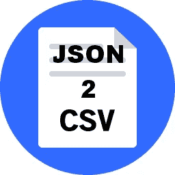

# 如何将 JSON 转换成 CSV — NodeJs

> 原文：<https://javascript.plainenglish.io/how-to-convert-json-to-csv-nodejs-f6be0778ee5a?source=collection_archive---------1----------------------->



编码让我的生活又变得简单了。几天前，有人向我提出一个问题，我们面前有一个很大的 json 转储文件，很难想象和理解文件的重要内容。它有一些我们需要提取的非常重要的信息，但是文件太大了，很多时候我的本地编辑器会崩溃，我不得不一直重启我的笔记本电脑。

是时候拿出**的解决方案了。**

1.  使用第三方网站链接，该链接接受 json 文件并将其转换为 CSV 格式。
2.  通过编写代码来自动化这个过程，该代码将接收 json 文件，对其进行处理，然后将最终输出写入 csv 文件。

让我们用上面的方法来研究一下**问题**。

1.  使用那个网站的问题是，当你上传你的 json 文件时(在我们的例子中，它的大小约为 20MB)，如果文件大于 1MB，所有的在线网站都要收费。我不想花 50 美元把我的 json 文件转换成 csv 文件格式。
2.  我必须研究不同的想法和方法，然后决定哪种技术最适合我的用例。

显然，作为一名软件开发工程师，我选择了第二种方法，为了解决上面的问题，我使用了我最喜欢的框架- **NodeJs** 。

出于演示的目的，我将采取一个小的样本 json，这里是它看起来如何:-

```
{
  "$schema": "[https://vega.github.io/schema/vega/v4.json](https://vega.github.io/schema/vega/v4.json)",
  "width": 400,
  "padding": 5,
  "autosize": "pad",
  "data": [
    {
      "url": "data/summary3.csv",
      "name": "tuples",
      "transform": [
        {
          "type": "aggregate",
          "groupby": ["a", "b", "d"],
          "fields": ["c"],
          "ops": ["average"],
          "as": ["c"]
        }
      ]
    },
    {
      "name": "trellis",
      "source": "tuples",
      "transform": [
        {"type": "aggregate", "groupby": ["a"]},
        {
          "type": "formula",
          "as": "span",
          "expr": "rangeStep * bandspace(datum.count, innerPadding, outerPadding)"
        },
        {"type": "stack", "field": "span"},
        {"type": "extent", "field": "y1", "signal": "trellisExtent"}
      ]
    }
  ],
  "legends": [
    {"fill": "color", "orient": "right", "title": "Objective Categories"}
  ],
  "signals": [
    {"name": "rangeStep", "value": 20},
    {"name": "innerPadding", "value": 0.1},
    {"name": "outerPadding", "value": 0.2},
    {"name": "height", "update": "trellisExtent[1]"},
    {"name": "colors", "value": ["#1f77b4", "#2ca02c", "#ff7f0e", "#1f77b4"]}
  ],
  "scales": [
    {
      "name": "xscale",
      "domain": {"data": "tuples", "field": "c"},
      "nice": true,
      "zero": true,
      "round": true,
      "range": "width"
    },
    {
      "name": "color",
      "type": "ordinal",
      "range": {"signal": "colors"},
      "domain": {"data": "trellis", "field": "a"}
    }
  ],
  "axes": [
    {
      "orient": "bottom",
      "scale": "xscale",
      "title": "Percent complete",
      "ticks": true,
      "labels": true,
      "grid": true,
      "domain": true
    }
  ],
  "marks": [
    {
      "type": "group",
      "from": {
        "data": "trellis",
        "facet": {"name": "faceted_tuples", "data": "tuples", "groupby": "a"}
      },
      "encode": {
        "enter": {"x": {"value": 0}, "width": {"signal": "width"}},
        "update": {"y": {"field": "y0"}, "y2": {"field": "y1"}}
      },
      "scales": [
        {
          "name": "yscale",
          "type": "band",
          "paddingInner": {"signal": "innerPadding"},
          "paddingOuter": {"signal": "outerPadding"},
          "round": true,
          "domain": {"data": "faceted_tuples", "field": "b"},
          "range": {"step": {"signal": "rangeStep"}}
        }
      ],
      "axes": [
        {
          "orient": "left",
          "scale": "yscale",
          "ticks": false,
          "domain": false,
          "labelPadding": 4
        }
      ],
      "marks": [
        {
          "type": "rect",
          "from": {"data": "faceted_tuples"},
          "encode": {
            "enter": {
              "x": {"value": 0},
              "x2": {"scale": "xscale", "field": "c"},
              "fill": {"scale": "color", "field": "a"},
              "strokeWidth": {"value": 2},
              "tooltip": {"field": "d"},
              "hover": {"fill": {"value": "red"}}
            },
            "update": {
              "y": {"scale": "yscale", "field": "b"},
              "height": {"scale": "yscale", "band": 1},
              "stroke": {"value": null},
              "zindex": {"value": 0}
            },
            "hover": {"stroke": {"value": "firebrick"}, "zindex": {"value": 1}}
          }
        }
      ]
    }
  ]
}
```

现在创建一个文件夹，你可以随意命名，并快速运行命令- `npm init`。这将用 **package.json** 文件初始化你的文件夹。

现在，我搜索了一下，发现 **npm** 包 **csvjson** 很有帮助。使用下面的命令安装它和一些其他的包。

```
npm i csvjson
npm i fs
```

让我们快速进入编码部分，不要花太多时间。创建一个名为- index.js 的文件，并将以下内容粘贴到其中。

```
const csvjson = require('csvjson');
const readFile = require('fs').readFile;
const writeFile = require('fs').writeFile;readFile('./test-data.json', 'utf-8', (err, fileContent) => {
    if (err) {
        console.log(err); // Do something to handle the error or just throw it
        throw new Error(err);
    }txs = JSON.parse(JSON.stringify(fileContent));finalTxs = []
    for(let i=0; i<=1; i++) {
      finalTxs.push(fileContent[i]);
    }const csvData = csvjson.toCSV(finalTxs, {
        headers: 'key'
    });
    writeFile('./test-data.csv', csvData, (err) => {
        if(err) {
            console.log(err); // Do something to handle the error or just throw it
        }
        console.log('Success!');
    });
});
```

我来解释一下上面代码的要点。

1.  导入 csvjson 和 fs 包。
2.  创建 readFile 和 writeFile 对象。
3.  假设您的输入内容存在于 **test-data.json** 文件中，我们开始读取它。
4.  我们一读完，就把内容存入一个变量。
5.  第 4 步完成后，我们调用转换方法。 **toCSV** ，传入输入内容变量，并开始将输出数据写入名为 **test-data.csv** 的文件。

要运行 **index.js** 文件，可以使用的命令是`node index.js`。

我希望上面的文章很容易理解，我花了一个小时才弄明白上面所有的东西，但我还是写了一篇文章，这样以后就没有人需要花这么多精力去解决一个简单的问题了。

## **用简单英语写的 JavaScript 笔记**

我们已经推出了三种新的出版物！请关注我们的新出版物:[**AI in Plain English**](https://medium.com/ai-in-plain-english)[**UX in Plain English**](https://medium.com/ux-in-plain-english)[**Python in Plain English**](https://medium.com/python-in-plain-english)**——谢谢，继续学习！**

**我们也一直有兴趣帮助推广高质量的内容。如果您有一篇文章想要提交给我们的任何出版物，请发送电子邮件至[**submissions @ plain English . io**](mailto:submissions@plainenglish.io)**，并附上您的 Medium 用户名，我们会将您添加为作者。另外，请让我们知道您想加入哪个/哪些出版物。****