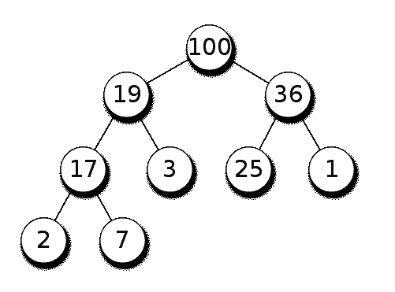
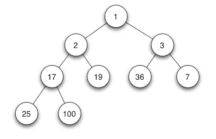
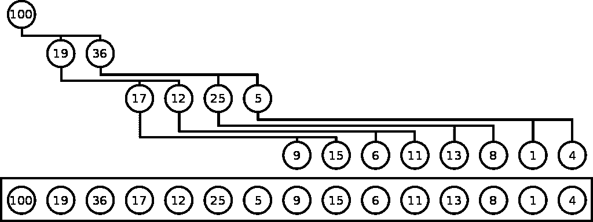

# 如何用 JavaScript 创建二进制堆

> 原文：<https://javascript.plainenglish.io/how-to-create-a-binary-heap-in-javascript-e1e6f6446ff9?source=collection_archive---------16----------------------->

## JavaScript 数据结构系列的第 7 部分


Photo by [Todd Quackenbush](https://unsplash.com/@toddquackenbush?utm_source=medium&utm_medium=referral) on [Unsplash](https://unsplash.com?utm_source=medium&utm_medium=referral)

在这篇文章中，我们将看看另一种类型的数据结构，二进制堆。如果你不熟悉树木，我建议你先看看下面的文章。

[](https://medium.com/javascript-in-plain-english/binary-search-trees-with-javascript-715df954b33) [## 使用 JavaScript 的二分搜索法树

### JavaScript 数据结构系列的第 5 部分

medium.com](https://medium.com/javascript-in-plain-english/binary-search-trees-with-javascript-715df954b33) 

# MaxBinaryHeap 与 MinBinaryHeap

二进制堆是一种具有附加规则的二叉树。要快速复习；二叉树是由具有父子关系的节点组成的数据结构。每个父节点最多可以有两个子节点。在二进制堆中，有两个附加规则:

1.  树的所有级别都必须按顺序填写。如果树的最后一级没有填充，则从左到右填充树的节点。

2.有两种方法可以将数据存储在树中:

*   MaxBinaryHeap 父值必须大于子值。下图显示了最大二进制堆。如您所见，根值是 100，每个子值(19 和 36)都小于父值。我们可以对树中的每个节点进行同样的检查。只要子属性小于父属性，左属性或右属性的顺序并不重要。



[https://en.wikipedia.org/wiki/Binary_heap](https://en.wikipedia.org/wiki/Binary_heap)

*   MinBinaryHeap 父值必须小于子值。下图显示了一个最小二进制堆。根值为 1，每个子节点(2 和 3)都大于父节点。这同样适用于树中的每个值。只要子属性多于父属性，左属性或右属性的顺序并不重要。



[https://en.wikipedia.org/wiki/Binary_heap](https://en.wikipedia.org/wiki/Binary_heap)

# 使用数组表示堆

存储二进制堆最简单的方法是使用数组。这涉及到一些数学问题，但不用担心；一旦我们理解了基本方程，使用它们就简单了。

为了找到任何父元素(n)的子元素，我们将使用以下等式:

*   左侧子节点:(2 * n) + 1
*   右子节点:(2 * n) + 2

为了找到任何子节点(n)的父节点，我们将使用下面的等式:

*   父节点:Math.floor((n - 1) / 2)



[https://en.wikipedia.org/wiki/Heap_(data_structure)](https://en.wikipedia.org/wiki/Heap_(data_structure))

让我们看看上面的图片，它显示了一个最大的二进制堆。我们可以用我们的方程，把我们的二进制堆表示成一个数组。`[100, 19, 36, 17, 12, 25, 5, 9, 15, 6, 11, 13, 8, 1, 4]`

例如，我们的根值 100 存储在数组的索引 0 处。使用我们的等式，我们可以在数组的索引 1 和 2 处找到两个孩子，19 岁和 36 岁。

左子节点:(2 * 0) + 1 = 1
右子节点:(2 * 0) + 2 = 2

然后，如果我们可以看看 19 作为一个父值，我们看到 19 有两个孩子，17 和 12。使用我们的等式，我们将看到这两个节点位于数组中的索引 3 和 4 处。

左子节点:(2 * 1) + 1 = 3
右子节点:(2 * 1) + 2 = 4

如果我们想找到任何节点的父节点，我们可以使用我们的另一个方程 Math.floor((n - 1) / 2)。例如，让我们看看存储在索引 4 中的值 12。父代是值 19，它存储在索引 1 中。

math . floor((4-1)/2)= math . floor(1.5)= 1

# 构建我们的二进制堆类

在下面的例子中，我们将构建一个最大二进制堆。一旦您理解了如何构建它，就可以用类似的方式创建一个最小二进制堆。首先，我们将创建一个类，并将其命名为 MaxBinaryHeap。这将有一个名为 values 的属性，它将被初始化为一个空数组。

```
class MaxBinaryHeap {
  constructor() {
    this.values = [];
  }
}
```

## 插入我们的二进制堆

让我们首先来看看如何向 max 二进制堆中添加值。第一步是将值推到值数组的末尾。push 方法将把值放在堆中的下一个位置。记住我们堆的第一条规则:*树的所有层次都必须按顺序填充。如果树的最后一级没有填充，则从左到右填充树的节点。*

然后，我们需要做一个泡泡效果。这意味着我们将比较插入的值和父值。如果插入的值大于父值，我们将切换这些值。我们将继续这样做，直到插入的值位于正确的位置。

Inserting into our Binary Heap

## 从二进制堆中移除

当从二进制堆中移除时，我们通常会移除根值。这意味着，在最大二进制堆中，我们删除的是最大值，而在最小二进制堆中，我们删除的是最小值。在我们的例子中，我们将调用我们的方法 extractMax。

为此，我们将首先用数组中的最后一个值交换根值。然后，我们将做一个泡沫下降的效果。因为我们的新根可能不在正确的位置，我们将比较这个值和它的子节点。无论哪个孩子更大，我们都要和他的父母交换。我们将继续这样做，直到值处于正确的位置。最后，我们将返回最大值。

Removing from our Binary Heap

# 包扎

感谢阅读！希望您现在已经了解了二进制堆以及如何在 max 二进制堆中插入和移除。如果您想为最小二进制堆实现这一点，您需要做的只是更改一些操作符和几行代码。

二进制堆对于排序和实现其他数据结构很有用，我们将在本系列的下一部分看到优先级队列。就大 O 符号而言，二进制堆在插入和删除方面表现出色。都有一个大 O 的 O(log N)。

想继续学习吗？看看下面这篇关于深度优先搜索和广度优先搜索的文章。

[](https://medium.com/javascript-in-plain-english/tree-traversal-with-javascript-29b57d61d486) [## 用 JavaScript 遍历树

### JavaScript 数据结构系列的第 6 部分

medium.com](https://medium.com/javascript-in-plain-english/tree-traversal-with-javascript-29b57d61d486)