# 如何在 Azure DevOps 中为 Angular 创建构建管道

> 原文：<https://javascript.plainenglish.io/how-to-create-a-build-pipeline-for-angular-in-azure-devops-a9255385275e?source=collection_archive---------6----------------------->

## 为 Angular 创建持续集成(CI)构建管道


Photo by [Saj Shafique](https://unsplash.com/@saj_shafique?utm_source=unsplash&utm_medium=referral&utm_content=creditCopyText) on [Unsplash](https://unsplash.com/s/photos/build?utm_source=unsplash&utm_medium=referral&utm_content=creditCopyText)

# 介绍

软件构建管道结合了持续集成(CI)和持续交付(CD)来一致地测试、构建和交付您的代码。这极大地提高了产品代码的质量和涉众的参与。

在本指南中，我将向您展示如何在 Azure DevOps 中建立持续集成(CI)管道。每当您将代码推送到远程 Git 存储库时，CI 管道都会生成应用程序的生产版本。

**注意** : Azure DevOps 是一个**免费的**服务，不要误认为是 Azure 云服务。

# **入门**

本指南旨在全面介绍，因此我们将从头开始构建。我们将创建一个 Angular 应用程序，然后将其推送到远程 GitHub 存储库，最后设置构建管道。

如果你已经在 GitHub 上安装了你的应用程序，可以直接跳到你只创建管道的部分，也就是在 Azure DevOps 中创建一个构建管道。

## 创建角度应用程序

您可以使用 Angular CLI 通过以下命令轻松创建 Angular 应用程序。

```
$ ng new angular-azure-pipeline --defaults
```

一旦创建了应用程序，您就可以进入它的根目录并初始化 git 存储库，如下所示:

```
$ cd ./angular-azure-pipeline && git init
```

# **创建应用程序的 GitHub 库**

在本节中，我们将为 Angular 应用程序创建一个相应的远程 GitHub 存储库。如果您愿意，可以随意使用其他 GitHub 替代方案，如 Azure、Bitbucket 等。

登录你的 GitHub 账户，点击下面红色突出显示的新建按钮。

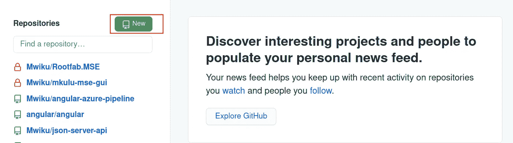

然后，您可以为远程存储库提供一个名称。我将我的 ***命名为 angular-azure-pipeline***与应用程序的名称一致。最后，单击 Create repository 按钮。

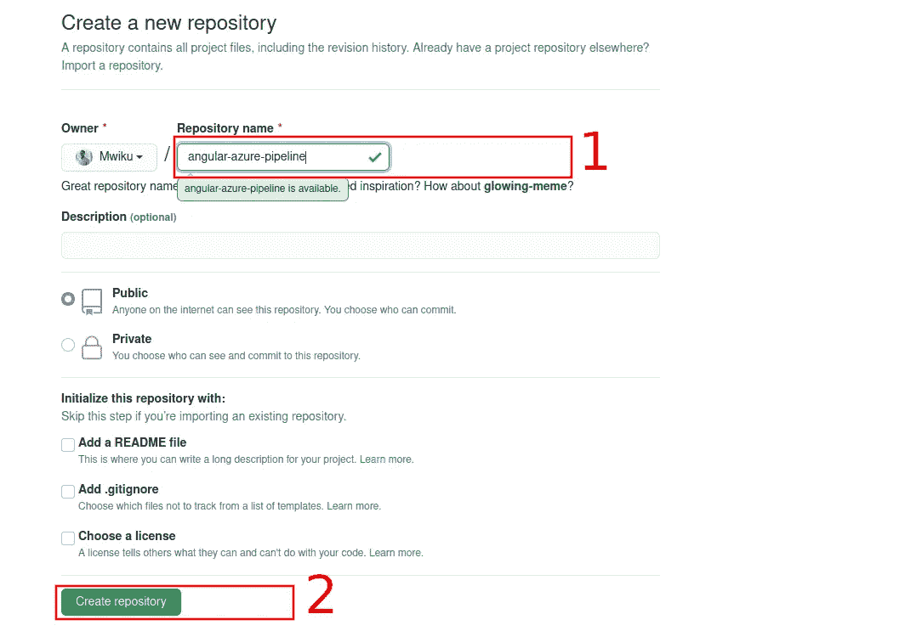

GitHub 将创建资源库，并向您提供一些快速设置信息。重要的是 git 存储库名称。我在下图中突出显示了这一点。

复制存储库名称，以便您可以在下面的部分中使用它，将其添加为本地存储库的远程源。

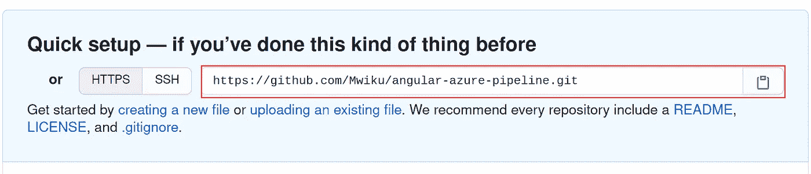

# 进行初始提交

返回本地存储库，使用下面的命令将其链接到远程存储库。

```
git remote add origin **https://github.com/Mwiku/angular-azure-pipeline.git**
```

**注意**:记住用您从 GitHub 复制的正确的库名替换上面粗体的库名。

现在，您可以使用以下三个命令进行初始提交并将代码推送到 GitHub 存储库。

```
git add .git commit -m “initialize repository”git push -u origin master
```

# 在 Azure DevOps 中创建构建管道

在本节中，我们将创建必要的基础设施，以便在 Azure DevOps 中使用管道。

你可以点击[链接](https://dev.azure.com/)访问 Azure DevOps。如果您没有帐户，请登录或注册免费的。

一旦登录 Azure DevOps，您需要创建一个项目，该项目将包含管道和其他相关资源或信息。

要创建一个项目，单击新建项目按钮，如下图所示。

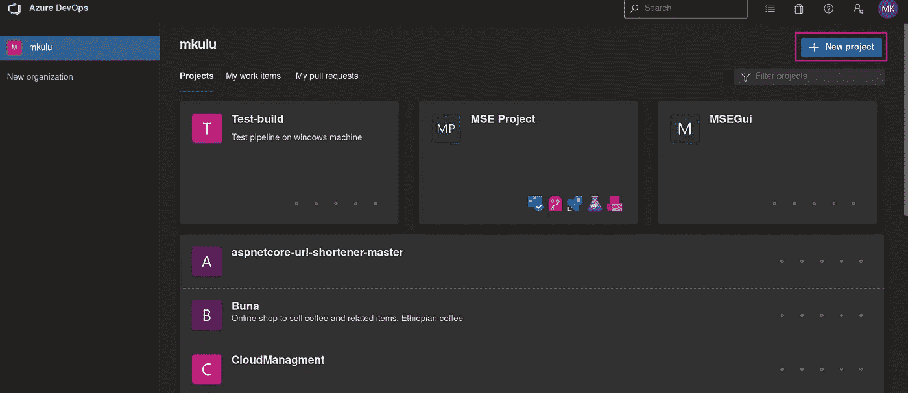

您将被提示输入项目名称，为了方便起见，我用应用程序的名称来命名它。您可以保留默认设置，但是如果您愿意，可以随意修改。最后，点击底部的创建按钮。

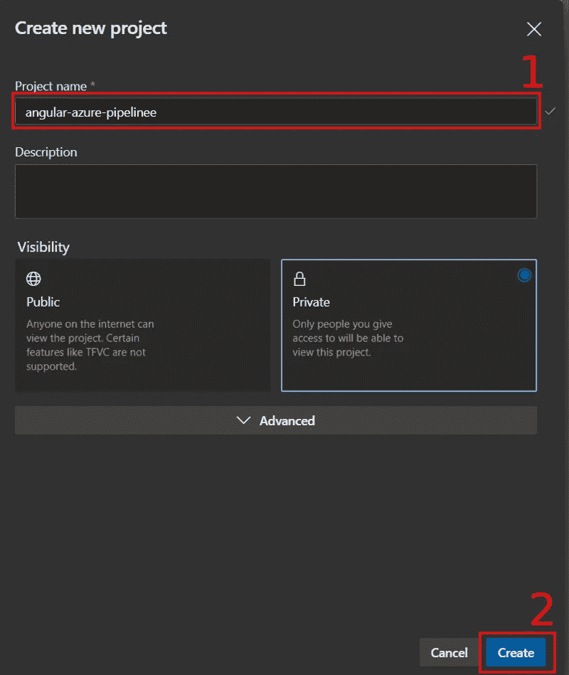

创建项目后，单击左侧导航菜单上的 pipeline 链接。然后单击出现在主要内容区域的“创建管道”按钮。

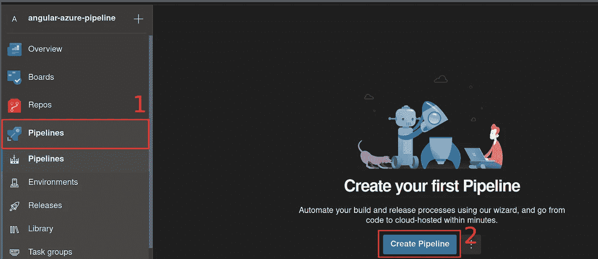

Azure DevOps 提供了两种创建新管道的主要方法。

1.经典编辑器——基本上是一个 GUI 变体，用于创建管道和

2.YAML 文件——使用 YAML 标记来创建和编辑管道

我们会选择 YAML，因为它更直接，并且为您提供了更多的定制能力。

因为我已经使用 GitHub 作为我的远程存储库主机，所以我将选择 GitHub，如下图所示。

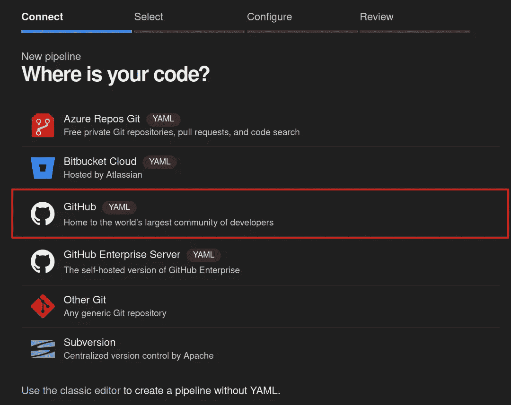

在我们选择 GitHub 之后，我们会被要求选择一个存储库。我正在寻找的存储库以红色突出显示，所以我选择了它。


选择 GitHub 存储库后，会出现一个登录 GitHub 帐户的屏幕提示。提供您的登录凭据。

通过身份验证后，如果您的存储库已被选中，您可以单击“批准并安装”按钮。

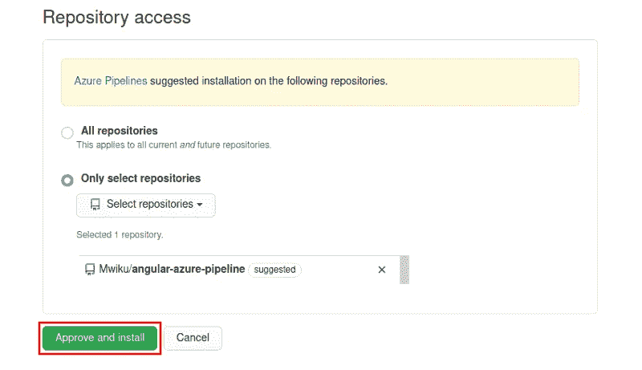

完成上述步骤后，您将被重定向到 Azure DevOps。其中将提示您通过选择要用来构建管道的引擎来配置管道。

由于我们的应用程序使用 Angular，我将选择这样的选项: **Node.js with Angular** 。这将为我们提供一个非常好的管道模板。

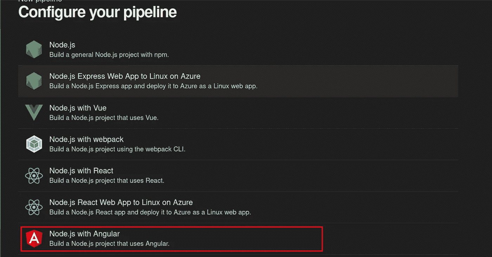

下图是 Azure DevOps 根据我选择的配置创建的管道文件的预览。

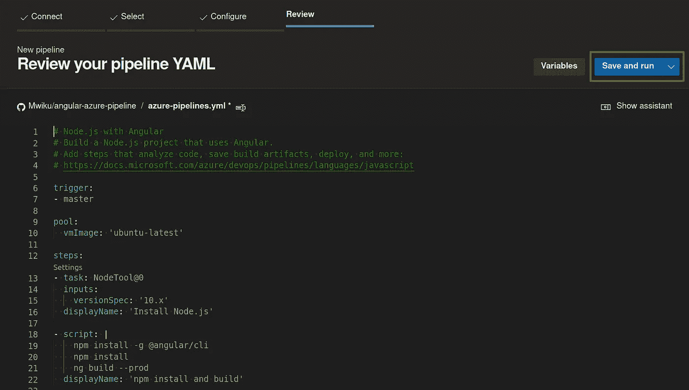

YAML 档案有三个主要部分

1.  trigger——这指定什么将导致管道自动运行。在这种情况下，它是主分支。每当您将代码更改推送到主分支时，管道都会运行。
2.  池-池指定运行管道时将使用的操作系统。这个管道使用的是***Ubuntu-最新的*** ，在本文写作时是 Ubuntu 20.04 焦窝 LTS。
3.  步骤——最后，YAML 文件指定了构建 Angular 应用程序的步骤。它将首先安装 angular CLI，然后恢复依赖关系，最后创建一个生产版本。如果将来您希望管道运行单元测试并执行其他任务，可以在 steps 部分进行编辑。

要保存并运行管道文件，您可以单击上面突出显示的保存并运行按钮。

在下一个提示中，您只需单击保存并运行即可。如果您愿意，请输入提交消息。Azure DevOps 将继续运行管道。如果构建成功运行，您将看到一个绿色的勾号，如下所示。

要查看有关管道构建的更多信息，您可以展开它。如果管道失败，这也是查找错误消息和哪个步骤失败的地方。

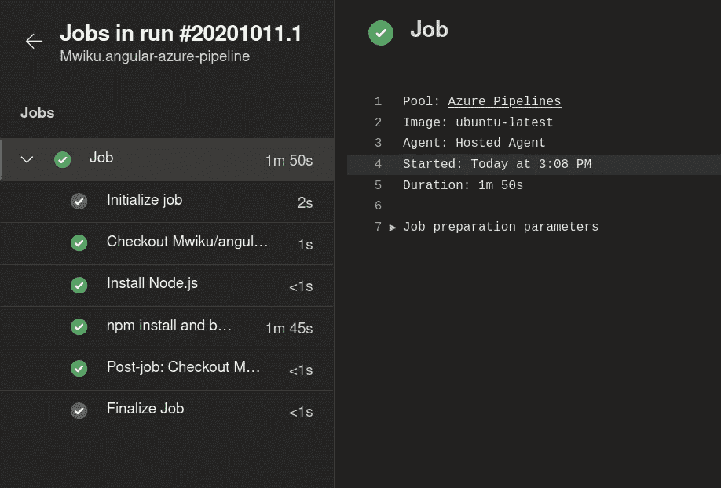

下次向主分支提交内容时，管道将自动运行。此外，管道构建输出报告将发送到您注册的电子邮件地址。

# **结论**

在本指南中，我们创建了一个 Angular 应用程序，然后将其推送到 GitHub，最后使用 Azure DevOps 为该应用程序创建了一个连续构建(CI)管道。

将 DevOps 实践整合到您的软件开发工作流中对于交付高质量的软件是至关重要的。