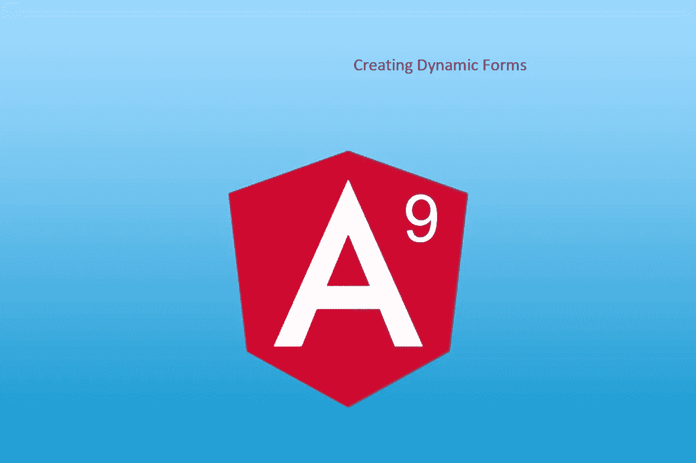

# 如何在 Angular 中创建复杂的动态表单

> 原文：<https://javascript.plainenglish.io/how-to-create-a-complex-dynamic-form-in-angular-19a472af6060?source=collection_archive---------3----------------------->



表单是 web 应用程序非常重要的一部分。有时我们会遇到表单元素是静态且定义良好的场景。有时候，web 应用程序开发超越了静态表单，进入了动态表单。动态表单没有静态字段。动态窗体和控件可以基于某些事件生成。在本文中，我们将基于加号的点击来生成控件。点击减号按钮删除它。

这是一个芯片一样的结构，我们有加号和减号按钮来添加和删除文本字段。在本文中，我们举一个产品的例子。

# 角度设计

Angular 支持两种动态控制设计。

*   **模板驱动-** 模板驱动表单中对角度模板有更多的控制。该模板非常强大，拥有 Angular 框架内置的大部分功能。我们只需要手工制作具有良好和干净设计的 HTML。我正在使用这种方法。
*   **反应型——**再次非常强大，大部分的控制权都在组件上。需要 Formbuilder 来构建表单。

# 构建动态组件

我们正在构建一个产品组件。产品有产品名称和产品代码。该产品还有另一个可选参数，即产品特性。产品功能包含功能名称、功能添加日期和功能描述。 ***该功能可以随时添加。我们要添加的功能数量没有限制。屏幕看起来会像这样。***


# 模型设计

创建接口产品特征并将其传递给产品接口。产品界面像数组一样接受产品特性。下面是数据模型。

下一步是创建子组件。是的，我正在这里创建一个子组件。因为在大多数企业应用程序中，我们应该创建一小组组件。

```
<app-product-feature ></app-product-feature>
```

我们必须将数据从子组件传递到父组件。所以这里定义 parentProductFields 函数，将数据设置到父组件中。

```
<app-product-feature (parentProductFields)="parentProductFields($event)"></app-product-feature>
```

在父组件中创建 parentProduct 方法。该方法将设置 this.productField，其类型为 Product <productfeatures>。</productfeatures>

```
productField: Product<productFeatures> = {} as Product<productFeatures>;parentProductFields(value) {console.log(`calling hour recieved from parent is ${JSON.stringify(value)}`)this.productField = value;}
```

现在，在产品目录下创建子组件产品特性。将父产品字段定义为@Output 属性。parentProductFields 属于产品类型<productfeatures>。</productfeatures>

```
@Output() parentProductFields = new EventEmitter<Product<productFeatures>>();
```

用初始数据初始化。这里，产品 id 被初始化为 1，其余的字段被初始化为空。产品特性数组保存一个对象，每当添加一个新特性时，我们将在特性数组中推送一个新特性对象。

```
productField: Product<productFeatures> = {id: 1,productName: ‘’,productCode: ‘’,description: ‘’,productFeatures: [{featureName:””,featureAddedDate:””,featureDescription:””}]}
```

完整的产品组件将如下所示。

现在手工制作 HTML。在 HTML 产品名称中，产品代码是文本框。产品特性是一个动态表，我们通过迭代来生成动态组件。

```
<tbody><ng-template ngFor let-prod [ngForOf]=”productField.productFeatures” let-i=”index”>
<tr><td>
<!-- Product feature here --><td></tr>
</ng-template>
</tbody>
```

在开发这个控件的时候我发现了一个重要的事情。您必须为每个控件动态创建 id。否则会创建控件的相同深层副本。

```
<td><input class=”form-control minimal” **id=”{{featureAddedDate + prod}}”**[(ngModel)]=”prod.featureAddedDate”></td>
```

完整 HTML 文件如下所示。

## 添加产品功能

要添加新产品功能，请添加以下代码行。此方法将新功能产品添加到 this . product field . product features 中

```
addNewProdField(index: number): void {let prod: productFeatures = {“featureName”: “”,“featureAddedDate”: “”,“featureDescription”: “”} ;this.productField.productFeatures.push(prod);console.log(`In method addNewProdField field index is ${index} and field is ${JSON.stringify(JSON.stringify( this.productField))}`);this.parentProductFields.emit(this.productField);}
```

## 删除产品特征

若要删除产品功能，请从 this . product field . product features 拼接产品索引。

```
removeNewProdField(index: number): void {this.productField.productFeatures.splice(index, 1);console.log(`In method addNewProdField field index is ${index}`);this.parentProductFields.emit(this.productField);}
```

要显示子组件数据的变化，请在父组件 HTML 中添加这一行。

```
<pre>{{productField | json}}</pre>
```

现在您可以看到添加字段的 JSON 数据。

```
{
  "id": 1,
  "productName": "Netgear Wireless Router",
  "productCode": "NG123",
  "description": "",
  "productFeatures": [
    {
      "featureName": "capacity",
      "featureAddedDate": "05/01/2020",
      "featureDescription": "123"
    },
    {
      "featureName": "range",
      "featureAddedDate": "05/01/2020",
      "featureDescription": "123"
    }
  ]
}
```

# 结论

同样，我们可以将这个例子扩展到多种产品。使用*ngFor 循环创建产品数组并显示。在这种情况下，我们应该有两个索引。一个指数代表产品，另一个指数代表产品特性。产品索引将有助于添加到产品阵列中，功能索引将有助于添加/删除产品功能。

在 stackblitz 项目中附加完整的代码示例。实时项目。

下载 github 项目以获得更多控制。

[](https://github.com/codingindepth/angular-dynamic-component-demo) [## 编码深度/角度动态组件演示

### 由斯塔克布里兹·⚡️.创作通过创建一个……

github.com](https://github.com/codingindepth/angular-dynamic-component-demo)