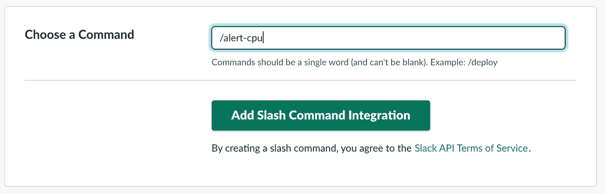

# 如何使用 Google Cloud 函数和 NodeJS 创建自定义 Slack 命令

> 原文：<https://javascript.plainenglish.io/how-to-create-a-custom-slack-command-using-google-cloud-functions-and-nodejs-72a2f653d4e6?source=collection_archive---------9----------------------->


现在，我们都已经习惯了远程工作，使用聊天、视频会议和屏幕共享，我们被鼓励分享想法，因此需要创建自定义工作流。

在本文中，我们将探讨三种流行的技术，Slack、Google Cloud Functions 和 NodeJS。结合这些技术将改善我们在 Slack 中的工作流程。

首先，我们将讨论如何创建谷歌云功能。如果你不熟悉谷歌云，我建议你免费试用一下。

[](https://cloud.google.com/free) [## GCP 免费等级免费扩展试用和永远免费|谷歌云

### GCP 自由层以两种方式扩展我们的免费计划。12 个月免费试用 300 美元，永远免费。了解更多。

cloud.google.com](https://cloud.google.com/free) 

要创建 Google Cloud 功能，请转到功能页面:

[](https://console.cloud.google.com/functions) [## 谷歌云平台

### Google 云平台让您可以在同一基础设施上构建、部署和扩展应用程序、网站和服务…

console.cloud.google.com](https://console.cloud.google.com/functions) 

*   单击创建函数。
*   给它起个名字，比如`alert-cpu`。
*   如果你想让任何人运行这个函数，正如我们想让 Slack 调用这个函数，那么点击复选标记“允许未认证调用”。
*   这将使任何人都可以调用这个函数，但是我们只允许 Slack 调用。因此，我们将要求它在查询字符串中检查一个令牌。
*   检查触发器是否为 HTTP。
*   您可以选择运行时为节点 8，也可以选择不同的节点版本。

云函数源代码:

```
/**
 * Responds to any HTTP request.
 *
 * @param {!express:Request} req HTTP request context.
 * @param {!express:Response} res HTTP response context.
 */
exports.alertCpu = (req, res) => {
  // Check if it is a valid Slack request
  if (req.query.token !== process.env.SLACK_TOKEN) {
    return res.status(403).send('No Access');
  }

  // This is just for an example
  const stats = await stats.check('CPU');

  res.status(200).json({
    response_type: 'in_channel',
    attachments: [
      {
        fallback: `CPU Stats`,
        color: '#2eb886',
        pretext: `This is checking the CPU of our servers`,
        author_name: req.query.user_name,
        title: 'Company Name App - CPU Check',
        title_link: 'https://your.company.com/status',
        text: `The CPU is at ${stats.CPU}%`,
        fields: [
          {
            title: 'Priority',
            value: 'High',
            short: false,
          },
        ],
        footer: 'Company Name',
        footer_icon: 'https://your.company.com/logo.png',
      },
    ],
  });
};
```

要完成这个函数的创建，请确保编辑名为“Function to Execute”的字段，并将其命名为您要导出的函数。在我们的代码中，我们使用如下名称导出函数:

```
exports.alertCpu
```

所以我们要执行的函数是`alertCpu`

在 Google Cloud 的底层架构中，Functions for Node 只是一个简单的`Express`服务器。

> 注意:您可以像在任何`Express`服务器中一样使用相同的`req`和`res`变量。

如果您对`Express`不熟悉，可以到这里阅读文档:

[](https://expressjs.com/) [## Express - Node.js web 应用程序框架

### Express 是一个最小且灵活的 Node.js web 应用程序框架，它为 web 和…

expressjs.com](https://expressjs.com/) 

所以现在让我们讨论一下我们可以发送回 slack 的响应。

首先，我们需要发回一个 JSON 有效载荷。在这个有效载荷中，我们可以配置很多东西，但是在这篇文章中，我们将讨论几个。

```
response_type: 'in_channel'
```

这意味着当您键入 Slack 命令时，它将响应该频道中的每个人，而不仅仅是您自己。如果你只是想让你的用户看到，那就不要写了。

我们还可以将附件作为我们响应的一部分发送，当 Slack 在通道中显示消息时，它会为我们格式化这些附件。

通过设置`author_name`,我们可以显示谁发送了命令。

我们可以发送图像、链接和文本。这个回答最重要的部分是这样的:

```
text: `The CPU is at ${stats.CPU}%`
```

我们想提醒我们的服务器的 CPU %的渠道。您可以使用任何想要的指标或统计数据来完成这项工作。系统上有多少用户。当服务器超过一定的 CPU 百分比时，向开发团队发送一封电子邮件。当然，你可能想在 Google Cloud 中设置某种监控系统来处理这个问题，但是这只是一个例子，你可以在 Slack 中发送消息，让你的团队与你的系统保持同步。

您可以在这里阅读 JSON 有效负载中可以返回的所有响应字段的文档:

[](https://api.slack.com/messaging/composing/layouts) [## 创建丰富的邮件布局

### 在消息中以易于阅读和理解的方式组织复杂的数据。我们已经向您介绍了…

api.slack.com](https://api.slack.com/messaging/composing/layouts) [](https://api.slack.com/interactivity/slash-commands) [## 启用斜线命令的交互性

### 斜线命令允许用户通过在消息编辑器框中键入字符串来调用您的应用程序。提交的斜线…

api.slack.com](https://api.slack.com/interactivity/slash-commands) 

在完成之前，记得将 Slack 令牌添加到环境变量列表中。创建完函数后，它会显示一个 URL，您必须调用这个 URL 才能让 Slack 命令工作。

要获得 Slack 令牌，我们必须首先创建一个 Slack 命令。

现在，让我们转到“松弛时间组自定义集成”页面，这样您就可以开始创建自己的松弛时间命令了:

```
[https://[YOUR-GROUP-NAME].slack.com/apps/manage/custom-integrations](https://solodev-group.slack.com/apps/manage/custom-integrations)
```

点击斜线命令。

单击添加到时差。

在下一页，它将显示一个屏幕，让您输入您希望 Slack 命令调用的内容。



单击添加斜杠命令集成。

在下一页上，您可以配置希望调用该命令的 URL。在我们的例子中，我们将输入从 Google Cloud 函数接收到的 URL。

我们将把方法从 POST 改为 GET。

我们还可以看到我们需要添加到云函数中的环境变量中的 Slack 令牌。这将使得有可能知道呼叫来自 Slack。

您还可以通过给命令添加描述、徽标等等来自定义该命令。

因此，从这篇文章和其他文档中，您可以看到很容易设置一个 Slack 命令，让它为您收集信息，然后提醒团队、渠道或业务，而不会留下 Slack。您可以保持联系并自定义您的工作流程。

现在我们可以输入 Slack 命令来测试:

```
/alert-cpu
```

当然这只是一个例子，但是你可以看到保持工作流松弛的好处。

## JavaScript 用简单的英语写的一个注释:

我们已经推出了三种新的出版物！请关注我们的新出版物:[**AI in Plain English**](https://medium.com/ai-in-plain-english)[**UX in Plain English**](https://medium.com/ux-in-plain-english)[**Python in Plain English**](https://medium.com/python-in-plain-english)**——谢谢，继续学习！**