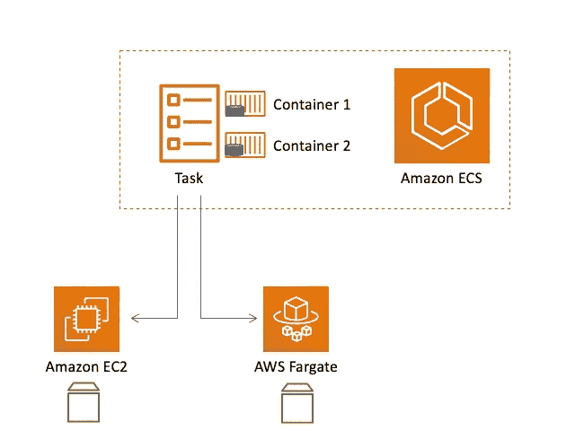
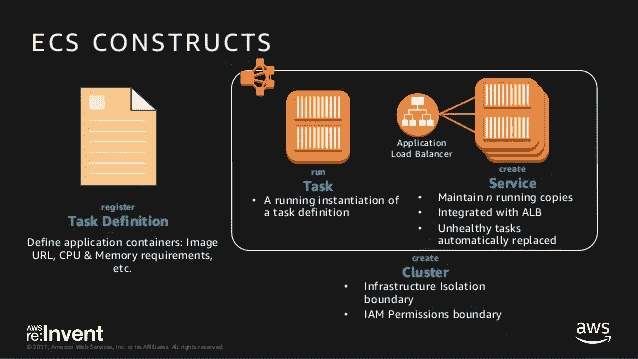

# 如何使用 Terraform 创建动态 AWS ECS 集群

> 原文：<https://javascript.plainenglish.io/how-to-create-a-dynamic-ecs-cluster-with-terraform-86d6b11d0db9?source=collection_archive---------0----------------------->

## 可根据您的需求扩展的 ECS 群集

本文旨在为如何使用 Terraform 开发动态 ECS ( [弹性容器服务](https://aws.amazon.com/ecs/?whats-new-cards.sort-by=item.additionalFields.postDateTime&whats-new-cards.sort-order=desc&ecs-blogs.sort-by=item.additionalFields.createdDate&ecs-blogs.sort-order=desc))模块提供**清晰的示例和说明**。


“动态”是因为 Terraform 可以**轻松**扩展以处理更多需要的服务和任务。



ECS Architecture ([source](https://aws.amazon.com/blogs/containers/developers-guide-to-using-amazon-efs-with-amazon-ecs-and-aws-fargate-part-1/))

本文假设对 Terraform 有一个基本的了解。如果你正在寻找一个项目向你介绍 Terraform，[看看我的文章，这篇文章展示了如何建立一个 **Spotify 数据管道**](https://medium.com/python-in-plain-english/how-to-engineer-spotify-data-with-terraform-aws-fd80feb73b1b) 。

# 0.建立工作关系网

实际 ECS 群集的定义没有任何网络要求。

```
resource "aws_ecs_cluster" "cluster" {
  name = "${var.environment}-cluster"
  tags = var.tags
}
```

这是因为网络功能是在服务级别定义的，因为这些是托管任务的弹性组件。

ECS overview

我们的网络需求在[服务定义](https://registry.terraform.io/providers/hashicorp/aws/latest/docs/resources/ecs_service)中指定:

```
resource "aws_ecs_service" "fargate-microservices" {
  for_each      = var.create_microservices == true ? var.fargate_microservices : {}
  name          = each.value["name"]
  cluster       = aws_ecs_cluster.cluster.id
  desired_count = each.value["desired_count"]
  launch_type   = each.value["launch_type"]
  depends_on = [aws_ecs_cluster.cluster,
  aws_ecs_task_definition.ecs_tasks]
  task_definition = each.value["task_definition"]

  network_configuration {
    subnets         = var.ecs_service_subnets
    security_groups = [aws_security_group.ecs_security_groups[each.value["security_group_mapping"]].id]
  }

  lifecycle {
    ignore_changes = [
      task_definition
    ]
  }
}
```

这里有很多内容需要解释，我将从网络配置开始。

```
network_configuration {
    subnets         = var.ecs_service_subnets
    security_groups = [aws_security_group.ecs_security_groups[each.value["security_group_mapping"]].id]
  }
```

在这种情况下,(私有)子网继承自定义 VPC 的模块，在创建动态集群时，我们只需参考 VPC 模块中的子网列表，以便将服务构建到所需的 VPC 中。

安全组利用 Terraform 中的‘for _ each’函数，该函数支撑了该模块的许多机制。

## [for_each](https://www.terraform.io/docs/configuration/resources.html#for_each-multiple-resource-instances-defined-by-a-map-or-set-of-strings)

这个功能允许我们构建共享相同参数的多个资源。该模块只需要在资源中定义 for_each，然后将一个“map”变量传递给指定的参数。

```
for_each      = var.create_microservices == true ? var.fargate_microservices : {}
```

在这种情况下，我们已经指定 create_microservices 必须为 true，以便创建我们的服务。然后，fargate_microservices 变量是一个映射，它包含我们的服务所需的所有参数(在“动态服务”一章中可以找到一个例子)。

## [**安全组**](https://registry.terraform.io/providers/hashicorp/aws/latest/docs/resources/security_group)

现在我们已经理解了 for_each 循环，下面是模块中的代码，它允许您定义任意数量的安全组。

```
resource "aws_security_group" "ecs_security_groups" {
  vpc_id = var.vpc_id

  for_each = var.security_groups
  name     = "${var.environment}-${each.value["ingress_port"]}"

  ingress {
    from_port   = each.value["ingress_port"]
    to_port     = each.value["ingress_port"]
    protocol    = each.value["ingress_protocol"]
    cidr_blocks = each.value["ingress_cidr_blocks"]
  }

  egress {
    from_port   = each.value["egress_port"]
    to_port     = each.value["egress_port"]
    protocol    = each.value["egress_protocol"]
    cidr_blocks = each.value["egress_cidr_blocks"]
  }

  tags = var.tags
}
```

该资源块将迭代在模块外部定义的“var.security_groups”对象，并将为每个以“each.value”为前缀的变量选取一个变量。

这是在模块外部定义单个安全组的方法:

```
"ecs_security_groups": {
    "prod-ecs-sg": {
        "ingress_port": "redacted",
        "ingress_protocol": "redacted",
        "ingress_cidr_blocks": [
            "redacted"
        ],
        "egress_port": "redacted",
        "egress_protocol": "redacted",
        "egress_cidr_blocks": [
            "redacted"
        ]
    }
}
```

然后，使用服务内部的“security_group_mapping”变量将它们映射到各自的服务，该变量将该安全组(prod-ecs-sg)的 id 与指定的服务相匹配。从这里开始，通过追加这个 map 对象来添加另一个安全组就很简单了。

现在我们将重新访问服务定义，看看 security_group_mapping 变量是如何与其他动态变量结合使用的。

# 1.动态服务

现在我们已经了解了如何配置我们的网络，让我们再看一看[服务定义](https://registry.terraform.io/providers/hashicorp/aws/latest/docs/resources/ecs_service)。

```
resource "aws_ecs_service" "fargate-microservices" {
  for_each      = var.create_microservices == true ? var.fargate_microservices : {}
  name          = each.value["name"]
  cluster       = aws_ecs_cluster.cluster.id
  desired_count = each.value["desired_count"]
  launch_type   = each.value["launch_type"]
  depends_on = [aws_ecs_cluster.cluster,
  aws_ecs_task_definition.ecs_tasks]
  task_definition = each.value["task_definition"]

  network_configuration {
    subnets         = var.ecs_service_subnets
    security_groups = [aws_security_group.ecs_security_groups[each.value["security_group_mapping"]].id]
  }}
```

您可能已经注意到了“depends_on”变量，这个变量列表是为了确保任务和集群都在服务之前构建。没有这些资源，服务将无法构建。

如前所述，为了创建任何服务，我们需要将 create_microservices 变量设置为 true。如果启用了此切换，那么我们必须传入一个变量映射来定义我们的服务:

```
"fargate_microservices": {
    "prod-service-one": {
        "name": "prod-service-one",
        "task_definition": "prod-task-one",
        "desired_count": "1",
        "launch_type": "FARGATE",
        "security_group_mapping": "prod-ecs-sg"
    },
    "prod-service-two": {
        "name": "prod-service-two",
        "task_definition": "prod-task-two",
        "desired_count": "1",
        "launch_type": "FARGATE",
        "security_group_mapping": "prod-ecs-sg"
    }
}
```

这才是真正的神奇之处，因为现在只需在地图中添加另一个元素就可以创建新的服务了！

变量定义如下:

```
variable "fargate_microservices" {
  description = "Map of variables to define a Fargate microservice."
  type = map(object({
    name                   = string
    task_definition        = string
    desired_count          = string
    launch_type            = string
    security_group_mapping = string
  }))
```

“launch_type”通过使用 AWS Fargate 或 EC2 指定您希望您的集群如何运行您的容器。为了更好地了解哪种发布类型适合您的要求，请查看此[链接](https://containersonaws.com/introduction/ec2-or-aws-fargate/)。

那么我们如何制作动态任务呢？



Summary of tasks, services and clusters ([source](https://www.slideshare.net/AmazonWebServices/container-networking-deep-dive-with-amazon-ecs-con401-reinvent-2017))

# 2.动态任务

下面是动态[任务](https://registry.terraform.io/providers/hashicorp/aws/latest/docs/resources/ecs_task_definition)的完整定义:

```
resource "aws_ecs_task_definition" "ecs_tasks" {
  for_each = var.create_tasks == true ? var.ecs_tasks : {}
  family   = each.value["family"]
  container_definitions = templatefile(each.value["container_definition"], "${merge("${var.extra_template_variables}",
    {
      container_name        = each.value["family"],
      docker_image          = "${var.docker_image}:${var.docker_tag}",
      aws_logs_group        = "/aws/fargate/${aws_ecs_cluster.cluster.name}/${each.value["family"]}/${var.environment}",
      aws_log_stream_prefix = each.value["family"],
      aws_region            = var.region,
      container_port        = each.value["container_port"]
  })}")

  task_role_arn            = aws_iam_role.ecs_task_role.arn
  network_mode             = var.task_definition_network_mode
  cpu                      = each.value["cpu"]
  memory                   = each.value["memory"]
  requires_compatibilities = [var.ecs_launch_type == "FARGATE" ? var.ecs_launch_type : null]
  execution_role_arn       = aws_iam_role.ecs_execution_role.arn

  tags = merge({
    "Name"        = "${each.value["family"]}-${var.environment}"
    "Description" = "Task definition for ${each.value["family"]}"
    }, var.tags
  )
}
```

在此定义的最顶端，您可以再次看到“for_each”的使用，它要求“var.create_tasks”为真，以便读取“var.ecs_tasks”映射对象。

开发这个项目最困难的部分是创建动态 container_definitions，这些变量定义了运行任务的图像。

```
container_definitions = templatefile(each.value["container_definition"], "${merge("${var.extra_template_variables}",
    {
      container_name        = each.value["family"],
      docker_image          = "${var.docker_image}:${var.docker_tag}",
      aws_logs_group        = "/aws/fargate/${aws_ecs_cluster.cluster.name}/${each.value["family"]}/${var.environment}",
      aws_log_stream_prefix = each.value["family"],
      aws_region            = var.region,
      container_port        = each.value["container_port"]
  })}")
```

“container _ defintions”参数接受一个 JSON 对象，该对象定义运行哪个 docker 映像以及所需的任何其他环境变量。

这与资源的其余部分放在同一个动态 for_each 循环中，并将“extra_template_variables”合并到 JSON 对象中，以便允许动态分配环境变量。

传递到模块中的任务的映射对象看起来非常类似于服务对象。

```
"azure_ecs_tasks": {
    "prod-task-one": {
        "family": "prod-task-one",
        "container_definition": "./templates/task-definition-one.json",
        "cpu": "1024",
        "memory": "4096",
        "container_port": "redacted"
    },
    "prod-task-two": {
        "family": "prod-task-two",
        "container_definition": "./templates/task-definition-two.json",
        "cpu": "1024",
        "memory": "4096",
        "container_port": "redacted"
    }
}
```

同样，通过向这个 map 对象添加另一个元素，添加一个新任务并将其映射回相关的服务(family name)也很简单。

任务的地图对象以与动态服务非常相似的方式在变量中定义:

```
variable "ecs_tasks" {
  description = "Map of variables to define an ECS task."
  type = map(object({
    family               = string
    container_definition = string
    cpu                  = string
    memory               = string
    container_port       = string
  }))
}
```

# 3.动态日志

您可能已经注意到，定义我们任务的资源块包含一个“log_group”参数。

```
aws_logs_group        = "/aws/fargate/${aws_ecs_cluster.cluster.name}/${each.value["family"]}/${var.environment}",
```

这表示日志应该发送到相应任务的何处。为了确保正确设置这些日志组，我们还需要定义一个动态 Cloudwatch 资源。

```
resource "aws_cloudwatch_log_group" "cw" {
  name              = "/aws/fargate/${aws_ecs_cluster.cluster.name}/${var.environment}"
  retention_in_days = var.cw_logs_retention
  tags = merge({
    "name"        = "${aws_ecs_cluster.cluster.name}-${var.environment}"
    "description" = "Task definition for ${aws_ecs_cluster.cluster.name}"
    }, var.tags
  )
}
```

只要这些资源的名称与我们的任务定义中的 aws_log_group 键的值相匹配，那么我们就会像预期的那样在 Cloudwatch 中收到日志。

# 4.InternationalAssociationofMachinists 国际机械师协会

如果这是一个全新的设置，此解决方案将要求您定义两个新的 IAM 角色。这些是动态任务的“任务角色”和“执行角色”。

任务角色指定了您的任务可以与哪些(如果有)AWS 资源进行交互。下面是相关的数据和资源块。

数据(策略):

```
data "aws_iam_policy_document" "ecs_task_policy" {
  statement {
    effect = "Allow"

    principals {
      type        = "Service"
      identifiers = ["ecs-tasks.amazonaws.com"]
    }

    actions = ["sts:AssumeRole"]
  }
}
```

资源(角色):

```
resource "aws_iam_role" "ecs_task_role" {
  name = "${var.environment}-ecs-task-role"

  assume_role_policy   = data.aws_iam_policy_document.ecs_task_policy.json
  permissions_boundary = "arn:aws:iam::<account>:policy/<policy>"
  tags = merge({
    "name" = "${var.environment}"
    }, var.tags
  )
}
```

我们还允许任务通过安全令牌服务调用 AssumeRole，以便允许任务使用临时凭证来访问其他服务。

执行角色指定对 ECS 容器代理和 Docker 守护程序的访问权限。

```
resource "aws_iam_role" "ecs_execution_role" {
  name                 = "${var.environment}-exec-task-role"
  assume_role_policy   = data.aws_iam_policy_document.ecs_task_policy.json
  permissions_boundary = "arn:aws:iam::${data.aws_caller_identity.current.account_id}:policy/ccoe/developer"
  tags = merge({
    "name" = "${var.environment}"
    }, var.tags
  )
}
```

此角色已通过相同的数据对象(ecs_task_policy)被授予与前一个角色相同的权限。

# 摘要

该模块使我的团队能够快速部署新的 ECS 任务和服务，而无需通过 GUI 手动重新配置所有设置。

该模块本身大量使用 Terraform 中的 for_each 参数来按需扩展，这种设计风格在考虑大规模 Terraform 解决方案时非常有用。

解决方案相对复杂，如果有任何不合理的地方，请给我发消息或给我留言。

更多 Terraform 内容请查看我的 YouTube 频道！