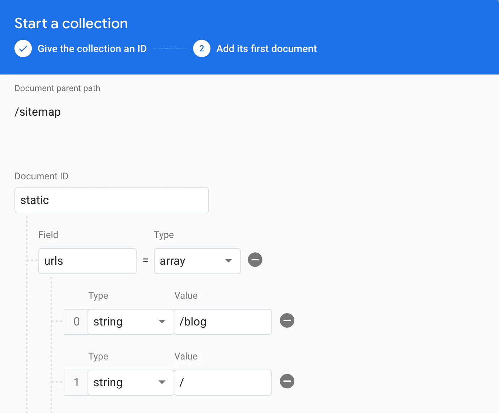

# 如何使用 Firestore 和云功能创建动态网站地图

> 原文：<https://javascript.plainenglish.io/how-to-create-a-dynamic-sitemap-using-firestore-and-cloud-functions-5ff05fc2c9d8?source=collection_archive---------0----------------------->

## 使用 Firebase Firestore 数据自动创建 sitemap.xml 文件的简单方法，反映了我们不断增长的 web 内容。

Reading your Firestore data

# 现代网站地图需要自动化

sitemap.xml 文件是搜索引擎机器人和蜘蛛最重要的文件之一。它提供了关于页面以及页面之间关系的信息。这是机器人在访问你的网站时首先要看的东西。

机器人(爬虫)寻找这个文件来理解你的站点的结构和抓取哪些页面。它提供了内容布局的直接表示。

Google 和 Bing 等搜索引擎使用 sitemap 来更有效地索引您的站点，并确定从哪里开始爬行。因此，如果你想提高你的网站在谷歌搜索中被高度索引的机会，一个反映你的网站状态的结构良好的网站地图是一个很好的起点。

*它们也可以用来通知搜索引擎，他们应该重新搜索你的网站，以确定和索引任何变化。*

## 现代网络应用的问题是

尽管你可能认为这不是什么大问题，但现代 web 应用程序的动态本质已经重新定义了创建站点地图的方式。

我们的动态内容会立即导致 sitemap.xml 成为我们站点的过时表示。尤其是当你的网站产生越来越多的用户生成的内容时，比如文章、事件和个人资料。

## 静态网站可以手动创建网站地图

静态网站，比如那些支持本地企业的网站，通常不是在线内容的创造者。这意味着你可以用在线工具如 [xml-sitemaps](https://www.xml-sitemaps.com/) 手工生成网站地图。静态站点地图只需要偶尔添加或修改，这取决于你对站点结构的更新程度。

如果你的网站有一些动态部分，你甚至可能会幸运地使用[尖叫青蛙网站地图生成器](https://www.screamingfrog.co.uk/xml-sitemap-generator/)。

这个工具会抓取你的站点，并可能抓取动态 URL(如果你的站点有很好的内部链接)。话虽如此，我只在你不想用细粒度控制完全自动化过程时才使用这些工具。

自动创建站点地图的工具的唯一问题(不需要你自己编写代码的工具)是，很可能你不得不在完成后自己编辑站点地图。这就引入了人工因素。

没有人喜欢**任何**中的手动元素。

## 解决方案是动态构建一个站点地图

由于我们都喜欢自动化(并且自己做的工作更少)，我将向您展示一种基于动态数据可靠地生成站点地图的方法，您可以将动态数据作为 **cron 触发器运行，**和**提交给 Google 和 Bing** 以便它们可以立即接收更新。

由于我们将使用 Firebase 来获取动态数据以通知我们的站点地图结构，我将向您展示如何将数据转换为站点地图。我们将使用博客文章作为动态数据，我们希望在站点地图中得到反映。

**我们还将通过配置 firebase 重写**来服务站点地图，以执行一个函数来服务我们已经保存到 firebase 存储中的生成的站点地图。

我们还将使用[站点地图 npm 包](https://www.npmjs.com/package/sitemap)来帮助使用我们的数据构建我们的站点地图。它提供了一种简单的方法来生成带有类型的站点地图并将其转换为字符串。

 [## 网站地图

### 是一个高级流站点地图生成库/CLI，使创建站点地图 XML 文件变得容易。什么是网站地图…

www.npmjs.com](https://www.npmjs.com/package/sitemap) 

# 1)创建 Firebase 函数 Cron 触发器

首先，我们将创建 Firebase 调度程序函数，该函数创建一个 [Google Cloud 发布/订阅主题](https://cloud.google.com/pubsub/)，该主题通过一个 C [loud 调度程序](https://cloud.google.com/scheduler/)按照定义的时间表运行。

我们将它设置为每天下午 2:00 运行。我还将时区设置为我的时区(欧洲/伦敦)，以确保它实际运行在下午 2:00(我的时间)。

如果您想将其设置为在不同的时间运行，您可以使用[**app engine cron . YAML**](https://cloud.google.com/appengine/docs/standard/python/config/cronref)**语法**指定一个替代时间

函数的主体非常简单。它包含对我们稍后将创建的`writeSitemap()`的调用。

我们还想导出这个函数，这样我们就可以在我们的`index.ts` firebase 函数文件中重新导出它。这使得 Firebase 云功能知道触发器。

The Schedule (Cron) function that will generate a new sitemap

# 2)生成静态应用程序 URL

并非所有的 URL 路径都是动态的，都依赖于数据驱动的内容。这些页面包括主页`/`，关于页面`/about`，博客页面`/blog`。

我们需要在数据库中定义一些静态路径，我们将在`sitemap/static`将这些路径写入 Firestore 文档。

我们将创建文档并将一组静态路径添加到一个`urls`属性中。使用 [Firebase 控制台](http://console.firebase.google.com)创建这个文档会更容易，因为我们只需要手动创建一次。

Manually saving our static URLs to Firestore

我们收集站点地图所需数据的第一步是从数据库中获取这些静态 URL。所以我们将创建函数`getAppURLs()`来从我们刚刚创建的文档中获取主要的静态 URL。

A function that appends the static app URLs to the sitemap

所以在这个函数中，我们循环遍历 ID 为`static`的文档中定义的 URL，并创建一个由`ISitemapItemOptionsLoose`对象组成的数组，这些对象是从`sitemap/dist/lib/types`导入的。

值得注意的是，站点地图中使用的所有时间戳都必须符合 ISO 标准。幸运的是，我们可以在`Date`对象上使用方便的`toISOString()`函数。

如果你没有使用正确的日期时间格式，你的站点地图将会出错，谷歌将无法正确读取。

# 3)基于 Web 内容生成动态 URL

这是自动化必不可少的部分，因为博客帖子的数量越来越多，需要越来越多的 URL 指向它们。

让我们创建`getBlogPostURLs()`函数。

我们假设我们的博客文章存储在集合`blog_posts`中，并在数据库中查询我们所有的博客文章。

我们使用一个异步函数，这样我们就可以使用 ***await*** 来处理 Firebase 作为承诺返回的数据。我们初始化一个`ISitemapItemOptionsLoose`条目的数组来存储从文章数据生成的站点地图条目。

**然后我们需要遍历帖子，获取一些值:**

*   使用`**slug**`值的 URL
*   主图像`**imageURL**`
*   `**title**`
*   `**updatedAt**`值。

同样，我们将`updatedAt`值(一种`**number**`类型)转换为`Date`对象，这样我们就可以使用`toISOString()`函数来确保日期时间格式是兼容的。

A function that takes the blog post data and appends them to the sitemap

该函数只返回一个带有 sitemap 项目数组的承诺。

我们导出这个函数，因为我们需要在下一步中导入它。

# 4)结合静态和动态 URL 来准备站点地图

一个站点地图由我们所有的 URL 组成，除非你有大量的 URL 并且需要一个指向多个站点地图的索引(但是那是另外一个话题)。

因此，我们需要组合到目前为止已经生成的站点地图条目，以形成我们完整的站点地图。所以这意味着我们的静态和动态网址。

为此，我们创建了`getAllURLs()`函数，它返回一个包含所有站点地图条目的承诺。

A function that combines the static + dynamic URLs

# 5)编写网站地图并上传到 Firebase 存储器

这是我们写站点地图的地方。我们需要从**站点地图**包**中导入`createSitemap`函数。**主机名应该与您的网站地址相匹配，并带有一个前导斜杠，因为网站地图路径将被附加到主机名后以形成网站地图。

我们需要 ***等待*** 我们在上一步中创建的`getAllURLs()`函数的结果，将结果作为`urls`属性提供给 sitemap 对象。

我们希望将新创建的站点地图保存到 Firebase 存储中，保存为`sitemap.xml`，用 contentType 压缩为`text/xml`。

## 让我们首先创建`uploadFile`函数。

这个函数将负责上传`sitemap.xml`文件到我们的 Firebase 存储桶。这是一个通用函数，当使用函数上载不同的数据类型时，它可以确保类型安全。

类型`SaveOptions`的选项包括**内容类型**和是否将**压缩**。

A function that will upload the data to a file in Firebase Storage

您可能还想将站点地图的当前状态保存到 Firestore 文档**，使用当前时间作为文档 ID 的时间戳**，因此我们在成功上传后设置该数据。

Write the Sitemap and Upload to Firebase Storage

我们需要通过使用 sitemap 对象上的`toString()`函数将成功创建的 sitemap 对象转换为字符串。这是准备我们的站点地图上传到 Firebase 存储的最后一步。

# 6)如何提供网站地图

为了在使用 Firebase 托管时提供站点地图服务，我们必须为 sitemap.xml 文件设置一个重写。这绕过了提供托管的 sitemap.xml 的通常行为。

我们将对 sitemap.xml 文件的请求重写为一个名为`serveSitemap()`的函数，该函数将从 Firebase 存储中下载 sitemap 并提供内容来代替静态的 sitemap.xml 文件。

在此之前，我们将创建一个新函数，从 Firebase 存储中下载字符串。

## 从 Firebase 存储器下载一个字符串

A function that downloads a string from Firebase Storage

这里，我们提供一个文件路径作为参数(这将是我们的`sitemap.xml`文件)，指定 bucket，并使用`Buffer.from(...result)`和缓冲区上的`toString()`方法下载和转换结果为一个字符串。

从缓冲区到字符串的转换是必要的，因为 Firebase 存储返回一个缓冲区数组。

## 配置 Firebase 重写以服务于站点地图

我们在 firebase JSON 文件中插入嵌套在托管 属性的 ***中的重写。来源是`/sitemap.xml`，因为这是我们想要覆盖的文件请求。***

提供的功能是`serveSitemap()`，它将负责下载和提供我们动态`sitemap.xml`的内容。

Firebase.json file where we specify the rewrite to our sitemap function

## 创建 serveSitemap 函数作为 HTTP 触发器

The serveSitemap function that serves our dynamic sitemap

我们从存储器中下载站点地图，并将其作为参数提供给云 HTTP 触发器的`res.send()`函数。这将返回站点地图文件的内容作为响应。

就是这样！我们有一个动态的网站地图，反映我们不断变化的内容。

# 奖金🚀用新的网站地图搜索谷歌和必应

厌倦了每次网站地图改变时都要去谷歌搜索控制台手动提交吗？

好吧，你可以用你更新后的网站地图连接谷歌和必应，只要它有了额外的云功能。

我们将使用 axios——NodeJS 中基于 promise 的 HTTP 客户端——发出 HTTP 请求来 ping 我们的站点地图。

 [## axios

### 基于 Promise 的浏览器和 node.js 的 HTTP 客户端

www.npmjs.com](https://www.npmjs.com/package/axios) 

Ping sitemap to Search Engines — Google and Bing

我们可以创建`pingSitemap()`，它用`?sitemap=`参数向`[https://www.google.com/ping](https://www.google.com/ping)`和`https://www.bing.com/ping`发出 GET 请求，指向我们的站点地图的位置。

调用这个函数的最佳时机是在站点地图创建之后，或者我们刚刚部署了 web 应用程序的更新时

**感谢阅读！有什么问题吗？给我留言吧。**