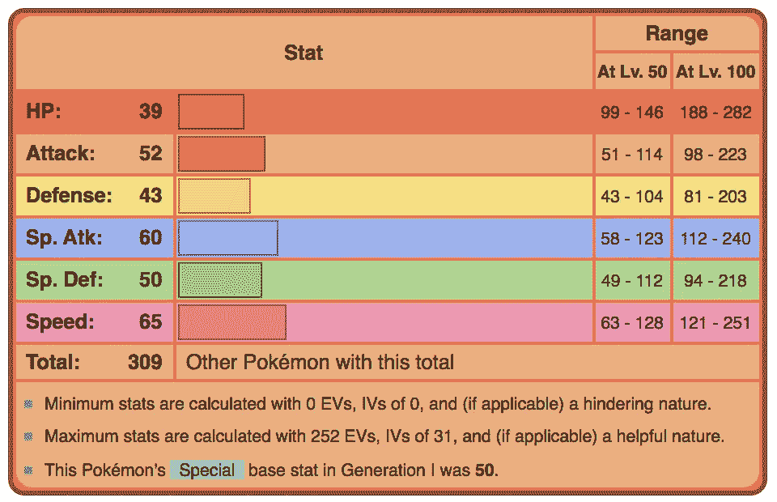
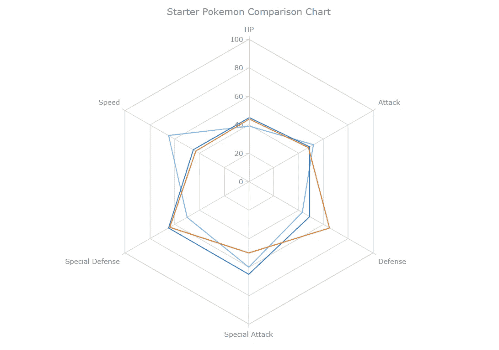
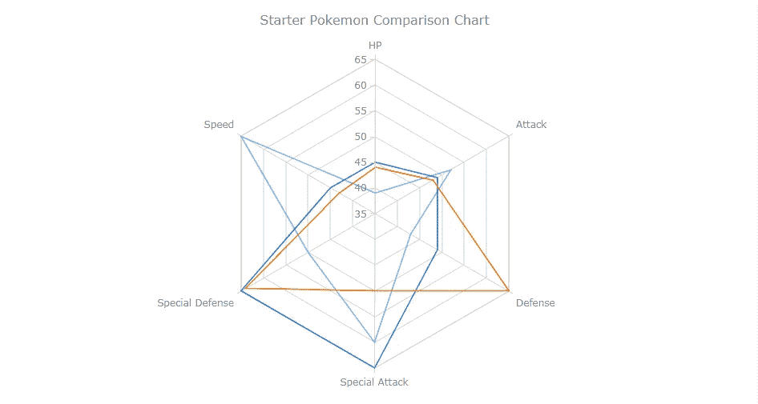
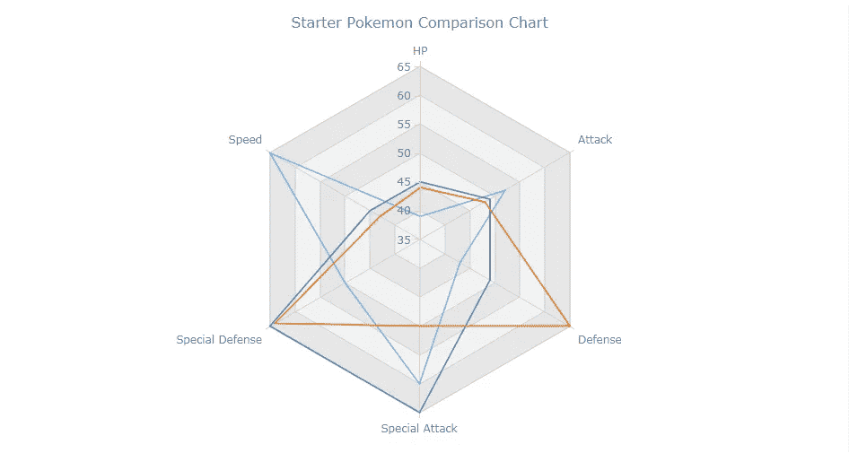
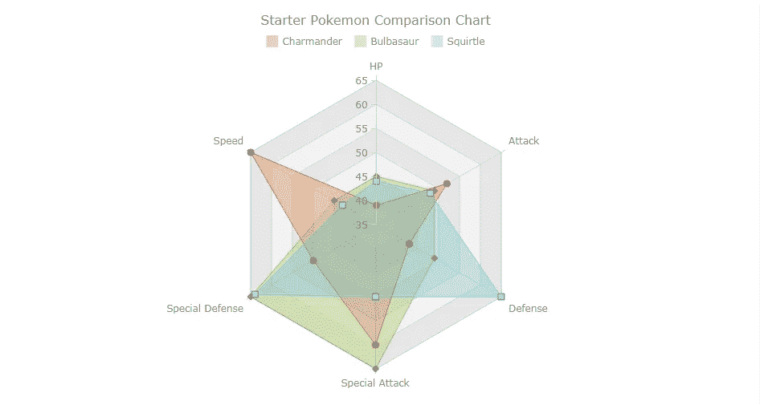
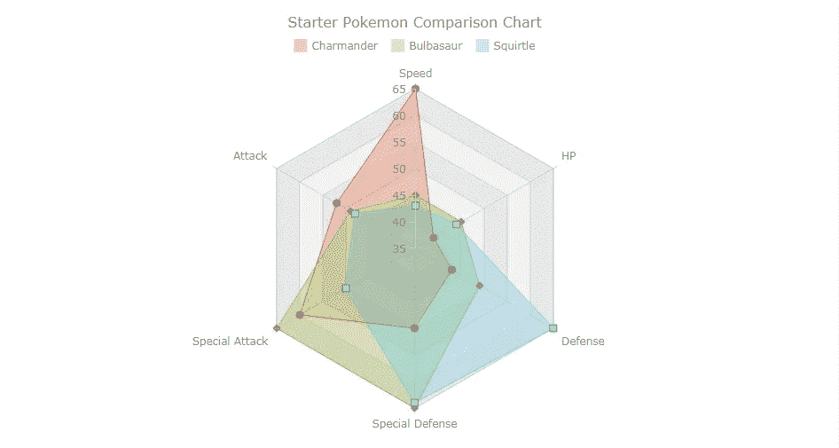

# 如何创建 JavaScript 雷达图

> 原文：<https://javascript.plainenglish.io/how-to-create-a-javascript-radar-chart-537b299de0cb?source=collection_archive---------7----------------------->


[雷达图](https://www.anychart.com/chartopedia/chart-type/radar-chart/)，也被称为蜘蛛图或雷达图，是一种数据可视化，用于将观察结果与多个定量变量进行比较。每个变量被编码成一个等距分布的辐条。该值越高，该点离图表中心越远。雷达图最适合用来比较观察值的“轮廓”和检测数据中的异常值。因此，它们在体育运动中被大量使用，最显著的是在篮球和足球中为[的球员](https://statsbomb.com/2016/04/understand-football-radars-for-mugs-and-muggles/)做侧写。

在本教程中，我将教你如何用 JavaScript 构建自己的**雷达图，以及如何使用它们来帮助做出游戏历史上最艰难的决定之一:**选择哪个开始口袋妖怪**！**

没错，我们将制作雷达图，对妙蛙种子、小火龙和杰尼龟进行数据分析，一劳永逸地确定哪一个是最佳选择。

# 构建 JavaScript 雷达图

为了构建我们的雷达图，我们将使用一个图表库。图表库消除了许多构建图表的负担(与 d3.js 之类的东西相比),并允许您快速轻松地创建图表。对于本教程，我选择使用 [AnyChart JavaScript 库](https://www.anychart.com)。我选择 AnyChart 是因为用它来构建图表真的很快，而且对于初学者来说它是一个很棒的库，因为它有相当密集的文档。

# 步骤 1:设置页面

创建雷达图的第一步是设置 html 页面并加载所需的脚本。

```
<html>
  <head>
    <script src="https://cdn.anychart.com/releases/8.7.1/js/anychart-core.min.js"></script>
    <script src="https://cdn.anychart.com/releases/8.7.1/js/anychart-radar.min.js"></script>
    <style type="text/css">
      html, body, #container {
        width: 100%;
        height: 100%;
        margin: 0;
        padding: 0;
      }
    </style>
  </head>
  <body>
    <div id="container"></div>
    <script>
      anychart.onDocumentReady(function () {
 ***// drawing our chart goes here***      });
    </script>
  </body>
</html>
```

我在这里所做的只是创建了一个新的 html 页面，添加了创建雷达图所需的脚本 [anychart-core.min.js](https://docs.anychart.com/Quick_Start/Modules#core) 和 [anychart-radar.min.js](https://docs.anychart.com/Quick_Start/Modules#radar) 。前者是所有 AnyChart 制图所必需的，并带有基本图表(散点图、条形图等)，而后者为我们提供了构建雷达图所需的模块。

然后，我们为 html 页面创建一个 CSS 规则来设置图表的大小。我们选择了 100%的宽度和高度以及 0 的边距来创建一个全屏的数据，但是如果你想要一些不同的东西，那就改变这些值来更好地满足你的需求。

最后，我们使用`anychart.onDocumentReady()`。我们的图表将放入这个函数中。这样做的目的是只有当文档准备好了才触发函数，而不是在此之前。

# 步骤 2:加载数据

为了给我们的初级口袋妖怪绘制雷达图，我们需要获得数据。这是我在[bulbapedia.bulbagarden.net](https://bulbapedia.bulbagarden.net/wiki/Main_Page)发现的(多可爱？)似乎有每个口袋妖怪的统计数据！



然后我们需要将这些数据重新格式化成任何图表都知道如何阅读的格式。AnyChart 喜欢以下格式的每个观察数据:

```
var data1 = [
  {x: "HP", value: 39},
  {x: "Attack", value: 52},
  {x: "Defense", value: 43},
  {x: "Special Attack", value: 60},
  {x: "Special Defense", value: 50},
  {x: "Speed", value: 65},
];
```

一个对象数组，其中每个变量的 x 轴变量命名为“x ”, y 轴变量命名为“value”。在雷达图的情况下，x 轴变量是变量的名称，而 y 轴变量是值。

我们对每个初级口袋妖怪重复这一步骤，得到以下三个数组:

```
var data1 = [
  {x: "HP", value: 39},
  {x: "Attack", value: 52},
  {x: "Defense", value: 43},
  {x: "Special Attack", value: 60},
  {x: "Special Defense", value: 50},
  {x: "Speed", value: 65},
];

var data2 = [
  {x: "HP", value: 45},
  {x: "Attack", value: 49},
  {x: "Defense", value: 49},
  {x: "Special Attack", value: 65},
  {x: "Special Defense", value: 65},
  {x: "Speed", value: 45},
]; 

var data3 = [
  {x: "HP", value: 44},
  {x: "Attack", value: 48},
  {x: "Defense", value: 65},
  {x: "Special Attack", value: 50},
  {x: "Special Defense", value: 64},
  {x: "Speed", value: 43},
];
```

# 第三步:绘制图表

现在我们已经把所有的(psy)鸭子排好队了，是时候绘制我们的图表了。

```
***// create radar chart*** var chart = anychart.radar();***// set chart title*** chart.title("Starter Pokemon Comparison Chart");***// set chart yScale settings*** chart.yScale()
  .minimum(0)
  .maximum(100)
  .ticks({'interval':20});***// create first series*** chart.line(data1)
***// create second series*** chart.line(data2)
***// create third series*** chart.line(data3)***// set container id for the chart***
chart.container('container');
***// initiate chart drawing*** chart.draw();
```

这导致:



这看起来信息不太丰富，是吗？不同的系列看起来都一样。不过，我们可以很容易地解决这个问题。如果我们改变最小和最大 yScale 值，我们将能够更好地看到 3 个系列之间的差异。然后，我将最大值设置为 65，最小值设置为 35，我根据我试图可视化的数据来选择这些值。如果我们的口袋妖怪有一个值高于 65 或低于 35 的变量，我会选择不同的值来适应它。

```
// set chart yScale settings
chart.yScale()
  .minimum(35)
  .maximum(65)
  .ticks({'interval':5});
```

这导致了:



> [CodePen 链接](https://codepen.io/waydeherman/pen/BaoOQdX)
> [游乐场链接](https://playground.anychart.com/1jY4jbcd/)

```
<html>
  <head>
    <script src="https://cdn.anychart.com/releases/8.7.1/js/anychart-core.min.js"></script>
    <script src="https://cdn.anychart.com/releases/8.7.1/js/anychart-radar.min.js"></script>
    <style type="text/css">
      html, body, #container {
        width: 100%;
        height: 100%;
        margin: 0;
        padding: 0;
      }
    </style>
  </head>
  <body>
    <div id="container"></div>
  </body>
  <script>
    anychart.onDocumentReady(function () {
 ***// our data from bulbapedia***      var data1 = [
        {x: "HP", value: 39},
        {x: "Attack", value: 52},
        {x: "Defense", value: 43},
        {x: "Special Attack", value: 60},
        {x: "Special Defense", value: 50},
        {x: "Speed", value: 65},
      ]; var data2 = [
        {x: "HP", value: 45},
        {x: "Attack", value: 49},
        {x: "Defense", value: 49},
        {x: "Special Attack", value: 65},
        {x: "Special Defense", value: 65},
        {x: "Speed", value: 45},
      ]; var data3 = [
        {x: "HP", value: 44},
        {x: "Attack", value: 48},
        {x: "Defense", value: 65},
        {x: "Special Attack", value: 50},
        {x: "Special Defense", value: 64},
        {x: "Speed", value: 43},
      ]; ***// create radar chart***      var chart = anychart.radar();
 ***// set chart yScale settings***      chart.yScale()
        .minimum(35)
        .maximum(65)
        .ticks({'interval':5}); ***// create first series***      chart.line(data1)
 ***// create second series***      chart.line(data2)
 ***// create third series***      chart.line(data3) ***// set chart title***      chart.title("Starter Pokemon Comparison Chart"); ***// set container id for the chart***      chart.container('container');
      ***// initiate chart drawing* **      chart.draw(); });
  </script>
</html>
```

好多了。我们现在可以区分我们的系列。

# 步骤 4:自定义图表

正如我刚才在上面给你展示的，通过改变图表的一个方面，我使它变得更吸引人，信息更丰富。作为一名数据可视化开发人员，您的工作就是使用您所掌握的所有工具，以更好的方式讲述您的数据故事。

任何有价值的图表库都有定制图表的方法，让你更好地讲述你的故事。现在，我将介绍一些定制技术，以便从我的雷达图中获取更多信息。

## 单元格颜色

使用雷达图的一个缺点是很难比较不同变量之间的值(因为它们是循环定位的，而不是线性定位的)。我们可以通过对交替单元格进行着色来创建引用，以便更好地比较变量，从而在一定程度上减轻这一缺点。

```
***// color alternating cells*** chart.yGrid().palette(["gray 0.1", "gray 0.2"]);
```



> [CodePen 链接](https://codepen.io/waydeherman/pen/OJyGmdg)
> [游乐场链接](https://playground.anychart.com/f9Vv9NlU/)

该代码将雷达单元染成灰色，交替的单元具有不同的不透明度*。

*使用不透明度是一个众所周知的技巧，可以让不同的颜色搭配得很好。

## 区域、填充、描边和图例

为了更好地描述我们不同的系列，我将把系列类型从线改为面。这将允许我们改变多边形的填充。我也将改变每个系列的颜色，以更好地代表有问题的口袋妖怪。

```
***// create first series*** chart.area(data1).name('Charmander').markers(true).fill("#E55934", 0.3).stroke("#E55934")
***// create second series*** chart.area(data2).name('Bulbasaur').markers(true).fill("#9BC53D", 0.3).stroke("#9BC53D")
***// create third series*** chart.area(data3).name('Squirtle').markers(true).fill("#5BC0EB", 0.3).stroke("#5BC0EB")
```

图例也能让我们分辨出哪个系列是哪个系列。

```
***// set chart title*** chart.title("Starter Pokemon Comparison Chart");
 ***// set legend***  .legend(true);
```



> [CodePen 链接](https://codepen.io/waydeherman/pen/KKdYqPx)
> [游乐场链接](https://playground.anychart.com/by2YKrGv/)

## 重新排列变量

雷达图的另一个问题是，用户倾向于看到相邻变量之间的联系，但事实并非如此。这是不幸的，我们对此无能为力，但是我们可以尝试充分利用这一点，重新排列变量，使相关性更强的变量相邻。这将进一步加强雷达图的使用，以查看分析“剖面图”。

在我们的示例中，我们将重新排列它:

```
var data1 = [
  {x: "HP", value: 39},
  {x: "Attack", value: 52},
  {x: "Defense", value: 43},
  {x: "Special Attack", value: 60},
  {x: "Special Defense", value: 50},
  {x: "Speed", value: 65},
];
```

对此

```
var data1 = [
  {x: "Speed", value: 65},
  {x: "HP", value: 39},
  {x: "Defense", value: 43},
  {x: "Special Defense", value: 50},
  {x: "Special Attack", value: 60},
  {x: "Attack", value: 52},
];
```

正如你所看到的，这更像是一门艺术而不是科学。但是正如你在下面看到的，我们可以更好地了解我们不同的个人资料。



> [CodePen 链接](https://codepen.io/waydeherman/pen/xxwaqxx)
> [游乐场链接](https://playground.anychart.com/uKD4EQo5/)

```
<html>
  <head>
    <script src="https://cdn.anychart.com/releases/8.7.1/js/anychart-core.min.js"></script>
    <script src="https://cdn.anychart.com/releases/8.7.1/js/anychart-radar.min.js"></script>
    <style type="text/css">
      html, body, #container {
        width: 100%;
        height: 100%;
        margin: 0;
        padding: 0;
      }
    </style>
  </head>
  <body>
    <div id="container"></div>
  </body>
  <script>
    anychart.onDocumentReady(function () {
 ***// our data from bulbapedia*** var data1 = [
  {x: "Speed", value: 65},
  {x: "HP", value: 39},
  {x: "Defense", value: 43},
  {x: "Special Defense", value: 50},
  {x: "Special Attack", value: 60},
  {x: "Attack", value: 52}
];var data2 = [
  {x: "Speed", value: 45},
  {x: "HP", value: 45},
  {x: "Defense", value: 49},
  {x: "Special Defense", value: 65},
  {x: "Special Attack", value: 65},
  {x: "Attack", value: 49}
];var data3 = [
  {x: "Speed", value: 43},
  {x: "HP", value: 44},
  {x: "Defense", value: 65},
  {x: "Special Defense", value: 64},
  {x: "Special Attack", value: 50},
  {x: "Attack", value: 48}
];***// create radar chart*** var chart = anychart.radar();***// set chart yScale settings*** chart.yScale()
  .minimum(35)
  .maximum(65)
  .ticks({'interval':5});***// color alternating cells*** chart.yGrid().palette(["gray 0.1", "gray 0.2"]);***// create first series*** chart.area(data1).name('Charmander').markers(true).fill("#E55934", 0.3).stroke("#E55934")
***// create second series*** chart.area(data2).name('Bulbasaur').markers(true).fill("#9BC53D", 0.3).stroke("#9BC53D")
***// create third series*** chart.area(data3).name('Squirtle').markers(true).fill("#5BC0EB", 0.3).stroke("#5BC0EB")***// set chart title*** chart.title("Starter Pokemon Comparison Chart")
 ***// set legend***
        .legend(true);***// set container id for the chart*** chart.container('container');
***// initiate chart drawing*** chart.draw(); });
  </script>
</html>
```

我们可以清楚地看到，小火龙更具攻击性，杰尼龟更注重防守，妙蛙种子更加全面。因此，我想说，使用这张图表(我意识到这是一个反高潮的结论)，我们可以清楚地看到所有的口袋妖怪都是正确的选择。它们都相当平衡，都有自己的优势和劣势。

# 结论

制作雷达图显然比大多数人想象的要容易得多，我认为结果非常酷，非常吸引人。然而，它们比其他数据可视化更难使用，并且有许多缺点。

如果变量太多，图表就会变得难以阅读。如果有太多的观察结果，建议将它们分别放在各自的图表上。他们还需要所有变量具有相同的规模。还要注意的是，用户倾向于将观察区域视为价值的衡量标准，不幸的是，事实往往并非如此。

考虑到这些警告，我建议使用[线](https://www.anychart.com/chartopedia/chart-type/line-chart/)或[条形图](https://www.anychart.com/chartopedia/chart-type/bar-chart/)来代替。雷达图真正闪光的地方是，在吸引用户方面，它们可能比折线图和条形图强得多，所以当它们工作时，它们工作得非常好！

*原载于 2020 年 7 月 7 日 https://www.anychart.com*[](https://www.anychart.com/blog/2020/07/07/radar-chart-js/)**。**

## *简单英语的 JavaScript*

*喜欢这篇文章吗？如果有，通过 [**订阅我们的 YouTube 频道**](https://www.youtube.com/channel/UCtipWUghju290NWcn8jhyAw) **获取更多类似内容！***