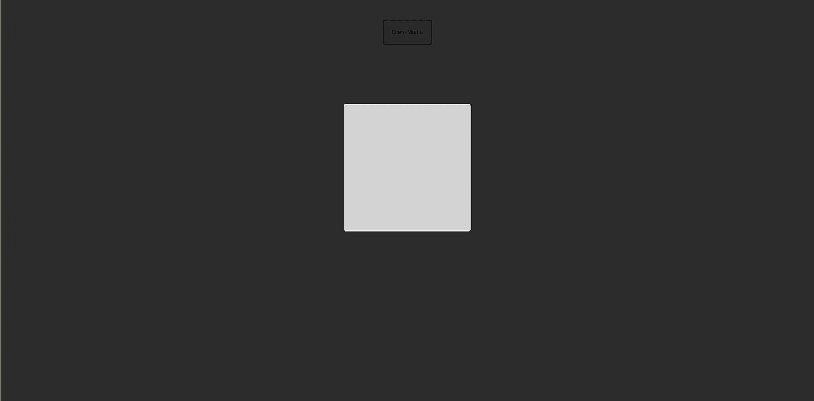
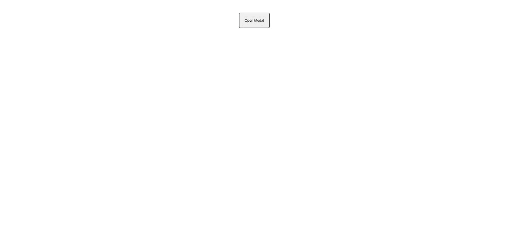

# 如何在 React 中创建模态

> 原文：<https://javascript.plainenglish.io/how-to-create-a-modal-in-react-14b1cb84cf09?source=collection_archive---------6----------------------->

## React 中创建风格不可知模型的快速、实用指南。

模态是一个弹出框，它的出现是为了响应用户的一些操作。模态通常比阻止其他事件发生的动作更受欢迎，比如`window.confirm`和`window.alert`。

幸运的是，在 React 中创建模态很容易。在本文中，我们将为 React 组件创建一个简单的、基本的模型。不需要特定的 CSS 框架，因此读者可以采用这种方式创建模态，并以他们想要的任何方式使用它。

# 创建示例应用程序

在命令行上，运行`npx create-react-app modal`。`modal`是由`create-react-app`创建的目录。

一旦命令完成，`cd`进入`modal`。

接下来，在文本编辑器中打开整个`modal`目录。

最后，从根目录`modal`运行`yarn start`。我们准备好做模型了。

# 最低款式

在`src`中，打开`App.css`。在此，将以下样式**粘贴到文件**中包含的样式下面:

`.modal-background`是该文件中需要注意的重要类。这个类中使用的属性和值将在模态之后创建背景**，阻止用户与模态**之外的任何事物**交互。**

> 注意:这款 modal 会**不好看**。由读者来决定组件的样式。

# 创建模型

打开`App.js`。用一个`const`声明替换`function App`，并对其进行适当的修改，使其作为一个 React 组件工作，如下所示:

为了创建一个模态，我们需要一些**状态**来告诉我们是否**显示模态**。让我们从`react`导入`useState`:

现在，让我们使用一个**钩子**来存储一些关于**显示**模态的状态:

我们给了函数调用`useState`一个参数`false`，因为通常我们不希望页面在用户没有做一些动作的情况下显示一个模态。当我们用参数`true`调用`setShow`时，我们告诉 React to **show** 模态。有了`false`，我们就有了**隐藏**的情态。

让我们也创建一些事件处理函数来处理设置**显示**的状态:

读者应该注意到我们将参数`e`、`event`传递给了`handleModalClose`。这有一个很好的理由，将在本文后面解释。

我们需要创建这些处理函数来避免组件的无限重渲染。当组件挂载时，如果组件上有某种事件处理程序，并且它是一个钩子，它将无限次调用该函数，并进入一个重新渲染组件的[无限循环](https://community.airtable.com/t/too-many-re-renders/31671)。

让我们创建一个保存**模态**的`div`，并创建一个可以点击打开模态的`button`。向`button`和`div`传递适当的事件处理程序:

太好了！我们现在可以点击`button`并实际打开模态。当点击`button`时，它应该是这样的:

I am ugly and I am proud!

单击深灰色背景应该会创建以下视图:

然而，目前的实现存在一个主要问题。当我们点击`modal-card` `div`时，它也会关闭模态。我们不希望发生这种情况，因为我们只想在单击背景时关闭模态，而不是模态的实际内容。

这是因为`modal-card` `div`是`modal-background` `div`的子节点。任何对`modal-card`的点击都会导致对`modal-background`的点击。

因此，我们需要更新`handleModalClose`来检查触发事件的`className`:

通过检查`className`，我们确保只有当被触发的事件是`modal-background` `div`，而不是`modal-card`子事件`div`时，模态才被关闭。

就这样，我们有了一个全功能的模型！

# 后续步骤

对于希望将他们的**模态**游戏提升到下一个级别的读者，我建议将模态提取到它自己的的**组件中，该组件可以用作任何**组件**的子组件。这将包括将 **props** 从父组件传递到模态子组件。**

如果读者很容易理解这一点，可以在模态中添加某种类型的**加载通知**。这增加了相当多的复杂性，尤其是在加载通知是动画的情况下。

感谢您花时间阅读本文。编码快乐！如果你觉得这很有用，可以通过 [**订阅我们的 YouTube 频道**](https://www.youtube.com/channel/UCtipWUghju290NWcn8jhyAw?sub_confirmation=true) **获取更多类似的内容！**