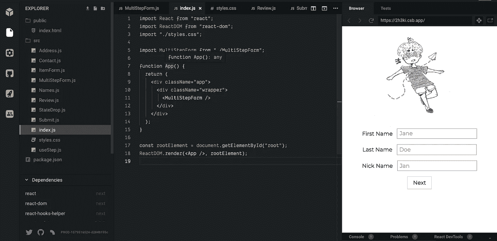
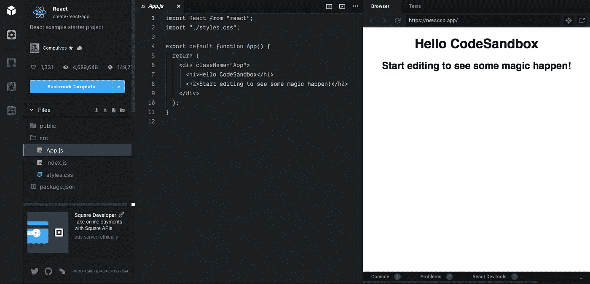
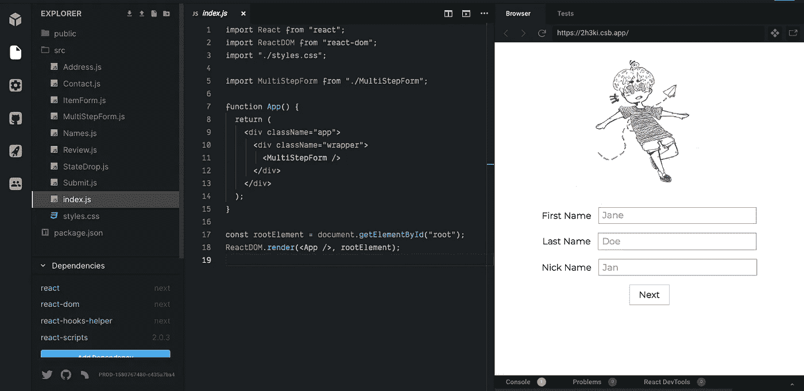
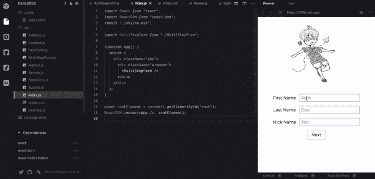

# 如何用 React 钩子创建多步窗体？

> 原文：<https://javascript.plainenglish.io/how-to-create-a-multi-step-form-with-react-hooks-53a85efdff62?source=collection_archive---------1----------------------->

## 对简单的多步反应形式的基本理解

如果你认为从结构上来说，世界上任何事情都没有你想象的那么难。这很难，直到你知道。web 开发中的表单是基础部分，它们的知识将有助于你成为更好的开发者。我们将着眼于形式的流动，并试图从中理解形式。

这里我们在 [codesandbox.io](https://codesandbox.io/) 中，有一个 react 应用沙箱。然后将 react-hooks-helper 依赖项添加到沙箱中。React 钩子是在 React 16.8 中引入的，我们的沙箱是在 16.12.0，所以我们必须使用它。

# 第一步

当我们在中创建一个 react 应用程序时，文件中会有`App.js` 和`index.js`

我们只需要添加一个新的组件/文件，然后用下面的代码创建`index.js`。它只是调用我们的第一个组件，即多步表单

# 第二步

在这一步中，你可以看到一些代码，它们导入了新的组件。`Names.js`、`Address.js`、`Contact.js`、`Review.js`和`Submit.js`。

这些是我们在这种形式中的步骤。当用户按下“下一步”按钮时，每个文件都是我们要去的一个步骤。首先，让我们看看代码并试着理解它。

我们首先要明白的是它使用了 react 钩子。第二行是我们的文件导入的地方。所有新组件都导入到该文件中。首先，确定步骤的数量，然后根据需要，我们用合适的名称创建文件。

我们还在表单中传递了一些默认数据。最后，使用了一个 switch 语句，以便在看起来像多步的组件之间切换。

也请看看这里的析构它可能会让你对这段代码中发生的事情有一个清晰的了解。

# 第三步

是时候准备好我们的组件，并开始以一种好的形式接受输入了。你可以看看其他组件的名称，地址，联系方式，审查和提交的代码基础。它们只是包含形式的代码。如`MultiStepForm.js.`中的 switch 语句所示

这是他们的代码。

## Names.js

这是一个简单的形式，所以我们不会使用太多的名字，姓氏和昵称。

## Address.js

有街道、城市、州的地址和邮政编码。

## Contact.js

`Contact.js`有邮箱和电话。

## 评论. js

`Review.js`是您检查表格中所填内容的地方。如果你喜欢，你可以编辑。

## 提交. js

`Submit.js`是表单提交给服务器的地方。没有服务器，所以我们只是显示一条成功消息，说明表单已提交。

我们还有两个辅助组件`ItemForm.js`、`StateDrop.js`。这是他们的代码。

## ItemForm.js

该组件有助于创建表单项目。它被导入并用于每个组件。

## StateDrop.js

`StateDrop.js`为地址成分。它有助于在表单的状态项中创建一个下拉列表。如您所见，状态在选择框中有一些元素。

# 不要被代码弄得不知所措

看看最终形成的形状。

> 另外，请看看这里的工作表单。[点击我](https://codesandbox.io/s/simple-multi-step-form-in-react-2h3ki)

试着去编辑你自己，试着再一次思考这个过程。一旦你明白这不再是魔术，而是纯粹的逻辑驱动我们的形式。

谢谢你的时间。

我写作是为了教育自己，并在这个过程中帮助他人。