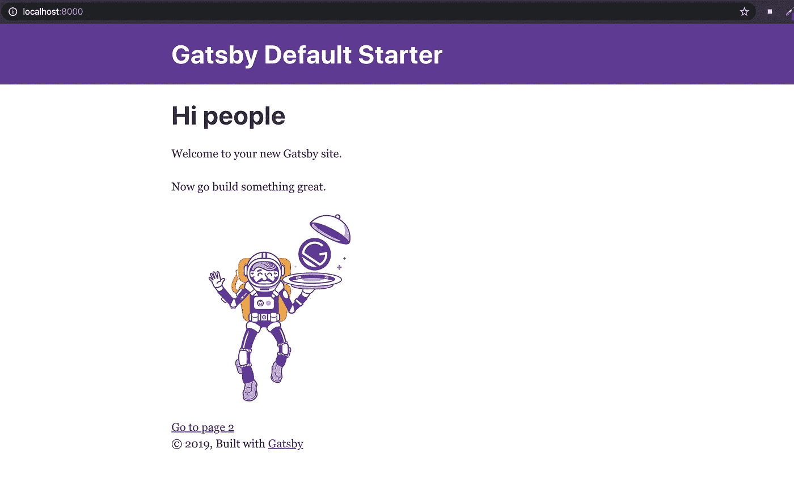
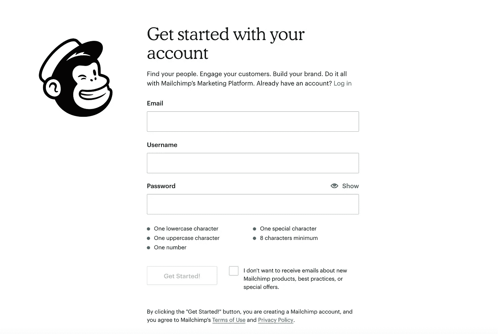
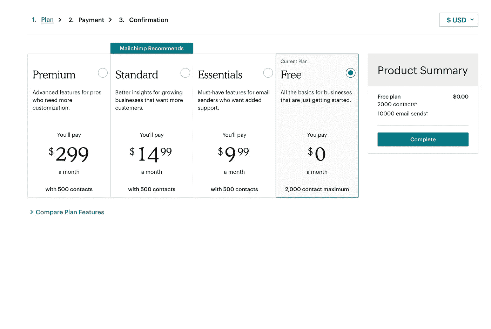
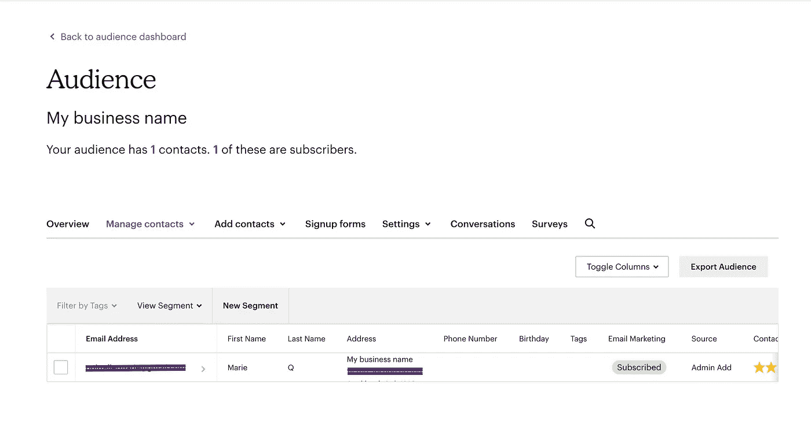
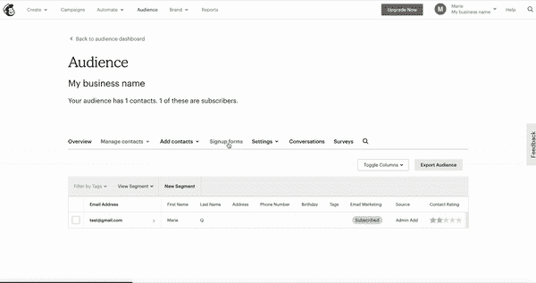
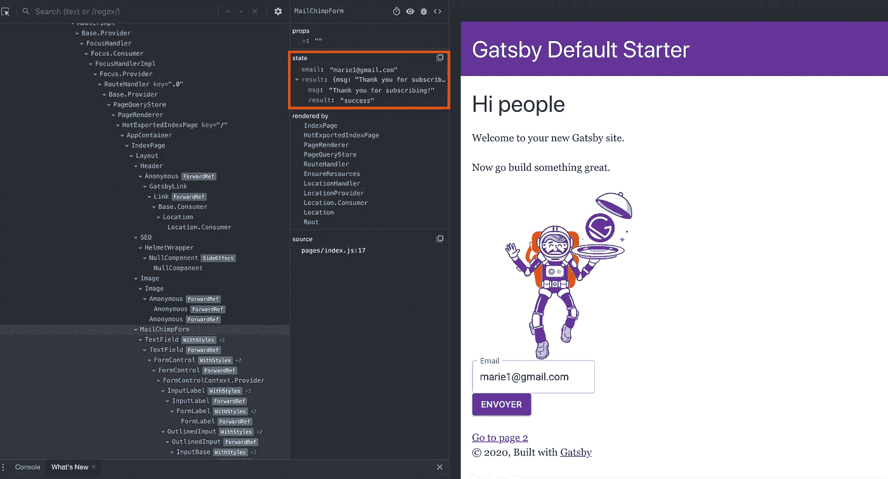
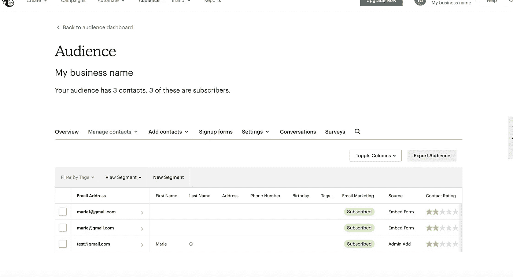

# 如何用 Mailchimp，Gatsby.js & Netlify 创建时事通讯

> 原文：<https://javascript.plainenglish.io/how-to-create-a-newsletter-with-mailchimp-gatsby-js-netlify-d48778d5c774?source=collection_archive---------0----------------------->

在做了[一个联系表格](https://medium.com/@mariequittelier/jamstack-how-to-do-a-contact-form-step-by-step-with-gatsby-js-netlify-and-mailgun-52d26432a5c4)和连接[谷歌分析](https://medium.com/@mariequittelier/how-to-connect-your-gatsby-js-landing-page-to-google-analytics-and-deploy-to-netlify-step-by-step-8352467583df)之后，我想继续我的系列文章，关于如何创建一个时事通讯注册表格。今天的文章是关于设置 MailChimp 的。

建立网站受众的一个方法是提供常规内容。为此，您需要收集电子邮件地址并向他们发送电子邮件。


I wish we could go back to that time where people sent letters … Photo by [Kate Macate](https://unsplash.com/@katemacate?utm_source=unsplash&utm_medium=referral&utm_content=creditCopyText) on [Unsplash](https://unsplash.com/s/photos/letter?utm_source=unsplash&utm_medium=referral&utm_content=creditCopyText)

当然，你可以通过创建一个 API 来做到这一点，但是那将会是你要么投入大量的精力，要么失去以下:

*   垃圾邮件打开、阅读或捕获的每封电子邮件背后的分析。
*   退订系统。

这就是为什么我们要使用 Mailchimp。像往常一样，让我们从一个 Gatsby.js 开始。

如果你在路上迷路了，这里是[回购通道](https://github.com/marieqg/mailchimp-medium)。

# 第一步:创建一个 Gatsby.js 启动器，并将其推送到 GitHub 上

如果您已经有了登录页面，您可以直接进入步骤 2。

和以前一样，我们将从创建一个 Gatsby.js 启动器开始。如果你还没有建立你的开发环境，你可以按照[这个步骤](https://www.gatsbyjs.org/tutorial/part-zero/)。



Gatsby starter

一旦您完成了这些，我们将创建一个新的 gatsby 站点，并使用以下命令进行第一次运行。

```
gatsby new gatsby-site
gatsby develop
```

一旦你到了这里，你就可以打开浏览器，进入 [http://localhost:8000/](http://localhost:8000/) 查看你的网站运行情况。

然后，我们将在 Github 上发布我们的代码。创建存储库后，Github 会给出发布存储库的说明。如果您选择在命令行上创建一个新的存储库，那么您不需要添加一个 read me，因为 Gatsby.js starter 已经提供了一个。

如果你想看的话，我在 Github 上的知识库可以在这里找到。

# 第二步:创建一个 Mailchimp 账户

第二步，你必须去 [Mailchimp](https://login.mailchimp.com/signup/) 创建一个账户。这非常简单，你只需要一个电子邮件、密码和用户名。



Mailchimp form to create an account

一旦完成，Mailchimp 将要求您验证您的电子邮件。



Choose the plan that fits your needs.

一旦你确认你不是机器人，你就必须选择一个计划。免费计划应该足够了，因为它给了你 2000 个联系人来注册你的时事通讯。

然后，Mailchimp 会请你向他们介绍一下你自己，因为你将是第一个注册订阅自己的时事通讯的人。此外，他们需要一个物理地址来确保你的电子邮件符合国际反垃圾邮件法。你将到达这里:



The first screen after you have successfully sign-up to Mailgun



Where to find your form action

现在，我们去拿你的邮件黑猩猩表单代码。正如你在这张 GIF 上看到的，要获得你的表单代码，你必须先进入“注册表单”,然后进入“嵌入表单”。

最终，您会看到这样的结果:

```
<form action="[https://gmail.us8.list-manage.com/subscribe/post?u=ab66fe9873d6ba44ff1aabad2&amp;id=c429497d08](https://gmail.us8.list-manage.com/subscribe/post?u=ab66fe9873d6ba44ff1aabad2&amp;id=c429497d08)" method="post" id="mc-embedded-subscribe-form" name="mc-embedded-subscribe-form" class="validate" target="_blank" novalidate>
```

我们唯一需要的是行动部分:

```
"[https://gmail.us8.list-manage.com/subscribe/post?u=ab66fe9873d6ba44ff1aabad2&amp;id=c429497d08](https://gmail.us8.list-manage.com/subscribe/post?u=ab66fe9873d6ba44ff1aabad2&amp;id=c429497d08)"
```

# 步骤 3:安装并配置插件

现在，让我们安装 Mailchimp 插件:

```
# npm 
$ npm install gatsby-plugin-mailchimp 
```

一旦插件安装完毕，转到您的`gatsby-config.js`文件并添加:

```
// gatsby-config.jsplugins: [
  {
        resolve: 'gatsby-plugin-mailchimp',
        options: {
            endpoint: '', 
        },
    },
];
```

端点是我们在第一步中得到的动作端点。端点是私有的，如果不小心，它很容易被窃取。它不应该被公开。所以你应该把它放在环境变量里。

通过`process.env`使用环境变量。 [Gatsby](https://www.gatsbyjs.org/docs/environment-variables/) 需要在我们的函数文件中安装(`npm install dotenv`)环境变量和几行代码:

```
// gatsby-config.jsrequire("dotenv").config({
  path: `.env.${process.env.NODE_ENV}`,
})
```

因此，您的配置将如下所示:

您需要在文件夹的根目录下创建一个新文件(即和你的`gatsby-config.js`档同一级别)。命名为`.env.development`(注意不要拼写错误。

该文件将包含一行:

```
// .env.development MAILCHIMP_ENDPOINT="[https://gmail.us8.list-manage.com/subscribe/post?u=ab66fe9873d6ba44ff1aabad2&amp;id=c429497d08](https://gmail.us8.list-manage.com/subscribe/post?u=ab66fe9873d6ba44ff1aabad2&amp;id=c429497d08)"
```

# 步骤#4:创建带有材质 UI 的前端界面

现在，我们需要创建前端部分。这非常简单，因为插件为我们提供了触发对 Mailchimp 端点的请求的功能。因此，我们将在组件文件夹中创建一个名为`MailChimpForm.jsx`的新组件:

如果您希望组件呈现在页面上，不要忘记调用索引页面上的组件。

现在，我们将在您的表单中添加输入内容。为了更好地做到这一点，我们将安装 Material UI 及其 gatsby 插件:

```
npm install gatsby-plugin-material-ui @material-ui/styles [@material](http://twitter.com/material)-ui/core
```

并在我们的`gatsby-config.js`中设置它:

```
// gatsby-config.jsmodule.exports = {   plugins: [`gatsby-plugin-material-ui`], };
```

因此，我们的前端组件将如下所示:

[https://gist . github . com/Marie qg/89d 7 b 8 cc 674 e 82 b 32 a 94159 fa 6 CFF 292](https://gist.github.com/marieqg/89d7b8cc674e82b32a94159fa6cff292)

正如 Mailchimp 建议我们做的那样，我们将把来自`TextField`输入的电子邮件地址存储在组件的状态中。Mailchimp 函数的结果也将存储在状态中。我还删除了列表字段，因为它们是可选的，在这里没有用。

如果您的状态正常，您将能够看到以下内容:



Final check of your state

此外，如果你的提交中有错误，它会出现在结果中。例如，您可能会遇到以下两个错误:

```
{result: "error", msg: "[marie@gmail.com](mailto:marie@gmail.com) is already subscribed to list My b…c429497d08">Click here to update your profile</a>"}{result: "error", msg: "The email you entered is not valid."}
```

现在，回到 Mailchimp，你将会看到你的观众因为你发送的邮件数量而增加了。

恭喜🎉您的时事通讯已启动并运行。



Your audience is growing

另外，如果您愿意，可以使用三元组来显示订阅的结果。您的回报将如下所示:

再次处理此回购时，我遇到了以下错误:

```
Unhandled Rejection (ReferenceError): __GATSBY_PLUGIN_MAILCHIMP_ADDRESS__ is not defined
```

你可以通过重启你的 gatsby 服务器来解决。

# 第 5 步:部署

当您在 Netlify 上部署您的网站时，您需要添加您的 MailChimp 端点作为环境变量。因此，进入设置后，单击构建和部署以及环境。然后，在“编辑变量”中，您将能够为以后需要的每个变量输入一个键和值的组合。

# 为了更进一步:

[](https://www.gatsbyjs.org/packages/gatsby-plugin-mailchimp/?=mailchimp) [## 盖茨比插件邮件黑猩猩

### 这个 Gatsby 插件可以帮助你在 Mailchimp 邮件列表中订阅新的邮件地址。Mailchimp 没有提供太多…

www.gatsbyjs.org](https://www.gatsbyjs.org/packages/gatsby-plugin-mailchimp/?=mailchimp) 

👏感谢您的阅读！如果你喜欢这篇文章，请随时关注我，获取更多类似的内容！

📚还有，如果你想了解更多，可以看看那些文章:

[](https://circuit.ooo/blog/the-key-ingredient-behind-high-newsletter-open-rates) [## 高简讯打开率背后的关键因素

### 在这篇文章中，我们将讨论我们 9 个月前的时事通讯《简明英语上周》是如何一直…

电路. ooo](https://circuit.ooo/blog/the-key-ingredient-behind-high-newsletter-open-rates) [](https://medium.com/@mariequittelier/post-mortem-of-my-first-solo-project-5-mistakes-i-will-not-do-anymore-part-1-44471f7a8be0) [## 我的第一个个人项目的事后分析:我再也不会犯的 5 个错误(第一部分)

### 我最近完成了职业转型，成为了一名网站开发人员。我关闭了学校和实习章节…

medium.com](https://medium.com/@mariequittelier/post-mortem-of-my-first-solo-project-5-mistakes-i-will-not-do-anymore-part-1-44471f7a8be0) [](https://medium.com/@mariequittelier/jamstack-how-to-do-a-contact-form-step-by-step-with-gatsby-js-netlify-and-mailgun-52d26432a5c4) [## 如何用 Gatsby.js，Netlify，Mailgun 一步步做一个联系表单

### 在这篇文章中，我将一步一步地向你展示如何用 Gatsby.js，Netlify 函数一步一步地做一个联系人表单…

medium.com](https://medium.com/@mariequittelier/jamstack-how-to-do-a-contact-form-step-by-step-with-gatsby-js-netlify-and-mailgun-52d26432a5c4) [](https://medium.com/@mariequittelier/how-to-connect-your-gatsby-js-landing-page-to-google-analytics-and-deploy-to-netlify-step-by-step-8352467583df) [## 如何将您的 Gatsby.js 登录页面连接到 Google Analytics 并逐步部署到 Netlify

### 使用谷歌分析很重要，因为它可以让你跟踪你的网站的使用情况。让我们来学习如何使用…进行设置

medium.com](https://medium.com/@mariequittelier/how-to-connect-your-gatsby-js-landing-page-to-google-analytics-and-deploy-to-netlify-step-by-step-8352467583df) 

*更多内容看* [*说白了。报名参加我们的*](https://plainenglish.io/) [*免费每周简讯*](http://newsletter.plainenglish.io/) *。关注我们* [*推特*](https://twitter.com/inPlainEngHQ) ，[*LinkedIn*](https://www.linkedin.com/company/inplainenglish/)*，*[*YouTube*](https://www.youtube.com/channel/UCtipWUghju290NWcn8jhyAw)*，以及* [*不和谐*](https://discord.gg/GtDtUAvyhW) *。对增长黑客感兴趣？检查* [*电路*](https://circuit.ooo/) *。*