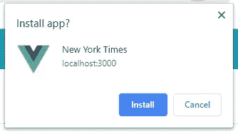
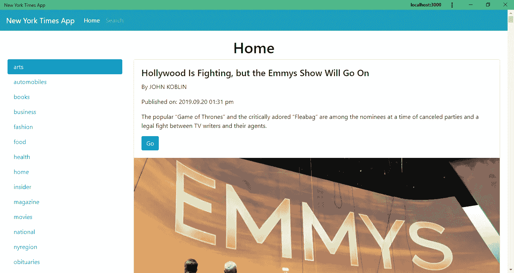
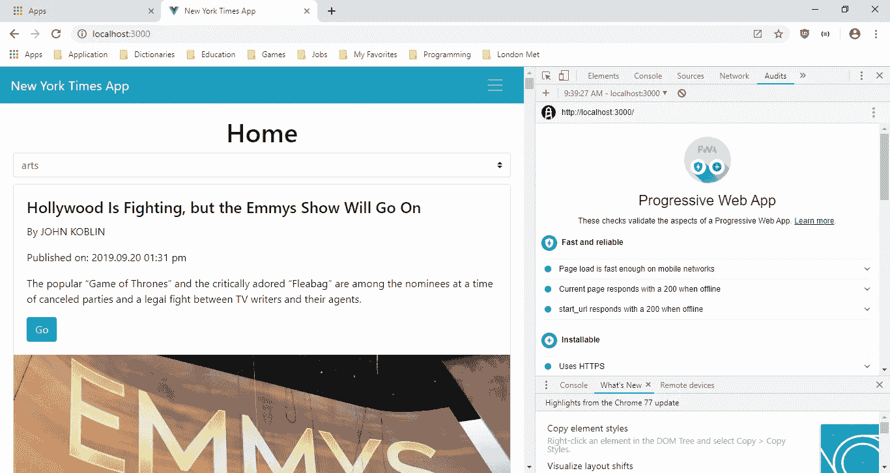

# 如何使用 Vue.js 创建渐进式 Web 应用程序

> 原文：<https://javascript.plainenglish.io/how-to-create-a-progressive-web-app-with-vue-js-7086cbf87a43?source=collection_archive---------1----------------------->

渐进式 web 应用程序(PWAs)是一个 web 应用程序，它可以做一些本机应用程序所做的事情。它可以离线工作，你可以从浏览器上一键安装。

PWAs 应该可以在任何设备上运行良好。他们应该有所回应。在任何设备中性能都应该不错。人们可以很容易地链接到它，它应该有一个不同大小的设备图标。

为了构建 PWA，我们必须注册服务人员来处理安装和添加离线功能，以使常规的 web 应用成为 PWA。Service works 还允许 PWAs 使用一些本机功能，如通知、设备离线时的缓存和应用程序更新。

使用 Vue CLI 3.x 构建 PWA 非常简单。还有就是 [@vue/cli-plugin-pwa](https://www.npmjs.com/package/@vue/cli-plugin-pwa) 插件。我们所要做的就是运行`vue add pwa`将我们的 web 应用程序转换为渐进式 web 应用程序。或者，我们可以使用[https://www.npmjs.com/package/@vue/cli-plugin-pwa](https://www.npmjs.com/package/@vue/cli-plugin-pwa)中列出的设置来配置我们的应用程序。

在本文中，我们将构建一个渐进式 web 应用程序，显示来自纽约时报 API 的文章片段和一个搜索页面，用户可以在其中输入关键字来搜索 API。

桌面布局将在左边有一个项目名称列表，在右边有文章片段。移动布局将有一个下拉菜单，用于选择要显示的部分和显示文章片段的卡片。

无论屏幕大小如何，搜索页面顶部都会有一个搜索表单，下方会有文章片段。

要开始构建应用程序，我们首先要运行 Vue CLI。我们运行:

```
npx @vue/cli create nyt-app
```

创建 Vue.js 项目。当向导出现时，我们选择“手动选择功能”。然后我们选择将 Vue 路由器和 Babel 包含在我们的项目中。

接下来，我们添加自己的库，用于样式化和发出 HTTP 请求。我们使用 BootstrapVue 进行样式化，使用 Axios 进行请求，使用 VueFilterDateFormat 进行日期格式化，使用 Vee-Validate 进行表单验证。

为了安装所有的库，我们运行:

```
npm i axios bootstrap-vue vee-validate vue-filter-date-format
```

安装完所有的库之后，我们就可以开始构建我们的应用程序了。

首先，我们使用插槽来构建我们的页面布局。在`components`文件夹中创建`BaseLayout.vue`并添加:

```
<template>
  <div>
    <div class="row">
      <div class="col-md-3 d-none d-lg-block d-xl-none d-xl-block">
        <slot name="left"></slot>
      </div>
      <div class="col">
        <div class="d-block d-sm-none d-none d-sm-block d-md-block d-lg-none">
          <slot name="section-dropdown"></slot>
        </div>
        <slot name="right"></slot>
      </div>
    </div>
  </div>
</template><script>
export default {
  name: "BaseLayout"
};
</script><!-- Add "scoped" attribute to limit CSS to this component only -->
<style scoped>
</style>
```

在这个文件中，我们利用 Vue 插槽来创建主页的响应布局。我们在这个文件中有`left`、`right`和`section-dropdown`槽。因为我们将`d-none d-lg-block d-xl-none d-xl-block`类添加到了`left`槽中，所以`left`槽仅在屏幕较大时显示。自从我们添加了`d-block d-sm-none d-none d-sm-block d-md-block d-lg-none`类后，`section-dropdown`槽只在小屏幕上显示。这些类是来自 Bootstrap 的响应实用程序类。

我们在这个文件中使用了 Vue.js 槽。Slots 是 Vue.js 的一个有用特性，它允许您将组件的不同部分分成一个有组织的单元。通过将组件划分到插槽中，您可以通过将组件放入您定义的插槽中来重用它们。它也使你的代码更整洁，因为它让你把应用程序的布局和逻辑分开。

此外，如果您使用插槽，您不必再用父子关系来组合组件，因为您可以将任何组件放入插槽中。

https://getbootstrap.com/docs/4.0/utilities/display/[的](https://getbootstrap.com/docs/4.0/utilities/display/)提供了响应性公用事业等级的完整列表

接下来，在`components`文件夹中创建一个`SearchLayout.vue`文件，并添加:

```
<template>
  <div class="row">
    <div class="col-12">
      <slot name="top"></slot>
    </div>
    <div class="col-12">
      <slot name="bottom"></slot>
    </div>
  </div>
</template><script>
export default {
  name: "SearchLayout"
};
</script>
```

为我们的搜索页面创建另一个布局。我们的`top`和`bottom`插槽占据了屏幕的整个宽度。

然后，我们创建一个`mixins`文件夹，并在其中创建一个`requestsMixin.js`文件，然后添加:

```
const axios = require("axios");
const APIURL = "[https://api.nytimes.com/svc](https://api.nytimes.com/svc)";export const requestsMixin = {
  methods: {
    getArticles(section) {
      return axios.get(
        `${APIURL}/topstories/v2/${section}.json?api-key=${process.env.VUE_APP_API_KEY}`
      );
    },searchArticles(keyword) {
      return axios.get(
        `${APIURL}/search/v2/articlesearch.json?api-key=${process.env.VUE_APP_API_KEY}&q=${keyword}`
      );
    }
  }
};
```

创建一个 mixin 向纽约时报 API 发出 HTTP 请求。`process.env.VUE_APP_API_KEY`是纽约时报 API 的 API key，我们从项目根文件夹的`.env`文件中获取，环境变量的 key 是`VUE_APP_API_KEY`。

接下来在`Home.vue`中，将现有代码替换为:

```
<template>
  <div class="page">
    <h1 class="text-center">Home</h1>
    <BaseLayout>
      <template v-slot:left>
        <b-nav vertical pills>
          <b-nav-item
            v-for="s in sections"
            :key="s"
            :active="s == selectedSection"
            [@click](http://twitter.com/click)="selectedSection = s; getAllArticles()"
          >{{s}}</b-nav-item>
        </b-nav>
      </template><template v-slot:section-dropdown>
        <b-form-select
          v-model="selectedSection"
          :options="sections"
          [@change](http://twitter.com/change)="getAllArticles()"
          id="section-dropdown"
        ></b-form-select>
      </template><template v-slot:right>
        <b-card
          v-for="(a, index) in articles"
          :key="index"
          :title="a.title"
          :img-src="(Array.isArray(a.multimedia) && a.multimedia.length > 0 && a.multimedia[a.multimedia.length-1].url) || ''"
          img-bottom
        >
          <b-card-text>
            <p>{{a.byline}}</p>
            <p>Published on: {{new Date(a.published_date) | dateFormat('YYYY.MM.DD hh:mm a')}}</p>
            <p>{{a.abstract}}</p>
          </b-card-text><b-button :href="a.short_url" variant="primary" target="_blank">Go</b-button>
        </b-card>
      </template>
    </BaseLayout>
  </div>
</template><script>
// @ is an alias to /src
import BaseLayout from "@/components/BaseLayout.vue";
import { requestsMixin } from "@/mixins/requestsMixin";export default {
  name: "home",
  components: {
    BaseLayout
  },
  mixins: [requestsMixin],
  data() {
    return {
      sections: `arts, automobiles, books, business, fashion,
      food, health, home, insider, magazine, movies, national,
      nyregion, obituaries, opinion, politics, realestate, science,
      sports, sundayreview, technology, theater,
      tmagazine, travel, upshot, world`
        .split(",")
        .map(s => s.trim()),
      selectedSection: "arts",
      articles: []
    };
  },
  beforeMount() {
    this.getAllArticles();
  },
  methods: {
    async getAllArticles() {
      const response = await this.getArticles(this.selectedSection);
      this.articles = response.data.results;
    },
    setSection(ev) {
      this.getAllArticles();
    }
  }
};
</script><style scoped>
#section-dropdown {
  margin-bottom: 10px;
}
</style>
```

我们使用该文件中`BaseLayout.vue`中定义的插槽。在`left`槽中，当我们有一个桌面大小的屏幕时，我们将部分名称的列表放在那里以在左侧显示列表。

在`section-dropdown`槽中，我们放置了只在手机屏幕上显示的下拉菜单，定义见`BaseLayout`。

然后在`right`槽中，我们放入用于显示文章片段的引导卡，也是在`BaseLayout`中定义的。

我们将所有的槽内容放在`BaseLayout`中，并在我们想要放入槽中的项目外使用`v-slot`来使项目显示在指定的槽中。

在`script`部分，我们通过从`requestsMixin`中定义`getAllArticles`函数来逐节获取文章。

接下来创建一个`Search.vue`文件并添加:

```
<template>
  <div class="page">
    <h1 class="text-center">Search</h1>
    <SearchLayout>
      <template v-slot:top>
        <ValidationObserver ref="observer" v-slot="{ invalid }">
          <b-form [@submit](http://twitter.com/submit).prevent="onSubmit" novalidate id="form">
            <b-form-group label="Keyword" label-for="keyword">
              <ValidationProvider name="keyword" rules="required" v-slot="{ errors }">
                <b-form-input
                  :state="errors.length == 0"
                  v-model="form.keyword"
                  type="text"
                  required
                  placeholder="Keyword"
                  name="keyword"
                ></b-form-input>
                <b-form-invalid-feedback :state="errors.length == 0">Keyword is required</b-form-invalid-feedback>
              </ValidationProvider>
            </b-form-group><b-button type="submit" variant="primary">Search</b-button>
          </b-form>
        </ValidationObserver>
      </template><template v-slot:bottom>
        <b-card v-for="(a, index) in articles" :key="index" :title="a.headline.main">
          <b-card-text>
            <p>By: {{a.byline.original}}</p>
            <p>Published on: {{new Date(a.pub_date) | dateFormat('YYYY.MM.DD hh:mm a')}}</p>
            <p>{{a.abstract}}</p>
          </b-card-text><b-button :href="a.web_url" variant="primary" target="_blank">Go</b-button>
        </b-card>
      </template>
    </SearchLayout>
  </div>
</template><script>
// @ is an alias to /src
import SearchLayout from "@/components/SearchLayout.vue";
import { requestsMixin } from "@/mixins/requestsMixin";export default {
  name: "home",
  components: {
    SearchLayout
  },
  mixins: [requestsMixin],
  data() {
    return {
      articles: [],
      form: {}
    };
  },
  methods: {
    async onSubmit() {
      const isValid = await this.$refs.observer.validate();
      if (!isValid) {
        return;
      }
      const response = await this.searchArticles(this.form.keyword);
      this.articles = response.data.response.docs;
    }
  }
};
</script><style scoped>
</style>
```

和`Home.vue`很像。我们通过将搜索表单放入`SearchLayour`来将它放入`top`槽，并且通过将表单放入`<template v-slot:top>`元素来将我们的槽内容放入`top`槽。

我们使用`ValidationObserver`来验证整个表单，使用`ValidationProvider`来验证`keyword`输入。它们都是由 Vee-Validate 提供的。

单击搜索按钮后，我们调用 `this.$refs.observer.validate();`来验证表单。我们得到了`this.$refs.observer`,因为我们将`ValidationObserver`包装在表单之外。

然后一旦表单验证成功，通过`this.$refs.observer.validate()`解析到`true`，我们从`requestsMixin`调用`searchArticles`来搜索文章。

在`bottom`槽中，我们放了显示文章搜索结果的卡片。它的工作方式与其他插槽相同。

接下来在`App.vue`中，我们放入:

```
<template>
  <div>
    <b-navbar toggleable="lg" type="dark" variant="info">
      <b-navbar-brand href="#">New York Times App</b-navbar-brand><b-navbar-toggle target="nav-collapse"></b-navbar-toggle><b-collapse id="nav-collapse" is-nav>
        <b-navbar-nav>
          <b-nav-item to="/" :active="path == '/'">Home</b-nav-item>
          <b-nav-item to="/search" :active="path == '/search'">Search</b-nav-item>
        </b-navbar-nav>
      </b-collapse>
    </b-navbar>
    <router-view />
  </div>
</template><script>
export default {
  data() {
    return {
      path: this.$route && this.$route.path
    };
  },
  watch: {
    $route(route) {
      this.path = route.path;
    }
  }
};
</script><style>
.page {
  padding: 20px;
}
</style>
```

我们在这里添加 BootstrapVue `b-navbar`并观察路线的变化，这样我们就可以将`active`属性设置为用户当前所在页面的链接。

接下来，我们将`main.js`的代码改为:

```
import Vue from "vue";
import App from "./App.vue";
import router from "./router";
import store from "./store";
import BootstrapVue from "bootstrap-vue";
import "bootstrap/dist/css/bootstrap.css";
import "bootstrap-vue/dist/bootstrap-vue.css";
import VueFilterDateFormat from "vue-filter-date-format";
import { ValidationProvider, extend, ValidationObserver } from "vee-validate";
import { required } from "vee-validate/dist/rules";Vue.use(VueFilterDateFormat);
Vue.use(BootstrapVue);
extend("required", required);
Vue.component("ValidationProvider", ValidationProvider);
Vue.component("ValidationObserver", ValidationObserver);Vue.config.productionTip = false;new Vue({
  router,
  store,
  render: h => h(App)
}).$mount("#app");
```

我们导入这里使用的所有应用程序范围的包，如 BootstrapVue、Vee-Validate 以及日历和日期时间选择器小部件。

这些样式也被导入到这里，因此我们可以在整个应用程序中看到它们。

接下来在`router.js`中，将现有代码替换为:

```
import Vue from "vue";
import Router from "vue-router";
import Home from "./views/Home.vue";
import Search from "./views/Search.vue";Vue.use(Router);export default new Router({
  mode: "history",
  base: process.env.BASE_URL,
  routes: [
    {
      path: "/",
      name: "home",
      component: Home
    },
    {
      path: "/search",
      name: "search",
      component: Search
    }
  ]
});
```

为我们的应用程序设置路线，以便当用户输入给定的 URL 或单击它的链接时，他们可以看到我们的页面。

最后，我们将`index.html`中的代码替换为:

```
<!DOCTYPE html>
<html lang="en">
  <head>
    <meta charset="utf-8" />
    <meta http-equiv="X-UA-Compatible" content="IE=edge" />
    <meta name="viewport" content="width=device-width,initial-scale=1.0" />
    <link rel="icon" href="<%= BASE_URL %>favicon.ico" />
    <title>New York Times App</title>
  </head>
  <body>
    <noscript>
      <strong
        >We're sorry but vue-slots-tutorial-app doesn't work properly without
        JavaScript enabled. Please enable it to continue.</strong
      >
    </noscript>
    <div id="app"></div>
    <!-- built files will be auto injected -->
  </body>
</html>
```

更改应用程序的标题。

接下来，通过运行`vue add pwa`使我们的应用程序成为渐进式 web 应用程序。然后我们运行`npm run build`来构建应用程序。运行之后，我们可以使用`browser-sync`包来服务我们的应用程序。运行`npm i -g browser-sync`来安装服务器。然后我们从我们的项目文件夹的`dist`文件夹运行`browser-sync start — server`，这个文件夹应该是我们运行`npm run build`时创建的。

然后在浏览器的右上角，你应该会在 Chrome 的 URL 输入的右边看到一个安装按钮:



单击安装后，您会看到:



您还应该在 chrome://apps/页面中获得该应用程序的条目。