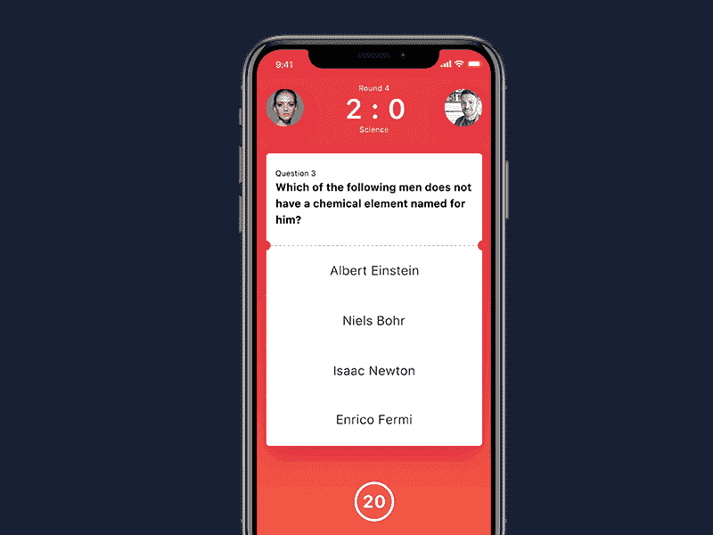

# 如何在 React 中创建测验应用程序

> 原文：<https://javascript.plainenglish.io/how-to-create-a-quiz-app-in-react-5a6fefa3a100?source=collection_archive---------3----------------------->

## 了解如何使用 React 创建功能齐全的测验应用程序



在本教程中，我们将看到如何创建一个测验应用程序，以及如何根据状态处理不同的状态挂钩。

# 我们测验应用程序中的场景

1.  当问题出现时，用户必须从选项中点击一个按钮。
2.  单击回答按钮后，转到下一个问题。
3.  如果答案正确，增加分数。
4.  回答完所有问题后，将显示分数。

# 代码

现在打开你的起始代码，进入 **App.js** ，提出你的问题和答案，并把它作为一个名为 questions 的数组存储起来。我们的测验就要准备好了。

下一个任务是从数组中获取问题并显示在屏幕上。为此，我们必须键入 **{question[0]}** 来获取问题数组中的第一个问题。

```
<div className='question-text'>{questions[0]}</div>
```

现在，只需执行`{question[0].questionText}`即可访问该对象的问题文本。在这里，第一个问题是一个对象，所以点符号(。)用于访问属性。

```
<div className='question-text'>{questions[0].questionText}</div> 
```

现在很清楚，我们从问题数组中的第一个对象获取第一个问题文本。同样，对于答案选项，过程也是相同的。

在这里，我们将使用地图功能。我们知道，map 函数用于循环数组，并以变量的形式给出循环当前所在的项。

这里，map 函数用于循环给定问题的答案选项。

第一个问题是一个对象，包含一个`answerOptions`的数组。我们可以使用点符号来访问这个数组:`questions[0].answerOptions`

因为`answerOptions`是一个数组，我们可以映射到这个:`questions[0].answerOptions.map`

```
<div className='answer-section'>
	{questions[0].answerOptions.map((answerOption, index) => (
		<button>{answerOption.answerText}</button>
	))}
</div>
```

在 map 函数中，我们为每个`answerOption`渲染一个按钮，并显示文本。

# 更改问题状态

现在，是时候改变问题状态了。让我们回到我们的 JSX。根据索引，从问题数组的不同问题中获取数据。每当我们从一个问题转到另一个问题时，UI 都会更新。

为此，我们必须使用一个状态对象来保存用户当前所在的问题，当单击一个回答按钮时，它将移动到下一个问题(UI 将更新)。

```
const [currentQuestion, setCurrentQuestion] = useState(0);
```

我们已经添加了 state 对象，它被初始化为 0，所以测验从数组中抽取第一个问题。

现在，返回到问题文本部分，用[ **currentQuestion** ]替换[0]。

```
<div className='question-text'>{questions[currentQuestion].questionText}</div>
```

对于回答部分:

```
<div className='answer-section'>
	{questions[currentQuestion].answerOptions.map((answerOption, index) => (
		<button>{answerOption.answerText}</button>
	))}
</div>
```

**CurrentQuestion** 被初始化以访问测验中的当前问题，UI 将更新并显示该特定问题的问题和答案。

现在，我们必须创建一个名为 **handleAnswerButtonClick** 的新函数。当用户点击一个答案时，这个函数被调用，它将当前问题的值加 1，保存到一个名为下一个问题的新变量中，并将这个新变量设置为状态。这将把我们带到下一个问题:

```
const handleAnswerButtonClick = (answerOption) => {
	const nextQuestion = currentQuestion + 1;
	setCurrentQuestion(nextQuestion);
};
```

接下来添加一个 **onClick** 事件到我们的按钮，如下所示:

```
<button onClick={() => handleAnswerButtonClick()}>{answerOption.answerText}</button>
```

除此之外，我们确保不超过限制。如果下一个问题编号小于问题总数，则将状态更新为下一个问题。否则，我们已经到达测验的末尾，所以现在显示分数屏幕。

在我们的**handleanswerbuttonclick**k 函数中，让我们添加以下条件:

```
if (nextQuestion < questions.length) {
	setCurrentQuestion(nextQuestion);
} else {
	setShowScore(true);
}
```

# 显示乐谱屏幕

正如我之前说过的，回答完所有问题后，将显示分数屏幕，这就是为什么我们在 else 部分添加代码`setShowScore(true).`如果您查找 JSX，您需要在标记部分用错误逻辑替换它。

然后添加用于存储结果的状态对象，它会在我们想看的时候显示分数屏幕。

```
const [showScore, setShowScore] = useState(false);
```

然后在我们的 JSX 中用 **showscore** 替换 **false** :

```
<div className='app'>{showScore ? <div className='score-section'>// ... score section markup</div> : <>// ... quiz question/answer markup</>}</div>
```

现在，当用户到达测验的最终状态时，我们必须更新状态变量。我们已经编写了 **handleAnswerButton** 函数的逻辑。

现在我们必须用 **showScore** 变量逻辑替换警报逻辑功能，以设置为真:

```
if (nextQuestion < questions.length) {
	setCurrentQuestion(nextQuestion);
} else {
	setShowScore(true);
}
```

现在，如果我们单击测验的答案，它将在最后显示分数。

# 保存分数

现在，我们的下一个任务是在我们的应用程序中保存分数，然后在用户回答正确答案时增加该值。

这个逻辑操作应该在函数**handleAnswerOptionClick**内部进行。

然后迭代 **answerOptions** ，它为每个包含 **questionText** 和一个仅在答案正确时显示的布尔值的对象映射函数。我们使用的布尔函数用于增加我们的分数。

用按钮更新功能:

```
onClick={()=> handleAnswerButtonClick(answerOption.isCorrect)
```

然后更新函数，将它作为参数接受:

```
const handleAnswerButtonClick = (isCorrect) => {
	//... other code
};
```

现在我们可以添加一些逻辑功能，如果答案是正确的，并显示一个警告。

```
const handleAnswerButtonClick = (isCorrect) => {
	if (isCorrect) {
		alert(“the answer is correct!”)
	}
```

此步骤与前面的步骤**相同，如果(isCorrect == true)** ，当我们点击正确答案时，将显示警告。

现在我们必须为 score 添加另一个状态，并用 **setScore = 0** 初始化它:

```
const [score, setScore] = useState(0);
```

然后，如果用户回答正确，我们必须更新分数为 1，而不是显示警告。

在**handle answer button click**功能中，解除警报，分数加 1:

```
const handleAnswerButtonClick = (isCorrect) => {
	if (answerOption.isCorrect) {
		setScore(score + 1);
	}
```

# 显示分数

为了显示分数，我们必须更新我们的 JSX 代码中的一个小变化来呈现我们的分数。在我们的 JSX 中添加新的变量:

```
div className='score-section'>
	You scored {score} out of {questions.length}
</div>
```

现在，如果我们运行这个应用程序，它是动态的，并在最后显示正确的答案。请注意，我们的 UI 总是设置为“1 ”,因此我们需要更改它，以使它更加动态。

将“问题计数”替换为以下内容，然后我们需要加上+1，因为计算机计数从 0 开始，而不是从 1 开始。

```
<div className='question-count'>
	<span>Question {currentQuestionIndex + 1}</span>/{questions.length}
</div>
```

# 结论

我希望你已经享受了很多，并找到一些有用的东西来学习如何在 react 中创建一个测验应用程序。React 是一项强大的学习技术，用于构建实时应用程序。

感谢阅读！

喜欢这篇文章吗？如果是这样，通过 [**订阅解码获得更多类似内容，我们的 YouTube 频道**](https://www.youtube.com/channel/UCtipWUghju290NWcn8jhyAw) **！**