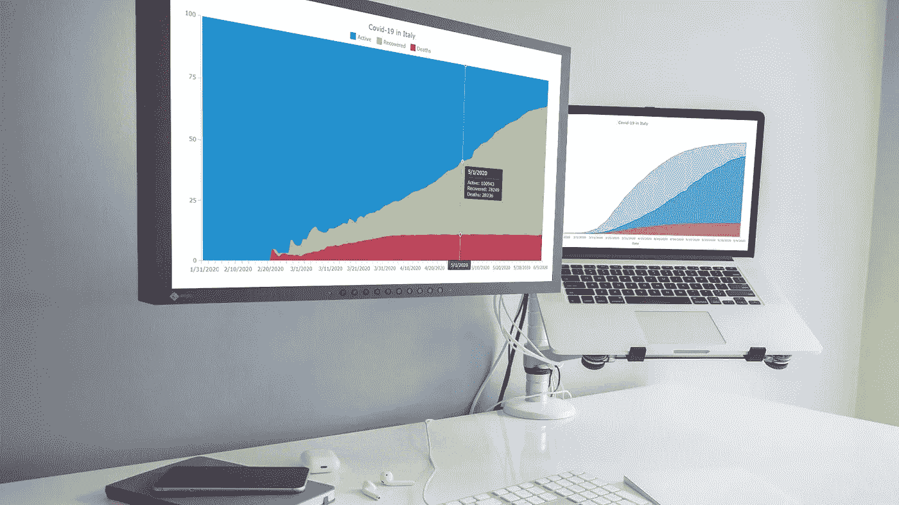
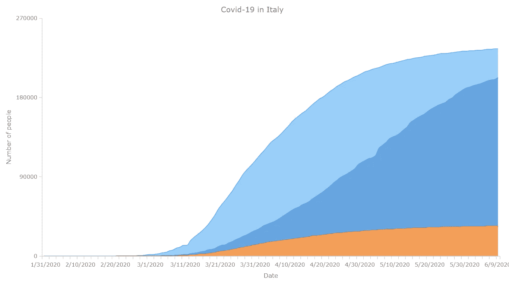
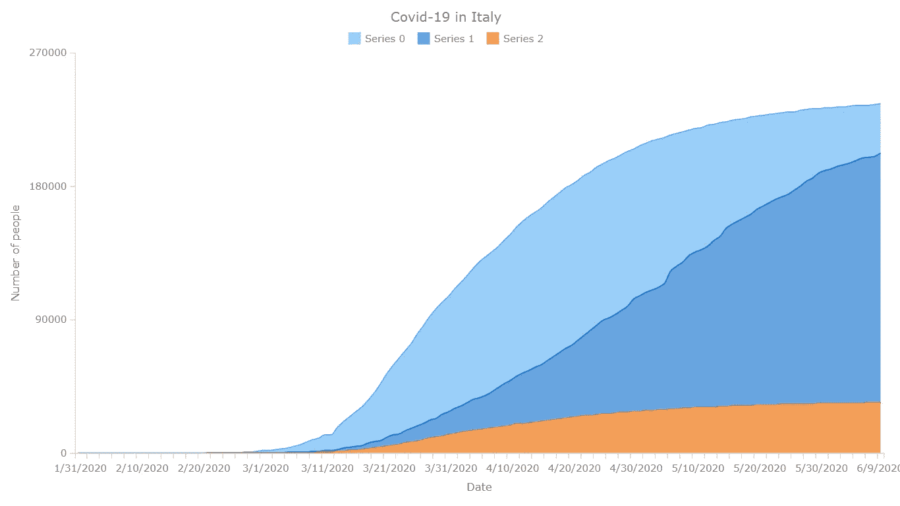
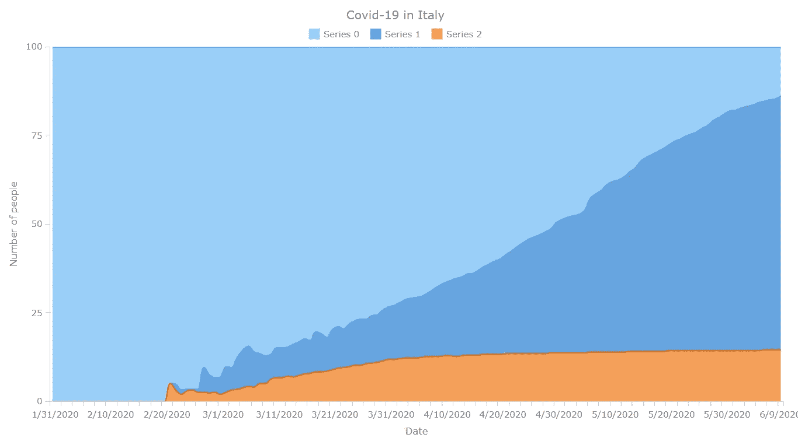
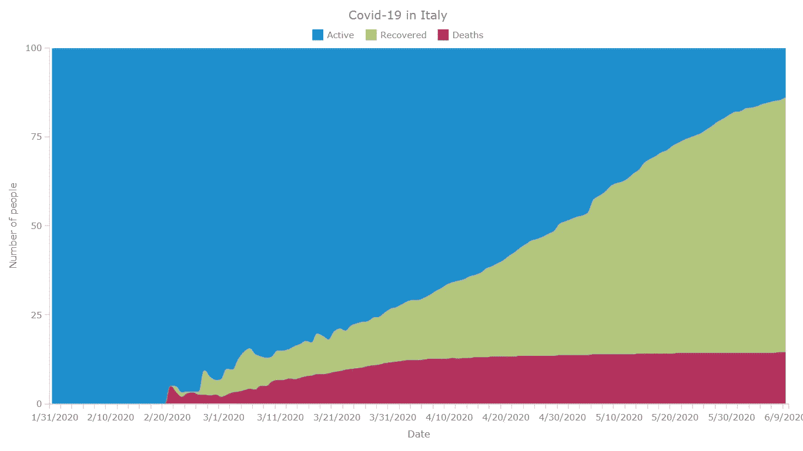

# 如何用 JavaScript 创建堆积面积图

> 原文：<https://javascript.plainenglish.io/how-to-create-a-stacked-area-chart-in-javascript-f7e0562323ae?source=collection_archive---------4----------------------->

## 可视化意大利新冠肺炎数据，1 月 31 日至 6 月 9 日



[堆积面积图](https://www.anychart.com/chartopedia/chart-type/stacked-area-chart/)，是经典[面积图](https://www.anychart.com/chartopedia/chart-type/area-chart/)的变体，是一种非常流行的数据可视化形式。它们很好地用图形表示了多个变量和它们的总和是如何随时间变化的。在本教程中，我将向您展示如何轻松地创建一个交互式 JavaScript 堆叠面积图，它在任何 HTML5 项目、网站或应用程序中都将引人注目。

为了演示这种方法，即使你只有基本的 HTML 编码技能，也很容易掌握，我将可视化关于新冠肺炎疫情病毒爆发的官方数据。根据该教程构建的可视化将显示病例数、康复数和死亡数的变化——从 1 月 31 日前两例确诊到昨天 6 月 9 日意大利冠状病毒病例总数达到 235，561 例。

# 构建 JS 堆积面积图的 4 个步骤

任何 JavaScript 图形(包括堆叠面积图)的开发都可以分为以下四个基本步骤:

1.  为图表创建 HTML 页面。
2.  添加必要的 JavaScript 文件。
3.  设置数据。
4.  为图表编写 JS 代码。

我们先做一个基本的，基于值的 JS 堆积面积图。然后，我将向您展示如何对其进行定制，以适合您自己的需求和任务。最终的数据可视化示例将是下面的 JavaScript 百分比堆积面积图:


现在，让我们言归正传！

# 步骤 1:创建一个 HTML 页面

首先创建一个基本的 HTML 页面。该页面应包含以下内容:

1.  一个相关的标题。
2.  一个 HTML 块元素(例如，`<div>`)将存储您的图表。
3.  `<div>`的 id 属性(例如，“容器”)。

请注意，您还可以在`<style>`块中添加 CSS 规则，以修改堆叠面积图将占用的空间。如果您希望图形填满整个页面，请将`width`和`height`参数设为 100%。

HTML 页面应该如下所示:

```
<!DOCTYPE html>
<html><head>
  <title>Stacked Area Chart</title>
  <style>
    html,
    body,
    #container {
      width: 100%;
      height: 100%;
      margin: 0;
      padding: 0;
    }
  </style>
</head><body>
<div id="container"></div>
</body></html>
```

# 步骤 2:添加必要的 JavaScript 文件

现在，您应该在`<head>`部分引用所有必要的 JS 文件。

我将在本教程中展示的堆积面积图是基于 [AnyChart](https://www.anychart.com) 的 JS 库。通常，JavaScript 库使您能够更快、更容易地生成所需的输出。AnyChart 是轻量级和灵活的，所以你可以尽可能地发挥创造力，想出一个功能齐全、响应迅速的图表，在你的网站或应用程序上使用。

对于这个图表教程，我将包括相应的 [CDN](https://cdn.anychart.com) 链接。如果您愿意，可以在本地下载脚本。

AnyChart JavaScript 库具有一个模块化系统，有助于优化 web 页面上运行的 JS 代码的大小。要使用它制作堆叠面积图，添加两个[模块:](https://docs.anychart.com/Quick_Start/Modules) Core 和 Basic Cartesian。第一个是使用任何其他模块所需的基本 AnyChart 模块。第二个模块驱动所有笛卡尔坐标图。

以下是我们目前所得到的 HTML 代码:

```
<!DOCTYPE html>
<html><head>
  <title>Stacked Area Chart</title>
  <script src="https://cdn.anychart.com/releases/8.8.0/js/anychart-core.min.js"></script>
  <script src="https://cdn.anychart.com/releases/8.8.0/js/anychart-cartesian.min.js"></script>
  <style>
    html,
    body,
    #container {
      width: 100%;
      height: 100%;
      margin: 0;
      padding: 0;
    }
  </style>
</head><body>
  <div id="container"></div>
  <script>
 ***// The stacked area chart's JS code will be written here.***
  </script>
</body></html>
```

# 步骤 3:添加要可视化的数据

## 加载数据

新冠肺炎·疫情是全世界的头条新闻。在本教程中，我决定把重点放在意大利，这是中国以外首个受到此次危机巨大影响的地区。我将可视化数据，包括活跃病例数、恢复数和死亡数，以了解从意大利疫情开始到现在，情况是如何演变的。

我从约翰·霍普金斯 CSSE [数据集](https://github.com/CSSEGISandData/COVID-19/tree/master/csse_covid_19_data)中提取数据，该数据集被认为是新冠肺炎官方统计数据的可靠来源。为了简单起见，我将意大利数据放在一个 CSV 文件中，您可以在这里找到。通过从确诊病例中减去死亡和恢复来计算活动病例。

[在 AnyChart 中加载 CSV 文件](https://docs.anychart.com/Working_with_Data/Data_Adapter/Loading_CSV_File)可以在[数据适配器](https://docs.anychart.com/Working_with_Data/Data_Adapter/Overview)模块的帮助下完成，除了已经在`<head>`部分引用的库脚本之外，您还应该在那里引用该模块:

```
<!DOCTYPE html>
<html><head>
  <title>Stacked Area Chart</title>
  <script src="https://cdn.anychart.com/releases/8.8.0/js/anychart-core.min.js"></script>
  <script src="https://cdn.anychart.com/releases/8.8.0/js/anychart-cartesian.min.js"></script>
  <script src="https://cdn.anychart.com/releases/8.8.0/js/anychart-data-adapter.min.js"></script>
  <style>
    html,
    body,
    #container {
      width: 100%;
      height: 100%;
      margin: 0;
      padding: 0;
    }
  </style>
</head><body>
  <div id="container"></div>
  <script>
 ***// The stacked area chart's JS code will be written here.***  </script>
</body></html>
```

现在您可以使用数据适配器提供的 [loadCsvFile](https://api.anychart.com/v8/anychart.data#loadCsvFile) 方法来加载 CSV 数据。

```
anychart.data.loadCsvFile ("https://static.anychart.com/git-storage/word-press/data/covid-19-italy/data.csv", function (data) {
});
```

然后，[设置数据](https://docs.anychart.com/Working_with_Data/Data_Sets),以便在未来基于 JavaScript 的堆积面积图中使用:

```
anychart.data.loadCsvFile ("https://static.anychart.com/git-storage/word-press/data/covid-19-italy/data.csv", function (data) {
 ***// set the data and ignore the first row that contains headers***  var dataSet = anychart.data.set(data, {ignoreFirstRow: true});
});
```

## 映射数据

该图表将显示三个字段的数据:活动病例、恢复和死亡。因此，您需要三个不同的数据系列，每个字段一个。但是，您将如何“告知”您的图表每个字段使用哪些数据呢？

这就是[数据映射](https://docs.anychart.com/Working_with_Data/Data_Sets#mapping)发挥作用的地方！通过调用 [mapAs](https://api.anychart.com/v8/anychart.data.Set#mapAs) 方法，观察这是如何在代码中实现的:

```
***// map data for the deaths series*** var deathsData = dataSet.mapAs({ 'x': 0, 'value': 2 });***// map data for the recovered series*** var recoveredData = dataSet.mapAs({ 'x': 0, 'value': 3 });***// map data for the active series*** var activeData = dataSet.mapAs({ 'x': 0, 'value': 4 });
```

# 步骤 4:为您的图表编写 JS 代码

现在一切似乎都已就绪，您可以开始编写 JS 堆叠面积图可视化代码了。

首先，添加`anychart.onDocumentReady`函数，它将封装图表的全部代码，并在页面准备就绪时执行。

```
<script>anychart.onDocumentReady(function () {
 ***// The stacked area chart's code will be written here.*** });</script>
```

接下来，添加步骤 3 中的数据:

```
<script>anychart.onDocumentReady(function () {
  anychart.data.loadCsvFile ("https://static.anychart.com/git-storage/word-press/data/covid-19-italy/data.csv", function (data) {
 ***// set the data and ignore the first row that contains headers***    var dataSet = anychart.data.set(data, {ignoreFirstRow: true});
  });
});</script>
```

然后，指定图表类型，设置系列并强制图表按 Y 刻度堆叠值:

```
***// specify the area chart type*** var chart = anychart.area();***// create a series with the mapped active data*** var actSeries = chart.splineArea(activeData);***// create a series with the mapped recovered data*** var recSeries = chart.splineArea(recoveredData);***// create a series with the mapped deaths data*** var deathsSeries = chart.splineArea(deathsData);***// force the chart to stack values by the y scale*** chart.yScale().stackMode('value');
```

为了清楚起见，让我们给它一个标题，并命名它的轴(如果你需要建议，请参见[写好图表标题的技巧](https://www.anychart.com/blog/2017/04/05/chart-captions-title-graph-tips/)):

```
***// set the chart title*** chart.title('Covid-19 in Italy');***// set the labels of the axes*** chart.xAxis().title("Date");
chart.yAxis().title("Number of people");
```

还有一点:我还想加一条会随鼠标移动的竖线，这样应该更容易一目了然哪里是什么。在 AnyChart 中，只需使用[十字准线](https://docs.anychart.com/Axes_and_Grids/Crosshair)功能。以下代码显示了如何启用十字准线，并带有一些附加样式:

```
***// turn on the crosshair*** var crosshair = chart.crosshair();
crosshair.enabled(true)
  .yStroke(null)
  .xStroke('#fff')
  .zIndex(39);
crosshair.yLabel().enabled(false);
```

最后，通过将图表放入容器并使用 drawing 命令来绘制图表。

```
***// set the container id for the chart*** chart.container('container');***// initiate chart drawing*** chart.draw();
```

享受结果:



该输出提供了对活动病例、恢复和死亡的数量如何随时间变化的洞察。总数都是确诊病例。您可以将鼠标移到图表上，查看每个点的准确值。注意十字准线如何帮助理解每天的信息！

**为方便起见，完整代码如下。随意在 AnyChart 游乐场玩这个** [**基础 JS 堆积面积图**](https://playground.anychart.com/y7Y3OAGf/) **。**

```
<!DOCTYPE html>
<html><head>
  <title>Stacked Area Chart</title>
  <script src="https://cdn.anychart.com/releases/8.8.0/js/anychart-core.min.js"></script>
  <script src="https://cdn.anychart.com/releases/8.8.0/js/anychart-data-adapter.min.js"></script>
  <script src="https://cdn.anychart.com/releases/8.8.0/js/anychart-cartesian.min.js"></script>
  <style>
    html,
    body,
    #container {
      width: 100%;
      height: 100%;
      margin: 0;
      padding: 0;
    }
  </style>
</head><body>
  <div id="container"></div>
  <script>anychart.onDocumentReady(function () {
  anychart.data.loadCsvFile("https://static.anychart.com/git-storage/word-press/data/covid-19-italy/data.csv", function (data) { 
 ***// set the data and ignore the first row that contains headers***    var dataSet = anychart.data.set(data, {ignoreFirstRow: true});***// map data for the deaths series* **    var deathsData = dataSet.mapAs({ 'x': 0, 'value': 2 });***// map data for the recovered series* **    var recoveredData = dataSet.mapAs({ 'x': 0, 'value': 3 });***// map data for the active series*
**    var activeData = dataSet.mapAs({ 'x': 0, 'value': 4 });***// specify the chart type* **    var chart = anychart.area();***// create a series with the mapped active data* **    var actSeries = chart.splineArea(activeData);***// create a series with the mapped recovered data* **    var recSeries = chart.splineArea(recoveredData);***// create a series with the mapped deaths data* **    var deathsSeries = chart.splineArea(deathsData);***// force the chart to stack values by the y scale* **    chart.yScale().stackMode('value');***// set the chart title* **    chart.title('Covid-19 in Italy');***// set the labels of the axes* **    chart.xAxis().title("Date");
    chart.yAxis().title("Number of people");***// turn on the crosshair* **    var crosshair = chart.crosshair();
    crosshair.enabled(true)
      .yStroke(null)
      .xStroke('#fff')
      .zIndex(39);
    crosshair.yLabel().enabled(false);***// set the container id for the chart* **    chart.container('container');***// initiate chart drawing* **    chart.draw();
  });
});</script>
</body></html>
```

# 定制 JavaScript 堆积面积图

很可能不同的人喜欢不同的图表功能和美学，更不用说作为一名 web 开发人员或数据可视化设计人员，您可能会得到不同的任务。幸运的是，由 AnyChart 支持的 JS 图表可以进行修改，以适应您的需要和偏好。我将向您展示如何立即执行一些快速定制:

1.  添加图例和动画。
2.  将值更改为百分比。
3.  配置工具提示、标记和标签。
4.  改变颜色。

# 添加图例和动画

为了便于阅读，每个显示多个值的图表都应该有一个图例。

添加以下代码，为基于 JS 的堆积面积图打开图例。

```
chart.legend(true);
```

我还想通过添加动画来给这个图表添加一点 wow 效果。您可以通过在图表的 JavaScript 代码中添加一行代码来快速实现这一点:

```
chart.animation(true);
```

**查看结果，在 AnyChart 游乐场** **:** 可以找到这个 [**带图例和动画的 JS 堆积面积图**](https://playground.anychart.com/GgOhYA6p/)



# 将值更改为百分比

现在，让我们将堆叠模式从值切换到百分比。通过这种方式，你可以想象出不管总数是多少，成分是如何变化的。

这很简单。要用 JavaScript (HTML5) [百分比堆积面积图](https://www.anychart.com/chartopedia/chart-type/percent-stacked-area-chart/)可视化相同的数据，只需用“百分比”替换“值”:

```
***// change the stacking mode to percent*** chart.yScale().stackMode('percent');
```



**此** [**JS 百分比堆积面积图在 AnyChart 游乐场**](https://playground.anychart.com/lPGKLSbK/) **有售。**

# 配置工具提示、标记和标签

让我们让图表在工具提示和图例中显示系列标题。有很多方法可以做到这一点。但是我也想修改点标记。因此，让我们创建一个助手函数，您可以在其中编写定制所有这些元素所需的代码:

```
***// helper function to setup tooltip labels for all series and style markers*** var setupSeriesLabels = function (series, name) {
  series.name(name)
};
```

在我设置系列的地方使用这个功能，并添加相应的标题:

```
***// create a series with the mapped active data*** var actSeries = chart.splineArea(activeData);
setupSeriesLabels(actSeries, 'Active');***// create a series with the mapped recovered data*** var recSeries = chart.splineArea(recoveredData);
setupSeriesLabels(recSeries, 'Recovered');***// create a series with the mapped deaths data*** var deathsSeries = chart.splineArea(deathsData);
setupSeriesLabels(deathsSeries, 'Deaths');
```

现在，再次使用辅助函数来设置标记的样式。我要做的是把它们都做成圆形，给它们一个特定的尺寸，并指定它们的笔画粗细和颜色。最后，我还将指定他们，使他们出现在前面的水平。

代码如下:

```
***// helper function to setup series and give them appropriate names in order to distinguish and label them properly*** var setupSeries = function (series, name) {
  series.name(name)
 ***// setting the markers***  series.hovered().stroke('3 #fff 1');
  series.hovered().markers()
    .enabled(true)
    .type('circle')
    .size(4)
    .stroke('1.5 #fff');
  series.markers().zIndex(100);
};
```

这些更改后的图表输出如下:


**欢迎您在 AnyChart 游乐场** **打开这个** [**定制的 JS 百分比堆积面积图。**](https://playground.anychart.com/p7MqdGgn/)

# 改变颜色

最后，我想将图表的颜色修改成对我更有意义的颜色。我将为死亡添加红色阴影，为康复添加绿色阴影，为活跃病例添加蓝色阴影。随意提出自己的想法！

代码如下:

```
***// create a series with the mapped active series*** var actSeries = chart.splineArea(activeData)
.fill("#1E8FCD")
.stroke("#4b9bc6")
setupSeries(actSeries, 'Active');***// create a series with the mapped recovered data*** var recSeries = chart.splineArea(recoveredData)
.fill("#B3C67D")
.stroke("#b9c1a0")
setupSeries(recSeries, 'Recovered');***// create a series with the mapped deaths data*** var deathsSeries = chart.splineArea(deathsData)
.fill("#b3315d")
.stroke("#b5617d")
setupSeries(deathsSeries, 'Deaths');
```

查看我在开始时以 GIF 形式展示的最终交互式 JavaScript 百分比堆积面积图:



**你可以在下面找到这个数据可视化的完整代码以及 AnyChart 操场上的** [**最终 JS 百分比堆积面积图**](https://playground.anychart.com/mHFN31Vt/) **:**

```
<!DOCTYPE html>
<html lang="en"><head>
  <title>Stacked Area Chart</title>
  <script src="https://cdn.anychart.com/releases/8.8.0/js/anychart-core.min.js"></script>
  <script src="https://cdn.anychart.com/releases/8.8.0/js/anychart-data-adapter.min.js"></script>
  <script src="https://cdn.anychart.com/releases/8.8.0/js/anychart-cartesian.min.js"></script>
  <style>
    html,
    body,
    #container {
      width: 100%;
      height: 100%;
      margin: 0;
      padding: 0;
    }
  </style>
</head><body>
  <div id="container"></div>
    <script>anychart.onDocumentReady(function () {
  anychart.data.loadCsvFile("https://static.anychart.com/git-storage/word-press/data/covid-19-italy/data.csv", function (data) {
 ***// set the data and ignore the first row that contains headers***    var dataSet = anychart.data.set(data, {ignoreFirstRow: true});***// map data for the deaths series* **    var deathsData = dataSet.mapAs({ 'x': 0, 'value': 2 });***// map data for the recovered series* **    var recoveredData = dataSet.mapAs({ 'x': 0, 'value': 3 });***// map data for the active series* **    var activeData = dataSet.mapAs({ 'x': 0, 'value': 4 });***// specify the area chart type* **    var chart = anychart.area();***// helper function to setup series and give them appropriate names in order to distinguish and label them properly* **    var setupSeries = function (series, name) {
      series.name(name)
 ***// setting the markers***      series.hovered().stroke('3 #fff 1');
      series.hovered().markers()
        .enabled(true)
        .type('circle')
        .size(4)
        .stroke('1.5 #fff');
      series.markers().zIndex(100);
    };***// create a series with the mapped active data* **    var actSeries = chart.splineArea(activeData)
    .fill("#1E8FCD")
    .stroke("#4b9bc6")
    setupSeries(actSeries, 'Active');***// create a series with the mapped recovered data* **    var recSeries = chart.splineArea(recoveredData)
    .fill("#B3C67D")
    .stroke("#b9c1a0")
    setupSeries(recSeries, 'Recovered');***// create a series with the mapped deaths data* **    var deathsSeries = chart.splineArea(deathsData)
    .fill("#b3315d")
    .stroke("#b5617d")
    setupSeries(deathsSeries, 'Deaths');

 ***// force the chart to stack values by the y scale***    chart.yScale().stackMode('percent');***// set the chart title* **    chart.title('Covid-19 in Italy');***// set the labels of the axes* **    chart.xAxis().title("Date");
    chart.yAxis().title("Number of people");***// turn on the crosshair* **    var crosshair = chart.crosshair();
    crosshair.enabled(true)
      .yStroke(null)
      .xStroke('#fff')
      .zIndex(39);
    crosshair.yLabel().enabled(false);***// turn on the legend* **    chart.legend(true);***// turn on the chart animation* **    chart.animation(true);***// set the container id for the chart* **    chart.container('container');***// initiate chart drawing* **    chart.draw();
  });
});</script>
</body></html>
```

# 结论

恭喜你！您已经构建了您的第一个 JavaScript 堆叠面积图！过程其实并不难吧？

趁热继续学吧。参见[文档](https://docs.anychart.com)。在[面积图图库](https://www.anychart.com/products/anychart/gallery/Area_Charts/)中查看更多堆积面积图示例以获取灵感。欢迎分享你自己的创作，并在评论中提出你的问题😉

***参见:*** [***如何创建 JavaScript 区域图***](https://www.anychart.com/blog/2017/10/28/create-javascript-area-chart/)

*原载于 2020 年 6 月 10 日*[*https://www.anychart.com*](https://www.anychart.com/blog/2020/06/10/stacked-area-chart-javascript-tutorial/)*。*