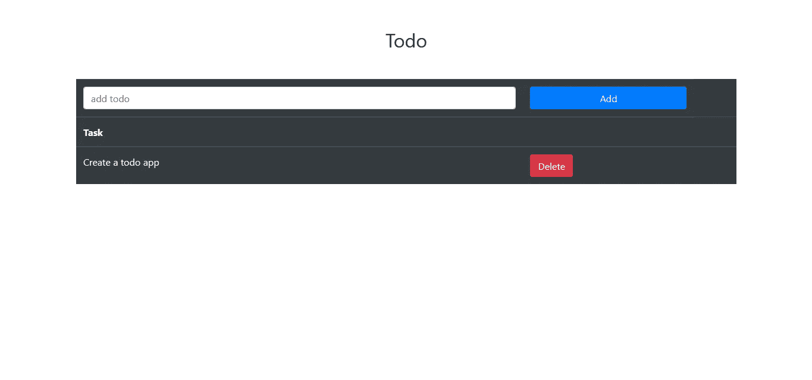
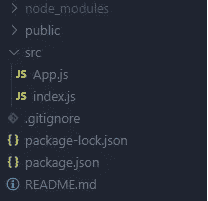
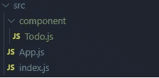

# 如何使用 React 挂钩和 LocalStorage 创建 Todo 应用程序

> 原文：<https://javascript.plainenglish.io/how-to-create-a-todo-app-with-react-hooks-and-localstorage-17e37cfeb46d?source=collection_archive---------3----------------------->


## 使用 React 挂钩创建 Todo 应用程序的分步指南

新反应？很想知道如何启动并运行这个库，并希望利用最新的特性。那么这个 Todo 应用将会是你一个很好的起点！

这是我们最终的应用程序:



在这里，我们不会过多关注应用程序的样式。

现在让我们创建 React 应用程序。为此，让我们启动主项目目录中的终端，并编写以下命令:

```
npx create-react-app .
```

该命令帮助您安装设置 react 应用程序所需的一切。

React 应用程序安装完成后，让我们安装一个包。为此，让我们在主项目目录中打开终端，并编写以下命令:

```
npm i bootstrap
```

使用这个命令，我们已经安装了 bootstrap。我们将使用 bootstrap 为我们的应用程序添加一些样式。

现在我们已经安装了包，让我们开始写一些代码。在写代码之前，让我们先删除一些我们不会用到的文件。让我们在 *src* 目录中保留 **App.js** 和 **index.js** 文件，并删除该目录中的其他文件。这应该使我们的文件夹结构看起来像这样:



让我们打开文件 **index.js** 并做一些修改。我们的 **index.js** 文件应该是这样的:

```
import React from "react";import ReactDOM from "react-dom";import App from "./App";ReactDOM.render( <React.StrictMode> <App /> </React.StrictMode>, document.getElementById("root") );
```

注意，我们已经删除了服务工作者和 **index.css** 文件的导入。其他的也一样。

现在让我们打开文件 **App.js** 并编写以下代码行:

```
import React from "react";import Todo from "./component/Todo";import "bootstrap/dist/css/bootstrap.css"; function App() { return ( <> <Todo /> </> );}export default App;
```

在第一行，我们导入了`React`。然后，我们导入了`Todo`组件——我们很快就会开始工作。之后，我们从 Bootstrap 导入 CSS 文件。

之后，我们创建了一个返回`Todo`组件的`App`函数。之后，我们导出了`App`函数。

现在让我们开始制作`Todo`组件。为此，让我们在 *src* 目录中创建一个名为*组件*的目录。之后，在*组件*目录下创建一个名为 **Todo.js** 的文件。这应该使我们的 *src* 文件夹看起来像这样:



现在让我们打开文件 **Todo.js** 并编写以下代码行:

我们可以通过创建多个组件来使这个文件更精简。对于这篇文章，让我们保持这种方式。

现在让我们仔细看看这个文件。

在第 1 行，我们从`'React’`导入了`React`、`useState`和`useEffect`。

在第 3 行，我们创建了`Todo`函数，并在第 89 行将其导出。

在第 4 & 5 行，我们使用`useState`创建了一个`todos`和`newTodo`状态。在这里，`useState`创造了我们一个国家。在基于类的组件中，我们会创建一个`state`对象并在其中存储值。但是有了钩子，我们就不需要了。状态是存储和修改数据的一种方式。这里，`useState`接受一个参数。此参数为状态提供默认值。在我们的例子中，我们为`todos`状态提供了一个空数组，为`newTodo`提供了一个空字符串。

这个`useState()`函数返回一个包含状态值的数组作为第一个元素，返回一个改变状态的函数作为第二个元素。记住我们不能直接改变状态值。我们需要一个函数来改变状态的值。我们使用数组析构来获取值和函数——这可以在第 4 行和第 5 行看到。在第 4 行，我们将状态命名为`todos`，将函数命名为`setTodos`。同样，我们将其他状态和功能命名为`newTodo`和`setNewTodo`。

从第 33 行到第 86 行，我们呈现了组件。

在第 35 行，我们添加了标题为“todo”的`h2`。从第 37 行到第 84 行，我们呈现了一个用于显示 todo 的表格。从第 38 行到第 57 行，我们创建了一个文本字段和一个 add todo 按钮。从第 41 行到第 48 行，我们有一个输入字段。我们已经在第 46 行用值`newTodo`设置了输入字段。这里，我们在第 47 行的输入字段中添加了一个`onChange`事件监听器。当发生一些变化时，我们使用`setNewTodo`函数将`newTodo`设置为`e.target.value`。这里，`e`是一个包含`target`属性的事件。这个目标实际上是`input`字段。`target`包含`value`属性。`value`将值存储在`input`字段中。

从第 51 行到第 54 行，我们创建了一个“添加”按钮。当按钮被点击时，我们调用一个名为`onAddTodo`的函数，在第 51 行的`onClick`事件监听器的帮助下。

从第 59 行到第 66 行，我们创建了一个标题为“Task”的`thead`。

从第 69 行到第 82 行，我们呈现了处于`todos`状态的 todos。我们映射通过`todos`州并创建`tr`。在第 71 行，我们用`todo.todo`添加了表格数据。我们的`todo`是一个包含`todo`和一个`id`的对象。从第 73 行到第 79 行，我们在一个`td`中添加了一个“删除”按钮。当删除按钮被点击时，我们使用第 75 行的`onClick`事件监听器调用`deleteTodo(todo.id)`函数。

在第 11 行，我们使用了`useEffect`，第一个参数作为回调函数，第二个参数作为空数组。我们构建`useEffect`的方式与`componentDidMount`的方式相同。这是因为我们使用了一个空数组作为第二个参数。让我们来看看回调函数内部的代码。在第 12 行，我们检查了`localStorage`中是否存在`todos`条目。这里，`localStorage.getItem()`帮助我们接收存储在`localStorage`中的数据。如果`todos`条目存在，我们在第 13 行将`todos`状态设置为与`localStorage`中存在的值相同。

现在让我们看看第 17 行的`onAddTodo`函数。当用户点击“添加”按钮时，这个函数被调用。在第 18 行，我们检查了要添加的 todo 是否为空字符串。如果是空字符串，我们什么都不做。如果不是空字符串，我们在第 19 行创建一个变量`newTodos`。注意，我们使用了 spread 操作符将之前的 todos 添加到`newTodos`数组中。我们还向`newTodos`数组添加了新的 todo。我们的 todo 是一个包含`todo`和`id`属性的对象。`todo`存储文本，而`id`存储特定 todo 的 id。我们使用`Date.now()`作为 id，使用`newTodo`状态作为`todo`。之后，我们在第 20 行使用`setTodos`将 todos 状态的值设置为`newTodos`。在第 21 行，我们将`newTodo`设置为一个空字符串。记住`newTodo`存储输入字段中的值。之后，我们在第 22 行运行带有参数`newTodos`的`saveData()`。此`saveData`功能帮助我们将待办事项保存到`localStorage`中。

现在让我们看看第 26 行的`deleteTodo`函数。它接受`id`作为参数。然后，我们过滤第 27 行的 todos。这里，过滤器只返回那些 id 与`id`参数不匹配的 todos，并将其存储在`newTodos`变量中。然后，我们使用`setTodos`将第 28 行的 todos 设置为`newTodos`。之后，我们运行`saveData()`,将`newTodos`作为第 30 行的参数。

现在让我们看看第 7 行的`saveData`函数。该函数以`newTodos`为自变量。它将数据保存到`localStorage`。在第 8 行，我们使用`localStorage.setItem`将 todos 保存到`localStorage`的`”todos”`字段。`setItem`接受两个参数，第一个参数是键名，第二个参数是键值。请注意，我们的第二个参数是使用`JSON.stringify()`字符串化的。因为`localStorage`只存储字符串值。这也是我们在从第 13 行的`localStorage`检索数据时使用`JSON.parse`的原因。

有了这个，我们已经完成了 Todo 应用程序的创建。您现在可以尝试一下了。