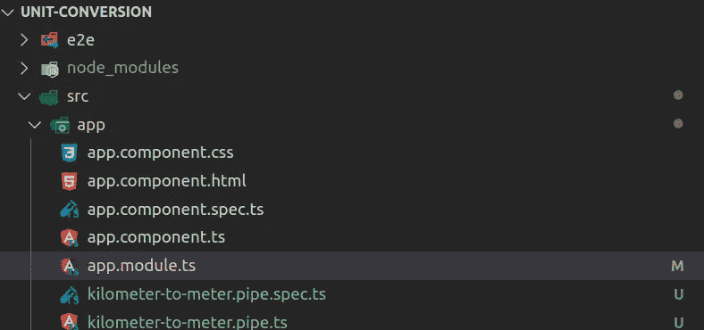

# 如何在 Angular 中创建单位转换器管道

> 原文：<https://javascript.plainenglish.io/how-to-create-a-unit-converter-pipe-in-angular-eea9b7201402?source=collection_archive---------6----------------------->

## 在 Angular 中创建简单的自定义管道


Photo by [Markus Spiske](https://unsplash.com/@markusspiske?utm_source=medium&utm_medium=referral) on [Unsplash](https://unsplash.com?utm_source=medium&utm_medium=referral)

在 Angular 中，管道用于转换或格式化模板中的数据，而无需在组件中编写任何样板代码。管道非常方便，因为只需声明一次管道，就可以在整个应用程序的模板中使用它。

在本指南中，我将通过实现一个简单的自定义单位转换管道向您展示角形管道的强大功能。以下是管道在 Angular 方面的一些优势。

*   当您键入或对其他更改做出反应时，值被格式化或转换，用户可以获得即时反馈。
*   管道非常轻
*   简单语法，要在模板中调用管道，只需使用管道字符后跟管道名，例如{{ name|大写}}。

为了简单起见，我们的管道会将值从千米(km)转换为等价的米(m)值。

事不宜迟，让我们直接进入代码。

# 创建新的角度应用程序

首先，我们将使用以下 CLI 命令创建一个名为 unit-conversion 的新角度应用程序。

```
ng new unit-conversion --defaults
```

# 添加新管道

一旦创建了应用程序，现在就可以创建单位转换管道了。为此，您可以使用以下 CLI 命令。

```
ng g p kilometer-to-meter
```

上面的命令创建了两个文件:包含逻辑的管道类和单元测试文件。此外，管道用缺省模块文件注册。

在本指南中，我们对类文件本身更感兴趣，但是我强烈建议您为您的管道编写单元测试。项目结构现在看起来如下。



# 实现管道

通常，Angular 中的管道将实现 PipeTransform 接口。该接口包含 ***转换方法*** ，该方法接受至少一个参数，包括要格式化或转换的值。

***转换方法*** 是您编写逻辑来格式化或计算所需值并将其作为格式化值返回的地方。

在我们的例子中，我们知道 1 公里等于 1000 米。因此，要从千米转换到米，转换方法必须通过将千米输入值乘以 1000 来计算所需的米值。返回值将是仪表的等效值。

我们在上面创建的管道代码应该如下所示。

# 在模板中使用管道

既然我们的管道逻辑已经就位。我们现在可以在模板中使用管道。

从***app.component.html***文件中删除所有样板代码，并替换为下面的代码。

该代码为用户创建了一个输入字段来输入公里数，在它下面，我们动态地显示以米为单位的等值。

因为我们已经在输入属性上使用了 ***ngModel*** 。我们必须在相应的模块中注册 ***表单模块*** ，在本例中是 ***app.module.ts*** 文件。

***app . module . ts***文件中的代码如下。

**注意**:如果您不导入并注册 ***FormsModule*** ，您将得到以下错误消息:*“无法绑定到‘ng model’，因为它不是‘input’的已知属性”*。

在***app . component . ts***文件中，我们为 km 值创建一个属性。并且最初将其设置为零。

# 测试管道

要为应用程序提供服务，只需在应用程序的根文件夹中运行以下 CLI 命令。

```
ng serve -o
```

在公里输入字段中，您可以输入想要转换的公里数。

下面的 GIF 显示了转换管道的作用。


# 摘要

在本指南中，我们创建了一个简单的管道来处理单位转换。具体来说，从千米到米。

管道功能强大且轻量级，可以轻松地在模板中使用，为用户提供即时格式化的数据。

Angular 框架提供了许多用于格式化数据的内置管道，随着框架的成熟，将会添加更多的默认管道。