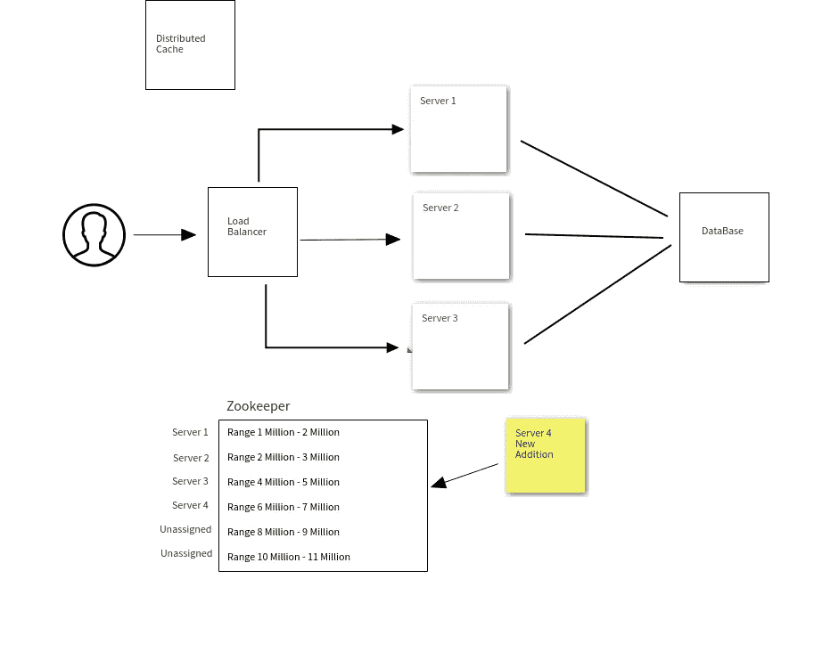

# 如何设计一个 URL Shortener web 应用程序

> 原文：<https://javascript.plainenglish.io/how-to-create-a-url-shortener-web-app-c782910b4d12?source=collection_archive---------9----------------------->

这是我为数不多的系统设计教程之一，我将在接下来的几天里发布，我将告诉你在构建高度可扩展的分布式系统中良好的具体故障保护解决方案。

## 我们将要学习的内容简介:

在高流量系统中，设计一个系统总是一个重要的或最重要的因素。同时设计类似 UrlShortener、票务应用程序或电子商务应用程序的东西，让数百万用户进行读写操作。您的系统应该能够平稳、高效、稳健地处理如此大的流量。因此，要做到这一点，我们需要设计我们的堆栈、工作流和系统。

今天我们要建立一个像 tinyurl.com 一样的网址缩短器。我们将会看到所有的算法都可以使用，它们的优缺点，以及最终哪个最适合这个系统。

因此，设计系统的第一个检查点是做出一些具体的假设:

在这种情况下，我们可以假设:url 的长度可以是 7 个字符长，以及有多少点击将进入我们的系统。比方说，我们的系统将能够获得 100 万次点击/天，即 3000 万次点击/天，等等…

## 构建数据容量模型:

因此，为了构建我们的数据库，我们需要构建一个数据模型，该模型将由以下条目组成:

长 URL - 2KB 大小

短 URL - 7 个字符

创建日期戳- 7 字节

到期日期- 7 字节

这很简单，对吧…不，当你想建立一个可扩展的系统时，这实际上并不简单。对于单个服务器系统，这很简单，但在现实生活中，这些系统应该是可伸缩的。

## 算法:

现在我们来看实现逻辑部分。所以为了实现这一点..我们几乎可以使用两种算法:

*base62*

*MD5 哈希*

所以以上两种算法都可以用来获得随机散列。我们使用 base62，因为使用 base62 我们可以生成 62⁷，即超过 3 万亿的字符串组合，与 MD5 哈希相同。MD5 散列的一个小问题是，它给出了 20–22 个字符长的散列值，而要求只有 7 个字符，因此我们需要提取 MD5 散列值的前 7 个字符。暂时还可以…

## 尝试使用 base62 和 MD5 哈希构建系统:

首先，让我们试着用 base62 来构建这个系统:所以我们用我们的长 url，比如:【www.abc.com/ayhasd/asdeqwe/qweqw?yusdsd=123123】T4&kqwenoow

我们将这个值传递给我们的 base62 服务，它将返回给我一个 7 字符的唯一键，如 **an1132s** ，我们将把它传递给我们的 url shortener 域，并构建我们的短 url，如[**【www.shorturl.com/an1132s】**](http://www.shorturl.com/an1132s)**，点击后会将我们重定向到所需的长 url。这对于单个系统来说工作得很好，但是假设当数百万用户使用该系统时，必须有一个具有并行处理或分片的系统，或者多个服务器来服务这些请求，而不是一个服务器。**

**所以在这种情况下，我们的问题就出现了。由于多个服务器为不同的请求提供服务，因此可能会出现两个服务器返回相同的 7 个字符的情况，对于两个不同的长 URL，base62 值是相同的。因此，如果我们使用 NoSQL 数据库，我们将不会有像 INSERT IF 这样的方法，也不会搜索数据库中是否存在该关键字，但我们会遇到损坏的项目或数据库冲突就是这种情况。**

## **试图用计数器解决问题:**

**上面的问题可以用计数器来解决..还是可以？让我们试一试。**

**为了解决这种不确定性，我们可以使用一个或两个计数器来跟踪或充当线程安全的唯一 id 生成器，这样我们就不会遇到重复的哈希值。因此，我们可以给一个计数器一个从 100 万到 100 万的范围值，给另一个计数器 200 万到 300 万的范围值。但是假设范围值在几个月之后耗尽，并且计数器服务不知道如何重置它，并且它将不会与另一个计数器通信，因为两个计数器都在不同的服务器中工作。这就是柜台服务的问题所在。**

## **动物园管理员前来救援:**

**我们可以用 ZooKeeper 来解决这个问题。但是什么是[动物园管理员](https://zookeeper.apache.org/)？**

**Zookeeper 是一个配置管理分布式系统，它作为一个协调服务来管理注册到它的不同服务或服务器。简而言之，它就像一个中央集线器，与连接到它的不同节点进行通信。记住这一点，让我们画一个系统设计图来解决我们的伸缩问题。**

****

**因此，用户上传一个长 url，该 URL 通过负载平衡器来确定将有效负载发送到哪个服务器。假设服务器 1 可以自由接受有效载荷，并且当它收到请求时，它递增其计数器，其范围从 1 百万到 2 百万，并且给该请求赋值。该请求随后被发送到 base62 服务，并获得其新的缩短的 7 个字符的密钥。**

**Zookeeper 在这里的主要工作是为每个服务器分配一个特定的计数器范围，并跟踪它的变化，这样就不会有重复的键或数据库冲突。**

## **让我们来衡量:**

**假设服务器 3 在一段时间后关闭，那么它将删除 Zookeeper 服务中的条目，并再次将其取消分配。让我们向系统添加另一台服务器 4，它将被分配到一个新的 4m-5m 范围。这就是我们如何在不停机的情况下轻松扩展和缩减系统的方法。因为 Zookeeper 是一个包含多个服务器的服务，所以它最终会成为一个安全系统。**

**GitHub Repo 的链接:**

** [## Rajdeepc/url-shortener-vue

### 一个完整的 E2E 应用程序，以缩短您的网址，并保存在您的个人资料。它给你选择域名的灵活性…

github.com](https://github.com/Rajdeepc/url-shortener-vue)** 

**感谢阅读！如果您有任何问题，请随时联系 rajrock38@gmail.com，通过 [LinkedIn](https://www.linkedin.com/in/rajdeepcoder/) 与我联系，或者通过 [Medium](https://medium.com/@rajrock38) 和 [Twitter](https://twitter.com/rajrock38) 关注我。**

**如果你觉得这篇文章很有帮助，给它一些掌声会很有意义👏并分享出来帮别人找！并欢迎在下方发表评论。**

## ****用简单英语写的 JavaScript 笔记****

**我们已经推出了三种新的出版物！请关注我们的新出版物:[**AI in Plain English**](https://medium.com/ai-in-plain-english)[**UX in Plain English**](https://medium.com/ux-in-plain-english)[**Python in Plain English**](https://medium.com/python-in-plain-english)**——谢谢，继续学习！****

****我们也一直有兴趣帮助推广高质量的内容。如果您有一篇文章想要提交给我们的任何出版物，请发送电子邮件至[**submissions @ plain English . io**](mailto:submissions@plainenglish.io)**，并附上您的 Medium 用户名，我们会将您添加为作者。另外，请让我们知道您想加入哪个/哪些出版物。******