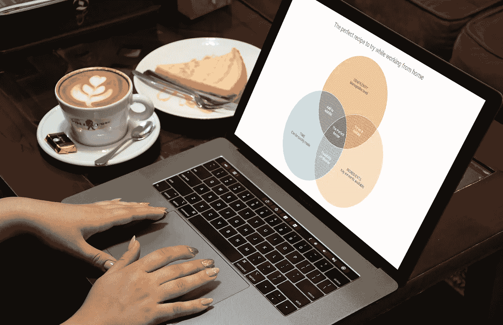
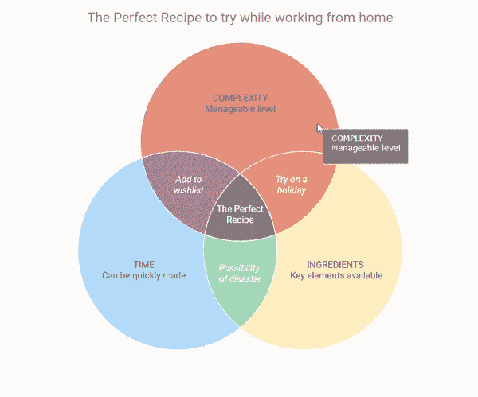
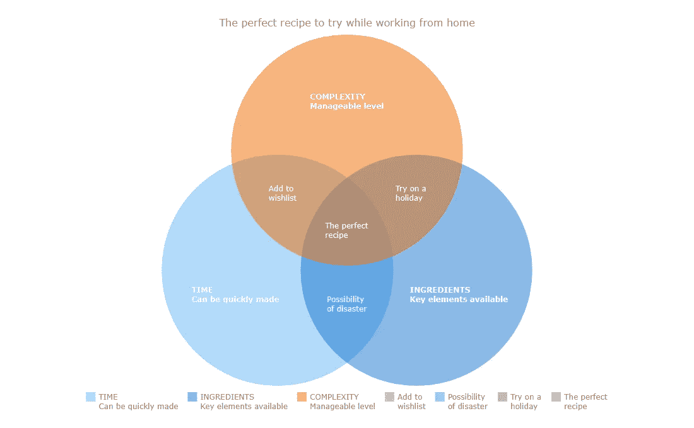
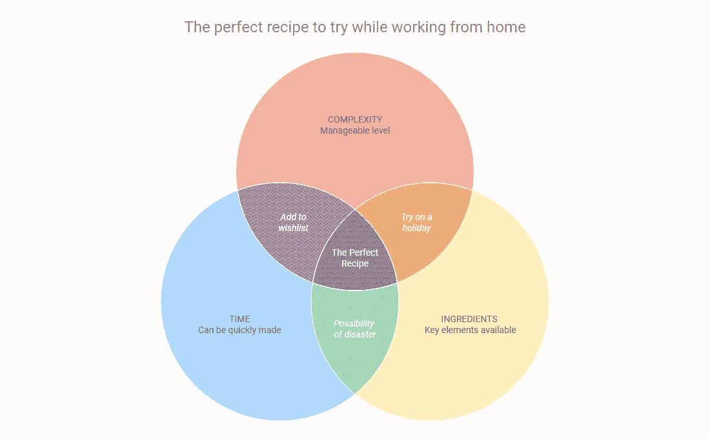

# 如何使用 JavaScript 创建维恩图

> 原文：<https://javascript.plainenglish.io/how-to-create-a-venn-diagram-using-javascript-cb769e916f14?source=collection_archive---------21----------------------->



一个**维恩图**是[数据可视化](https://www.anychart.com/blog/2018/11/20/data-visualization-definition-history-examples/)的一种形式，它使用形状，通常是圆形，来显示各组事物之间的关系。在该图表类型中，重叠区域显示共性，而不重叠的圆圈显示不共享的特征。

由英国数学家、逻辑学家和哲学家[约翰·维恩](https://en.wikipedia.org/wiki/John_Venn)提出，维恩图也被称为集合图或逻辑图，因为它们显示了不同集合的元素之间可能的逻辑关系。当绘制这样的图表时，我们很可能会处理两个或三个重叠的圆圈，因为只有一个圆圈会很无聊，而有四个或更多的圆圈会很快变得非常复杂。

这些图表不仅是概念上很好的可视化，而且它们还提供了一个很好的机会来表现定性数据和一点图形幽默。基本上，构建和使用它们既简单又有趣。我现在就给你看！

阅读本教程，了解如何在 JavaScript 的帮助下，轻松地为你的网站或应用程序创建一个视觉上吸引人、信息丰富的维恩图。教程中使用和演示的所有代码都将免费供您使用。

在冠状病毒疫情期间，由于在家工作，避免从外面吃东西，我们许多人都成了业余厨师。因此，让我们使用基于 JS 的维恩图来找出**哪种食谱最适合在工作日尝试** —这将是一个令人愉快的探索用例！

# 剧透:有待开发的文氏图

在我们开始之前，我决定激发您对很酷的数据可视化和学习体验的兴趣，并向您展示最终的交互式 JavaScript 维恩图将会是什么样子。

看看吧，跟着制图教程走！



# 基本 JS 文氏图的 4 个简单步骤

维恩图是可视化者和观众的一种享受——它们提供了巨大的价值和快速的洞察力，同时易于制作和理解。

让我们看看如何使用 JavaScript (HTML5)制作维恩图。这可能不像用不同颜色的素描笔在餐巾纸上画圈那么简单(也许是为了比较狗和猫吧！).但是相信我，当你把事情做对的时候，事情几乎就是这么简单，而且肯定更令人兴奋。

我们将从一个非常基本的文氏图开始，然后对其进行定制。

实际上，你应该遵循这 4 个步骤来构建一个漂亮的 JavaScript 图表，包括维恩图:

*   为图表创建 HTML 页面。
*   包括必要的 JavaScript 文件。
*   添加数据。
*   为图表编写 JS 代码。

## 1.创建 HTML 页面

创建一个带有块级元素的基本 HTML 页面，其中将呈现维恩图。这个 div 元素将保存图表，并被赋予一个惟一的 id 以供以后引用。

```
<!DOCTYPE html>
<html>
  <head>
    <title>JavaScript Venn Diagram</title>
    <style type="text/css">
      html,
      body,
      #container {
        width: 100%;
        height: 100%;
        margin: 0;
        padding: 0;
      }
    </style>
  </head>
  <body>  
    <div id="container"></div>
  </body>
</html>
```

容器的宽度和高度设置为 100%,以便图表填满整个屏幕。您可以根据需要设置其他值来更改图形的大小。

## 2.包括必要的 JavaScript 文件

要创建一个 JavaScript 图表，有必要链接将要用来开发它的适当的 JS 脚本。这些文件必须包含在 HTML 页面的`<head>`部分的`<script>`标签中。

请随意[选择](https://www.anychart.com/blog/2017/03/05/how-to-choose-the-right-javascript-charting-component-10-factors-you-have-to-consider/)一个 JS 库进行数据可视化，因为[有很多这样的库，而且这种方法非常通用。在本教程中，我将使用](https://en.wikipedia.org/wiki/Comparison_of_JavaScript_charting_libraries) [AnyChart](https://www.anychart.com/) 。这是一个灵活而强大的 JavaScript 图表库，使得在健壮的图表中可视化数据变得非常容易和快速，所以即使是初学者也没问题。对于维恩图，我们只需要所有图表都需要的[核心库模块](https://docs.anychart.com/Quick_Start/Modules#core)和用于创建这种特定图表类型的[专用模块](https://docs.anychart.com/Quick_Start/Modules#venn_diagram)。

您可以下载所需的脚本，并将它们添加到 HTML 页面，或者像我们在这里所做的那样，为了简单起见，包含 [CDN](https://www.anychart.com/download/cdn/?v=8.9.0) 链接。

```
<!DOCTYPE html>
<html>
  <head>
    <title>JavaScript Venn Diagram</title>
    <script src="https://cdn.anychart.com/releases/8.9.0/js/anychart-core.min.js"></script>
    <script src="https://cdn.anychart.com/releases/8.9.0/js/anychart-venn.min.js"></script>
    <style type="text/css">
      html,
      body,
      #container {
        width: 100%;
        height: 100%;
        margin: 0;
        padding: 0;
      }
    </style>
  </head>
  <body>  
    <div id="container"></div>
    <script>
 ***// All the code for the chart will come here***    </script>
  </body>
</html>
```

注意:我们在主体中添加了一个 script 标签，在这里我们将编写创建图表的代码。

## 3.添加数据

数据构成了图表，因此，它是可视化的一个重要方面。AnyChart 的一个很大的优点就是它提供了多种[添加数据](https://docs.anychart.com/Working_with_Data/Overview)的方式。在这个维恩图中，我们使用简单的数据，所以我们可以直接将数据包含到我们的页面中。

每个图表都以特定的形式呈现数据，因此确保我们以对呈现维恩图有意义的方式获得数据是很重要的。这是非常直观的，所以没有什么可怕的。

我们的数据是关于我们在选择在家工作时尝试的食谱时考虑的 3 个方面。一份完美的食谱应该具备所有三个有利的特征。

我们将考虑中的 3 个属性列为 3 个数据点，将 2 个组合的交集以及所有 3 个属性列为其他单独的数据点。

维恩图接受一组数据，所以我们也同样构造数据。

```
data = [
  {
    x: 'A',
    value: 100,
    name: 'TIME \n Can be quickly made'
  },
  {
    x: 'B',
    value: 100,
    name: 'INGREDIENTS \n Key elements available'
  },
  {
    x: 'C',
    value: 100,
    name: 'COMPLEXITY \n Manageable level'
  },
  {
    x: ['A', 'C'],
    value: 25,
    name: 'Add to \n wishlist'
  },
  {
    x: ['A', 'B'],
    value: 25,
    name: 'Possibility \n of disaster'
  },
  {
    x: ['B', 'C'],
    value: 25,
    name: 'Try on a \n holiday'
  },
  {
    x: ['A', 'B', 'C'],
    value: 25,
    name: 'The perfect \n recipe'
  }
]
```

数据点被赋予一个值来指示重叠和不重叠的数量。由于我们的数据是定性的，我们给每个重叠部分相同的值。该名称表示每个数据点的描述。描述中看到的`\n`符号是一个换行符，用于插入换行符。

## 4.为文氏图编写 JS 代码

现在一切都准备好了，我们准备好去看奇迹发生了！只需几行代码，我们就可以准备好基本的维恩图。

所有的 JavaScript 代码都放在 HTML 页面主体的`<script>`标签中。我们做的第一件事是添加一个包含所有代码的函数，确保代码只在页面准备好的时候执行。

```
<script type="text/javascript">
  anychart.onDocumentReady(function() {
 ***// All the code for drawing the chart will come here***
  });
</script>
```

接下来，我们添加数据并使用该数据创建图表。然后，我们将容器设置为引用我们之前添加的 HTML 元素，并绘制图表。

```
anychart.onDocumentReady(function () {
  var data = [{data}];

 ***// create venn diagram***  var chart = anychart.venn(data);

 ***// set container id for the chart***
  chart.container('container');

 ***// initiate chart drawing***
  chart.draw();
}
```

我们绘制了维恩图，但我们只添加了 2 行代码来给图表添加标题，并格式化标签来表示相交的数据文本而不是值，因为这对我们的主观数据更有意义。

```
***// set chart title*** chart.title('The perfect recipe to try while working from home');

***// set labels settings*** chart.labels().format('{%Name}');
```

看看结果:



在[游乐场](https://playground.anychart.com/vSHSX6Cr/)或 [CodePen](https://codepen.io/shacheeswadia/pen/XWKZPxy) 上查看这个带有完整 JS/CSS/HTML 代码的基本维恩图。

看到用 JavaScript 用这么少的几行代码就创建了一个功能齐全、美观的交互式维恩图，难道不是一件令人高兴的事情吗？

# 定制维恩图(让它更棒)

AnyChart 库提供了大量的[选项](https://docs.anychart.com/Appearance_Settings/)来调整数据可视化的外观。无论你做什么，总有改进的空间，我们肯定可以改变我们的 JS 维恩图中的一些东西，使它更有吸引力，突出某些特定的点，添加功能以更好地理解数据，或者只是打磨美学以适应我们的口味！

改变数据外观的最简单方法是尝试 AnyChart 提供的各种颜色主题。这可以简单地通过在页面的头部添加想要的主题来实现:

```
<script src="https://cdn.anychart.com/releases/8.9.0/themes/pastel.min.js"></script>
```

然后在代码中引用它:

```
***// set chart theme***
anychart.theme('pastel');
```

让我们看看本教程中的其他一些快速修改:

*   整体图表外观改进。
*   每个数据点的自定义颜色。
*   字体改变。
*   特效。

## 1.整体图表外观改进

我们将在这里和那里做一些小的改变来完善维恩图的可视化。同样，你会看到做这些改变是多么容易。

因为我们的文氏图显示了图表上的数据点文本，所以我们并不真正需要图例。

```
***// disable legend*** chart.legend(false);
```

然后，让我们在圆圈上添加一笔，使相交的区域更加突出。

```
***// set chart stroke*** chart.stroke('1 #fff');
```

并修改文本大小、样式和位置以增强标题和标签。

```
***// set chart title*** chart
  .title()
  .enabled(true)
  .fontSize(24)
  .padding({ bottom: 25 })
  .text("The perfect recipe to try while working from home");***// set labels settings*** chart
  .labels()
  .fontSize(14)
  .fontColor("#5e6469")
  .hAlign("center")
  .vAlign("center")
  .fontWeight("500")
  .format("{%Name}");***// set intersections labels settings***
chart
  .intersections()
  .labels()
  .fontStyle("italic")
  .fontColor("#fff")
  .format("{%Name}");
```

给你:


在[游乐场](https://playground.anychart.com/7g2D33GZ/)或 [CodePen](https://codepen.io/shacheeswadia/pen/RwRMXQX) 上查看这个带有完整 JS/CSS/HTML 代码的半定制维恩图。

## 2.每个数据点的自定义颜色

当我们希望每个数据点有不同的颜色时，最好的方法是给数据添加颜色属性。在 AnyChart 中，我们不仅可以指定每个区域的颜色，还可以指定悬停和选择这些区域时的颜色。

让我们向数据中添加正常、悬停和选定的属性，并指定填充颜色和不透明度。

以下是数据点 A 的示例:

```
{
  x: 'A',
  value: 100,
  name: 'TIME \n Can be quickly made',
  normal: {fill: "#8ecafb 0.7"},
  hovered: {fill: "#8ecafb 1"},
  selected: {fill: "#8ecafb 1"}
}
```

## 3.字体更改

我们可以使用现有的字体或添加[谷歌字体](https://fonts.google.com/)，就像我们在这里做的那样。我们将简单地链接我们想要在页面头部使用的 Google 字体的样式表:

```
<link href="https://fonts.googleapis.com/css2?family=Roboto:ital@0;1&display=swap" rel="stylesheet">
```

然后指定要应用字体系列:

```
***// add this in the code***
.fontFamily('Roboto, sans-serif')
```

## 4.一些特殊效果

为了给我们的 JavaScript 维恩图增添趣味，让我们在相交区域添加一个[纹理填充](https://playground.anychart.com/docs/v8/samples/AS_Background_08)并在图表工具提示中添加一些有趣的文本。

由于工具提示文本和纹理填充颜色将特定于每个数据点，我们将在数据中包括它。

以下是一个交叉点数据点的示例:

```
{
  x: ['A', 'C'],
  value: 20,
  name: 'Add to\n wishlist',
  tooltipTitle: 'Add to wishlist',
  tooltipDesc: 'Add the ingredients in the next shopping list',
  normal:   {fill: "#a98caf 0.6"},
  hovered : {fill: "#a98caf 1"},
  selected:   {fill: "#a98caf 1"},
  hatchFill:{
    type:"weave",
    color: "#8b6b92"
  }
}
```

在代码中包含以下更改:

```
***// set tooltip settings***
chart.tooltip()
  .titleFormat('{%tooltipTitle}')
  .format("{%tooltipDesc}")
  .background().fill("#000 0.5");
```

查看最终的基于 JavaScript 的交互式维恩图，以及所有这些定制！为了方便起见，它的完整代码就在嵌入式交互图形的正下方。



```
<!DOCTYPE html> 
<html>
  <head>
    <title>JavaScript Venn Diagram</title>
    <script src="https://cdn.anychart.com/releases/8.9.0/js/anychart-core.min.js"></script>
    <script src="https://cdn.anychart.com/releases/8.9.0/js/anychart-venn.min.js"></script>
    <script src="https://cdn.anychart.com/releases/8.9.0/themes/pastel.min.js"></script>
    <link href="https://fonts.googleapis.com/css2?family=Roboto:ital@0;1&display=swap" rel="stylesheet">
    <style type="text/css">
      html,
      body,
      #container {
        width: 100%;
        height: 100%;
        margin: 0;
        padding: 0;
      }
    </style>
  </head>
  <body>
    <div id="container"></div>
    <script>anychart.onDocumentReady(function () {
  ***// set chart theme***
  anychart.theme('pastel'); var data = [
    {
      x: 'A',
      value: 100,
      name: 'TIME \n Can be quickly made',
      tooltipTitle: 'TIME \n Can be quickly made',
      normal: {fill: "#8ecafb 0.7"},
      hovered: {fill: "#8ecafb 1"},
      selected: {fill: "#8ecafb 1"}
    },
    {
      x: 'B',
      value: 100,
      name: 'INGREDIENTS \n Key elements available',
      tooltipTitle: 'INGREDIENTS \n Key elements available',
      normal: {fill: "#ffeaa6 0.7"},
      hovered: {fill: "#ffeaa6 1"},
      selected: {fill: "#ffeaa6 1"}
    },
    {
      x: 'C',
      alue: 100,
      name: 'COMPLEXITY \n Manageable level',
      tooltipTitle: 'COMPLEXITY \n Manageable level',
      normal: {fill: "#ee957f 0.7"},
      hovered: {fill: "#ee957f 1"},
      selected: {fill: "#ee957f 1"}
    },
    {
      x: ['A', 'C'],
      value: 20,
      name: 'Add to \n wishlist',
      tooltipTitle: 'Add to wishlist',
      tooltipDesc: 'Add the ingredients in the next shopping list',
      normal: {fill: "#a98caf 0.6"},
      hovered: {fill: "#a98caf 1"},
      selected: {fill: "#a98caf 1"},
      hatchFill: {
        type:"weave",
        color: "#8b6b92"
      }
    },
    {
      x: ['A', 'B'],
      value: 20,
      name: 'Possibility \n of disaster',
      tooltipTitle: 'Possibility of disaster',
      tooltipDesc: 'Keep a backup ready',
      normal: {fill: "#9fdebe 0.8"},
      hovered: {fill: "#9fdebe 1"},
      selected: {fill: "#9fdebe 1"},
      hatchFill: {
        type:"weave",
        color: "#83c3a3"
      }    
    },
    {
      x: ['B', 'C'],
      value: 20,
      name: 'Try on a \n holiday',
      tooltipTitle: 'Try on a holiday',
      tooltipDesc: 'When there is no other work pending',
      normal: {fill: "#f5b57c 0.8"},
      hovered: {fill: "#f5b57c 1"},
      selected: {fill: "#f5b57c 1"},
      hatchFill: {
        type:"weave",
        color: "#d09259"
      }
    },
    {
      x: ['A', 'B', 'C'],
      value: 30,
      name: 'The Perfect \n Recipe',
      tooltipTitle: 'The Perfect Recipe',
      tooltipDesc: 'Easy to follow and fast to cook with whatever is in the kitchen',
      label: {enabled:true, fontStyle: 'normal'},
      normal: {fill: "#8392ab 0.9"},
      hovered: {fill: "#8392ab 1"},
      selected: {fill: "#8392ab 1"},
      hatchFill: {
        type:"percent40",
        color: "#5f6b7d"
      }
    }
  ]; ***// create venn diagram***
  var chart = anychart.venn(data); ***// set chart title***
  chart
    .title()
    .enabled(true)
    .fontFamily('Roboto, sans-serif')
    .fontSize(24)
    .padding({ bottom: 30 })
    .text('The Perfect Recipe to try while working from home'); ***// set chart stroke***
  chart.stroke('1 #fff'); ***// set labels settings***
  chart
    .labels()
    .fontSize(16)
    .fontColor('#5e6469')
    .hAlign("center")
    .vAlign("center")
    .fontFamily('Roboto, sans-serif')
    .fontWeight('500')
    .format('{%Name}'); ***// set intersections labels settings***
  chart
    .intersections()
    .labels()
    .fontStyle('italic')
    .fontColor('#fff')
    .format('{%Name}'); ***// disable legend***
  chart.legend(false); ***// set tooltip settings***
  chart
    .tooltip()
    .titleFormat('{%tooltipTitle}')
    .format("{%tooltipDesc}")
    .background().fill("#000 0.5"); ***// set container id for the chart***
  chart.container('container'); ***// initiate chart drawing***
  chart.draw();
}); </script>
  </body>
</html>
```

在[游乐场](https://playground.anychart.com/iwo0Qjyy/)或 [CodePen](https://codepen.io/shacheeswadia/pen/KKMoaed) 上查看这个定制的维恩图，其中有完整的 JS/CSS/HTML 代码。

# 结论

本教程向您展示了如何快速制作一个维恩图，并通过各种改进使其更具吸引力。你可以尝试颜色、图案和其他可能的定制选项。要了解更多关于作为图表类型的文氏图，请参见[在 Chartopedia](https://www.anychart.com/chartopedia/chart-type/venn-diagram/) 上的简介。

一些 HTML 和 JavaScript 的工作知识总是很有帮助的。但是正如我们所看到的，使用一个健壮的 JavaScript 图表库创建可视化效果是如此简单，即使没有任何技术知识，也可以轻松地制作出有用且漂亮的交互式图表。此外，AnyChart 最大的特点是有大量的[文档](https://docs.anychart.com)和其他[资源](https://www.anychart.com/products/anychart/docs/)来帮助轻松创建和定制可视化效果。

我们 AnyChart 很高兴感谢经验丰富的数据设计师 Shachee Swadia 创建了这个令人惊叹的教程。

*如果你想为我们的博客写一篇引人注目的客座博文，请联系*[](https://www.anychart.com/support/)**。**

**要继续学习和练习数据可视化，请查看其他的* [*JavaScript 图表教程*](https://www.anychart.com/blog/category/javascript-chart-tutorials/) *并查看* [*您可以构建的图表的完整列表*](https://docs.anychart.com/Quick_Start/Supported_Charts_Types) *和* [*主要特性*](https://www.anychart.com/features/) *您可以使用 AnyChart。然后，以一种快速而轻松的方式，享受创建令人惊叹的可视化效果的乐趣。**

**原载于 2020 年 11 月 11 日*[*https://www.anychart.com*](https://www.anychart.com/blog/2020/11/11/venn-diagram-javascript/)*。**