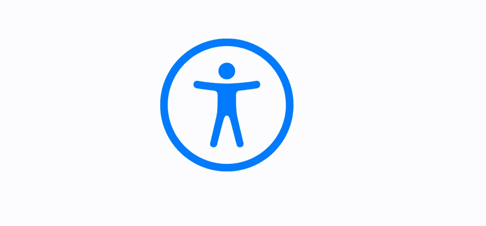
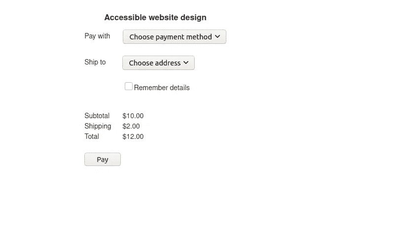
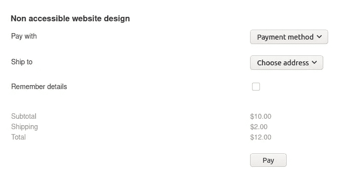

# 如何创建可访问的网站

> 原文：<https://javascript.plainenglish.io/how-to-create-accessible-websites-7e1a661990df?source=collection_archive---------12----------------------->

## 关于如何创建适合残障人士的应用程序的指南



拥有独特身体和/或精神能力的人广泛使用网络。

在本指南中，我将带您了解一些步骤，让您的角度应用更容易被广大人群使用，无论他们有什么障碍。

当一个网站的内容可以容纳所有用户，并且几乎可以由任何人操作时，这个网站就被称为是可访问的。

在创建网站时，重要的是要认识到并非所有用户都有相同的使用鼠标或触摸屏的权限或能力。

# 关键指南

《网页内容无障碍指南》(WCAG)概述了应构成无障碍网站基础的一些基本原则。

这些指导原则通常使用缩写词 POUR，如下所示:

*   可感知-网页内容应该是用户可感知的。确保你有以下感觉:视觉、听觉和/或触觉。必要时使用带有`alt`属性的替代文本。确保表单输入有关联的标签。和元素必须是可区分的。
*   可操作性——确保网站的形式、控件和导航对所有人都是可操作的，不管一个人的能力如何。所有的功能都应该可以通过键盘操作。
*   易于理解——为了易于理解，要保证网页的一致性。例如，所有的元素都应该在所有的页面上使用。通过在表单完成和提交过程中提供提示来帮助用户。
*   健壮——Web 内容应该与辅助技术配合得很好，应该能够被各种各样的用户代理使用

关于可访问性指南的进一步阅读，请看网页内容可访问性指南清单[这里](https://webaim.org/standards/wcag/checklist)

# 设计

你的网站设计应该考虑到可访问性。可访问性不应该是事后的想法！

设计网站时需要考虑的一些事情有

*   除非另有说明，否则网页内容的方向不应仅限于纵向或横向。
*   不要对文本使用低对比度的颜色，因为弱视的人很难阅读。
*   关联标签和输入字段。当标签和相应的输入字段相距很远时，用户关联和映射它们的关系可能会有问题。或者使用缩放功能。

> *避免设计可能导致癫痫发作和身体反应的内容。* ***不*** *页面内容应该每秒钟闪烁三次以上！*

关联良好的元素使使用屏幕阅读器的人更容易理解这种关联。

下图是一个无障碍设计的好例子。用户可以容易地关联内容，并且颜色对比度足够好。



相反，下面的网站是不容易访问的。输入和标签很难关联，因为它们放置得相距很远。对于需要在缩放模式下使用页面的用户来说，情况变得更糟。

考虑复选框及其相应的标签。

此外，分类汇总的文本颜色对比度很低，使得弱视用户难以阅读。



# 使用语义元素

使用语义 HTML 元素有很多好处，其中最重要的是它提高了可访问性。

*   使用像`nav`、`footer`、`article`这样的显式元素标签，而不是仅仅使用`div`。
*   尽可能使用描述性属性。例如，总是对图像使用`alt`属性。
*   为视频和音频媒体内容添加标题。
*   使用语言属性，例如`<html lang=”en”>`来标识网站的主要语言。如果有些内容是用另一种语言写的，要明确，例如`<blockquote lang=”es”>`

# 使用 ARIA 属性

`aria`属性是一个可访问性特定的属性。

使用`aria`属性在可能缺少语义的地方提供语义，或者创建小部件类型的元素，这在普通 HTML 中是不可能的。

例如，您可以使用`aria`属性添加额外的标签和描述文本，这些文本只对辅助技术 API 公开，如下所示。

```
<button aria-label="screen reader only label"></button>
```

您还可以使用`aria`属性通知屏幕阅读器一些事情。例如，默认情况下使用`aria-checked` 选中一个复选框，或者通过如下方式指定`role`属性使该控件成为一个复选框。

```
<input type="checkbox" tabindex="0" role="checkbox" checked aria-checked="false">
```

如果使用像 Angular 这样的框架，他们有时会用特定于框架的方式来设置某些标签。例如，在 Angular 中，当绑定到 Angular 中的 aria 属性时，我们使用`attr.`前缀，如下所示。

```
<button [attr.aria-label]="myActionLabel"> </button>
```

# 最后的想法

使用像 Angular 这样的成熟框架是一个很好的起点，因为它们包含了很多可访问性特性。此外，您可以使用来自角形材料和材料设计原则的组件。

成为为每个人创造网络的一份子。在您的设计过程中包含可访问性。