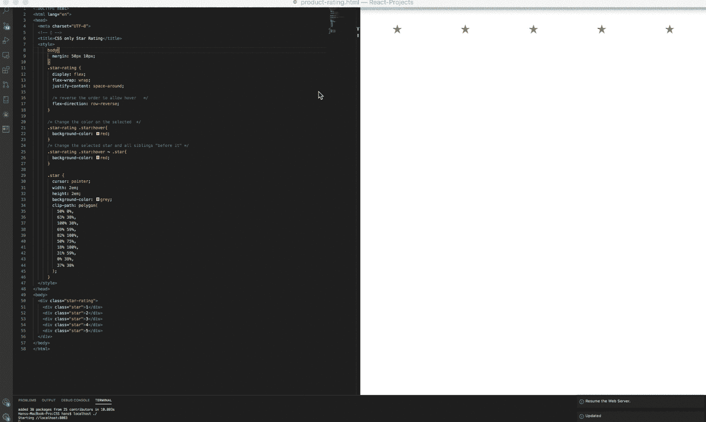

# 如何只用 CSS 创建动画星级:

> 原文：<https://javascript.plainenglish.io/how-to-create-an-animated-star-rating-with-just-css-4df50286ea4b?source=collection_archive---------2----------------------->

## 使用前一个同级 CSS“Hack”

## [学习如何在 2020 年](https://medium.com/@HansOnConsult/learn-how-to-code-in-2020-52bed38a2987)系列中编码

今天，我将介绍一个简单但功能惊人的方法，使用**以前的子选择器 CSS“Hack”**来构建一个星级组件。

## 那么我们如何只用 CSS 构建一个星级组件呢？

继续向下滚动查找，同时，我想提供一些关于这篇文章的背景知识…

```
Beware. 
There will be “humor”. It may or may not be taken out later...This article is part of an ongoing educational series that will be [turned into an Open Source Book](https://medium.com/@HansOnConsult/learn-how-to-code-in-2020-52bed38a2987) and therefore is considered a "**living article**" subject to change. If you have question, want to contribute or just wanna chat about the content, **leave a comment**!**If you have a find a bug, typo, DM me on twitter** [**@HansOnConsult**](https://twitter.com/HansOnConsult) **or contribute** directly to this book by submitting an issue: 
[https://github.com/HansUXdev/OSS-Books](https://github.com/HansUXdev/OSS-Books)
```



## **好了，伙计们，我写了一些代码，在代码评论里写了一段描述，还做了一个 gif…**

**我开玩笑的**，我是什么 JavaScript 老师？用简单的英语来说，我们在[做得比这更好……所以让我们开始吧:](https://plainenglish.io/)

# 这怎么是 CSS“黑”？

不，这不是一种违反计算机欺诈法案的黑客行为。这是违法的，我们是守法公民。

> 这只是一种创造性的解决问题的方法，通过将问题完全颠倒过来，做与需求完全相反的事情，然后将我们的谎言完美地呈现给用户，因为对他们来说你是如何做到的并不重要。

> 如果这不是一个 CSS“黑”，它肯定是一个神奇的明星...

# 仅 CSS 的星级评定:

让我们根据项目需求和可用的 CSS 选择器&组合子来分解它，看看这是否可能。

> 剧透一下，我们**欺骗**……这就是为什么它是“黑客”。

## 那么一个星级的 ***要求*** 到底是什么呢？

一般来说，当你看到这个编码挑战时，它是这样的:

评级组件由 5 颗星组成，每颗星由一个元素表示，保存在父容器中。

1.  当星形元素被点击或者在这种情况下被悬停时，星形应该被改变为“活动”颜色，并且所有在之前开始的*应该被更新以做同样的事情。*
2.  此外,后的星星*不应有活动颜色。*

**用 CSS 选择器解决问题，显示类型&组合器**

CSS 不是一种编程语言，它是一种"[样式表语言](https://en.wikipedia.org/wiki/Style_sheet_language)，用于描述用[标记语言](https://en.wikipedia.org/wiki/Markup_language)如 [HTML](https://en.wikipedia.org/wiki/HTML) 编写的文档的[表示方式](https://en.wikipedia.org/wiki/Presentation_semantics)。

> 换句话说，我们不能告诉*浏览器* **做什么**。
> 相反，我们只能**告诉浏览器如何呈现标记。**

使用类似于`[:hover](https://developer.mozilla.org/en-US/docs/Web/CSS/:hover)`、`[:focus](https://developer.mozilla.org/en-US/docs/Web/CSS/:focus)`、`[:focus-within](https://developer.mozilla.org/en-US/docs/Web/CSS/:focus-within)`和`[:checked](https://developer.mozilla.org/en-US/docs/Web/CSS/:checked)`的伪选择器，我们可以**模仿**点击和触摸文档对象模型(DOM)中的元素的行为，或者更简单地说，模仿呈现的 HTML。

> 很好，我们可以很容易地完成第二个要求。
> 但是需求 1 呢？
> 嗯……这就是为什么我们必须“欺骗”，因为没有办法真正定位到**前一个兄弟节点，**我们只能以*级联*的方式定位到父容器、子容器和它们的亲属。
> 
> 这就是为什么它被称为 [**层叠**](https://www.synonym.com/synonyms/cascade#:~:text=k%C3%A6%CB%88ske%C9%AAd)%20Rush%20down%20in%20big,rise%20ascend%20lengthen%20accelerate%20strengthen) 样式表，而不是上升样式表。
> 这也意味着我们在技术上无法完成其中任何一个，但我们可以做与这两个完全相反的事情，并**呈现它**，就好像我们实际上正在完成它们一样……所以，是的，这肯定是作弊，而且会很有趣，希望能让你更欣赏 CSS。

**重写 CSS 规则的要求**

1.  当星形元素被悬停时，星形应变为“活动”颜色，并且所有在之后开始的*应被更新以做同样的事情。*
2.  此外，在之前的星星*想要的等级不能被设计，所以我们抛出一个幼稚的配合，把这该死的东西翻过来，颠倒顺序。*
3.  对用户(和读者)撒谎，说这是一个前子选择器

因为我们可以“描述一个文档的[表示](https://en.wikipedia.org/wiki/Presentation_semantics)，
包括我们如何表示元素的**顺序。**

有几种方法可以做到这一点，但我只打算介绍其中的两种，第二种是反模式，您应该避免使用它。它仅用于手动*，演示描述正在发生的事情的另一种方式。*

***选项 1:显示 Flex&Flex-direction**
因为我想将其显示为一行，所以我们将`[flex-direction: row-reverse;](https://css-tricks.com/grid-content-re-ordering-and-accessibility/)`应用到`.star-rating`的类中，以反转每个子元素的顺序。*

> *DOM 不会改变。我们只是改变了我们呈现它的方式。*

*所以够了我们的文档，或者说 **HTML 是这样写的:***

```
*<div class="star-rating">
  <div class="star star-1"></div>
  <div class="star star-2"></div>
  <div class="star star-3"></div>
  <div class="star star-4"></div>
  <div class="star star-5"></div>
</div>*
```

*应用在`.star-rating`类中的 CSS 将反转每个 div 的顺序。
。
**然后我们再改变星星的颜色。***

*为此，我将使用`:hover`来改变选中星星的颜色，我们将使用 CSS [通用兄弟组合符](https://developer.mozilla.org/en-US/docs/Web/CSS/General_sibling_combinator) `~`而不是[相邻兄弟组合符](https://developer.mozilla.org/en-US/docs/Web/CSS/Adjacent_sibling_combinator)，`+`。如果我们使用相邻组合子，我们必须写:*

```
*.star-rating .star:hover,      // the selected star
.star-rating .star:hover+.star, // the sibling after it
.star-rating .star:hover+.star+.star, // and so on
.star-rating .star:hover+.star+.star+.star, // and so on
.star-rating .star:hover+.star+.star+.star+.star, // and so on
.star-rating .star:hover+.star+.star+.star+star+.star // and so on..
{
  background-color: red;
}*
```

*打字太多了，我手里有一个盘子和 8 个螺丝，所以打字很疼。
再加上它只是糟糕的 CSS，所以取而代之，我们将简单地编写以下内容:*

```
*.star-rating .star:hover,
.star-rating .star:hover ~ .star{
  background-color: red;
}*
```

*那就简单多了。*

> *但重要的是要记住，我们并不是真的设计前面的兄弟姐妹，我们是在我们选择的明星之后设计兄弟姐妹，只是颠倒了它呈现给用户的方式。*

> *这就是为什么这是一个 CSS 黑客*

*选项 2:使用 SCSS、网格、网格区域和网格模板
因为我们已经在作弊了，YOLO，让我们使用编译成 CSS 的 SCSS。请不要在生产中使用这样的代码。这只是用另一种更具语义的方式来描述如何以相反的顺序呈现星星。*

*因为我很懒，所以我将使用 SCSS 提供一些实际的编程特性来生成我的最终用户 CSS。*

```
*// DO USE THIS IN CSS, it wont work because it's SCSS.
[@for](http://twitter.com/for) $i from 1 through 5 {
    .star-#{$i} {
      grid-area: star-#{$i} ;
    }
}*
```

*这符合以下 CSS 要求:*

```
*.star-1 {grid-area: star-1;}
.star-2 {grid-area: star-2;}
.star-3 {grid-area: star-3;}
.star-4 {grid-area: star-4;}
.star-5 {grid-area: star-5;}*
```

*我们有 5 个无用的类来描述每颗星星的面积，我们将使用 grid-template 手动重新排列它们*

```
*.star-rating-grid {
  display: grid;
**/* This is what flex-direction: row-reverse is doing */
  grid-template: 
  'star-5 ... star-4  ... star-3  ... star-2  ... star-1';**
}*
```

*用 CSS 作弊很有趣，另一方面，用 [react](https://github.com/HansUXdev/React-Projects/tree/master/hooks/src/useState/ProductRating) 正确地作弊也很有趣，更实用*

## *高级用例:SCSS Mixin*

*如果你对 CSS 有点陌生，我建议你跳过这一部分，直到你学会 SCSS。对于那些更大胆、更好奇或更有经验的人，我做了一个有趣的小组合供你们使用。
你也可以删除:hover 部分。*

```
*[@mixin](http://twitter.com/mixin) previousSibling($parent, $child, $sibling) {
  #{$parent} {
    display: flex;
    flex-direction: row-reverse;
    #{$child}**:hove**r ~ #{$sibling }{
      [@content](http://twitter.com/content);
    }
  }
}[@include](http://twitter.com/include) previousSibling(".star-rating", ".star", "*") {
  // Do something
  background-color: red;
}*
```

## *教育资源:*

1.  *星级评定方法:【https://css-tricks.com/five-methods-for-five-star-ratings/ *
2.  *[有没有以前的兄弟姐妹组合？](https://stackoverflow.com/questions/1817792/is-there-a-previous-sibling-selector)*
3.  *[弯曲方向](https://developer.mozilla.org/en-US/docs/Web/CSS/flex-direction):*
4.  *[相邻兄弟组合子](https://developer.mozilla.org/en-US/docs/Web/CSS/Adjacent_sibling_combinator)*
5.  *[通用兄弟组合子](https://developer.mozilla.org/en-US/docs/Web/CSS/General_sibling_combinator)*

# *普通英语 JavaScript(JSIPE)*

*喜欢这篇文章吗？如果有，通过 [**订阅我们的 YouTube 频道**](https://www.youtube.com/channel/UCtipWUghju290NWcn8jhyAw) **获取更多类似内容！JSIPE 拥有一些来自世界各地的真正令人惊叹的程序员和作者。所以考虑跟着出版。***

## *接下来*

*如果你喜欢读这篇文章，可以看看这个系列的其他文章。*

*在本文中，您将了解更多关于 JavaScript 的历史或者它与 Deno 的可能未来。考虑阅读这篇文章。或者跳过它，直接进入学习。*

*[](https://medium.com/javascript-in-plain-english/a-brief-history-of-javascript-9289a4d344d2) [## JavaScript 简史

### es、Deno 和 TypeScript 的过去、现在和可能的未来

medium.com](https://medium.com/javascript-in-plain-english/a-brief-history-of-javascript-9289a4d344d2) 

做好准备，通过学习终端安装 nvm，一路谷歌东西，感觉自己像个黑客。在下一篇文章中，我们将详细讨论这一点。

[](https://medium.com/swlh/terminal-basics-and-installing-nvm-node-js-631cf9476ac4) [## 终端基础知识和安装 NVM 和节点。射流研究…

### 2020 年学习如何编码

medium.com](https://medium.com/swlh/terminal-basics-and-installing-nvm-node-js-631cf9476ac4) 

## 潜入 JavaScript 的海洋而不被淹没…

您将深入了解该语言以及理解变量、数据类型和不变性所需的一切。这是一篇 14 分钟的阅读材料，内容丰富，所以我强烈建议你去看看。

[](https://medium.com/javascript-in-plain-english/what-do-you-really-know-about-variables-data-types-and-immutability-in-javascript-1730835a9e87) [## 你对 Javascript 中的变量、数据类型和不变性真正了解多少？

### 了解如何在 2020 年编码:第 2 部分

medium.com](https://medium.com/javascript-in-plain-english/what-do-you-really-know-about-variables-data-types-and-immutability-in-javascript-1730835a9e87) 

# 为什么你应该注册成为灵媒会员？

首先，也是最重要的，它鼓励像我这样的技术作家写更多的内容。**第二个**，我用写作的被动收入来给我的老姐。所以每一分钱都是为了他的未来。

也就是说，如果你买得起网飞，你可能也买得起一个 5 美元的中型账户，所以请考虑让 T2 注册一个付费账户，发展整个中型社区。

# 关于作者

Brett“Hans”McMurdy 是一名自学成才的开发人员，在前端、后端以及两者之间的几个主要领域拥有 6 年多的经验。


他目前是一名全职爸爸，正在寻找一份全职工作，如果你对[雇佣他感兴趣，可以看看他的 Linkedin。](https://www.linkedin.com/in/brett-hans-mcmurdy/)

与此同时，他正在从事一些很酷的开源项目，这应该会让你考虑[资助他](https://github.com/sponsors/HansUXdev/)。

1.他正在写一本关于 JavaScript 的开源书籍，用 node.js 而不是浏览器来教授这门语言。这也是一个由 GitPod 驱动的远程开发环境，因此您不需要一台昂贵的计算机，只需打开书本，在一个预配置的环境中开始学习。

2.他正在创建一些简单但强大的 [vscode 扩展](https://marketplace.visualstudio.com/publishers/HansUXdev)。

3.他想在 Twitch 上推出一个 [**免费**职业，当他的追随者达到 50 人的时候。](https://www.twitch.tv/hansoncoding)*