# 如何用 Angular 和 Firebase 创建一个电子商务应用程序:第 1 部分

> 原文：<https://javascript.plainenglish.io/how-to-create-an-app-using-angular-and-firebase-part-1-debb80f928ad?source=collection_archive---------0----------------------->

## 如何使用 Angular 和 Firebase 创建电子商务 web 应用程序

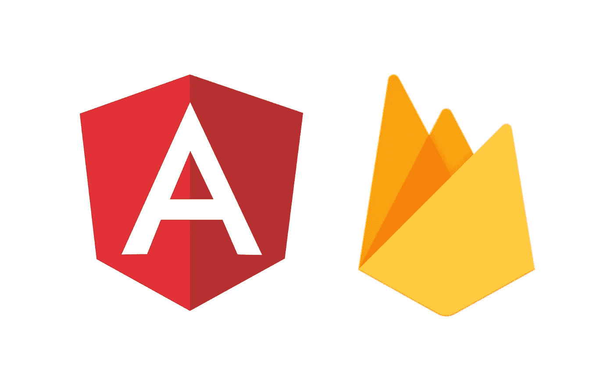

# 您需要什么:

*   **Node.js**
*   **NPM**

如果你安装了这两个，那就太好了。如果没有，访问[https://nodejs.org/en/](https://nodejs.org/en/)并安装 Node(默认包含 npm，所以不需要分别安装两者)。

*   **Angular CLI(命令行界面)。**

安装节点和 npm 后，您将能够通过在终端/命令行中运行以下命令来安装 Angular CLI:

```
**npm i -g @angular/cli**
```

确保你得到它的最新版本。点击了解更多关于 Angular CLI [的信息。](https://cli.angular.io/)

*   **JavaScript/TypeScript 基础。**
*   **引导基础知识。**

## 我需要知道 TypeScript 吗？

**使用带**角度**的打字稿**提供无缝体验。然而，您仍然可以在您的 TypeScript 文件中编写普通的 JavaScript，它们将正常工作。

现在我们已经准备好了环境，让我们继续。

# 我们开始吧

Angular CLI 用于生成组件、服务、管道、路由和指令。

使用以下命令创建新的角度应用类型:

```
ng new ngCart --routing
```

这里`ngCart`是我们的应用程序的名称，上面的命令将创建一个名为`ngCart`的文件夹，并为我们创建所有必要的文件。

`--routing`标志用于生成 **app-routing.module.ts** 文件，该文件将包含所有关于路线的信息。

> **”。ts"** 是用于类型脚本文件的扩展名。

# 这是我们运行上述命令后得到的文件结构

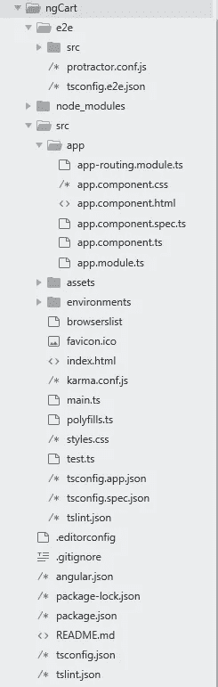

别慌，我知道有很多文件。但是我们大部分时间将在 **src/app/** 目录下工作。

**app.component.css** 将包含 **app** 组件的所有 css。

**app.component.html**将包含**应用**组件的所有 HTML。

**app.component.ts** 将包含与 **app** 组件相关的所有逻辑。

**app.module.ts** 将负责我们应用中使用的所有**包**。

为了获得更好的外观，我们将使用 Bootstrap 4。在`</head>`之前的`index.html`文件中包含 CSS 的[引导](https://getbootstrap.com/docs/4.0/getting-started/download/) CDN

```
<link rel="stylesheet" href="https://maxcdn.bootstrapcdn.com/bootstrap/4.0.0/css/bootstrap.min.css" integrity="sha384-Gn5384xqQ1aoWXA+058RXPxPg6fy4IWvTNh0E263XmFcJlSAwiGgFAW/dAiS6JXm" crossorigin="anonymous">
```

在`</body>`之前的 index.html 文件中包含 [Bootstrap](https://getbootstrap.com/docs/4.0/getting-started/download/) CDN for JS

```
<script src="https://code.jquery.com/jquery-3.2.1.slim.min.js" integrity="sha384-KJ3o2DKtIkvYIK3UENzmM7KCkRr/rE9/Qpg6aAZGJwFDMVNA/GpGFF93hXpG5KkN" crossorigin="anonymous"></script><script src="https://cdnjs.cloudflare.com/ajax/libs/popper.js/1.12.9/umd/popper.min.js" integrity="sha384-ApNbgh9B+Y1QKtv3Rn7W3mgPxhU9K/ScQsAP7hUibX39j7fakFPskvXusvfa0b4Q" crossorigin="anonymous"></script><script src="https://maxcdn.bootstrapcdn.com/bootstrap/4.0.0/js/bootstrap.min.js" integrity="sha384-JZR6Spejh4U02d8jOt6vLEHfe/JQGiRRSQQxSfFWpi1MquVdAyjUar5+76PVCmYl" crossorigin="anonymous"></script>
```

现在进入你的应用程序的根目录，输入下面的命令来运行你的应用程序。

```
ng serve -o
```

“ **- o** ”标志在浏览器中打开我们的应用程序。

# 到目前为止，我们的应用程序看起来像这样

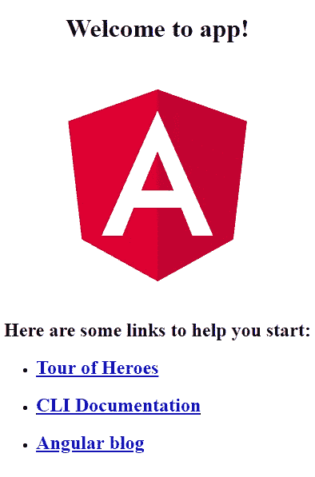

如果你在浏览器中看到类似这样的东西，那么恭喜你刚刚创建了一个 angular 应用程序。

但这不是我们想要的。

因此，让我们制作一些项目所需的组件。

# 首先，我们需要创建以下文件结构

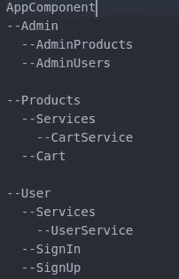

Component structure

# 执行以下命令来生成组件。

确保您位于应用程序的根(/ngCart)文件夹中

```
ng generate component Admin
```

此命令将生成 4 个文件，并将更新“app.module.ts”文件

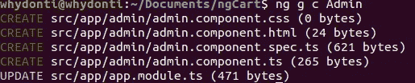

ng g c component

要生成子组件，进入父组件的文件夹并运行如下所示的命令。

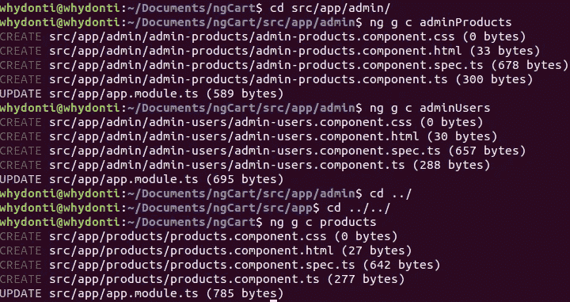

现在我们还将生成**服务**文件夹，在其中我们将使用下面的命令生成‘cart-service’。

```
ng generage service cart
```

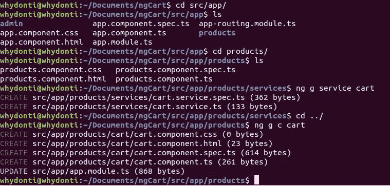

现在生成用户组件，如下图所示。

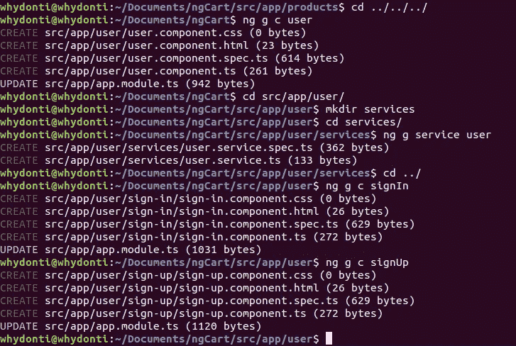

现在我们已经完成了组件的生成，让我们将它们导入到 **app.module.ts** 文件中。如我们所见，Angular CLI 已经为我们导入了所有组件，因此我们只需要导入服务。

不要忘记在`providers`数组中包含服务名。

现在让我们制作一些路线，为此我们需要更新 **app-routing.module.ts** 。将 **app.module.ts** 文件中所有组件的导入语句复制到 **app-routing.module.ts** 文件中即可。

```
import { AppComponent } from ‘./app.component’;
import { AdminComponent } from ‘./admin/admin.component’;
import { AdminProductsComponent } from ‘./admin/admin-products/admin-products.component’;
import { AdminUsersComponent } from ‘./admin/admin-users/admin-users.component’;
import { ProductsComponent } from ‘./products/products.component’;
import { CartComponent } from ‘./products/cart/cart.component’;
import { UserComponent } from ‘./user/user.component’;
import { SignInComponent } from ‘./user/sign-in/sign-in.component’;
import { SignUpComponent } from ‘./user/sign-up/sign-up.component’;
```

将下面的代码粘贴在`@NgModule`关键字之前。

```
const routes: Routes = [{ path: '', component: UserComponent},
 { path: 'user', component: UserComponent,
     children: [
       { path: '', component: SignInComponent },
       { path: 'signin', component: SignInComponent},
       { path: 'signup', component: SignUpComponent}
     ]
 },
 { path: 'products', component: ProductsComponent,
  children: [
       { path: 'cart', component: CartComponent }     ]
 },
 { path: 'admin', component: AdminComponent,
  children: [
       { path: 'products', component: AdminProductsComponent },
       { path: 'users', component: AdminUsersComponent }
     ]
 }];
```

上面的代码设置了我们所有的路由。

这里的父组件是 UserComponent、ProductsComponent 和 AdminComponent。

所以编辑**user.component.html、products.component.html 和 admin.component.html**文件，并**追加**下面的代码。

```
<router-outlet></router-outlet>
```

另外，编辑【app.component.html ，删除所有代码，粘贴下面的代码。

```
<router-outlet></router-outlet>
```

现在，我们终于完成了创建应用程序所需的所有设置。

因此，让我们尝试从我们的应用程序中访问一些路线。

只需在 CMD 或终端中键入以下命令。

```
ng serve -o
```

您的浏览器窗口将会打开，您将会看到类似这样的内容。

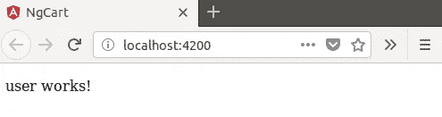

继续尝试您的所有路线 URL，看看是否一切都设置好了。如果是这样，您应该能够看到每条路线的以下内容:

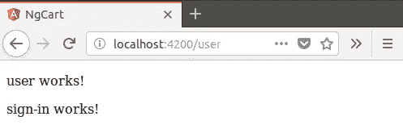

/user

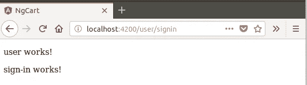

/user/signin

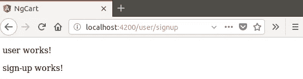

/user/signup

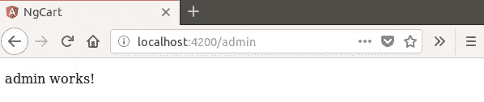

/admin

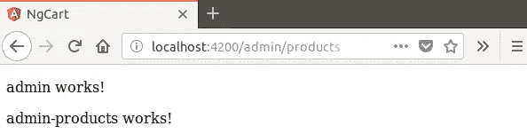

/admin/products

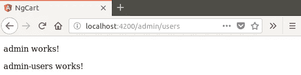

/admin/users

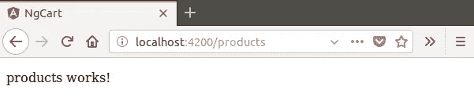

/products


/cart

## 我们做到了！

我们已经建立了一个新的 Angular 应用程序，并创建了初始文件结构和路由。在下一部分，我们将通过连接到 Firebase 来增强我们的 Angular 应用程序。

编码快乐！

## 感谢您的关注。让我知道你的想法，如果你有任何问题，请随时联系我👍