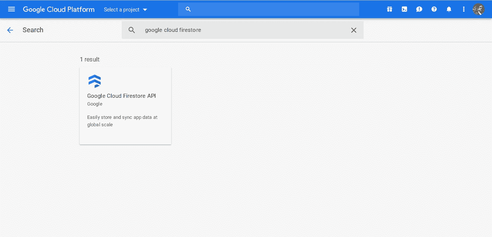

# 如何用 Angular 和 Firebase 创建一个电子商务应用程序:第 2 部分

> 原文：<https://javascript.plainenglish.io/how-to-create-an-app-with-firebase-and-angular-part-2-79063adebab9?source=collection_archive---------0----------------------->

## 如何用 Angular 和 Firebase (Cloud Firestore)创建电子商务 web app

第一部分:[https://medium . com/JavaScript-in-plain-English/how-to-create-a-app-using-angular-and-firebase-part-1-debb 80 f 928 ad](https://medium.com/javascript-in-plain-english/how-to-create-an-app-using-angular-and-firebase-part-1-debb80f928ad)

第二部分:

在这一部分，我们将把我们的应用程序与我们的数据库 Firebase Cloud Firestore 连接起来。


Firebase Cloud Firestore + Angular

【console.firebase.google.com】到上手只需将头伸向[T5](http://console.firebase.google.com)**用你的谷歌凭证登录。**

**在 Firebase 控制台上创建一个新的 Firebase 应用程序，点击“添加项目”并为您的项目键入任何合适的名称。我要把它命名为“ngCart”。**

****

**Click on Add Project button.**

**这就是我们如何得到一个 Firebase 应用程序。**

**现在访问 [Google Cloud 控制台](http://console.cloud.google.com/apis/library)并选择将 Google Cloud Firestore API 添加到库中的项目。**

****

**search for API**

**为我们创建的项目点击 enable **API** 。**

**通过单击“创建凭据”按钮获取凭据。**

****

**Create Credentials**

**它会询问您使用的是哪种 API**

**从下拉列表中选择 Cloud Firestore API，我们不需要任何特殊凭据，默认凭据将为我们工作。**

****

**Add Credentials**

**现在前往 **Firebase 控制台**->-**数据库**并点击 **Cloud Firestore。****

****

****点击创建数据库**->-**在测试模式下启动**->-**启用****

****

**Enable rules**

**这样，我们就完成了数据库的创建，并准备好将我们的应用程序与我们一直在设置的数据库连接起来。**

**点击 **Firebase** 控制台左上角的**项目概述****

**点击**/>/**图标。**

**复制那些花括号里的内容。**

**在任何代码编辑器中打开**' src/environments/environment . ts '**文件。**

**您的 **environment.ts** 文件应该是这样的，**

```
//src/environments/environment.tsexport const environment = {
  production: false,
  firebase: {
   apiKey: "*****************************************",
    authDomain: "app-***.firebaseapp.com",
    databaseURL: "[https://*********.firebaseio.com](https://ngcart-58f8b.firebaseio.com)",
    projectId: "[*********](https://ngcart-58f8b.firebaseio.com)",
    storageBucket: "[*********](https://ngcart-58f8b.firebaseio.com).appspot.com",
    messagingSenderId: "[*********](https://ngcart-58f8b.firebaseio.com)"
  }
};
```

**在 **app.module.ts** 中导入 **environment.ts** 文件，在所有导入完成后添加下面一行即可**

```
import { environment } from '../environments/environment';
```

**现在让我们导入 Firebase/Cloud Firestore 的 Angular 库附带的模块。在应用程序的父目录中运行下面的命令。**

```
npm install [@angular/fire](http://twitter.com/angular/fire) firebase --save
```

**在 **'app.module.ts'** 文件中导入以下模块**

```
//app.module.ts
import { AngularFireModule } from '[@angular/fire](http://twitter.com/angular/fire)';
import { AngularFirestore } from '[@angular/fire](http://twitter.com/angular/fire)/firestore';
import { AngularFirestoreModule } from '[@angular/fire](http://twitter.com/angular/fire)/firestore';
```

**在 **'app.module.ts'** 文件中追加**导入**数组**

```
//app.module.ts
imports: [
    BrowserModule,
    HttpClientModule,
    AppRoutingModule,
    AngularFireModule.initializeApp(environment.firebase),
    AngularFirestoreModule
  ],
```

**最后，我们完成了数据库与应用程序的连接。**

**让我们添加一些数据到我们的数据库，以便我们可以获取。**

**进入你的 **Firebase 控制台**->-**数据库**->-**添加收藏****

**并键入您的收藏的名称作为项目，因为我们正在建立像应用程序一样的电子商务，我们将需要项目列表。**

****

**Add Collection**

**创建一些随机数据来处理，如下所示**

****

**现在，我们将修改我们的**'/src/app/products/products . component . ts '**，并导入 observable 和代码以从数据库中获取数据。**

**数据将作为一个可观察对象返回，因此我们需要创建一个可观察对象' items: Observable <any>'，它的数据类型是' any ',因此它可以有任何类型的数据。</any>**

```
// src/app/products/products.component.tsimport { Component, OnInit } from '[@angular/core](http://twitter.com/angular/core)';
import { AngularFirestore } from '@angular/fire/firestore';
import { Observable } from 'rxjs';[@Component](http://twitter.com/Component)({
  selector: 'app-products',
  templateUrl: './products.component.html',
  styleUrls: ['./products.component.css']
})
export class ProductsComponent implements OnInit {items: Observable<any[]>;

  constructor(db: AngularFirestore) {
    this.items = db.collection('items').valueChanges();
  }ngOnInit() {
  }}
```

**然后，我们将在构造函数中编写一些代码，以便在创建组件时执行。**

> **这里是官方 [**Angular +Firebase 文档**](https://github.com/angular/angularfire2) 的链接**

**现在让我们创建一些前端的东西来显示我们的数据库中有什么，只需将下面的代码附加到**'/src/app/products/products . component . html '****

```
// src/app/products/products.component.html<p>
  products works!
</p>
<router-outlet></router-outlet><ul>
 <li *ngFor="let item of items | async">
   <h1>{{ item.productName }}</h1>
   {{ item.price }}
 </li>
</ul>
```

**最后，我们完成了，我希望这应该工作。只需通过运行以下命令从父目录为应用程序提供服务，**

```
ng s -o
```

****

# **如果出现类似上面的东西，恭喜我们已经做到了。**

****就是这样；)对于这一部分，在下一部分，我们将使用 bootstrap 4 来设计我们的应用程序。在此之前，请启动并运行您的应用程序。****

****

**Happy Coding**

> ****这里是连接到 Firebase 的空白 Angular 项目的样板。给它一颗星，然后克隆它，开始你的新的 Angular Firebase 项目。；)****

**[](https://github.com/whyDontI/angularFirebaseFirestore) [## whyDontI/angularFirebaseFirestore

### 角 7 +火基地样板。通过在…上创建帐户，为 whyDontI/angularFirebaseFirestore 的发展做出贡献

github.com](https://github.com/whyDontI/angularFirebaseFirestore) 

## 进一步阅读

[](/how-to-build-a-decentralized-ecommerce-platform-with-react-and-solidity-part-two-cb4650f827b3) [## 如何建立一个具有反应能力和可靠性的分散式电子商务平台

### 第 2 部分:构建前端

javascript.plainenglish.io](/how-to-build-a-decentralized-ecommerce-platform-with-react-and-solidity-part-two-cb4650f827b3)**