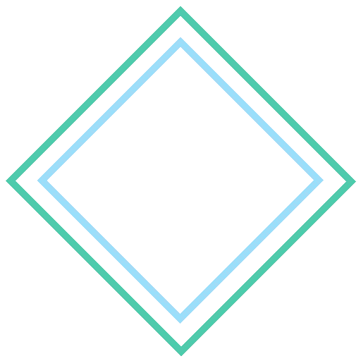

# 如何用 React 和 Tailwind CSS 创建一个自动编码板

> 原文：<https://javascript.plainenglish.io/how-to-create-an-auto-coder-pad-with-react-and-tailwind-css-ae74d25c6e2c?source=collection_archive---------15----------------------->



我的故事如下。前几天我在 Tailwind CSS 网站上，我注意到他们的主页上有一个很棒的自动编码板。当自动编码器板输入时，它会改变 css，这样你就可以看到如何使用 Tailwind CSS 来创建样式化的组件。所以我自然想把它添加到我的入门级开发人员培训网站上。

[](https://www.tailwindcss.com) [## tailwind CSS——一个实用的 CSS 框架，用于快速构建定制设计

### 它们带有各种预先设计的组件，如按钮、卡片和警报，可以帮助您快速移动…

www.tailwindcss.com](https://www.tailwindcss.com) 

当我第一次开始思考如何做到这一点时，我首先去了 NPM，看看我可以用什么包来突出代码。

我决定使用 Highlight.js 和 React Highlight.js，React highlight . js 是这个库的一个轻量级包装器。

Highlight.js 易于开箱即用，它提供了许多风格和语言。

[https://highlightjs.org/](https://highlightjs.org/)

这里是我尝试使用这些库在 React 中创建一个自动编码板。

```
import { useEffect, useState, useRef } from 'react';
import useTriggerOnScroll from '@hooks/useTriggerOnScroll';const introContent = `1 <html lang="en">
2  <head>
3   <title>Entry Level Developer</title>
4  </head>
5  <body>
6   <h1>Start your career today!</h1>
7  </body>
8 </html>
`;let index = 0;function CodeSample() {
  const el = useRef();
  const [content, setContent] = useState('');
  const [start, setStart] = useState(false);
  useTriggerOnScroll(el, () => {
    setStart(true);
  });
  useEffect(() => {
    if (!start) {
      return;
    }
    const type = () => {
      setContent(content + introContent[index++]);
    };
    if (index < introContent.length) {
      setTimeout(type, 100);
    }
  }, [start, content]);
  return (
    <div ref={el} className="highlight text-xs sm:text-sm md:text-md">
      <div className="flex pl-4 pt-4">
        <div className="rounded-full bg-red-500 w-3 h-3 mr-2" />
        <div className="rounded-full bg-yellow-500 w-3 h-3 mr-2" />       
        <div className="rounded-full bg-green-500 w-3 h-3" />
      </div>
      <Highlight language={'html'}>{content}</Highlight>
    </div>
  );
}
```

让我们来谈谈我的方法，以及我为什么要这样编码。首先，我从完整的内容开始，当用户第一次来到网站时，我希望自动编码板能够打印出来。我把这个变量叫做`introContent`。

现在，在我的组件中，我用一个 React 状态变量跟踪 Highlight.js 组件中文本的状态。

```
const [content, setContent] = useState('');
```

我希望它打得很快，但不要太快，所以在我的`useEffect`中，我有一个每 100 毫秒执行一次的`setTimeout`函数。

```
setContent(content + introContent[index++]);
```

我用一个叫做`index`的整数来跟踪我在字符串中的索引。每当我在`setTimeout`中综合输入一个字符时，我就增加到下一个字母，直到不再有字符需要输入并与之前输入的字符连接。

起初我认为我可以写一个`setInterval`并让`useEffect`只运行一次，然而这样做它永远不会更新`content`状态，因为`useEffect`不会在每次运行时都有更新版本。

至于最后一部分，我们来说说`useRef`和`useTriggerOnScroll`挂钩。

我注意到，当我第一次把它添加到我的网站时，它会在页面加载时自动输入，然后当我向下滚动到该元素时，它已经完成了。我需要一种方法来触发开始输入时，用户向下滚动，自动编码器垫进入视野。

我`useRef`在主`div`元素上添加一个引用，然后我把它传递给我的自定义钩子`useTriggerOnScroll`。当元素滚动到用户视窗时，这个钩子触发一个函数。

让我们来看看自定义挂钩。

```
import { useEffect } from 'react';function isInViewport(el, offset = 0) {
  if (!el) return false;
  const top = el.getBoundingClientRect().top;
  return top + offset >= 0 && top - offset <= window.innerHeight;
}export default function useTriggerOnScroll(ref, onTrigger) {
  useEffect(() => {
    function onScroll() {
      if (isInViewport(ref.current)) {
        onTrigger();
        window.removeEventListener('scroll', onScroll);
      }
    }
    window.addEventListener('scroll', onScroll);
    return () => {
      window.removeEventListener('scroll', onScroll);
    };
  }, [ref, onTrigger]);
}
```

我设置了一个`addEventListener`，这样我就可以监听滚动事件。在我的`onScroll`函数中，我通过使用`isInViewport`函数计算元素是否在视窗中。

一旦元素滚动到视图中，调用`onTrigger`函数并删除滚动监听器。

这是我所面临的特定问题，所以请随意更改以满足您的需求。

也许有更好的方法，请在评论中告诉我。

现在我们来谈谈一些顺风 CSS 样式。

首先，我在 styles.css 中设置了一些组件类。

```
.highlight {
  @apply rounded-lg shadow-2xl bg-background h-64;
}.highlight code {
  @apply p-4 bg-background;
}
```

对于我的`highlight`类，我想要圆角，一个方框阴影和一个固定的高度。然后在 Highlight.js `code` html 标签中，我希望一些填充和背景是我自己设置的彩色背景。

在我的 *tailwind.config.js* 文件中，我添加了这样的背景颜色:

```
theme: {
  extend: {
    colors: {
      background: '#1E1E1E',
    },
  },
},
```

让我们完成有趣的部分，克隆关闭、最小化和最大化按钮在 MacOS 中的外观。

```
<div className="rounded-full bg-red-500 w-3 h-3 mr-2" />
<div className="rounded-full bg-yellow-500 w-3 h-3 mr-2" />       
<div className="rounded-full bg-green-500 w-3 h-3" />
```

所以`rounded-full`创建了一个圆，我设置了适当的颜色，宽度和高度为 3，还有一些空白。

就是这样！

请查看我的入门级开发人员培训网站，看看它的行动。

[](https://www.entryleveldeveloper.training) [## 入门级开发人员培训

### 这个网站是献给那些开始学习如何成为一名开发者的人的。许多文章…

www . entryleveldeveloper . training](https://www.entryleveldeveloper.training) 

喜欢这篇文章吗？如果有，通过 [**订阅解码，我们的 YouTube 频道**](https://www.youtube.com/channel/UCtipWUghju290NWcn8jhyAw) **获取更多类似内容！**