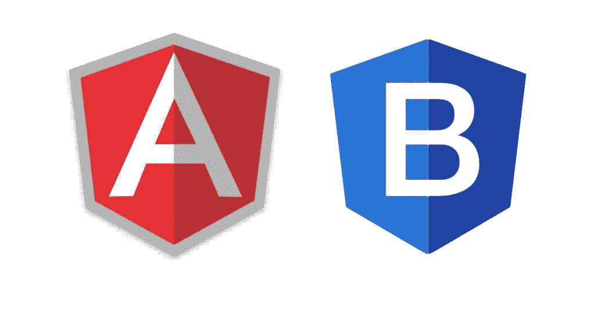
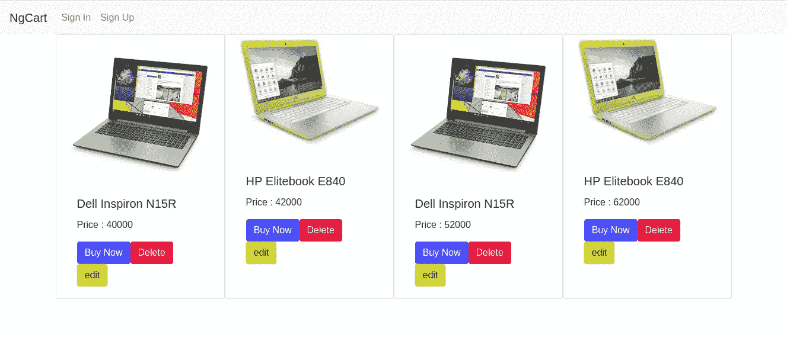
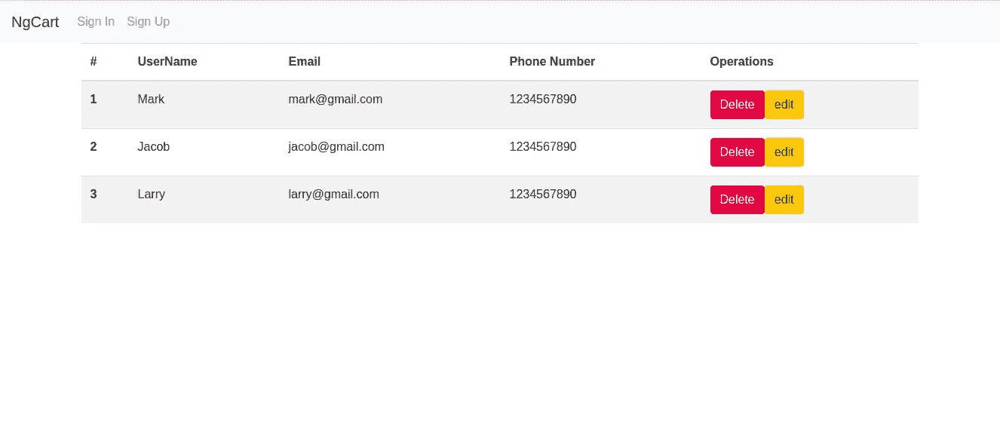
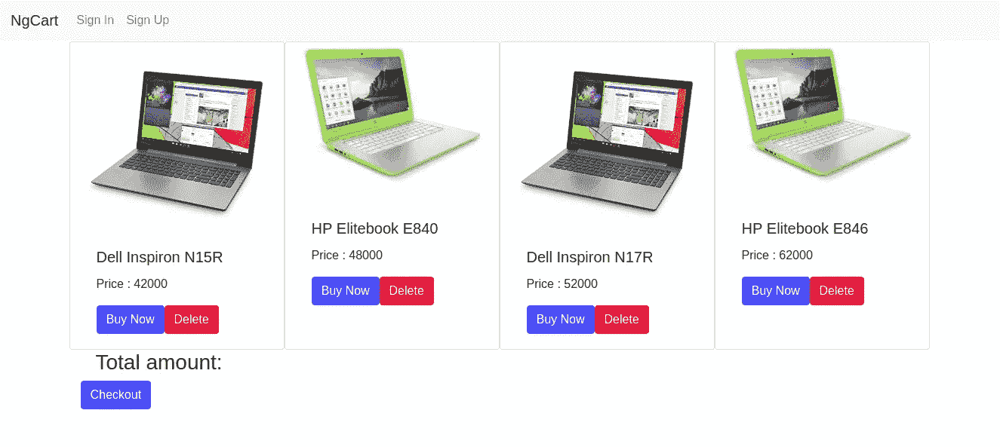
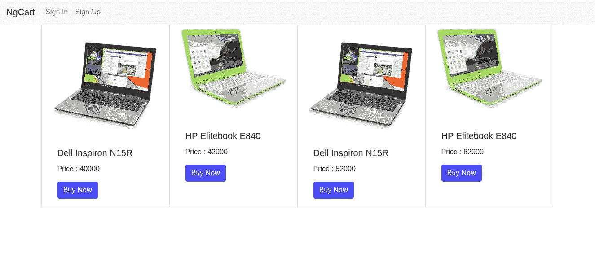
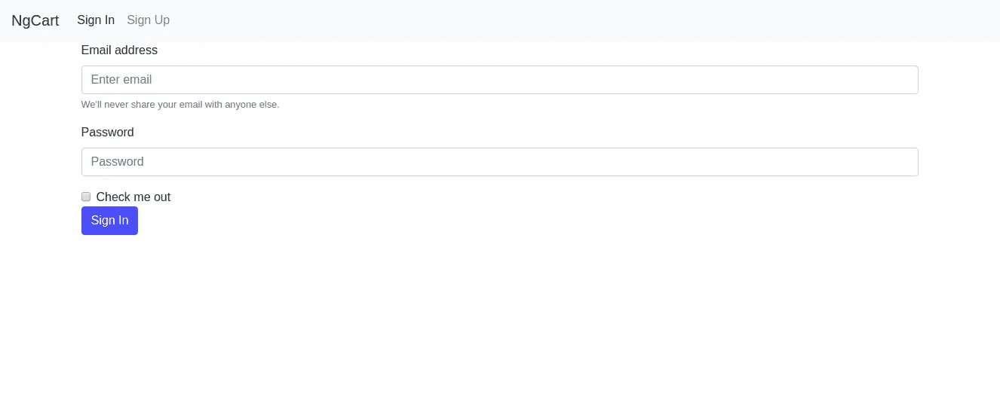
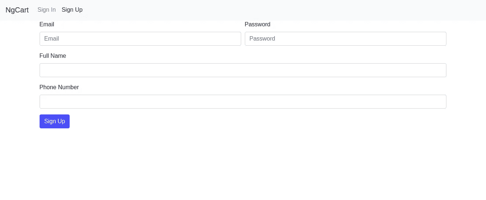

# 如何用 Angular 和 Firebase 创建一个电子商务应用程序:第 3 部分

> 原文：<https://javascript.plainenglish.io/how-to-create-an-ecommerce-app-with-angular-and-firebase-part-3-bd6012961454?source=collection_archive---------1----------------------->

第一部分:[https://medium . com/JavaScript-in-plain-English/how-to-create-a-app-using-angular-and-firebase-part-1-debb 80 f 928 ad](https://medium.com/javascript-in-plain-english/how-to-create-an-app-using-angular-and-firebase-part-1-debb80f928ad)

第二部分:[https://medium . com/JavaScript-in-plain-English/how-to-create-a-app-with-fire base-and-angular-part-2-79063 adebab 9](https://medium.com/javascript-in-plain-english/how-to-create-an-app-with-firebase-and-angular-part-2-79063adebab9)

在这一部分中，我们将构建应用程序的前端。我们将使用 Bootstrap 框架来使我们的应用程序看起来干净漂亮。


# 引导程序

Bootstrap 是用于 web 前端开发的最流行的 HTML、CSS 和 JavaScript 框架**。它非常适合开发响应迅速、移动优先的网站。自举网站可在[http://getbootstrap.com/](http://getbootstrap.com)获得。Bootstrap 框架可以与 Angular **等现代 JavaScript web &移动框架一起使用。****



Angular + Bootstrap, Good idea!

# 事不宜迟，让我们动手干吧🙏


Dirty hands... 💩

## 如果你还记得这个博客系列的最后一部分，我们已经在我们的应用程序中包含了 bootstrap，所以我们可以开始编码了。

您' **ngCart/src/index.html** '文件应该如下所示:

```
<!doctype html><html lang="en"><head><meta charset="utf-8"><title>NgCart</title><base href="/"><meta name="viewport" content="width=device-width, initial-scale=1"><link rel="icon" type="image/x-icon" href="favicon.ico"><link rel="stylesheet" href="https://maxcdn.bootstrapcdn.com/bootstrap/4.0.0/css/bootstrap.min.css" integrity="sha384-Gn5384xqQ1aoWXA+058RXPxPg6fy4IWvTNh0E263XmFcJlSAwiGgFAW/dAiS6JXm" crossorigin="anonymous"></head><body><app-root></app-root><script src="https://code.jquery.com/jquery-3.2.1.slim.min.js" integrity="sha384-KJ3o2DKtIkvYIK3UENzmM7KCkRr/rE9/Qpg6aAZGJwFDMVNA/GpGFF93hXpG5KkN" crossorigin="anonymous"></script><script src="https://maxcdn.bootstrapcdn.com/bootstrap/4.0.0/js/bootstrap.min.js" integrity="sha384-JZR6Spejh4U02d8jOt6vLEHfe/JQGiRRSQQxSfFWpi1MquVdAyjUar5+76PVCmYl" crossorigin="anonymous"></script><script src="https://cdnjs.cloudflare.com/ajax/libs/popper.js/1.12.9/umd/popper.min.js" integrity="sha384-ApNbgh9B+Y1QKtv3Rn7W3mgPxhU9K/ScQsAP7hUibX39j7fakFPskvXusvfa0b4Q" crossorigin="anonymous"></script></body></html>
```

在上面的代码中，我们包含了引导 CSS 和 JS 文件的 cdn(内容交付网络),以及一些必要的文件，如 JQuery.js 和 Popper.js

现在我们已经包含了所有需要的 cdn，我们准备好样式化我们的应用程序了。只需前往[自举 4](https://getbootstrap.com/docs/4.0/components/navbar/) 官方文档。

Bootstrap 是一个编写良好的 CSS 库，我们可以使用它的组件来设计我们的应用程序。

复制第一个导航条代码，如下所示，

```
<nav class="navbar navbar-expand-lg navbar-light bg-light">
    <a class="navbar-brand" routerLink="/" routerLinkActive="active">NgCart</a>
    <button class="navbar-toggler" type="button" data-toggle="collapse" data-target="#navbarSupportedContent" aria-controls="navbarSupportedContent" aria-expanded="false" aria-label="Toggle navigation">
      <span class="navbar-toggler-icon"></span>
    </button>

    <div class="collapse navbar-collapse" id="navbarSupportedContent">
      <ul class="navbar-nav mr-auto">
        <li class="nav-item">
          <a class="nav-link" routerLink="/user/signin" routerLinkActive="active">Sign In</a>
        </li>
        <li class="nav-item">
          <a class="nav-link" routerLink="/user/signup" routerLinkActive="active">Sign Up</a>
        </li>
      </ul>
    </div>
  </nav>
```

在上面我已经包括了' routerLink '属性，这将重定向我们到某些路线，就像在引号中提到的。

这是一个响应式导航条，它会根据设备的屏幕大小进行自我调整。

将此代码添加到容器 div 上方的'**src/app/app . component . html**'文件中。你的'**src/app/app . component . html**'应该是这样的。

```
<nav class="navbar navbar-expand-lg navbar-light bg-light">
    <a class="navbar-brand" routerLink="/" routerLinkActive="active">NgCart</a>
    <button class="navbar-toggler" type="button" data-toggle="collapse" data-target="#navbarSupportedContent" aria-controls="navbarSupportedContent" aria-expanded="false" aria-label="Toggle navigation">
        <span class="navbar-toggler-icon"></span>
    </button><div class="collapse navbar-collapse" id="navbarSupportedContent">
        <ul class="navbar-nav mr-auto">
        <li class="nav-item">
            <a class="nav-link" routerLink="/user/signin" routerLinkActive="active">Sign In</a>
        </li>
        <li class="nav-item">
            <a class="nav-link" routerLink="/user/signup" routerLinkActive="active">Sign Up</a>
        </li>
        </ul>
    </div>
</nav><div class="container">
    <router-outlet></router-outlet>
</div>
```

现在你可以随心所欲地设计你的应用程序了，只需搜索特定的 UI 组件，你就会得到所需的代码。

这是我如何设计我们的角组件。

admin-products.component.html

```
<div class="row">
    <div class="card col" style="width: 18rem;">
      
      <div class="card-body">
        <h5 class="card-title">Dell Inspiron N15R</h5>
        <p class="card-text"> Price : 40000</p>
        <a href="#" class="btn btn-primary">Buy Now</a>
        <a href="#" class="btn btn-danger">Delete</a>
        <a href="#" class="btn btn-warning">edit</a>
      </div>
    </div>
    <div class="card col" style="width: 18rem;">
      
      <div class="card-body">
        <h5 class="card-title">HP Elitebook E840</h5>
        <p class="card-text"> Price : 42000</p>
        <a href="#" class="btn btn-primary">Buy Now</a>
        <a href="#" class="btn btn-danger">Delete</a>
        <a href="#" class="btn btn-warning">edit</a>
      </div>

    </div>

    <div class="card col" style="width: 18rem;">
        
        <div class="card-body">
          <h5 class="card-title">Dell Inspiron N15R</h5>
          <p class="card-text"> Price : 52000</p>
          <a href="#" class="btn btn-primary">Buy Now</a>
          <a href="#" class="btn btn-danger">Delete</a>
        <a href="#" class="btn btn-warning">edit</a>
        </div>
      </div>

      <div class="card col" style="width: 18rem;">
          
          <div class="card-body">
            <h5 class="card-title">HP Elitebook E840</h5>
            <p class="card-text"> Price : 62000</p>
            <a href="#" class="btn btn-primary">Buy Now</a>
            <a href="#" class="btn btn-danger">Delete</a>
        <a href="#" class="btn btn-warning">edit</a>
          </div>

        </div>
  </div>
```



**admin-products.component.html**

**admin-users.component.html**

```
<table class="table table-striped">
    <thead>
      <tr>
        <th scope="col">#</th>
        <th scope="col">UserName</th>
        <th scope="col">Email</th>
        <th scope="col">Phone Number</th>
        <th scope="col">Operations </th>
      </tr>
    </thead>
    <tbody>
      <tr>
        <th scope="row">1</th>
        <td>Mark</td>
        <td>[mark@gmail.com](mailto:mark@gmail.com)</td>
        <td>1234567890</td>
        <td>
          <a href="#" class="btn btn-danger">Delete</a>
          <a href="#" class="btn btn-warning">edit</a>
        </td>
      </tr>
      <tr>
        <th scope="row">2</th>
        <td>Jacob</td>
        <td>[jacob@gmail.com](mailto:jacob@gmail.com)</td>
        <td>1234567890</td>
        <td>
            <a href="#" class="btn btn-danger">Delete</a>
            <a href="#" class="btn btn-warning">edit</a>
          </td>
      </tr>
      <tr>
        <th scope="row">3</th>
        <td>Larry</td>
        <td>[larry@gmail.com](mailto:larry@gmail.com)</td>
        <td>1234567890</td>
        <td>
            <a href="#" class="btn btn-danger">Delete</a>
            <a href="#" class="btn btn-warning">edit</a>
          </td>
      </tr>
    </tbody>
  </table>
```



**admin-users.component.html**

cart.component.html‘T2’

```
<div class="row">
    <div class="card col" style="width: 18rem;">
      
      <div class="card-body">
        <h5 class="card-title">Dell Inspiron N15R</h5>
        <p class="card-text"> Price : 42000</p>
        <a href="#" class="btn btn-primary">Buy Now</a>
        <a href="#" class="btn btn-danger">Delete</a>
      </div>
    </div>
    <div class="card col" style="width: 18rem;">
      
      <div class="card-body">
        <h5 class="card-title">HP Elitebook E840</h5>
        <p class="card-text"> Price : 48000</p>
        <a href="#" class="btn btn-primary">Buy Now</a>
        <a href="#" class="btn btn-danger">Delete</a>  
      </div>

    </div>

    <div class="card col" style="width: 18rem;">
        
        <div class="card-body">
          <h5 class="card-title">Dell Inspiron N17R</h5>
          <p class="card-text"> Price : 52000</p>
          <a href="#" class="btn btn-primary">Buy Now</a>
          <a href="#" class="btn btn-danger">Delete</a>
        </div>
      </div>

      <div class="card col" style="width: 18rem;">
          
          <div class="card-body">
            <h5 class="card-title">HP Elitebook E846</h5>
            <p class="card-text"> Price : 62000</p>
            <a href="#" class="btn btn-primary">Buy Now</a>
            <a href="#" class="btn btn-danger">Delete</a>
          </div>

        </div>
  </div><form>

      <div class="form-check">
        <h3>Total amount: </h3>
      </div>
      <button type="submit" class="btn btn-primary">Checkout</button>
    </form>
```



**cart.component.html**

【products.component.html】T4

```
<div class="row">
  <div class="card col" style="width: 18rem;">
    
    <div class="card-body">
      <h5 class="card-title">Dell Inspiron N15R</h5>
      <p class="card-text"> Price : 40000</p>
      <a href="#" class="btn btn-primary">Buy Now</a>
    </div>
  </div>
  <div class="card col" style="width: 18rem;">
    
    <div class="card-body">
      <h5 class="card-title">HP Elitebook E840</h5>
      <p class="card-text"> Price : 42000</p>
      <a href="#" class="btn btn-primary">Buy Now</a>
    </div>

  </div><div class="card col" style="width: 18rem;">
      
      <div class="card-body">
        <h5 class="card-title">Dell Inspiron N15R</h5>
        <p class="card-text"> Price : 52000</p>
        <a href="#" class="btn btn-primary">Buy Now</a>
      </div>
    </div><div class="card col" style="width: 18rem;">
        
        <div class="card-body">
          <h5 class="card-title">HP Elitebook E840</h5>
          <p class="card-text"> Price : 62000</p>
          <a href="#" class="btn btn-primary">Buy Now</a>
        </div>

      </div>
</div>
```



**products.component.html**

sign-in.component.html

```
<form>
  <div class="form-group">
    <label for="exampleInputEmail1">Email address</label>
    <input type="email" class="form-control" id="exampleInputEmail1" aria-describedby="emailHelp" placeholder="Enter email">
    <small id="emailHelp" class="form-text text-muted">We'll never share your email with anyone else.</small>
  </div>
  <div class="form-group">
    <label for="exampleInputPassword1">Password</label>
    <input type="password" class="form-control" id="exampleInputPassword1" placeholder="Password">
  </div>
  <div class="form-check">
    <input type="checkbox" class="form-check-input" id="exampleCheck1">
    <label class="form-check-label" for="exampleCheck1">Check me out</label>
  </div>
  <button type="submit" class="btn btn-primary">Sign In
  </button>
</form>
```



**sign-in.component.html**

**sign-up.component.html**

```
<form>
    <div class="form-row">
      <div class="form-group col-md-6">
        <label for="inputEmail4">Email</label>
        <input type="email" class="form-control" id="inputEmail4" placeholder="Email">
      </div>
      <div class="form-group col-md-6">
        <label for="inputPassword4">Password</label>
        <input type="password" class="form-control" id="inputPassword4" placeholder="Password">
      </div>
    </div>
    <div class="form-group">
      <label for="fullName">Full Name</label>
      <input type="text" class="form-control" id="fullName">
    </div>
    <div class="form-group">
      <label for="phoneNumber">Phone Number</label>
      <input type="number" class="form-control" id="phoneNumber">
    </div>
    <button type="submit" class="btn btn-primary">Sign Up</button>
  </form>
```



**sign-up.component.html**

一切都很完美。


Oh Yeah..!

如果你愿意，现在你可以添加更多的功能。我会坚持你去玩所有这些引导组件，使我们的应用程序一个眼睛糖果。

在本系列的下一部分中，我将描述与设置 firebase 身份验证相关的一切。直到那时快乐编码😋。

Bye...