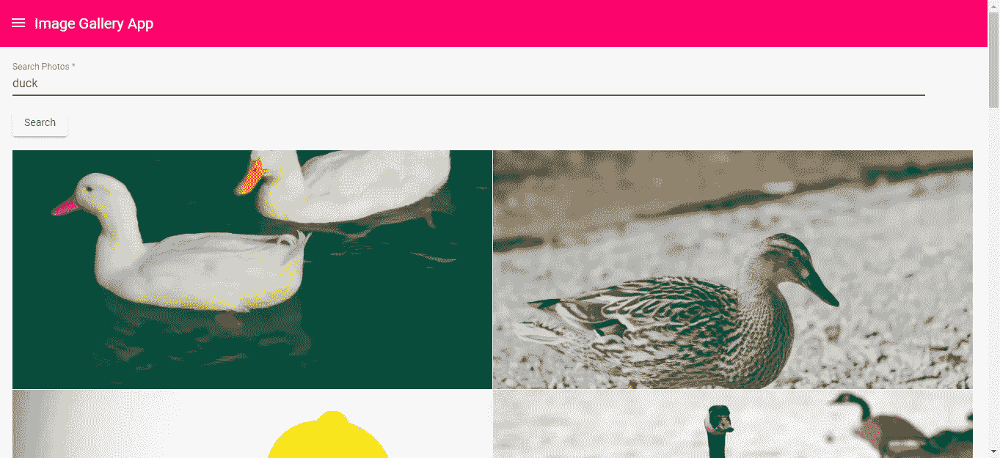
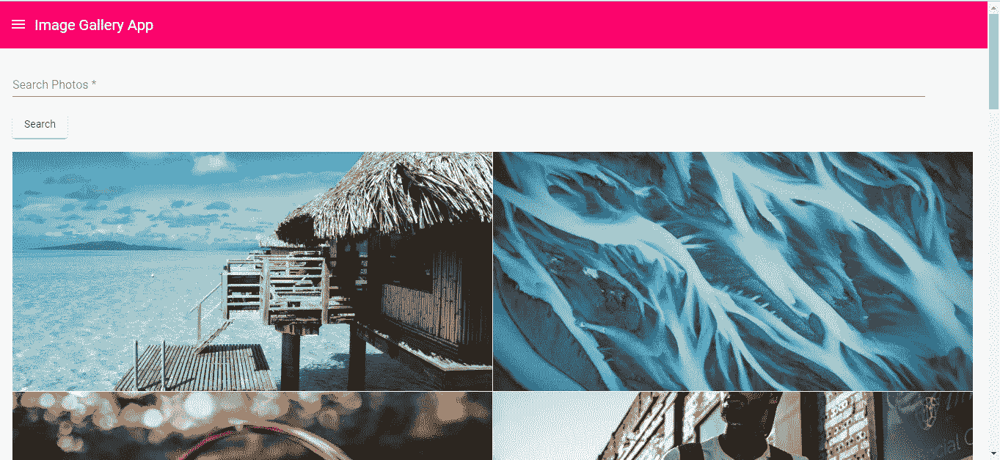
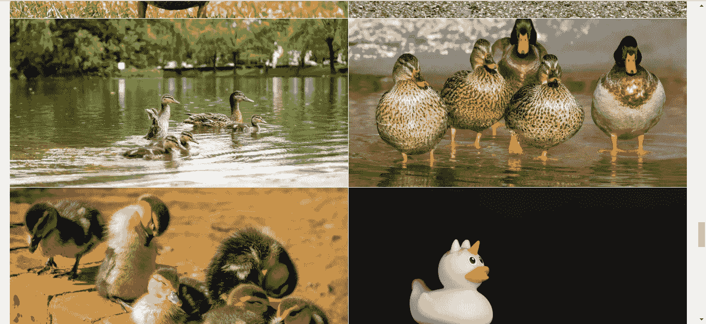

# 如何使用 Angular 创建图片库应用程序

> 原文：<https://javascript.plainenglish.io/how-to-create-an-image-gallery-app-with-angular-903190015aec?source=collection_archive---------3----------------------->

用 Angular 创建一个好看的照片应用程序很容易。有许多用于添加照片幻灯片的库，其中大多数都很容易使用。此外，使用现有的库，如 Angular Material design 的网格，以整洁的方式显示图像很容易。

在这个故事中，我们将建立一个照片库应用程序，其中一个页面具有搜索功能和无限滚动，另一个页面显示随机照片的幻灯片。我们将使用 Angular Material 来利用其好看的表单元素和网格，以及一个名为`ng-simple-slideshow`的幻灯片库来显示幻灯片。它的左侧会有一个菜单。我们照片的来源将来自 Pexels API。你需要一个 API 密匙，通过在[https://www.pexels.com/api/](https://www.pexels.com/api/)注册一个来免费访问 API。它被限制在每小时 200 个 API 调用，所以不要做太多的请求。

为了开始构建应用程序，我们首先通过运行`npm i @angular/cli`来安装 Angular CLI。安装后，我们运行`ng new image-gallery`为我们的图库应用程序创建一个新的角度。我们还创建了一个 flux store 来存储菜单的状态。接下来，我们安装应用程序的库。我们运行`npm i @angular/cdk @angular/material ng-simple-slideshow ngx-infinite-scroll @ngrx/store`来安装我们需要显示照片和展示照片幻灯片的库。然后我们运行`ng add @ngrx/store`来添加代码

接下来，我们为将要编写的代码添加框架代码。为此，我们运行以下命令:

```
ng g component homePage
ng g component randomSlideshowPage
ng g component topBar
ng g class httpReqInterceptor
ng g service photo
```

这将创建用于显示的组件。`httpReqInterceptor`类用于将 API 键附加到每个请求的请求头。照片服务是调用 Pexels API 的代码所在的地方。

在`environment.ts`中，我们输入:

```
export const environment = {
  production: false,
  pexelsApiKey: 'your pexels api key'
};
```

让我们将您的 API 密钥导入到其他文件中。

在`http-req-interceptor.ts`中，我们添加:

```
import { Injectable } from '[@angular/core](http://twitter.com/angular/core)';
import {
    HttpEvent,
    HttpInterceptor,
    HttpHandler,
    HttpResponse,
    HttpRequest
} from '[@angular/common](http://twitter.com/angular/common)/http';
import { Observable } from 'rxjs';
import { environment } from '../environments/environment'
import { tap } from 'rxjs/operators';
[@Injectable](http://twitter.com/Injectable)()
export class HttpReqInterceptor implements HttpInterceptor {
    constructor() { } intercept(req: HttpRequest<any>, next: HttpHandler): Observable<HttpEvent<any>> {
        let modifiedReq = req.clone({});
        modifiedReq = modifiedReq.clone({
            setHeaders: {
                'Authorization': environment.pexelsApiKey
            }
        });return next.handle(modifiedReq).pipe(tap((event: HttpEvent<any>) => {
            if (event instanceof HttpResponse) {}
        }));
    }
}
```

使用这个块将我们的令牌附加到每个请求的`Authorization` 请求头:

```
let modifiedReq = req.clone({});
  modifiedReq = modifiedReq.clone({
    setHeaders: {
      'Authorization': environment.pexelsApiKey
    }
});
```

在`photo.service.ts`中，我们把:

```
import { Injectable } from '[@angular/core](http://twitter.com/angular/core)';
import { HttpClient } from '[@angular/common](http://twitter.com/angular/common)/http';[@Injectable](http://twitter.com/Injectable)({
  providedIn: 'root'
})
export class PhotoService { constructor(
    private http: HttpClient
  ) { } randomPhotos(page: number = 1) {
    return this.http.get(`[https://api.pexels.com/v1/curated?per_page=15&page=${page}`](https://api.pexels.com/v1/curated?per_page=15&page=${page}`))
  } searchPhotos(query: string, page: number = 1) {
    return this.http.get(`[https://api.pexels.com/v1/search?query=${encodeURIComponent(query)}&per_page=15&page=${page}`)](https://api.pexels.com/v1/search?query=${encodeURIComponent(query)}&per_page=15&page=${page}`))
  }
}
```

让我们向 Pexels API 发出请求。我们在应用程序中使用了精选照片和分页搜索端点。

接下来在`home-page.component.ts`中，我们放入:

```
import { Component, OnInit } from '[@angular/core](http://twitter.com/angular/core)';
import { NgForm } from '[@angular/forms](http://twitter.com/angular/forms)';
import { PhotoService } from '../photo.service';[@Component](http://twitter.com/Component)({
  selector: 'app-home-page',
  templateUrl: './home-page.component.html',
  styleUrls: ['./home-page.component.scss']
})
export class HomePageComponent implements OnInit {
  query: any = <any>{};
  photoUrls: string[] = [];
  page: number = 1; constructor(
    private photoService: PhotoService
  ) { } ngOnInit() {
    this.getPhotos();
  } getPhotos() {
    this.photoService.randomPhotos(this.page)
      .subscribe(res => {
        this.photoUrls = this.photoUrls.concat((res as any).photos.map(p => p.src.landscape));
      })
  } searchPhotos(searchForm: NgForm) {
    if (searchForm.invalid) {
      return;
    }
    this.page = 1;
    this.photoUrls = [];
    this.requestSearchPhotos();
  } requestSearchPhotos() {
    this.photoService.searchPhotos(this.query.search, this.page)
      .subscribe(res => {
        this.photoUrls = this.photoUrls.concat((res as any).photos.map(p => p.src.landscape));
      })
  } onScroll() {
    this.page++
    if (!this.query.search) {
      this.getPhotos();
    }
    else {
      this.requestSearchPhotos();
    } }
}
```

这是我们从位于[https://api.pexels.com/v1/curated?per_page=15&page = 1](https://api.pexels.com/v1/curated?per_page=15&page=1)的策划照片端点获取照片的地方，通过调用响应的照片字段上的`map`来获取图像 URL。如果输入一个搜索词，我们将使用位于[https://api.pexels.com/v1/search?query=example+query&per _ page = 15&page = 1](https://api.pexels.com/v1/search?query=example+query&per_page=15&page=1)的搜索照片端点，并用`map`函数做同样的事情。我们有无限滚动，所以当用户滚动到页面底部时，我们增加页码，并不断向我们的数组添加更多的图像 URL。

在`home-page.component.html`中，我们把:

```
<form #searchForm='ngForm' (ngSubmit)='searchPhotos(searchForm)'>
    <mat-form-field>
        <input matInput placeholder="Search Photos" required #search='ngModel' name='search' [(ngModel)]='query.search'>
        <mat-error *ngIf="search.invalid && (search.dirty || search.touched)">
            <div *ngIf="search.errors.required">
                Search query is required.
            </div>
        </mat-error>
    </mat-form-field>
    <br>
    <button mat-raised-button type='submit'>Search</button>
</form>
<br>
<div infiniteScroll [infiniteScrollDistance]="2" [infiniteScrollThrottle]="50" (scrolled)="onScroll()">
    <mat-grid-list cols="2" rowHeight="2:1">
        <mat-grid-tile *ngFor='let p of photoUrls'>
            
        </mat-grid-tile>
    </mat-grid-list>
</div>
```

显示搜索表单，并在无限滚动中包裹我们的照片网格`div`，这样当用户向下滚动时，它将加载新的图像。

在`home-page.component.scss`中，我们加上:

```
.tile-image {
  width: 100%;
  height: auto;
}
```

使图像充满网格框。

在`random-slideshow-page.component.ts`中，我们输入:

```
import { Component, OnInit } from '[@angular/core](http://twitter.com/angular/core)';
import { PhotoService } from '../photo.service';[@Component](http://twitter.com/Component)({
  selector: 'app-random-slideshow-page',
  templateUrl: './random-slideshow-page.component.html',
  styleUrls: ['./random-slideshow-page.component.scss']
})
export class RandomSlideshowPageComponent implements OnInit {
  photoUrls: string[] = []; constructor(
    private photoService: PhotoService
  ) { } ngOnInit() {
    this.getPhotos();
  } getPhotos() {
    this.photoService.randomPhotos(1)
      .subscribe(res => {
        this.photoUrls = (res as any).photos.map(p => p.src.landscape);
      })
  }
}
```

这是我们从策展照片端点获取随机照片的地方。

在`random-photos-page.component.html`中，我们添加:

```
<div class="center">
    <h1>Random Photos</h1>
</div>
<slideshow [imageUrls]="photoUrls" [height]="height" [minHeight]="'60vh'" [autoPlay]="true" [showArrows]="false">
</slideshow>
```

显示照片的幻灯片。

接下来，我们创建一个名为`menu-reducer.ts`的文件，并添加以下内容:

```
const TOGGLE_MENU = 'TOGGLE_MENU';function menuReducer(state, action) {
    switch (action.type) {
        case TOGGLE_MENU:
            state = action.payload;
            return state;
        default:
            return state
    }
}export { menuReducer, TOGGLE_MENU };
```

存储菜单状态。

在`reducers/index.ts`中，我们把:

```
import { menuReducer } from './menu-reducer';export const reducers = {
  menu: menuReducer,
};
```

允许`@ngrx/store`的`StoreModule`使用菜单缩减器存储状态。

在`app.component.ts`中，我们添加:

```
import { Component, HostListener } from '[@angular/core](http://twitter.com/angular/core)';
import { Store, select } from '[@ngrx/store](http://twitter.com/ngrx/store)';
import { TOGGLE_MENU } from './reducers/menu-reducer';[@Component](http://twitter.com/Component)({
  selector: 'app-root',
  templateUrl: './app.component.html',
  styleUrls: ['./app.component.scss']
})
export class AppComponent {
  menuOpen: boolean; constructor(
    private store: Store<any>,
  ) {
    store.pipe(select('menu'))
      .subscribe(menuOpen => {
        this.menuOpen = menuOpen;
      })
  } [@HostListener](http://twitter.com/HostListener)('document:click', ['$event'])
  public onClick(event) {
    const isOutside = !event.target.className.includes("menu-button") &&
      !event.target.className.includes("material-icons") &&
      !event.target.className.includes("mat-drawer-inner-container")
    if (isOutside) {
      this.menuOpen = false;
      this.store.dispatch({ type: TOGGLE_MENU, payload: this.menuOpen });
    }
  }}
```

如果您没有点击菜单按钮，在换页时自动关闭左侧菜单。我们获取商店中的菜单状态，如果菜单需要通过导航或点击菜单外部来关闭，我们关闭菜单并在商店中设置状态。

在`top-bar.component.ts`中，我们输入:

```
import { Component, OnInit } from '[@angular/core](http://twitter.com/angular/core)';
import { Store, select } from '[@ngrx/store](http://twitter.com/ngrx/store)';
import { TOGGLE_MENU } from '../reducers/menu-reducer';[@Component](http://twitter.com/Component)({
  selector: 'app-top-bar',
  templateUrl: './top-bar.component.html',
  styleUrls: ['./top-bar.component.scss']
})
export class TopBarComponent implements OnInit {
  menuOpen: boolean; constructor(
    private store: Store<any>
  ) {
    store.pipe(select('menu'))
      .subscribe(menuOpen => {
        this.menuOpen = menuOpen;
      })
  } ngOnInit() {
  } toggleMenu() {
    this.store.dispatch({ type: TOGGLE_MENU, payload: !this.menuOpen    });
  }
}
```

允许我们切换菜单并在存储中存储状态。然后在`top-bar.component.ts`中，我们放入:

```
<mat-toolbar>
    <a (click)='toggleMenu()' class="menu-button">
        <i class="material-icons">
            menu
        </i>
    </a>
    Image Gallery App
</mat-toolbar>
```

在`app.component.html`中，我们有:

```
<mat-sidenav-container class="example-container">
  <mat-sidenav mode="side" [opened]='menuOpen'>
    <ul>
      <li>
        <b>
          Image Gallery App
        </b>
      </li>
      <li>
        <a routerLink='/'>Home</a>
      </li>
      <li>
        <a routerLink='/random'>Random Photos Slideshow</a>
      </li>
    </ul></mat-sidenav>
  <mat-sidenav-content>
    <app-top-bar></app-top-bar>
    <div id='content'>
      <router-outlet></router-outlet>
    </div>
  </mat-sidenav-content>
</mat-sidenav-container>
```

显示左侧导航菜单和`router-outlet`按钮，让用户在点击上面的链接或直接输入 URL 时看到我们的页面。

在`app.component.scss`中，我们添加:

```
#content {
  padding: 20px;
  min-height: 130vh;
}ul {
  list-style-type: none;
  margin: 0;
  li {
    padding: 20px 5px;
  }
}
```

添加一些填充并删除页面的空白。

最后在`app.module.ts`中，我们把:

```
import { BrowserModule } from '[@angular/platform-browser](http://twitter.com/angular/platform-browser)';
import { NgModule } from '[@angular/core](http://twitter.com/angular/core)';
import {
  MatButtonModule,
  MatCheckboxModule,
  MatInputModule,
  MatMenuModule,
  MatSidenavModule,
  MatToolbarModule,
  MatTableModule,
  MatDialogModule,
  MatDatepickerModule,
  MatSelectModule,
  MatCardModule,
  MatFormFieldModule,
  MatGridListModule
} from '[@angular/material](http://twitter.com/angular/material)';
import { BrowserAnimationsModule } from '[@angular/platform-browser](http://twitter.com/angular/platform-browser)/animations';
import { AppRoutingModule } from './app-routing.module';
import { AppComponent } from './app.component';
import { StoreModule } from '[@ngrx/store](http://twitter.com/ngrx/store)';
import { reducers } from './reducers';
import { TopBarComponent } from './top-bar/top-bar.component';
import { FormsModule } from '[@angular/forms](http://twitter.com/angular/forms)';
import { HttpClientModule, HTTP_INTERCEPTORS } from '[@angular/common](http://twitter.com/angular/common)/http';
import { HomePageComponent } from './home-page/home-page.component';
import { RandomSlideshowPageComponent } from './random-slideshow-page/random-slideshow-page.component';
import { InfiniteScrollModule } from 'ngx-infinite-scroll';
import { SlideshowModule } from 'ng-simple-slideshow';
import { HttpReqInterceptor } from './http-req-interceptor';
import { PhotoService } from './photo.service';[@NgModule](http://twitter.com/NgModule)({
  declarations: [
    AppComponent,
    TopBarComponent,
    HomePageComponent,
    RandomSlideshowPageComponent
  ],
  imports: [
    BrowserModule,
    AppRoutingModule,
    FormsModule,
    MatButtonModule,
    StoreModule.forRoot(reducers),
    BrowserAnimationsModule,
    MatButtonModule,
    MatCheckboxModule,
    MatFormFieldModule,
    MatInputModule,
    MatMenuModule,
    MatSidenavModule,
    MatToolbarModule,
    MatTableModule,
    HttpClientModule,
    MatDialogModule,
    MatDatepickerModule,
    MatSelectModule,
    MatCardModule,
    MatGridListModule,
    InfiniteScrollModule,
    SlideshowModule,
  ],
  providers: [
    {
      provide: HTTP_INTERCEPTORS,
      useClass: HttpReqInterceptor,
      multi: true
    },
    PhotoService
  ],
  bootstrap: [AppComponent]
})
export class AppModule { }
```

为了包含所有的库、HTTP 拦截器和我们需要使应用程序运行的服务。

最后，我们在完成的应用程序中有以下内容:

