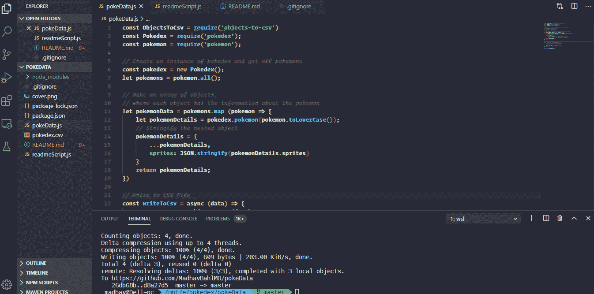

# 如何在 Node.js 中创建和写入 CSV 文件

> 原文：<https://javascript.plainenglish.io/how-to-create-and-write-to-a-csv-file-in-node-js-b4e194747e56?source=collection_archive---------1----------------------->

## 我如何在 2 分钟内制作我的口袋妖怪数据集


我们并不总是得到我们想要的，不是吗？

同样的事情也发生在我身上！我想要一个关于每个口袋妖怪的适当的数据集，所以我开始寻找不同的 API 或 npm 包。

我无法在单一来源中找到我要找的所有东西，但我能够在 2 个不同的包中找到它。所以我决定从每个文件中提取所需的信息到一个 CSV 文件中。

而且，(我不是吹牛)，我不到 2 分钟就能做到！怎么会？使用`objects-to-csv`库。在这篇博客中，你将了解到如何快速地将你的对象数组转换成一个 CSV 文件。让我们开始吧。

如果您只对代码感兴趣，您可以在 GitHub repo 中找到它:

[](https://github.com/MadhavBahlMD/pokeData) [## MadhavBahlMD/pokeData

### 通过制作自己的口袋妖怪数据集学习用 NodeJS 写 CSV 文件。我如何在 2 分钟内制作我的口袋妖怪数据集ᕦ(…

github.com](https://github.com/MadhavBahlMD/pokeData) 

# 关于包裹

对于口袋妖怪的数据，我遇到了这三个有特定问题的包—

1.  [pokedex](https://www.npmjs.com/package/pokedex)——不能同时搜索所有的口袋妖怪。
2.  [口袋妖怪](https://www.npmjs.com/package/pokemon)——只是所有口袋妖怪的列表，但是解决了获得所有口袋妖怪的问题。
3.  [objects-to-csv](https://www.npmjs.com/package/objects-to-csv) —将一组 JavaScript 对象转换成 csv 格式。救命恩人。

所以我决定把这些结合起来:)

# 安装软件包

如果你熟悉 NodeJS，我想我不需要告诉你这些步骤，但是，如果你来自不同的语言，我会告诉你如何安装这些。

只需一个命令！

```
npm install --save objects-to-csv pokemon pokedex
```

# 写剧本

太棒了，现在是主要部分。在我们继续之前，让我们看看从上面两个包中得到的响应。

## 口袋妖怪套装

这个包可以用来获得一个特定的口袋妖怪的名字/id。它还可以用来获取所有口袋妖怪的列表。

```
const pokemon **=** require('pokemon');pokemon.all();
*//=> ['Bulbasaur', …]*
```

## Pokedex 包

这个包可以用来获取关于口袋妖怪的信息，包括他们的精灵。

```
var Pokedex **=** require('pokedex'),
pokedex **=** **new** Pokedex();console.log( pokedex.pokemon('garbodor') );
```

结果会是—

```
{
  id**:** 569,
  species_id**:** 569,
  height**:** 19,
  weight**:** 1073,
  base_experience**:** 166,
  order**:** 617,
  is_default**:** 1,
  name**:** 'garbodor',
  sprites**:** {
    normal**:** 'http://img.pokemondb.net/sprites/black-white/normal/garbodor.png',
    animated**:** 'http://img.pokemondb.net/sprites/black-white/anim/normal/garbodor.gif'
  }
}
```

所以你可能已经猜到了，我想要一个所有口袋妖怪的这些细节的 csv。我们来写剧本吧。

就像在任何其他节点项目中一样，第一步是导入库。

```
const ObjectsToCsv = require('objects-to-csv')
const Pokedex = require('pokedex');
const pokemon = require('pokemon');
```

现在让我们创建一个 Pokedex 实例，并获取所有的口袋妖怪

```
const pokedex = new Pokedex();
let pokemons = pokemon.all();
```

现在让我们制作一个对象数组，每个对象都有关于口袋妖怪的信息。不要忘记对嵌套的对象进行字符串化(否则它们会在写入 CSV 时产生问题)。

```
let pokemonData = pokemons.map (pokemon => {
  let pokemonDetails = pokedex.pokemon(pokemon.toLowerCase());
  *// Stringify the nested object* pokemonDetails = {
    ...pokemonDetails,
    sprites: JSON.stringify(pokemonDetails.sprites)
  }
  return pokemonDetails;
})
```

好了，这是我们的最后一步，写 CSV。

我正在使用`[objects-to-csv](https://www.npmjs.com/package/objects-to-csv)`库，这使得工作变得非常简单。看到下面的代码，就不言自明了！

```
*// Write to CSV File* const writeToCsv = async (data) => {
  const csv = new ObjectsToCsv(data);*// Save to file:* await csv.toDisk('./pokedex.csv');
}
```

既然我们已经走了这么远，让我们跑吧！

```
node fileName.js
```

就是这样！魔法。我们的 CSV 准备好了！



这是完整的代码—

就这些了，希望你觉得这个帖子有用！


如果你想讨论什么，随时联系我，:D

如果您能发送您的反馈、建议或询问，我将非常高兴。此外，我喜欢交新朋友，我们可以成为朋友，只要给我发邮件。

> *非常感谢阅读到最后。如有需要可以联系我:
> 邮箱:theleanprogrammer@gmail.com
> 网页:*[*http://madhavbahl.tech/*](http://madhavbahl.tech/) *Github:*[*https://github.com/MadhavBahlMD*](https://github.com/MadhavBahlMD) *LinkedIn:*[*https://www.linkedin.com/in/madhavbahl/*](https://www.linkedin.com/in/madhavbahl/) *insta gram:*[*https://www.instagram.com/theleanprogrammer/*](https://www.instagram.com/theleanprogrammer/)

## **用简单英语写的 JavaScript 笔记**

我们已经推出了三种新的出版物！请关注我们的新出版物，表达对它们的爱:[**AI in Plain English**](https://medium.com/ai-in-plain-english)[**UX in Plain English**](https://medium.com/ux-in-plain-english)[**Python in Plain English**](https://medium.com/python-in-plain-english)**——谢谢，继续学习！**

**我们也一直有兴趣帮助推广高质量的内容。如果您有一篇文章想要提交给我们的任何出版物，请发送电子邮件至[**submissions @ plain English . io**](mailto:submissions@plainenglish.io)**，并使用您的 Medium 用户名，我们会将您添加为作者。另外，请让我们知道您想加入哪个/哪些出版物。****