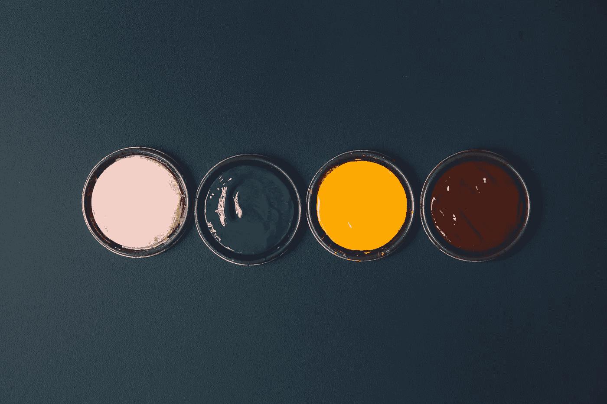
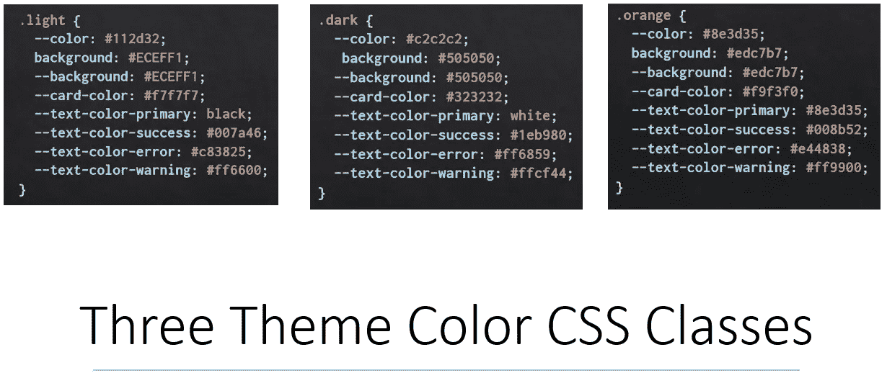
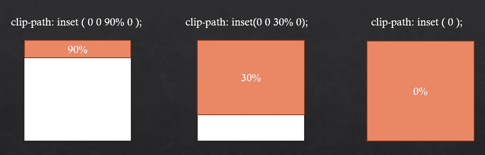
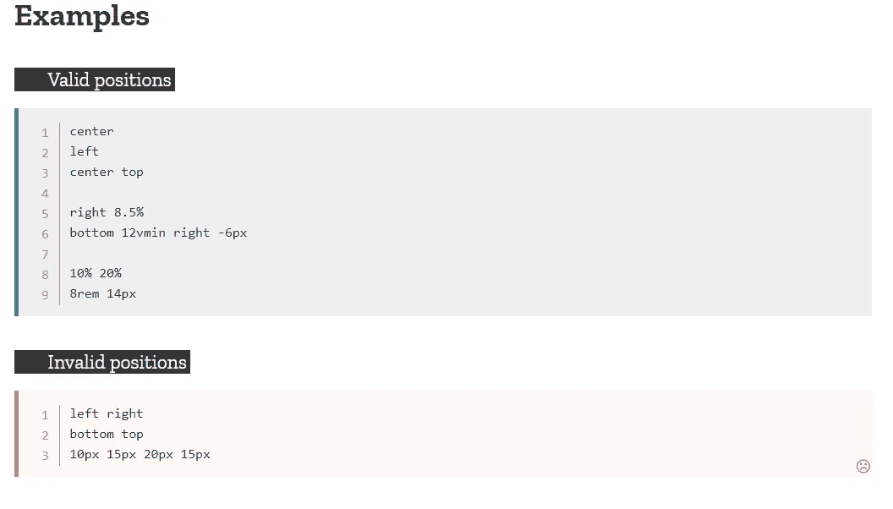
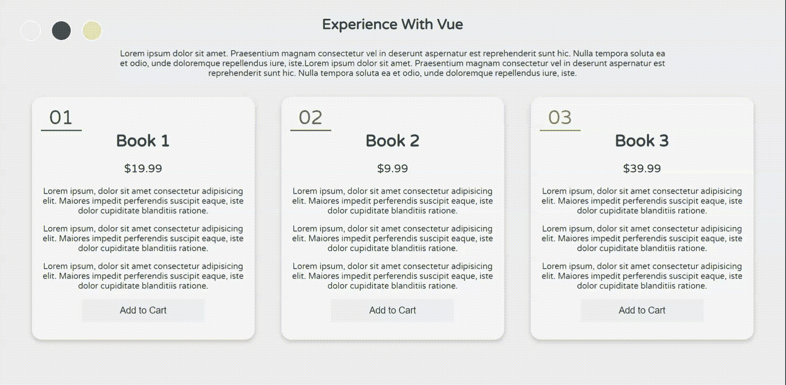
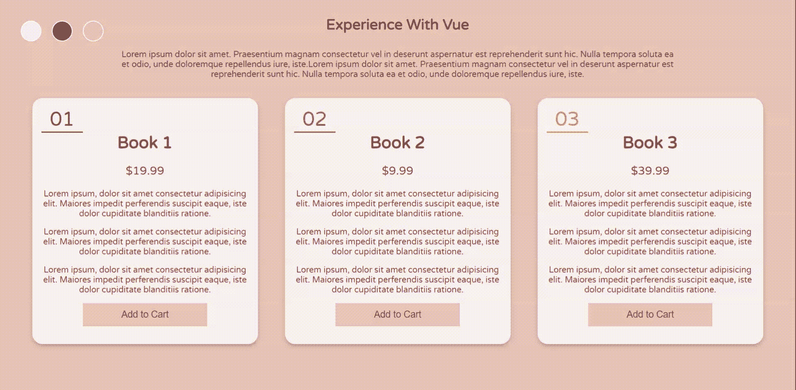

# 如何用 Vue 创建动态主题

> 原文：<https://javascript.plainenglish.io/how-to-create-dynamic-themes-with-vue-81d27ffd9414?source=collection_archive---------5----------------------->



By Sarah Pflug in Art & Design

大家好。我想在这篇文章中解释一下如何用 Vue 和 CSS 以不同的方式切换主题。让我们从一个简单的方法开始。



首先，我通过使用 CSS 变量的 **CSS** **自定义属性**为我的应用程序声明了 3 个主题，分别是亮、暗和橙色。什么是 CSS 自定义属性？

CSS 自定义属性声明以双连字符(`--`)开始，并且可以通过 var()函数在所有 CSS 类中重用。

```
--color: white;
--background-color: brown;h1{
  background-color: var(--main-bg-color);
}
```

然后，当选择主题颜色时，我使用**类绑定** (v-bind: class)来绑定值(例如，亮、暗或橙色)。因此，当改变主题颜色时，其余的 CSS 类将通过使用 **var()函数**自动插入自定义属性的值。

***搞定*！**您已成功更改主题颜色。

接下来，我想应用 CSS 过渡效果，让背景颜色平滑地变化，以避免在改变主题颜色时突然“闪烁”。

对将改变主题颜色的地点/类别应用过渡效果，例如，背景样式和文本。您可以调整和指定 CSS **过渡属性**例如，您可以通过更改过渡持续时间使过渡在更短/更长的时间内发生。

***。背景样式*** 是用来定义网页界面背景的 CSS 类。所以当背景颜色改变时，我应用一个简单的过渡。

```
.background-style {
  min-height: 100vh;
  display: flex;
  justify-content: center;
  align-items: center;
 ** transition: all 2s;**
}
```

Simple Transition With Vue

当主题颜色改变时，让我们继续增强动画。对于下一个动画，我决定动画的主题颜色从上到下。所以，

> 怎么动画呢？

这些动画需要两件重要的东西:

1.  Vue `<transition>`组件

Vue 提供了 6 个不同的 CSS 类，其中 3 个不同的 CSS 类用于**进入过渡**和 3 个不同的 CSS 类用于**离开过渡。**组件/元素包装在**`<transition>`组件会同时自动应用和移除 CSS 类。只有**一个**补码/元素可以用`<transition>`组件制作动画。所以，我使用 **v-if** 来决定制作哪个动画。**

```
<transition name="move-down">
    <card class="box light" **v-if**="picked === 'light'"></card>
    <card class="box dark" **v-else**-if="picked === 'dark'"></card>
    <card class="box orange" **v-else**></card>
 </transition>
```

**2.剪辑路径**

***`***clip-path***`*[*CSS*](https://developer.mozilla.org/en-US/docs/Web/CSS)*属性创建一个剪辑区域，用于设置应该显示元素的哪一部分。显示区域内部的部分，而隐藏区域外部的部分。—来自 developer.mozilla.org*****

****从我的理解来看，clip-path 容易定义一个**形状**，例如，圆形、多边形和正方形。`**inset**` CSS 属性是对应于`top`、`right`、`bottom`和`left`属性的简写，用于定义正方形。****

****`**inset**` CSS 属性值相当棘手。用百分比(%)表示的插入值表示容器的宽度或高度。****

********

****Different percentage of inset bottom value.****

****这里有两个不同的动画。假设白色主题(离开动画)改变为黑色主题(进入动画)。****

1.  ****输入动画——声明 **100%** 为 0%的底值，然后以 100%向 **0** 方向动画显示。****
2.  ****离开动画-声明整个正方形，然后动画向下，直到 100%消失。插入值的百分比不断增加意味着白色主题颜色将在最后消失。****

```
**.move-down-enter-active {
 ** animation: 5s down-enter;**
}
.move-down-leave-active {
  **animation: 5s down-leave;**
}
[@keyframes](http://twitter.com/keyframes) down-enter {
  0% {
    clip-path: inset(0 0 100% 0);
}
  100% {
    clip-path: inset(0);
  }
}
[@keyframes](http://twitter.com/keyframes) down-leave {
  0% {
    clip-path: inset(0);
  }
  100% {
    clip-path: inset(100% 0 0 0);
  }
}**
```

********

****Anime From Top To Bottom****

****你也可以从左到右动画主题颜色。只是改变周围的插入值。它既有趣又酷。****

```
**[@keyframes](http://twitter.com/keyframes) down-enter {
  0% {
     clip-path: **inset(0 100% 0 0);**
  }
  100% {
    clip-path: inset(0);
  }
}
[@keyframes](http://twitter.com/keyframes) down-leave {
  0% {
    clip-path: inset(0);
  }
  100% {
    clip-path: **inset(0 0 0 100%);**
  }
}**
```

********

****Anime From Top To Bottom****

****下一步，我想动画主题颜色像涟漪效应。与上述示例的概念相同。****

****需要两个重要的东西，它们是 Vue 转换组件和剪辑路径。然而，这个涟漪效果动画使用了剪辑路径——**圆**。Circle 接受两个可以设置动画的属性:****

```
**circle( [<shape-radius>]? [at <position>]? )**
```

1.  ******形状半径:**圆的长度半径。****

****如果形状半径设置为较小的尺寸，例如 20%，动画将不会在较大的屏幕上流畅地播放。因此，圆半径的较大值被定义用于改变背景颜色，例如 80%。****

******2。位置:**代表`x`和`y`轴。****

****圆位置的默认值是垂直方向**和水平方向**上**元素的**中心**。以下是一些如何声明有效位置值的示例。******

********

****Position value for the clip-path (circle)****

********

****shape radius with 20%****

********

****shape radius with 80%****

****这是另一个有圆的位置值的例子。****

```
**[@keyframes](http://twitter.com/keyframes) circle {
  0% {
    clip-path: circle(150% at 150px 90px);
  }
  100% {
    clip-path: circle(0% at 150px 90px);
  }
}**
```

********

****Set position of the circle****

## ****额外提示:****

****如果你想从色点得到精确的动画，你必须将元素的轴`x`和`y`传递给动画。****

****[**获取 Github 代码**](https://github.com/Chueeng/ThemeWithVue)****

## ****其他资源:****

****[](https://css-tricks.com/animating-with-clip-path/) [## 使用剪辑路径| CSS 技巧制作动画

### clip-path 是我们通常知道的 CSS 属性之一，但是由于某种原因可能不会经常用到…

css-tricks.com](https://css-tricks.com/animating-with-clip-path/) 

[https://developer . Mozilla . org/en-US/docs/Web/CSS/position _ value](https://developer.mozilla.org/en-US/docs/Web/CSS/position_value)

# 结论

酷炫的动画会给用户带来一些‘惊喜’，改善用户体验。有时候有一些很酷很棒的动画，我希望我也能把它们应用到我的应用程序中。最后，我希望你能通过这篇文章了解它是如何工作的。

如果你有任何建议或意见，请给我留言。希望你喜欢阅读这篇文章。谢谢你。****