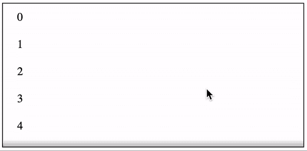
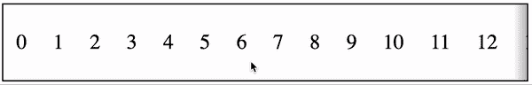

# 如何创建水平+垂直滚动阴影

> 原文：<https://javascript.plainenglish.io/how-to-create-horizontal-vertical-scroll-shadows-26aa7a7f00a0?source=collection_archive---------3----------------------->

## 用纯 CSS 还是用 CSS + JavaScript


Photo by [Kelly Sikkema](https://unsplash.com/@kellysikkema?utm_source=medium&utm_medium=referral) on [Unsplash](https://unsplash.com?utm_source=medium&utm_medium=referral)

# 我的旅程

我第一次注意到 gmail 中的滚动阴影——当你向下滚动收件箱时，顶部工具栏上会出现一个小阴影，表明它下面有东西，因此是可滚动的。我喜欢这个。它巧妙地告诉用户，在当前的视窗中隐藏了一些东西，如果你向那个方向滚动，就会看到。我想为我的应用程序做一些类似的事情。

# CSS 滚动阴影

这种效果完全可以用 CSS 来实现。它包括多个相互叠加的背景图像。要实现一个单一的滚动阴影，你需要一个阴影和一个阴影覆盖。阴影是有可滚动内容时看到的阴影效果。当不再有可滚动内容时，阴影覆盖将覆盖前述阴影。与其他背景属性一起，垂直滚动阴影的 CSS 如下所示:

```
background-image: linear-gradient(to top, white, white),
    linear-gradient(to top, white, white),
    linear-gradient(to top, rgba(0, 0, 0, 0.25), rgba(255, 255, 255, 0)),
    linear-gradient(to bottom, rgba(0, 0, 0, 0.25), rgba(255, 255, 255, 0));
  background-position: bottom center, top center, bottom center, top center;
  background-color: white;
  background-repeat: no-repeat;
  background-size: 100% 20px, 100% 20px, 100% 10px, 100% 10px;
  background-attachment: local, local, scroll, scroll;
```



Vertical Scroll Shadow

如果你想要一个水平的滚动阴影，只需交换顶部，底部，高度和宽度变量。

```
background-image: linear-gradient(to right, white, white),
    linear-gradient(to right, white, white),
    linear-gradient(to right, rgba(0, 0, 0, 0.25), rgba(255, 255, 255, 0)),
    linear-gradient(to left, rgba(0, 0, 0, 0.25), rgba(255, 255, 255, 0));
  background-position: left center, right center, left center, right center;
  background-repeat: no-repeat;
  background-color: white;
  background-size: 20px 100%, 20px 100%, 10px 100%, 10px 100%;
  background-attachment: local, local, scroll, scroll;
```



Horizontal Scroll Shadow

注意:如果你真的想要理解它的内部原理，使用不同颜色的线性渐变，这样你就可以直观地看到每个背景是如何影响整体效果的。

# Javascript 滚动阴影

通过 Javascript 也可以达到同样的效果。通过监听滚动事件，您可以启用/禁用创建阴影的绝对定位的前的*和*后的*。使用 React 和[样式的组件](https://medium.com/javascript-in-plain-english/the-modern-way-to-style-with-styled-components-c3c51b750b5f)，代码看起来会像这样，以达到相同的效果:*

```
const Shadow = styled.div`
  position: relative;
  border: 1px solid black;
  ${props =>
    props.showStart
      ? css`
          ::before {
            content: '';
            position: absolute;
            top: 0;
            left: 0;
            right: 0;
            height: 10px;
            background: linear-gradient(
              to top,
              rgba(255, 255, 255, 0),
              rgba(0, 0, 0, 0.25)
            );
          }
        `
      : ''}
  ${props =>
    props.showEnd
      ? css`
          ::after {
            content: '';
            position: absolute;
            bottom: 0;
            left: 0;
            right: 0;
            height: 10px;
            background: linear-gradient(
              to bottom,
              rgba(255, 255, 255, 0),
              rgba(0, 0, 0, 0.25)
            );
          }
        `
      : ''}
`;const Container = styled.div`
  height: 200px;
  overflow: auto;
`;const Content = styled.div`
  padding: 10px 20px;
`;const VerticalJSScrollShadow = () => {
  const [showStart, setShowStart] = React.useState(false);
  const [showEnd, setShowEnd] = React.useState(false);
  const ref = React.useRef(); React.useEffect(() => {
    const onScroll = () => {
      const { scrollHeight = 0, scrollTop = 0, offsetHeight = 0 } =
        ref.current || {};
      setShowStart(scrollTop > 0);
      setShowEnd(scrollTop + offsetHeight < scrollHeight);
    };
    onScroll();
    const node = ref.current;
    node.addEventListener('scroll', onScroll);
    return () => {
      node.removeEventListener('scroll', onScroll);
    };
  }, []); return (
    <Shadow showEnd={showEnd} showStart={showStart}>
      <Container ref={ref}>
        {Array.from(Array(20)).map((i, idx) => (
          <Content key={idx}>{idx}</Content>
        ))}
      </Container>
    </Shadow>
  );
};
```

对于水平滚动阴影，可以通过使用左、右和宽度来实现类似的效果。参见[此处的](https://github.com/mjchang/medium/blob/master/scroll-shadow/src/HorizontalJSScrollShadow.js)了解完整实施。

# 优点+缺点

鉴于这两种截然不同的选择创造了相同的效果，有一些小的重要差异。

**性能:**CSS 方法明显更好，因为它是通过一次渲染实现的，而 Javascript 方法需要多次渲染来设置`showStart`和`showEnd`状态。

**浏览器支持:**CSS 方法在 Safari 中不起作用(从 Safari 14 开始)。阴影会出现，但不会在滚动时消失。Javascript 方法没有这个可支持性问题。

**开发:**CSS 方法比 Javascript 方法简单得多。CSS 方法只需要设置背景样式，而 Javascript 方法需要 refs、state 和 scroll 监听器。

# 最后的想法

在我的应用程序中，我最初选择了 CSS 方法。当我意识到 Safari 的问题时，我设计了 Javascript 方法的原型，但最终决定放弃它——少数 Safari 用户的需求不值得对所有用户造成性能影响。不管采用哪种方法，滚动阴影都是一种非常棒的视觉工具，可以帮助用户更好地浏览任何应用程序。

# 资源

*   [本文 Github 回购](https://github.com/mjchang/medium/tree/master/scroll-shadow)
*   [本文的 CodeSandbox】](https://codesandbox.io/s/github/mjchang/medium/tree/master/scroll-shadow)