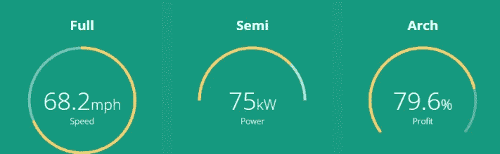
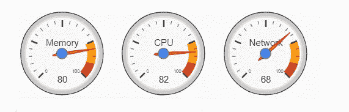
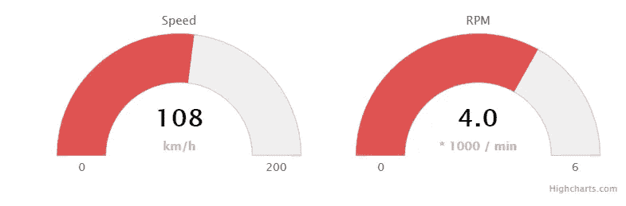
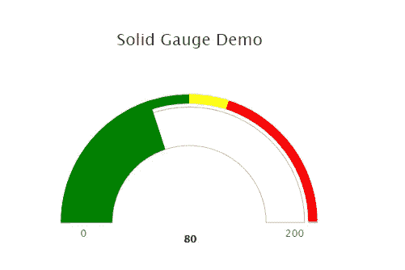

# 如何以角度创建令人印象深刻的仪表图

> 原文：<https://javascript.plainenglish.io/how-to-create-impressive-looking-gauge-charts-using-angular-6-8f91dfd6fc5c?source=collection_archive---------0----------------------->

## 我使用 3 个免费图表组件库的经验


必要时，仪表图或速度计图对于可视化数据非常有用。但是怎么用 Angular 实现呢？

最近，我做了一些研究，以找到合适的角度仪表图组件。我试用了 3 个免费的图表组件库:

> [ngx-gauge @ 1 . 0 . 0-β4](https://github.com/ashish-chopra/ngx-gauge#readme)
> 
> [angular-Google-charts @ 0 . 1 . 2](https://github.com/FERNman/angular-google-charts)
> 
> [角度高度图](https://github.com/cebor/angular-highcharts#readme)

虽然这三种工具都可以生成好看的仪表图，但是它们提供的功能却大不相同，当然，它们都有各自的优势和局限性。

让我们一个一个来看看。

## **ngx-gauge**

这是我测试的第一个组件，因为它出现在谷歌搜索结果的顶部。



它是一个简单而好看的组件，具有基本的功能。它易于安装和使用。只需按照 [GitHub](https://github.com/ashish-chopra/ngx-gauge#readme) 上的说明进行操作。需要强调的一个特性是“阈值颜色范围”，您可以如下定义一个“`thresholdConfig`”属性，因此颜色将根据数据值而变化。

我在 StackBlitz 上创建了一个[示例](https://angular-gaugecontrols.stackblitz.io/ngxgauge)来演示这个特性。

```
thresholdConfig = {
        '0': {color: 'green'},
        '40': {color: 'orange'},
        '75.5': {color: 'red'}
    };
```

该组件的缺点是它不支持一些常见的功能，如绘制色带或刻度盘箭头。不幸的是，色带是我的项目必须具备的，所以必须使用不同的组件。

## 角度谷歌图表

Angular Google charts 是 Angular 6+的 Google charts 库的一个包装器。Google Charts 是一个强大的数据工具，包括丰富的交互式图表库。



要在 Angular 中设置仪表图，首先安装软件包

```
npm install angular-google-charts
```

然后导入 app.module.ts

```
imports: [
    ...
    GoogleChartsModule.forRoot(),
    ...
  ],
```

在使用图表的组件中

我把上面的代码打包成一个 [StackBlitz 项目](https://angular-gaugecontrols.stackblitz.io/google)供你参考。

虽然仪表非常易于配置，并且支持三种颜色部分(绿色、黄色和红色)，但是颜色不能自定义，并且不支持其他颜色。对于一个典型的用例来说，这可能不是一个问题，但是我的项目需要特定的颜色，而不仅仅是三种颜色。所以搜索还在继续。

## 角度高度图

它是基于 SVG 的非常流行的 [Highcharts](https://gist.github.com/sunnyy02/683d2b0c20e51005e2cee0c3669e91a8.js) JS 图表库的包装器。虽然 angular-highcharts 的特性非常丰富，但是大量的属性也使得该组件对于刚接触这个库的开发人员来说有些混乱。



使用 angular-highcharts 的仪表图的安装和设置不是很简单，但是一旦设置好了，它就非常好用。

首先，用 npm 安装。

```
npm install angular-highcharts@6.2.6
npm install highcharts@4.2.5
```

请注意，6.2.6 版适用于 Angular 6。

然后在 app.module.ts 中，导入以下内容。

```
import { ChartModule, HIGHCHARTS_MODULES } from 'angular-highcharts';
import * as more from 'highcharts/highcharts-more.src';
import * as solidGauge from 'highcharts/modules/solid-gauge.src';...
  providers: [{ provide: HIGHCHARTS_MODULES, useFactory: () => [more, solidGauge] }],
...
```

在组件类中

上面的结果如下



正如您所看到的，上面的示例代码中的可配置属性比其他两个组件中的多。这只是一个简单的版本，更多可用的 API，请访问 [highcharts API 参考网站](https://api.highcharts.com/highcharts/chart)。

## 结论

最后，我为我的项目选择了 angular highcharts，因为它是唯一支持可配置色带和刻度盘箭头的组件。

但是如果你只是需要一个简单的速度计，ngx-gauge 似乎也是一个不错的选择。我喜欢它是一个“纯粹的”角度解决方案，并且使用起来足够简单。

谷歌图表介于两者之间——它有一个复杂的外观，但缺乏一些重要的功能。

上述 angular-highcharts 演示的源代码可以在 [Github](https://github.com/sunnyy02/angular-highcharts-demo) 上获得。

*如果您还不是 Medium 的付费会员，* [***您可以访问此链接***](https://sunnysun-5694.medium.com/membership) *。你可以无限制地阅读媒体上的所有报道。我会收你一部分会员费作为介绍费。*