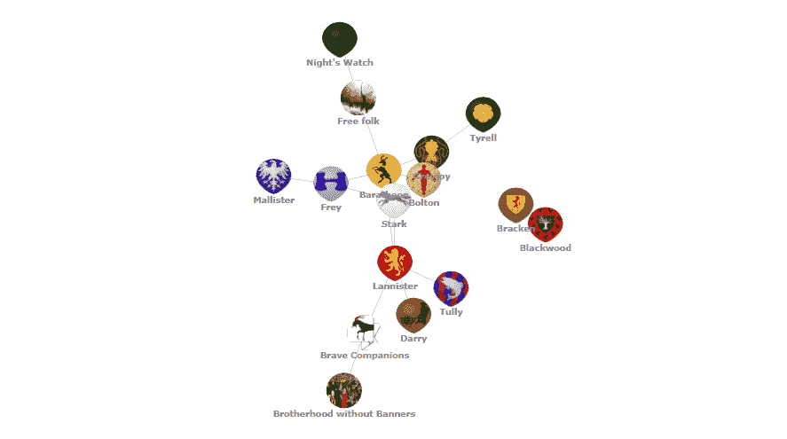
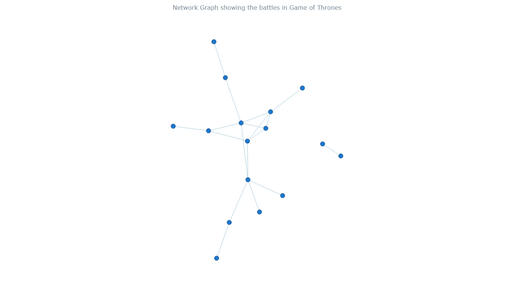
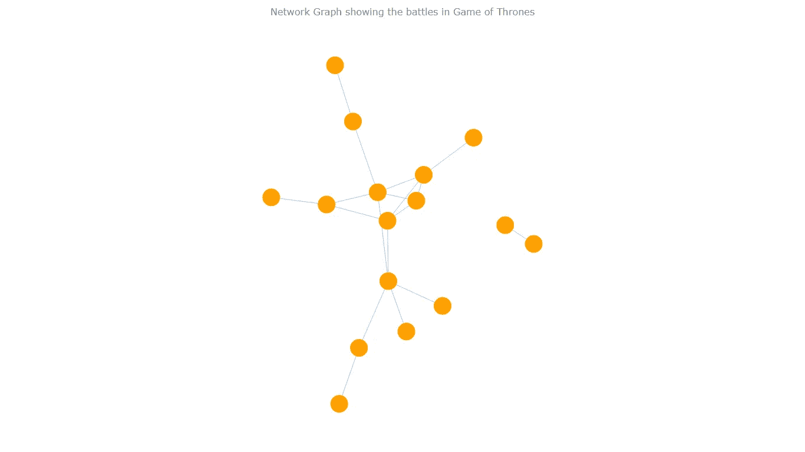
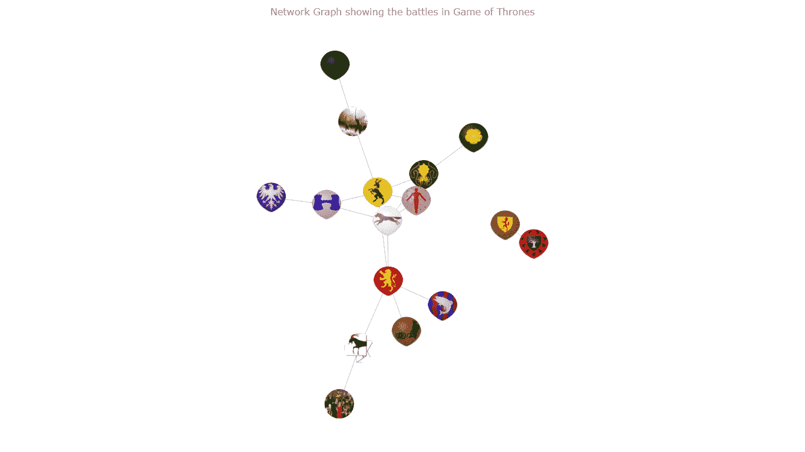

# 如何创建 JavaScript 网络图

> 原文：<https://javascript.plainenglish.io/how-to-create-javascript-network-graph-b40e6f10928c?source=collection_archive---------2----------------------->


[**网络图**](https://www.anychart.com/chartopedia/chart-type/network-graph/) 是一种特殊的、非常有趣的数据可视化形式。与更传统的图表类型如[条形图](https://www.anychart.com/chartopedia/chart-type/bar-chart/)或[饼图](https://www.anychart.com/chartopedia/chart-type/pie-chart/)不同，网络图不仅仅是可视化数字数据。在这些图表中，您将每个对象表示为一个点，称为节点，将对象之间的连接表示为一条线，称为链接或边。在这里，我们不关注用我们通常习惯的精度来表示对象。相反，我们试图发现网络或网络部分中的关系，而不太担心单个节点。

现在，我将通过**指导你如何使用 JavaScript** (HTML5)开发一个交互式网络图。受本·苏林斯创作的一个有趣的可视化作品[的启发，我决定收集过去十年最大的电视连续剧](https://bensullins.com/every-game-thrones-battle-visualized/)[权力的游戏](https://en.wikipedia.org/wiki/Game_of_Thrones)的数据。这是一个史诗般的幻想故事，围绕着各种派系似的房子。所以在本教程中，我将**通过展示谁攻击了谁来可视化《权力的游戏》世界中的关系**。跟着我，这将是一次很酷的冒险！

# 要制作的网络图



# 从头开始构建 JS 网络图

基本上，要构建一个基于 JS 的网络图，我们需要遵循与任何 JavaScript 图表相同的四个步骤:

*   创建一个 HTML 页面。
*   添加必要的脚本。
*   加载将被可视化的数据。
*   画图表。

## 1.创建 HTML 页面

构建网络图的第一步是建立一个 HTML 页面。这包括为图表创建一个基本的 HTML 模板，以及添加必要的 CSS 规则。

这里我们还为 HTML 页面添加了一个标题，并创建了一个 div 来包含图表。

```
<!DOCTYPE html>
<html>
  <head>
    <title>JavaScript Network Graph</title>
    <style>
      html, body, #container {
        width: 100%;
        height: 100%;
        margin: 0;
        padding: 0;
      }
    </style>
  </head>
  <body>
    <div id="container"></div>
    <script>
 ***// The chart code goes here.***    </script>
  </body>
</html>
```

我已经设置了 CSS 来使容器 div 填充整个页面。当然，您可能希望根据您的用例来改变这一点。

## 2.添加必要的脚本

第二步是添加所有必要的脚本。我们将使用 [AnyChart JS Charts](https://www.anychart.com) ，这是一个非常易于使用且功能强大的 JavaScript 图表库。我个人非常喜欢 AnyChart，因为它对初学者和专业人士都非常有用。它可以让您快速地构建数据可视化的原型，并真正有助于加快整个开发过程。

为了充分利用 AnyChart 库，我们需要添加其专用的[模块](https://docs.anychart.com/Quick_Start/Modules)。在本教程中，我们将使用其中的三个。绘制我们的网络图需要核心和图形模块，数据适配器模块将帮助我们导入《权力的游戏》的 JSON 数据(稍后将详细介绍)。

```
<script src="https://cdn.anychart.com/releases/8.8.0/js/anychart-core.min.js"></script><script src="https://cdn.anychart.com/releases/8.8.0/js/anychart-graph.min.js"></script><script src="https://cdn.anychart.com/releases/8.8.0/js/anychart-data-adapter.min.js"></script>
```

我们将这些脚本添加到代码的开头。

## 3.加载我们将要可视化的数据

如前所述，我们将使用的数据基于《权力的游戏》。我发现了一个很棒的数据集，[五王之战](https://github.com/chrisalbon/war_of_the_five_kings_dataset)。数据最初来源于[一个火与冰的维基](http://awoiaf.westeros.org/index.php/War_of_the_Five_Kings)，一个致力于《权力的游戏》的维基。然后，维基媒体基金会机器学习主任、数据科学家克里斯·阿尔邦(Chris Albon)对其进行了清理。为了这个 JS 网络图教程，我自己做了进一步的处理；你可以在 JSON 的这里找到结果[。](https://static.anychart.com/git-storage/word-press/data/network-graph-tutorial/data.json)

事实是，AnyChart 希望您的网络图数据采用特定的格式。它需要一个包含节点数组和边数组的 JSON 对象。每个节点都需要一个“id”。边需要一个“从”和“到”，分别是每个连接的源和目标。

像这样:

```
nodes: [{ "id": "Lannister" }]
edges: [{ "from": "Lannister", "to": "Tully" }]
```

然后我们需要导入我们的数据。为 JavaScript 数据可视化加载数据有时会很痛苦。但是使用 AnyChart，[处理数据](https://docs.anychart.com/Working_with_Data/Overview)真的非常简单。利用正确的函数，您可以轻松导入 CSV、JSON、XML，甚至 Google 电子表格！

这里，我们的数据是 JSON 格式的，所以我们需要下面的函数:

```
anychart.data.loadJsonFile('https://static.anychart.com/git-storage/word-press/data/network-graph-tutorial/data.json', function (data) {
 ***// The chart code goes here.*** })
```

因为我们希望只有在数据成功加载后才绘制图表，所以我们将在这个函数中放置绘制图表的代码。

## 4.绘制图表

第四步也是最后一步是绘制图表。在这里，我们命令从我们的数据创建一个图表，设置图表标题，然后使用这些非常简单的函数可视化我们的图形:

```
***// create a chart from the loaded data*** var chart = anychart.graph(data);***// set the title*** chart.title("Network Graph showing the battles in Game of Thrones");***// draw the chart***chart.container("container").draw();
```

这就是结果:



> 在 [AnyChart Playground](https://playground.anychart.com/GyGRrCsT) 或 [CodePen](https://codepen.io/waydeherman/pen/vYLJygE) 上查看这个带有完整 HTML/CSS/JS 代码的网络图示例。

也许没有我们基于 D3.js 的灵感在美学上给人留下深刻印象，但我们稍后会谈到这一点。花些时间悬停在节点上，或许可以拖动它们。有多神奇？通过这四个简单的步骤和几行 JavaScript 代码，我们创建了这个相当强大的交互式网络图。

完整代码如下，查看一下:

```
<html>
  <head>
    <script src="https://cdn.anychart.com/releases/8.8.0/js/anychart-core.min.js"></script>
    <script src="https://cdn.anychart.com/releases/8.8.0/js/anychart-graph.min.js"></script>
    <script src="https://cdn.anychart.com/releases/8.8.0/js/anychart-data-adapter.min.js"></script>
    <style type="text/css">
      html, body, #container {
        width: 100%;
        height: 100%;
        margin: 0;
        padding: 0;
      }
    </style>
  </head>
  <body>
    <div id="container"></div>
    <script>
      anychart.onDocumentReady(function () {
        anychart.data.loadJsonFile("https://static.anychart.com/git-storage/word-press/data/network-graph-tutorial/data.json", function (data) {
 ***// create a chart from the loaded data***          var chart = anychart.graph(data);
 ***// set the title***          chart.title("Network Graph showing the battles in Game of Thrones");
 ***// draw the chart***          chart.container("container").draw();
        });
      });
    </script>
  </body>
</html>
```

# 自定义网络图外观

尽管我们目前的设想令人印象深刻，但我们可以做得更好。好多了。所有像样的 JS 图表库都允许您使用它们的 API 定制您构建的图表。作为数据可视化开发人员，利用这些定制来更好地讲述您的数据故事是一项关键技能。有些定制是美学上的，比如改变元素的大小或颜色，有些是功能上的，比如改变工具提示。

下面，我将演示一些可用于网络图的定制技术。

## 更改迭代步骤

网络图是用一种反复尝试改进其布局的算法绘制的。随着每次迭代，该算法根据误差度量进一步优化一个步骤。这意味着迭代次数越多越好。然而，有时算法对优化布局的想法和你(以及你的用户)对优化布局的想法可能会有很大的不同。通过改变迭代次数，我们可以得到适合我们需要的不同布局。

添加下面的代码，你会看到如果你只使用 10 次迭代会发生什么，默认是 500 次。

```
***// set the iteration step*** chart.layout().iterationCount(10);
```

这只是一个简单的演示。让我们跳过这个变化，看看如何做一些关于 JS 网络图可视化的有趣的事情。

## 自定义节点(基本):

我们可以自定义每个节点的大小、填充和笔画，并为每个状态设置不同的规则。我所说的状态是指默认节点、悬停节点或选定节点。JavaScript 网络图中的颜色可以像设置 CSS 颜色一样设置，这里我们将使用十六进制代码。

```
***// set the size of nodes*** nodes.normal().height(30);
nodes.hovered().height(45);
nodes.selected().height(45);***// set the fill of nodes*** nodes.normal().fill("#ffa000");
nodes.hovered().fill("white");
nodes.selected().fill("#ffa000");

***// set the stroke of nodes*** nodes.normal().stroke(null);
nodes.hovered().stroke("#333333", 3);
nodes.selected().stroke("#333333", 3);
```



> 在 [AnyChart Playground](https://playground.anychart.com/YySiLKVy/) 或 [CodePen](https://codepen.io/waydeherman/pen/qBbVOVE) 上查看这个带有完整 HTML/CSS/JS 代码的网络图示例。

## 自定义节点(高级):

就我个人而言，我最喜欢的网络图美学变化是用图像代替节点图标。在这里，我们可以用图像替换维斯特洛的大房子(我们的节点)。在我们的 JSON 中，通过将图像的文件路径添加到每个节点的对象中，可以很容易地做到这一点。例如:

```
{id: "Example",
  fill: {
    src: "example_url"
  }
},
```

我已经做了这个修改，更新后的文件可以在[这里](https://static.anychart.com/git-storage/word-press/data/network-graph-tutorial/data_images.json)找到。通过使用包含图像的 JSON，我们得到了下图:



> 在 [AnyChart 游乐场](https://playground.anychart.com/y209YF9m/)或 [CodePen](https://codepen.io/waydeherman/pen/xxZPwpx) 上看到这个带有完整 HTML/CSS/JS 代码的网络图示例。

多酷啊。这比以前吸引人多了。

## 节点标签

不是所有人都知道每个房子的横幅，并且必须悬停在每个节点上以查看它属于哪个节点会非常痛苦。为了解决这个问题，我们可以标记每个节点。这可以通过下面的代码轻松完成:

```
***// enable the labels of nodes*** chart.nodes().labels().enabled(true);

***// configure the labels of nodes*** chart.nodes().labels().format("{%id}");
chart.nodes().labels().fontSize(12);
chart.nodes().labels().fontWeight(600);
```

这导致了:


> 在 [AnyChart Playground](https://playground.anychart.com/Bm0Yttoh/) 或 [CodePen](https://codepen.io/waydeherman/pen/NWxwGyY) 上查看这个带有完整 HTML/CSS/JS 代码的网络图示例。

为了方便起见，下面是这个(本教程的最终版本)交互式 JavaScript 网络图的完整代码，它可视化了关于《权力的游戏》战斗的数据:

```
<html>
  <head>
    <script src="https://cdn.anychart.com/releases/8.8.0/js/anychart-core.min.js"></script>
    <script src="https://cdn.anychart.com/releases/8.8.0/js/anychart-graph.min.js"></script>
    <script src="https://cdn.anychart.com/releases/8.8.0/js/anychart-data-adapter.min.js"></script>
    <style type="text/css">
      html, body, #container {
        width: 100%;
        height: 100%;
        margin: 0;
        padding: 0;
      }
    </style>
  </head>
  <body>
    <div id="container"></div>
    <script>anychart.onDocumentReady(function () {
  anychart.data.loadJsonFile("https://static.anychart.com/git-storage/word-press/data/network-graph-tutorial/data_images.json", function (data) { ***// create a chart from the loaded data*** var chart = anychart.graph(data); ***// set the title*** chart.title("Network Graph showing the battles in Game of Thrones"); ***// access nodes*** var nodes = chart.nodes(); ***// set the size of nodes*** nodes.normal().height(30);
    nodes.hovered().height(45);
    nodes.selected().height(45); ***// set the stroke of nodes***
    nodes.normal().stroke(null);
    nodes.hovered().stroke("#333333", 3);
    nodes.selected().stroke("#333333", 3); ***// enable the labels of nodes*** chart.nodes().labels().enabled(true); ***// configure the labels of nodes*** chart.nodes().labels().format("{%id}");
    chart.nodes().labels().fontSize(12);
    chart.nodes().labels().fontWeight(600); ***// draw the chart*** chart.container("container").draw(); });
}); </script>
  </body>
</html>
```

# 结论

就像这样，我们有一个很棒的可视化工具来解开这个网络中的复杂关系。在本教程中，我已经展示了建立和运行 JS 网络图是多么的快速和简单，以及我们如何再多一点点努力，通过一些选择上的调整，让我们的图表变得生动起来。

老实说，你可以做出更多的改变。访问[网络图图库](https://www.anychart.com/products/anychart/gallery/Network_Graph/)获取更多灵感，同时查看这份内容丰富的[网络图文档](https://docs.anychart.com/Basic_Charts/Network_Graph)并在 [AnyChart 文档](https://docs.anychart.com)中寻找关于如何进一步改进该图表以及如何实施的想法。

如果这个教程激起了你对基于该剧的图表的兴趣，看看这个令人敬畏的《权力的游戏》32 个数据可视化列表。

*原载于 2020 年 7 月 22 日*[*【https://www.anychart.com】*](https://www.anychart.com/blog/2020/07/22/network-graph-javascript/)*。作者韦德·赫尔曼。*

# 简单英语的 JavaScript

喜欢这篇文章吗？如果有，通过 [**订阅解码，我们的 YouTube 频道**](https://www.youtube.com/channel/UCtipWUghju290NWcn8jhyAw) **获取更多类似内容！**