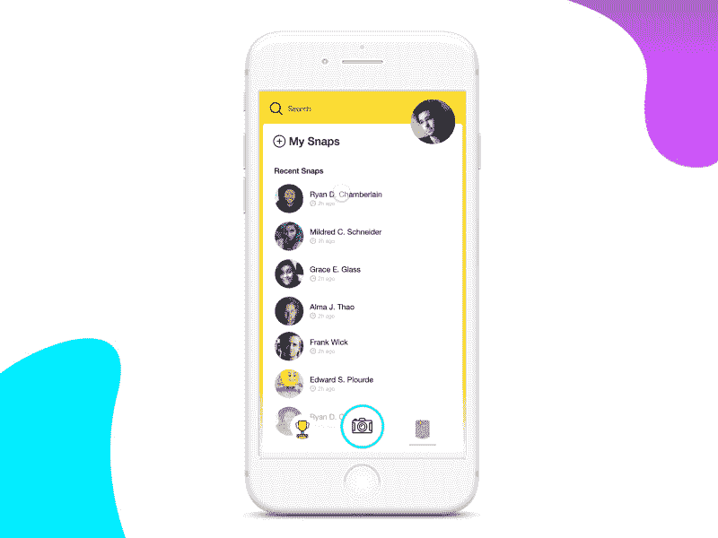
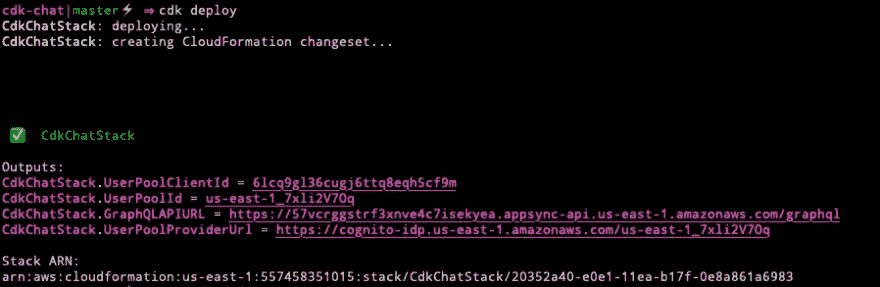

# 如何在 React 中创建实时聊天应用程序

> 原文：<https://javascript.plainenglish.io/how-to-create-real-time-chat-application-in-react-1e7ae41b0cb2?source=collection_archive---------4----------------------->

## 了解如何使用 React 和 GraphQL 创建实时聊天应用程序。



在本文中，我们将使用 React、GraphQL、AWS CDK 和 AWS AppSync 创建一个实时聊天应用程序。这个应用程序包含认证，数据库和前端。

这是一个全栈应用程序，所以你必须知道一些基本概念，如 JavaScript，Restful API 或 GraphQL API。

让我们开始吧。

# 入门指南

要开始，首先您必须安装和配置 AWS CLI

```
npm install -g aws-cdk
```

安装 CDK 后，通过以下命令运行 CDK。

*   初始化一个新的项目。
*   **部署**——部署 AWS 基础设施。
*   **diff**——用于比较堆栈和已部署的堆栈，并向您反馈您所做的更改。这将通过运行 deploy 命令来实现。

# 创建 CDK 项目

首先通过以下命令创建一个新项目:

```
mkdir cdk-chat

cd cdk-chat
```

然后使用 **init** 命令创建 CDK 项目:

```
cdk init --language=typescript
```

项目创建后，您可以看到项目中的文件和文件夹。主代码将出现在 **lib/cdk-chat-stack.ts.** 中

在我们的项目中使用 AWS 服务构造。我们必须安装以下服务:

*   亚马逊 DynamoDB(数据库)。
*   亚马逊 Cognito(认证)。
*   AWS AppSync (GraphQL API，实时)。
*   AWS IAM(管理 IAM 权限)。

现在，通过以下命令安装必要的依赖项:

```
npm install @aws-cdk/aws-appsync @aws-cdk/aws-cognito @aws-cdk/aws-dynamodb @aws-cdk/aws-iam
```

安装完依赖项后，检查 **package.json** 文件是否更新了这些相同版本的 **aws-cdk/core** 。

# 定义 GraphQL 模式

现在我们已经创建了 CDK 项目。现在我们的聊天应用程序需要 GraphQL 模式。在 CDK 目录中，创建一个名为 graphql 的新文件夹和一个名为 **schema.graphql** 的新文件，然后添加以下代码:

# 编写 CDK 代码

现在已经创建了模式，然后通过打开 **lib/cdk-chat-stack.ts** 定义 CDK 代码，并添加以下导入。

您可以导入顶级导入或单个 API。这里我们为每个库使用单独的 API。

# 创建身份验证服务

现在我们可以开始创建服务了。首先，我们必须由 Amazon Cognito 创建认证服务。将以下代码添加到构造函数中。

我们创建的代码提供了以下操作:

*   允许用户通过启用自助注册来注册。
*   注册时发送电子邮件通知。
*   定义所需的注册属性。
*   创建在 React 客户端使用的客户端 ID。

现在从 CLI 执行 diff 命令:

```
cdk diff
```

# 创建 DynamoDB 表和 GSI

现在我们必须创建一个 DynamoDB 表，并配置 GSI 来查询 RoomId 中的消息。

# 创建应用程序同步 API

对于认证和数据库服务，我们必须通过创建 API 来进行配置。AWS AppSync 是一个 GraphQL 服务。有两种方法可以使用 CDK 和 App Sync 创建解析器。在我们的例子中，我们使用了其中的两个。

# 客户端应用程序

您可以看到我们为此应用程序创建的完整组件。

我们还可以实现单独的 API 调用，与后端交互来验证用户。

为 **App.js** 添加以下代码。

为 **Chat.js** 添加以下代码。

为 **Rooms.js** 添加以下代码。

在 **Profile.js** 中添加以下代码。

# 理解 API 调用

现在让我们将后端与前端应用程序连接起来。

## 证明

对于身份验证，您可以在 React 组件中使用 Auth class。

对于基本的基本认证，您可以使用 Amplify React UI 组件，并在其中添加以下代码行。

```
import React from 'react';
import { withAuthenticator, AmplifySignOut } from '@aws-amplify/ui-react';

const App = () => (
  <div>
    <AmplifySignOut />
    My App
  </div>
);

export default withAuthenticator(App);
```

## 认证类别

它包含几个操作，如注册，登录和密码恢复管理。

对于注册用户，您可以使用注册方法。

```
import { Auth } from 'aws-amplify';

await Auth.signUp({
  username: "dabit3",
  password: "MyCoolPassword",
  attributes: { email: "you@yourdomain.com" }
});
```

# 应用程序接口

为了与 GraphQL API 交互，我们使用 API 类别。

## 发送查询

```
import { API } from 'aws-amplify';
import { listRooms } from './graphql/queries';

const roomData = await API.graphql({
  query: listRooms
});
```

## 发送包含变量的查询

```
import { API } from 'aws-amplify';
import { createRoom } from './graphql/mutations';

await API.graphql({
  query: createRoom,
  variables: {
    input: {
      name: "Cool cats"
    }
  }
})
```

让我们看一个如何在应用程序中管理它们的例子。

## 在实时处理中，当创建房间时监听更新。

```
import { API } from 'aws-amplify';
import { onCreateRoom } from './graphql/subscriptions';

API.graphql({
  query: OnCreateRoom
]})
.subscribe({
  next: roomData => {
    // roomData is the data from the mutation that triggered the subscription     
  }
})
```

## 在实时处理中，当在特定房间中创建消息时，监听更新。

```
API.graphql({
  query: OnCreateMessage,
  variables: {
    roomId: id
  }
})
.subscribe({
  next: async messageData => {
    // messageData is the data from the mutation that triggered the subscription
  }
})
```

# 部署后端

现在，您可以通过在终端中运行 **deploy** 命令来部署一切。

```
cdk deploy
```

部署后，您可以看到如下输出:

```
Outputs:
CdkChatStack.UserPoolClientId = 6lcq9gl36cugj6ttq8eqh5cf9m
CdkChatStack.UserPoolId = us-east-1_7xli2V7Oq
CdkChatStack.GraphQLAPIURL = https://57vcrggstrf3xnve4c7isekyea.appsync-api.us-east-1.amazonaws.com/graphql
```



这些是 **cnfOutput** 的结果值。当连接到客户端应用程序时，您可以使用这些值。

# 结论

我希望你喜欢这个应用程序，它是一个完整的应用程序，包含认证、数据库管理和完整的 API 工具。您还可以开发自己的全功能实时聊天应用程序。

感谢阅读！

## 简单英语的 JavaScript

你知道我们有三份出版物和一个 YouTube 频道吗？在[**plain English . io**](https://plainenglish.io/)找到一切的链接！