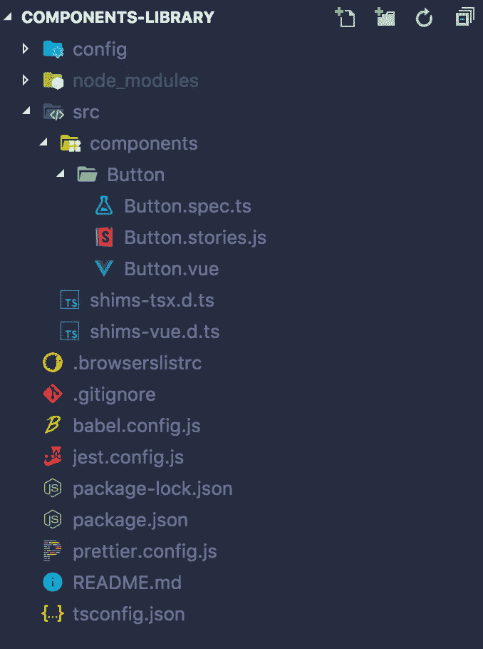
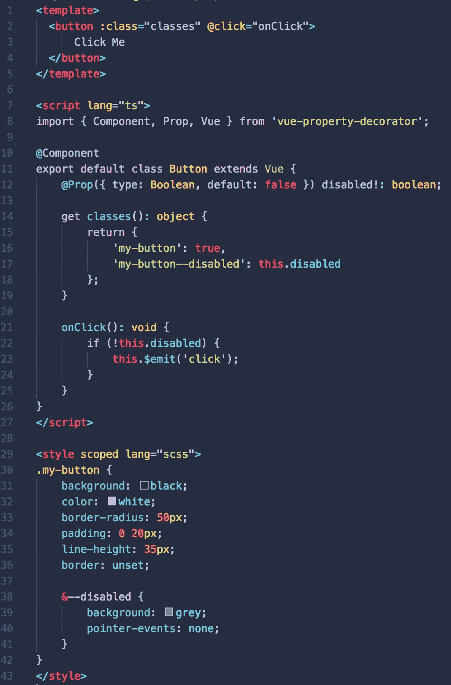
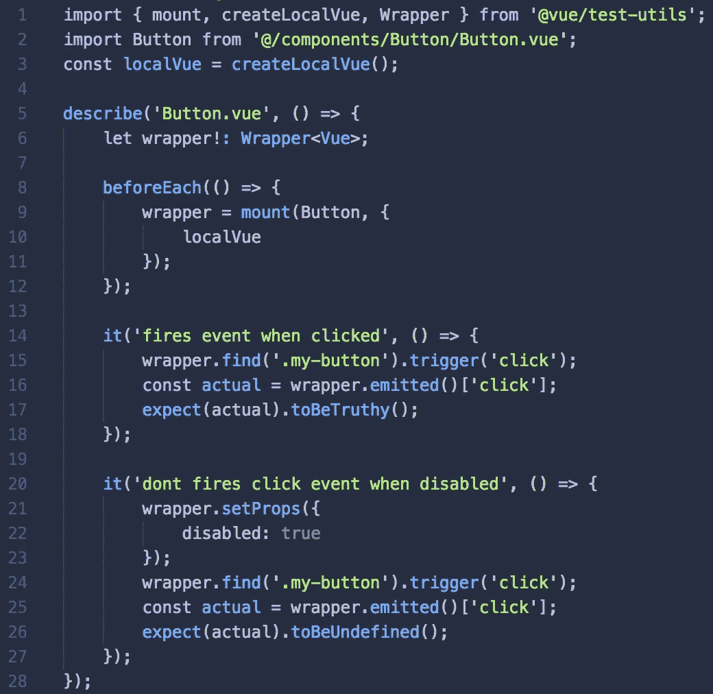
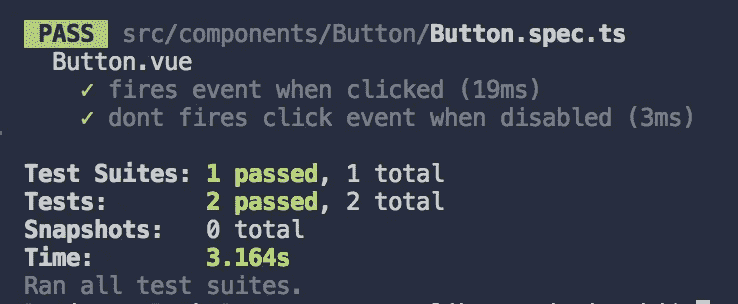
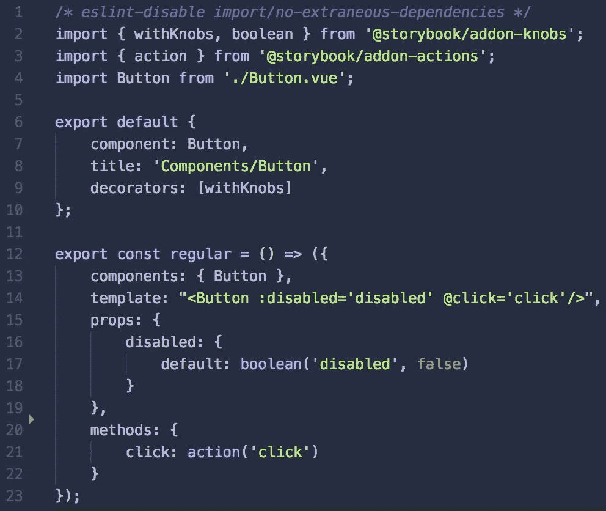
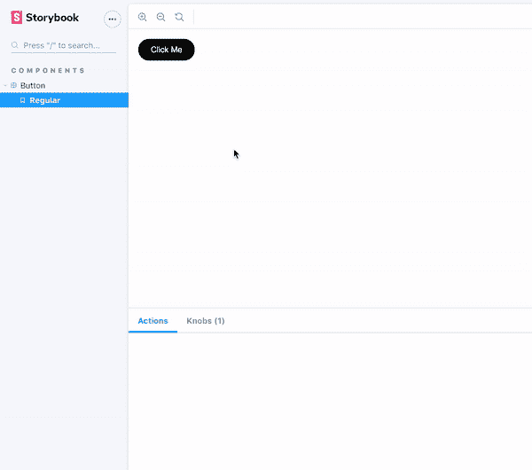
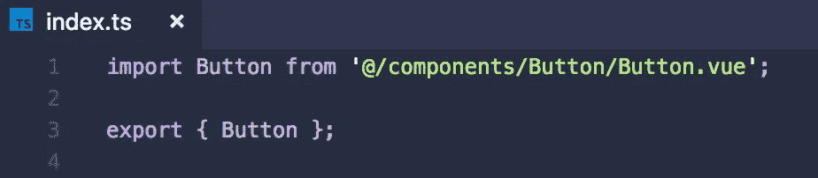
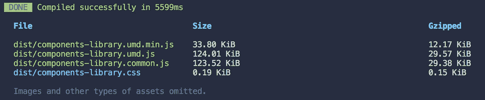

# 如何创建、测试和捆绑 Vue 组件库

> 原文：<https://javascript.plainenglish.io/how-to-create-test-bundle-vue-components-library-8c4828ab7b00?source=collection_archive---------2----------------------->


# 介绍

Vue 是一个强大的 JavaScript 框架，采用基于组件的方法设计。Vue 提供了构建可伸缩的单页面应用程序的工具，并简化了这个过程。在我们的上下文中，组件是一个独立的构建块，可以很容易地在一个或多个应用程序中重用。

组件库可以确保应用程序各部分之间(或应用程序之间)一致的设计语言，并将加快开发过程。使用这样的库将有助于您专注于合成，而不是重复实现。

在我们的项目中实施这种方法对我们来说是正确的决定。因此，我决定撰写本指南，介绍如何创建、构建、测试和捆绑 Vue 组件库。我们将使用 **Vue 类风格语法**和**类型脚本**， **Jest** 用于测试， **Storybook** 用于可视化测试和文档，而 **Webpack** 作为我们的捆绑器。

# 项目配置

从安装 [@vue/cli](https://cli.vuejs.org/) 开始——这将帮助我们搭建我们的 vue 项目:

```
npm install -g [@vue/cli](http://twitter.com/vue/cli)
```

接下来，运行以下命令:

```
vue create components-library
```

对于我们的需求，我们会选择“手动选择特性”；紧接着，请确保选择以下选项:Typescript(类样式组件语法)、CSS 预处理程序(Scss)、单元测试(Jest)。

让我们将 storybook 添加到我们的项目中，我们将在稍后讨论更多关于它的内容，现在只需遵循安装步骤:

```
vue add storybook
```

太好了！现在我们有了一个空的 vue 应用程序项目，感谢 [@vue/cli](https://cli.vuejs.org/) 它超级简单。

# 目录结构

为了使这个项目组件的基础上，我们需要做一些调整，删除不必要的文件，文件夹和做一些重组工作。

首先，我们希望删除不必要的文件和文件夹，因此只需删除以下文件:public 文件夹、assets 文件夹、App.vue、HelloWorld.vue、main.ts 和 tests 文件夹(不要担心，测试文件将包含在组件文件夹中)—由于我们的项目目的，我们不再需要这些文件。

其次，我们希望确保我们的项目文件夹结构符合我们的需求。我们应该为每个组件文件夹添加 3 个文件:Vue 组件、测试文件和故事书文件在同一个文件夹下。对于这个例子，我决定创建一个按钮组件。



Once you’r done, the structure should look as above

**重要提示:**确保更新 jest.config.js 文件中的测试路径。

```
module.exports = {preset: "@vue/cli-plugin-unit-jest/presets/typescript-and-babel",testMatch: ["**/components/**/*.spec.[jt]s?(x)"]};
```

# 我们的第一个组件

终于！有趣的事情。我们将实现基本的按钮组件，它将在点击时触发一个事件，也可以通过传递一个道具来禁用。



Our amazing button component

# 我们来测试一下！

当创建一个组件库时——你想要确保你的项目的消费者收到一个稳定的和工作的代码，这就是为什么在开发过程中包含测试是非常重要的。编写一个好的测试的能力表明你完全理解你的组件的目的和它的用法。此外，它提高了您的编程技能，因为您会发现自己编写了一段定义良好的代码，可以很容易地进行测试和维护。如果你不相信我，试着为一个意大利面条式的代码写一个单元测试——你会很快理解我的观点😉

所以，在这个简短的介绍之后，让我们回到我们的按钮组件，并尝试理解它的用途。在我们的例子中，我们的实现非常简单，当我们点击一个按钮时，组件应该发出一个点击事件；但是，当按钮被禁用时，不应触发 click 事件。

我们将使用 [@vue/test-utils](https://vue-test-utils.vuejs.org/) 在隔离环境中加载我们的组件，并将 [Jest](https://jestjs.io/) 作为我们的测试工具包



Unit test structure

太好了！我们对按钮组件的测试已经准备好了，让我们运行它:

```
npm run test:unit
```



All tests are passed!

# 故事书

既然我们已经确保了我们的逻辑按照预期工作，我强烈建议为您开发的每个组件写一个[故事书](https://storybook.js.org/)故事。通过这样做，你将能够对你的组件进行可视化测试，结合单元测试和可视化测试确保了你的 UI 组件的稳定性。

Storybook 还提供了各种工具来测试不同输入、屏幕、可访问性等的组件。此外，这是记录组件的简单方法。



Our “regular” button component story, using action as event listener and boolean knob for input toggling

好了，故事写好了，让我们开始吧:

```
npm run storybook:serve
```

故事书 app 默认会在 localhost:6006 上打开。



Click event is not triggered when button is disabled

故事书的一个主要优点是它可以很容易地被分享。这样，您的团队可以与组件进行交互，查看代码并了解如何使用它。

如果您想构建故事书应用程序，运行下一个命令:

```
npm run storybook:build
```

故事书-静态文件夹将被创建，你可以将它部署到你最喜欢的主机上，并与你的团队分享。

# 打包吧！

现在我们有了令人惊奇的按钮组件，它从各个角度进行了测试，是时候把它捆绑到一个库中了。默认情况下,@vue/cli 再次做了一件令人难以置信的工作，为我们提供了一个简单的接口，帮助我们使用 webpack 将项目构建成一个库，查看更多信息 [**这里**](https://cli.vuejs.org/guide/build-targets.html#library) 。

首先，让我们在 src 文件夹中创建 index.ts，它将作为我们的库消费者的入口点，并且将是注册所有组件的单点。



You should register all the public components of your library here

在终端中运行下一个命令来启动构建过程:

```
vue-cli-service build --target lib --name components-library ./src/index.ts
```



Congrats! you bundle is ready!

构建过程的输出产生了 4 个文件，让我们来了解其中的每一个:

*   **components-library . UMD . js**:UMD(Universal Module Definition)bundle 可以作为一个模块直接在浏览器中消费。
*   **components-library . umd . min . js**:缩小的 UMD 包。
*   **components-library . common . js**:common js bundle，可以被其他 bundler 使用，这个文件将作为入口点。
*   **components-library.css:** 从组件中提取的 css 文件。

接下来，我们希望将入口点添加到我们的库中，我们将把它添加到 package.json:

```
"main": "./dist/components-library.common.js"
```

现在，我们希望将包含在 npm 包中的文件列入白名单，将其添加到 package.json:

```
"files": [ "dist/*"]
```

如果您想添加其他文件，请随意将其添加到此数组中。

# 消费你的图书馆

现在，您可以在其他项目中使用 npm 包作为依赖项。您可以通过配置 npm 链接在本地使用它，或者您可以将它发布到 npm 并安装到您的项目中。

要在本地运行，请转到项目目录并运行:

```
npm link
```

这将创建一个包的全局符号链接。接下来转到消费项目目录并运行:

```
npm link components-library
```

现在你的包在本地链接到项目，下一步你想安装它，npm 将识别符号链接并解析本地版本:

```
npm i components-library
```

要发布包，请执行以下操作:

```
npm publish --access public
```

现在，您可以从主 npm 注册表安装您的软件包。

# 结论

使用这种方法可能是一个非常好的实践，它将帮助您组织一个独立项目中的组件。在其他应用程序中依赖这个库，可以确保设计语言的一致性，并加快开发速度。

通过故事书与你团队中的设计师和其他开发人员分享你的组件——这将有助于他们更好地理解组件。所有这些优势结合在一起，为您未来的项目奠定了坚实的基础。

你可以在这里找到 GitHub repo:

[https://github.com/DaniMezhi/components-library](https://github.com/DaniMezhi/components-library)