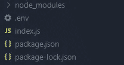

# 如何在 Node.js 中创建网址缩写

> 原文：<https://javascript.plainenglish.io/how-to-create-url-shortener-in-node-js-568027027b91?source=collection_archive---------10----------------------->


在本文中，我们将在 Node.js 中创建一个最小的 URL Shortener。

让我们现在开始工作吧！

让我们启动终端并编写以下命令:

```
npm init -y
```

让我们安装一些我们需要的软件包。为此，启动终端并编写以下命令:

```
npm i dotenv express mongoose shortid validator
```

使用这个命令，我们已经安装了`dotenv`、`express`、`mongoose`、`shortid`、`validator`。`dotenv`包帮助我们访问**。env** 文件。我们将使用`shortid`包为我们的 URL 生成一个短 id。安装完成后，我们的文件夹结构应该如下所示:


现在让我们创建一个名为**的文件。env** 在我们的主项目目录中。让我们打开文件**。env** 并编写以下内容:

```
MONGO_URI=   // Enter mongo URI here
```

您需要按照上面注释中的说明将值输入到`MONGO_URI`。`MONGO_URI`应该包含您的 Mongo DB 数据库的 URL。

现在让我们在主项目目录中创建一个名为 **index.js** 的文件。这应该使我们的文件夹结构看起来像这样:



现在让我们打开文件 **index.js** 并编写以下代码行:

第 1 行，我们导入了`express`；在第 2 行，我们导入了`mongoose`。然后，在第 4 行，我们导入并配置了`dotenv`。在第 5 行，我们导入了`route`。

在第 7 行，我们创建了一个存储`express()`的`app`常量。

在第 9 行，我们使用了`express.json()`中间件。这个`express.json()`中间件帮助我们读取从客户端接收的 JSON 数据。

在第 11 行，我们使用了`route`中间件。

在第 13 行，我们为`PORT`创建了一个常量。

从第 15 行到第 21 行，我们使用`mongoose.connect()`连接到 MongoDB 数据库。我们提供了 MongoDB 数据库作为`connect()`的第一个参数。如果在连接过程中出现任何错误，我们将记录该错误(在第 21 行)。

在第 23 行，我们在`PORT`启动了我们的服务器。

既然我们已经完成了我们的 **index.js** 文件，现在让我们开始工作我们的路线。为此，让我们在主项目目录中创建一个名为 *routes* 的目录。让我们在我们的 *routes* 目录中创建一个名为 **ShortenerRoute.js** 的文件。在这之后，我们的文件夹结构看起来像这样:


现在让我们打开文件 **ShortenerRoute.js** 并编写以下代码行:

在第 1 行，我们导入了`express`。在第 3 行，我们导入了`Redirect`和`AddUrl`控制器。

在第 5 行，我们创建了存储`express.Router()`的`router`常量。

在第 8 行，我们为 GET 请求创建了 */:shortId* 的路由，并为该路由提供了`Redirect`控制器。

在第 11 行，我们用 POST 请求创建了路由，并提供了`AddUrl`控制器。

最后，在第 13 行，我们导出了`router`。

接下来，让我们研究控制器。为此，让我们在主项目目录中创建一个名为*控制器*的目录。之后，在*控制器*目录下创建一个名为 **ShortenerController.js** 的文件。这应该使我们的文件夹结构看起来像这样:


现在让我们打开文件 **ShortenerController.js** 并编写以下代码行:

在第 1 & 3 行，我们分别导入了`validator`和`Url`。`Url`是一个模型，我们很快就会开发它。

在第 5 行，我们创建了一个名为`Redirect`的箭头函数，并在第 48 行将其导出。这个`Redirect`控制器的目的是根据提供的`shortId`将用户重定向到 URL。在第 6 行，我们使用对象析构从`req.params`中提取了`shortId`。如果`shortId`不存在，我们在第 8 行提供一个 id 未提供的错误消息。在`shortId`的帮助下，我们在第 11 行查询了`Url`模型，并将其存储在`URL`常量中。如果`URL`存在，我们将用户重定向到第 13 行的路线`URL.url`。`url`是`Url`模型中的一个字段，存储网站的 URI。我们在`Url`模型中也有`shortId`字段，用于存储`shortId`。过一会儿我们在做的时候，你就会知道我们的模型是什么样子的了。如果`URL`不存在，我们在第 12 行返回一个错误消息。如果在这个过程中出现任何错误，我们在第 15 行记录这个错误。然后，我们在第 16 行发送错误消息。

在第 20 行，我们创建了一个名为`AddUrl`的箭头函数，并在第 49 行将其导出。这个函数的目的是向数据库添加一个新的 URL，并向用户提供唯一的 id。在第 21 行，我们从`req.body`中提取了`url`。如果`url`不存在，我们在第 23 行提供一个错误消息。然后，在第 25 到 30 行，我们使用`validator`对`url`进行了验证。`validator`的`isUrl`方法接受一个要验证的字符串作为第一个参数，在我们的例子中是`url`。第二个参数接受 options 对象。这里，我们在第 27 行设置了`require_protocol`到`true`。如果验证不匹配，我们在第 30 行向用户发送一条错误消息。在第 33 行，我们用`url`查询了`Url`模型，并将其存储在`URL`常量中。如果`URL`存在，我们在第 40 行从`URL.shortId`和`url`本身向用户发送相同的`shortId`。如果`URL`不存在，我们在第 35 行从`Url`模型创建一个`newUrl`。然后，我们保存第 36 行的`newUrl`。之后，我们在第 37 行将`shortId`和`url`发送给用户。请注意，我们在创建`newUrl`时没有提供`shortId`，但我们已经收到了。那是因为我们的`Url`模型为我们完成了生成`shortId`的任务。如果在这个过程中出现任何错误，我们在第 42 行记录这个错误。然后，在第 43 行，我们向用户发送错误消息。

既然我们已经完成了控制器的工作，现在让我们来研究一下我们的`Url`模型。为此，让我们在主项目目录中创建一个名为 *model* 的目录。在目录内部，创建一个名为 **url.js** 的文件。这应该使我们的文件夹结构看起来像这样:


现在让我们打开文件 **url.js** 并编写以下代码行:

现在让我们看看上面的代码。在第 1 行，我们导入了`mongoose`。在第 2 行，我们导入了`shortid`。

从第 4 行到第 7 行，我们创建了一个新的模式，并将其存储在`UrlSchema`常量中。`UrlSchema`有两个字段:`url`、`shortId`。`url`字段存储字符串，是必填字段。`shortId`字段存储字符串，也是必填字段。我们已经为`shortId`字段设置了默认值`shortid.generate()`。该方法生成一个 id，存储在`shortId`字段中。然后，我们终于在第 9 行导出了`”url”`模型。

现在让我们来试试这个应用程序。尝试使用 Postman 向路由 *localhost:3000/* 发出 post 请求，其中`url`字段包含有效的 URL。你应该会从它那里收到一个`shortId`。然后，打开浏览器，输入网址*localhost:3000/:short id*。这里的`:shortId`应该是你向路由 *localhost:3000/* 发出 post 请求时收到的 shortId。这应该会将您重定向到链接到`shortId`的页面。

这意味着我们已经创建了一个网址缩写！

## **简单英语的 JavaScript**

喜欢这篇文章吗？如果有，通过 [**订阅获取更多类似内容解码，我们的 YouTube 频道**](https://www.youtube.com/channel/UCtipWUghju290NWcn8jhyAw) **！**