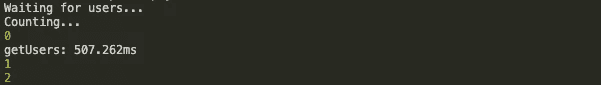
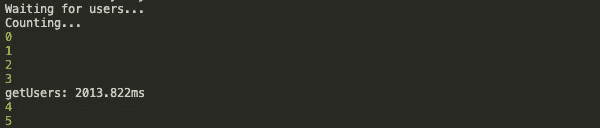
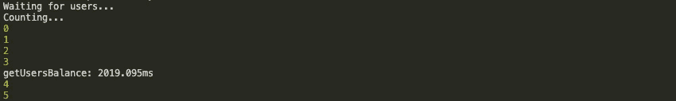
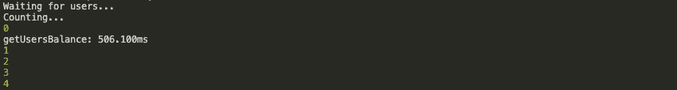

# 如何处理数组函数中的 async/await

> 原文：<https://javascript.plainenglish.io/how-to-deal-with-async-await-in-the-array-functions-4f592f1c0091?source=collection_archive---------3----------------------->

[JavaScript icon](https://icons8.com/icons/set/javascript) icon by [Icons8](https://icons8.com/)

当我的一个朋友问我如何在 map 的回调中等待异步函数结果时，我萌生了写这篇文章的想法。我向他解释了他可以如何解决这个问题，然后想到很多人可能都有同样的问题，所以下一步对我来说很明显，写下来并与他人分享！

# 这篇文章是关于什么的？

在本文中，我将分享我对如何处理 JavaScript 集合中的异步函数的想法。我将通过展示代码的例子来解释这一点，这对我来说是最好的，你也可以在我的 [*github*](https://github.com/kwdowik/async-await-loops) 库中找到。

我们将使用通过 ids 返回用户的 fake a API 来模拟对 real API 的异步调用，基于此，我们将讨论几个示例，重点是:

*   对于循环，
*   对于每个人，
*   为了…的，
*   地图，
*   过滤器，
*   减少

为了简化和主要关注你的主题，每个例子都有相同的主要步骤:

*   开始程序，
*   开始测量时间，
*   调用 getUsers 方法，
*   结束测量时间，
*   执行测试，

此外，在一个并行方法中，为了更好地显示异步操作，增加了计数到 10。

# 让我们编码

## **例 1**

**使用 for 循环遍历回调**

测试*(第 23 行)*期望接收四个用户，但是当执行这个代码 *(node async-cb.js* )时将返回错误。如果我们记录用户，就会发现数组是空的，这是因为我们只是遍历了所有的 id，而没有等待响应。我们可以通过注释掉测试*(第 23 行)*并添加日志 API 回调*(第 9 -11 行)*来证明这一点，然后您会看到我们实际上从我们的 API 接收了数据，因此正如您所看到的，主要问题是等待来自 getUsers 方法的数据，在接下来的每个示例中，我们将尝试解决这个问题。

## **例 2**

**使用 *for* 循环**遍历承诺

这个例子包含了另一个测试*(第 22 行)*，它主要检查从 *getUsers* 方法返回的数据的格式。如果您执行这段代码，请注意这次测试通过了，此外您还会看到计数到 10，以标记我们对 API 的调用是异步的。综上所述，添加在 for 循环内部调用的承诺保证在对数据执行任何操作之前等待数据，但是如果我们想使用像 *forEach、filter、map、reduce* 这样的数组方法呢？

让我们看看会发生什么。

## **例 3**

**使用*forEach*遍历承诺**

在这个例子中，我们只替换了 *forEach* 上的循环的*，但是当你执行这个代码时，你会看到我们的测试失败了，当你记录从 *getUsers* 方法返回的用户时，你会看到数组是空的，所以基本上我们回到了起点，但是抬头，因为我们碰到了基础问题，这对于我们将要讨论的 *filter，map，reduce* 方法也是一样的。*

空用户数组是因为 *forEach* 本身不等待回调，而是遍历所有对象，然后返回空用户数组，因为此时 API 没有做出任何响应。

现在，我们将重点关注如何处理这种行为，并处理数组上的不同类型的操作，这些操作在回调中包含异步函数。

在我们进入下一个例子之前，请尝试执行以下代码

我们几乎没有将 *forEach* 替换为*for……of，*检查结果并尝试回答自己为什么会这样？

## **例 4**

**使用*映射*** 遍历承诺

由于使用了 map，我们不必在遍历 ids 之前声明 users 数组，现在 map 本身根据工作原理返回用户，但这是真的吗？注意解决所有的承诺*(第 10 行)*是必需的，很多时候缺乏这一点，导致我们的问题，但为什么是必需的呢？map 本身并不返回数据，但是它并不返回一个承诺数组，而是像在 *forEach* 中一样与相同的事实相关联， *map* 不会等待每个承诺被解决，而是返回一个待定的承诺。

我想提醒您注意 *getUsers* 的执行时间，让我们将它与循环的*进行比较*

map time

for loop time

这种差异从何而来？这个方法中的每一个都为相同的用户 id 集执行四个请求，更准确地说，我们的 API 请求是大约 500ms 后返回用户的 *setTimeout* 方法(或多或少是因为 *setTimeout* 保证至少在 500ms 后执行回调，而不是正好在 500 ms 内，这不是本文的主题，所以要得到为什么我鼓励更熟悉事件循环的答案)。回到这个问题，不同之处在于 map 一个接一个地设置所有四个请求，而不等待每个响应

之后，我们得到我们的用户 *(Promise.all)* ，时间等于最长的承诺请求，在这种情况下对所有请求都是一样的，大约等于 500ms，而 for 循环以这种方式工作:

## 实例 5

**使用*过滤器*** 遍历承诺

在这个例子中，我们的任务是只获得成年用户，知道如何从我们的 API 获得每个用户，达到我们的目标，我们只需要按年龄过滤这些用户*(第 13 行)*。通过引入*管道*方法，可以以一种更加功能化的方式实现我们的目标。在这个例子中，它将是*管道异步*，让我们看看代码将如何处理变更

## 实例 6

**使用 *reduce*** 遍历承诺

现在我们的任务是合计用户帐户余额，如果您试图执行此代码，您将收到一个错误，让我们在第 18 行添加日志来检查总和

*【对象承诺】40000* 哪里来的？原来，40000 值是最后一个用户的帐户余额(您可以在 *lib/api.js 第 5 行*中查看)，但为什么我们会收到*【对象承诺】*，这与 reduce 的回调*(第 6 行)*中的一个异步关键字有关，每个异步函数都返回承诺，所以在我们的例子中 *prev* 变量不等于特定值而是承诺，为了获得实际值，我们必须使用 await 关键字

现在测试通过了，但是我想让你注意一下执行时间

为什么又超过了 2000 毫秒？看起来我们又回到了这个执行命令上

这是真的，因为引入了变量*prev sum*(第 3 行)因为现在每个回调都必须等待上一个值才能发出 API 请求，为了解决这个问题，只需要交换第 3 行和第 4 行，让我们来看看结果

仅仅通过交换两行代码，我们就将代码的性能提高了 75%!由此可见，理解好异步编程是多么重要。

# 下一步是什么？

鼓励您查看我在 [*github*](https://github.com/kwdowik/async-await-loops) 上的知识库，我在那里为您准备了一些练习，以提高您对 async/await 的信心。

这就是我想给你看的，我希望你能从这篇文章中找到一些东西，我准备的练习会给你更多！

如果你喜欢这篇文章，请鼓掌，如果你有任何问题，请在评论中留下，或者通过 [*twitter*](https://twitter.com/k_wdowik) 与我保持联系！

推特: [*k_wdowik*](https://twitter.com/k_wdowik)

一如既往，欢迎任何意见！

# **简明英语笔记**

你知道我们推出了一个 YouTube 频道吗？我们制作的每个视频都旨在教给你一些新的东西。点击 点击 [**查看我们，并确保订阅该频道😎**](https://www.youtube.com/channel/UCtipWUghju290NWcn8jhyAw)