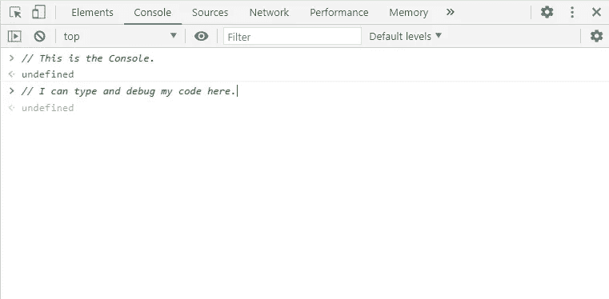

# 调试 JavaScript 代码的 4 种方法

> 原文：<https://javascript.plainenglish.io/how-to-debug-your-javascript-code-4a309d58417f?source=collection_archive---------12----------------------->

## 通过实际例子学习 JavaScript 调试

Photo by [NeONBRAND](https://unsplash.com/@neonbrand?utm_source=medium&utm_medium=referral) on [Unsplash](https://unsplash.com?utm_source=medium&utm_medium=referral)

# 什么是调试？

对于程序员来说，调试是一个非常重要和有价值的工具。花时间写了一段代码后，很难意识到它可能有错误。这就是为什么你需要学习一些调试技巧来修复这些错误。因此，**调试**就是找出你的代码中有什么问题并修复它的过程。在本文中，我们将介绍一些有助于发现 bug 的工具，以及它们的一些常见形式。

Photo by [Blake Connally](https://unsplash.com/@blakeconnally?utm_source=medium&utm_medium=referral) on [Unsplash](https://unsplash.com?utm_source=medium&utm_medium=referral)

# 1.使用 JavaScript 控制台

所有现代浏览器都有一个漂亮的 JavaScript 控制台，也称为 **DevTools** ，用于调试你的 JavaScript。你可以打开你的 JavaScript 控制台，首先打开浏览器，然后右击你的鼠标，点击 inspect 按钮，或者如果你使用的是 Firefox，只需点击 **F12** 。一旦你打开它，你可以在那里写任何 JavaScript 代码。

The JavaScript Console

JavaScript 中用于在控制台中调试代码的一个重要方法是 **console.log()** 方法，方法，它将括号中的内容“打印”到控制台。让我们用这个方法来得到一个变量的值。看看下面的例子。

Using the Console.log method.

请注意，您可以将任何类型的数据放入这个控制台方法中。这使得在 JavaScript 代码中发现问题变得很容易。

# 2.使用 typeof 方法

我们使用`**typeof**`方法来检查变量的数据结构或类型。如果您在 JavaScript 中处理多种数据类型，这将非常有用。

下面是一些使用`**typeof**` **:** 的例子

Using the Typeof method.

# 3.使用循环时要小心

我们都知道，当我们想要多次执行某个东西时，JavaScript 中的循环会有所帮助。下面的例子将导致一个无限循环，使你的浏览器崩溃。因为那个循环的条件不符合逻辑，所以变量 **(i)** 永远不会等于 4，这就是为什么循环会继续将变量 **(i)** 递增 2，永远不会停止。为了解决这个问题，我们只能在变量 **(i)** 小于或等于 4 时将条件改为增加 2。

Infinite Loop.

# 4.错误类型

1.  语法错误:可能是你代码中任何类型的错误语法导致程序无法运行，所以你必须小心。
2.  **运行时错误:**当代码无法执行或出现意外行为时，这可能是因为您在 JavaScript 文件中输入了错误的名称，或者您从另一个文件中导入了错误的代码。
3.  **语义错误:**当代码没有做它应该做的事情时。有时你的大脑会疲劳，你会开始写不合逻辑的代码，结果，这将改变你的程序的行为。

# 结论

在修复代码中的错误时，调试是非常重要和有用的。作为一名程序员，你会花很多时间调试你的代码，这可能会令人沮丧，但它有助于开发和遵循一步一步的方法来审查你的代码。这就是这篇文章，我希望你今天学到了一些新的东西。