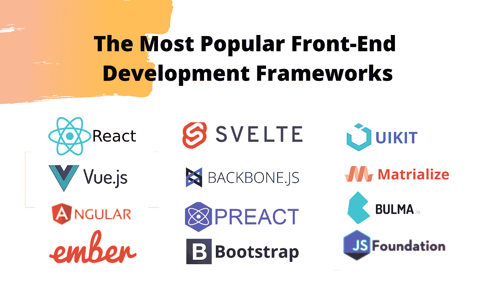
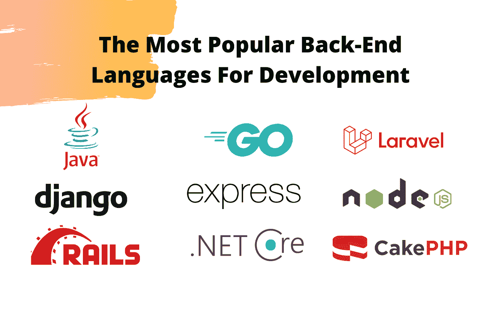
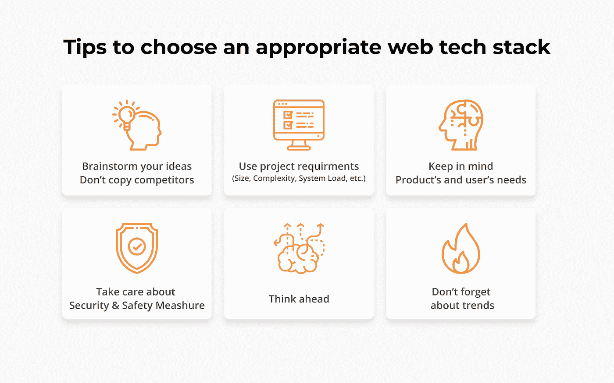
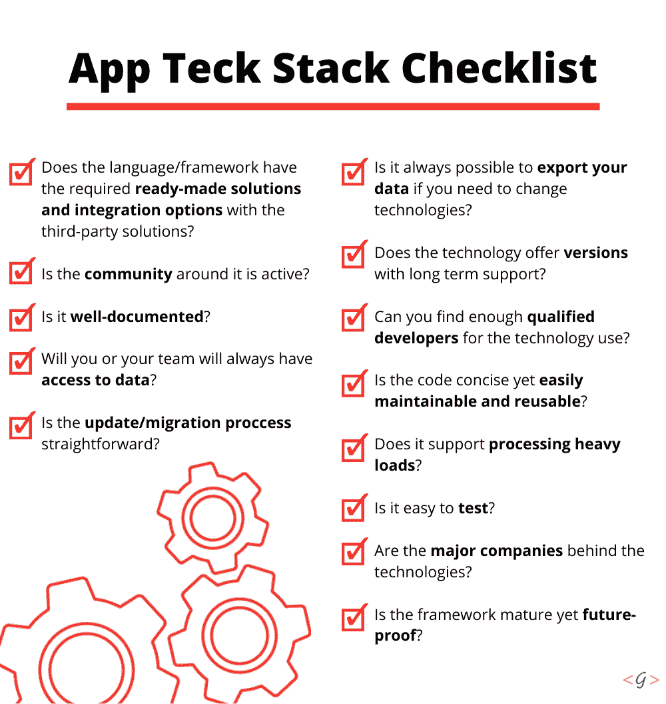

# 如何为网络/移动应用选择合适的技术组合

> 原文：<https://javascript.plainenglish.io/how-to-decide-the-right-tech-stack-for-web-mobile-app-c143ad603c01?source=collection_archive---------3----------------------->

选择最佳技术来构建可靠的解决方案是一个非常关键的决策。这是规划移动和 web 应用程序开发的第三步。它发生在建立业务视角和产品结构之后。对于大公司，内部和外部开发人员通常会共同做出选择。如果你是一家小型创业公司，情况会更复杂。

这个决定通常会决定您的移动和 web 应用程序是否会运行良好并具有可伸缩性。这也会影响你的预算！一个精心选择的技术体系可以提供竞争优势并帮助其发展，而错误的技术会让你落后几个月。

本文将为您提供关于技术堆栈的一些您需要了解的事情的见解，以及在时机成熟时做出明智决策的一些线索。

# **网络和移动应用技术的差异**

什么是技术栈？坦率地说，它是一套软件工具、数据库、框架、编程语言和技术，用于构建移动设备、web 应用程序或网站。

Web 应用程序通常支持互联网。因此，用户不必下载它们来访问它。Web app tech stack 使用系统提供的资源。这样，要构建一个 web 应用程序，您将需要使用前端和后端技术的组合。

移动应用程序是为特定的移动平台(即特定环境)创建的，不能复制到另一个环境中。要使用移动应用程序，用户应该从 app/play 商店下载。因此，除了前端和后端技术，要构建一个移动应用程序，你应该使用面向平台的技术——对于 iOS 和 Java，使用 Swift 和 Objective-C，对于 Android 应用程序开发，使用 Kotlin。

# **前端技术包括:**

*   HTML/HTML5
*   半铸钢ˌ钢性铸铁(Cast Semi-Steel)
*   Java Script 语言
*   UI-框架和库:ReactJS、AngularJS、React、jQuery 等等。

## **HTML 和 CSS 工具包**

有几个框架用于 CSS 和 HTML。其中一些包括:

*   纯的
*   实现
*   Susy 系统（全称 Submission System）
*   引导程序
*   UIkit
*   布尔玛
*   基础

其中最受欢迎的选择是基础和引导。虽然 Foundation 是开发敏捷、响应迅速的网站的理想选择，但 Bootstrap 使用 HTML、CSS 和 jQuery 库来制作响应迅速的网页，

## **前端开发的 JavaScript 框架**

现代 web 应用程序在前端使用 JavaScript。我们列出了[2021 年用于网络和移动应用的最佳前端框架](https://blog.galaxyweblinks.com/best-frontend-development-frameworks-in-2021/)。

# **后端技术包括:**

*   操作系统
*   Web 服务器:Apache，Nginx
*   数据库:Neo4j、MySQL、Oracle、PostgreSQL、Microsoft SQL Server 等
*   编程语言:Objective-C、Python、PHP、Java、C#等等
*   云基础设施和服务:AWS、Heroku、Google Cloud、Microsoft Azure 等。
*   各种框架建立在编程语言之上:Django。NET、Node.js 等；

我们再次列出了 2021 年你可能会用到的[最佳后端框架。](https://blog.galaxyweblinks.com/top-8-backend-frameworks-for-2021/)

以下是几种常用的流行后端技术堆栈组合:

## **灯堆**

LAMP 堆栈有助于构建运行 PHP 应用程序的环境。它用于在 Linux 上托管网站。这个堆栈由以下技术组成:Linux(环境操作系统)、Apache(HTTP 服务器)、MySQL(数据库)和 PHP(服务器端编程语言)。

## **胜栈**

Windows Internet 命名服务(Wins)是另一个后端堆栈，由 Windows 服务器、Internet 信息服务。Net 和微软 SQL Server。这是一个用于确定与特定网络计算机相关联的 IP 地址的系统。

## **平均堆栈**

mean 栈由 MongoDB、Express.js、Angular、Node.js 组成，更多的是全栈结构。这是一个用于构建动态网站和 web 应用程序的开源 JavaScript 软件栈。

## **Xampp 堆栈**

Xampp 工具包由 X，Apache，MySQL 或 MariaDB，PHP，Perl 组成。AMP stack 可以让你在电脑上安装 Apache、MySQL、PHP 以及其他一些有用的软件。它旨在为您提供轻松的安装体验。

## **MERN 堆栈**

MERN 由 MongoDB、Express、React/Redux 和 Node.js 组成，MERN 栈与均值栈非常相似。由于前端开发中的 ReactJS 和后端开发中的 NodeJS 越来越受欢迎，该堆栈受到追捧，并且对于构建[高端单页面应用](https://blog.galaxyweblinks.com/why-should-you-consider-a-single-page-application-for-your-next-project/)非常有用。

# **选择合适的技术组合| 11 件必须知道的事情**

你对技术栈的选择应该主要基于你想要在你的应用或网站中拥有的质量和功能需求。如果这种技术能够开发出你想要的所有特性和功能，那么这就是正确的选择。

## **项目的规模&复杂程度**

需要注意的一个关键因素是项目的规模。中型甚至大型项目所需的技术与小型项目不同。除了规模，项目的复杂性也很重要。复杂的项目需要全面的技术和工具。

## **产品功能和规格**

你需要确保你定义的功能能够解决你的目标受众的问题。在市场调查之后或者与市场调查一起进行这一步是有意义的，这样可以找出已经存在的产品，以及你的软件需要哪些额外的规范来击败竞争对手。根据这一点，你将能够选择合适的工具。

## **产品要求的速度和功能**

它会继续仔细检查配对项目和技术堆栈的兼容性和效率。在这里，项目预期的功能和速度应该很好地交付给用户，这对于确定使用哪种技术堆栈有很大的帮助。

## **系统负载需求**

这是另一个需要注意的非常重要的方面。几个项目有不同的处理负载，因此不是所有的技术栈都能满足所有的处理负载需求。有了这个，你将需要比较你的预期产品处理负荷与技术堆栈的能力，以确保它能满足需要。

## **对 MVP 的明确要求**

MVP 对于产品的移动和 web 应用程序开发过程是必不可少的。作为一套基本的关键要素，MVP 通常被设计为对产品在真实市场环境中的竞争力和生存能力进行实验证明。因此，从一开始就了解什么对应用程序至关重要，以及未来需要什么技术是至关重要的。

## **可扩展性要求**

必须理解有两种类型的可伸缩性—水平和垂直。

水平可伸缩性意味着在更多设备上运行的能力。垂直可伸缩性有助于向应用程序添加更多元素。这两者对于产品的增长和高效运行同样重要。

您选择的技术堆栈应该能够支持您的应用程序的扩展。当您准备好提高您的生产力时，您的技术堆栈应该配备合适的工具、框架和方面，以加快这一过程，而不浪费时间或金钱。由于 MVP 模型主导了应用程序的前景，您的堆栈应该能够在原型发布后的各个阶段支持升级和可伸缩性，而不会使事情复杂化。

## **性能要求**

性能统计的影响来自两个方面。一个是业务需求，另一个是技术在某种情况下的能力。

性能需求决定了系统的反应速度，以及系统可以以何种速度处理多少个请求。由于整个操作必须以毫秒级的速度对数以千计的事件做出反应，因此选择最可靠的选项是有意义的。

## **成本**

预算技术栈可能是整个开发过程中最棘手的事情。为什么？嗯，软件开发并不是用铅笔在纸上精确地书写——它需要大量的财政资源来完成工作。有:

*   后续维护成本
*   技术教育和许可费用
*   开发人员工资
*   保存产品的托管成本

诀窍是尽可能避免超支，避免膨胀，平衡事物。

## **DevOps &安全要求**

您所习惯的 DevOps 实践的种类，以及安全需求的级别，也是一个至关重要的因素。你的应用是仅仅作为终端用户的信息中心，还是管理他们的财务数据？

如果您需要管理用户数据，安全性是最重要的，因此，您还应该考虑选择一种技术堆栈，它总是有助于高端安全框架来实现应用程序开发目标。

## **维修**

技术堆栈应该易于管理，不需要冗长的代码。如果你的技术栈用复杂的代码迷惑了你的开发人员，并且花了很长时间来处理和完成一项任务，那么你可能会在开发的某一点后停滞不前。

同时，选择一个具有非常难以辨认的编码结构的堆栈会导致在培训和资源开发上的额外花费。所以，你的重点应该是找到一种技术栈，在这种栈上，你的开发团队可以很容易地维护代码。

## **寻求专业指导**

如果你是应用技术领域的新手，那么寻求 IT 专业人士的帮助是个好主意。这些专业人员将能够提供获得最佳技术堆栈组件所需的指导。

# **结论**

这些是你需要了解的关于技术堆栈的基本概念，以及它如何影响项目的发展和定义它的前景。

有了这些建议，你将能够在浩瀚的选择海洋中航行，不会陷入混乱，也不会迷失自己的目标。