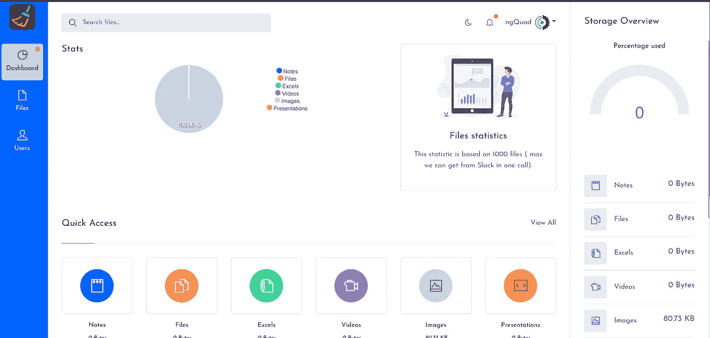

# 松弛管理器，如何删除文件以释放工作空间

> 原文：<https://javascript.plainenglish.io/how-to-delete-slack-files-to-free-space-in-your-workspace-1bd051ceb7cf?source=collection_archive---------2----------------------->

免费计划的 Slack 用户知道共享太多文件的危险。随着时间的推移，5GB 的存储计划用完了，你会面临“你的工作空间内存不足了…”的消息。而且几天后，Slack 不会让你上传新文件，除非你删除旧文件。拜拜，协作？

Slack Manager

Slack 没有一个内置的方法来删除你共享的所有文件。但是，我有一个解决方案。

[Slack Manager](https://slack-man.web.app) 使您能够查看您的旧文件并随后删除它们。

# 什么是时差管理器？

它使用 Slack API 来确定可以删除哪些文件。团队成员只能删除他们共享的文件，而管理员可以删除公共文件。

您可以随时撤销访问权限(我们将在文章末尾看到)。

# 支持的文件类型？

Slack Manager 支持多种文件类型，无论是 PDF 还是图像。

# 撤销松弛时间管理器的权限

Slack Manager 不存储您的个人资料或工作区信息。虽然[撤销长时间不用的应用程序的权限](https://www.guidingtech.com/revoke-app-access-google/)绝对是个好做法。毕竟，如今你永远无法确定[的隐私和安全。](http://www.nytimes.com/2018/04/11/technology/facebook-privacy-hearings.html)

为此，前往 Slack，点击应用程序并搜索 Slack Manager。选择它，它将锁定你的松弛窗口。然后导航到设置，你所要做的就是向下滚动并点击删除(垃圾桶)图标。就是这样。

# 检查空间使用情况

您可能需要检查空间使用情况。为此，单击工作区并选择分析。

让我知道如果你喜欢它，来源可以在这里找到。
它还被列在[产品排行榜上，](https://www.producthunt.com/posts/slack-cleaner)并被评为当天的第四大产品。:D